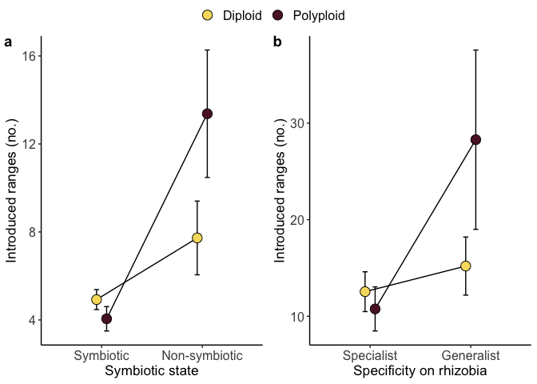
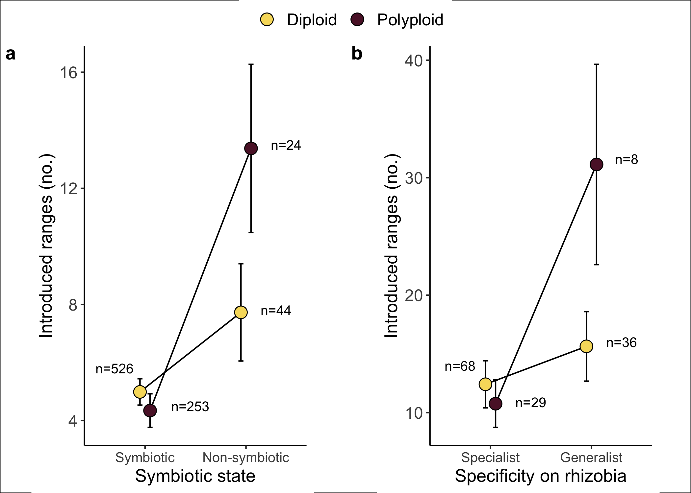

PGLS analysis
================
Tia Harrison
2022-10-13

## Overall setup

### Load the packages for analysis

``` r
# Packages 
library(tidyverse)
library(car)
library(lsmeans)
library(lme4)
library(MASS)
library(ape)
library(inauguration)
library(ggpubr)
library(plotrix)
library(nlme)
library(geiger)
library(lmtest)
library(sandwich)
library(performance)
library(phytools)
library(MuMIn)
```

## Dataset

### Ploidy dataset and phylogeny

The spreadsheet contains information about the symbiotic status (Fixer
column) of each legume species where 1 indicates a legume that forms
nodules with rhizobia (symbiotic) and where 0 indicates a plant that
forms no association with rhizobia (nonsymbiotic). The diPloidyLow
column indicates whether plant species are diploids (coded as 0) or
polyploid (coded as 1). The diPloidyLow values were calculated from
genus-level data. The Num_Introduced column indicates how many separate
ranges a plant species has been introduced to as calculated in Simonsen
et al (2017).

The phylogeny used in this analysis is a version of the Zanne et al
(2014) angiosperm phylogeny where the full phylogeny was pruned for the
species in our dataset.

``` r
# Dataset 
ploidy<- read.csv("Legume_ploidy_dataset.csv", row.names=1)

# Phylogeny 
legumes1<-read.tree("Vascular_Plants_rooted.dated.tre")
```

### Clean up the dataset

Here, we create a new column called “NewPloidy” which indicates diploidy
(0) and polyploidy (1) but was calculated from a combination of genus
and subfamily level data.

We also added symbiotic species to our Fixer column if we had data from
Harrison et al. (2018) that suggested those species associated with a
rhizobium genus or OTU.

``` r
# If diPloidyLow (genus-level ploidy) is available use it and if not then use disfPloidy_corrected (subfamily with some species double checked in the literature)
# If there is data for NumGenera or OTUs then call the associating legume species a fixer 
ploidy1<-ploidy%>% 
  rownames_to_column() %>%
  mutate(NewPloidy = ifelse(is.na(diPloidyLow), disfPloidy_corrected, diPloidyLow)) %>% 
  mutate(Fixer = ifelse(is.na(Fixer) & numOTUs >= 1, 1, Fixer)) %>%
  mutate(Fixer = ifelse(is.na(Fixer) & numGenera >=1 , 1, Fixer)) %>%
  column_to_rownames()
```

### Prune the dataset and tree

``` r
# Make sure the data and tree match up 
TreeOnly <- setdiff(legumes1$tip.label, rownames(ploidy1))
DataOnly <- setdiff(rownames(ploidy1), legumes1$tip.label)

# Prune the tree 
pruned <- drop.tip(legumes1, TreeOnly)
pruned$node.label <- NULL

# Get the tip names 
tip_names<-data.frame(pruned$tip.label)

# Filter the dataset for tree species 
ploidy_data<-ploidy1 %>%
  filter(rownames(ploidy1) %in% tip_names$pruned.tip.label) 

# Set columns as factors for analysis 
# Set Species as its own column
ploidy_data1 <- ploidy_data %>%
  rownames_to_column("Species") %>%
  mutate(Fixer=as.factor(Fixer), 
         numGenera=as.factor(numGenera), 
         Specialist=as.factor(Specialist), 
         diPloidyLow=as.factor(diPloidyLow), 
         NewPloidy=as.factor(NewPloidy))
```

### Data exploration

How many species in each data type?

``` r
# Data summary for genus level ploidy 
ploidy_data1 %>%
  filter(!is.na(diPloidyLow) & !is.na(Num_Introduced) & !is.na(Fixer)) %>%
  group_by(diPloidyLow, Fixer) %>%
  tally()
```

    ## # A tibble: 4 × 3
    ## # Groups:   diPloidyLow [2]
    ##   diPloidyLow Fixer     n
    ##   <fct>       <fct> <int>
    ## 1 0           0        21
    ## 2 0           1       414
    ## 3 1           0         2
    ## 4 1           1       234

``` r
# Average of introduced ranges 
ploidy_data1 %>%
  filter(!is.na(diPloidyLow) & !is.na(Num_Introduced) & !is.na(Fixer)) %>%
  group_by(diPloidyLow, Fixer) %>%
  summarize(mean(Num_Introduced))
```

    ## # A tibble: 4 × 3
    ## # Groups:   diPloidyLow [2]
    ##   diPloidyLow Fixer `mean(Num_Introduced)`
    ##   <fct>       <fct>                  <dbl>
    ## 1 0           0                       7.43
    ## 2 0           1                       5.69
    ## 3 1           0                      32   
    ## 4 1           1                       4.40

``` r
# What are the two non-symbiotic polyploid species? 
ploidy_data1 %>% 
  filter(diPloidyLow==1 & Fixer ==0)
```

    ##          Species  Genus areaIntroduced areaNative Num_Introduced Fixer numOTUs
    ## 1 Cassia_fistula Cassia       3.90e+13   1.02e+13             47     0      NA
    ## 2 Cassia_grandis Cassia       9.33e+12   1.27e+13             17     0      NA
    ##   numGenera Specialist Human_Uses AbsLatNative LatNative ChromosomeCount
    ## 1      <NA>       <NA>          7    10.689225 10.689225              28
    ## 2      <NA>       <NA>          4     2.346186  2.346186              28
    ##   PloidyLow diPloidyLow sfPloidy disfPloidy annual disfPloidy_corrected
    ## 1         4           1        4          1      0                    1
    ## 2         4           1        4          1      0                    1
    ##          subfamily NewPloidy
    ## 1 Caesalpinioideae         1
    ## 2 Caesalpinioideae         1

``` r
# Cassia fistula 7 human uses 
# Cassia grandis 4 human uses 

# Average number of human uses 
ploidy_data1 %>%
  filter(!is.na(Fixer) & !is.na(Human_Uses)) %>%
  group_by(Fixer) %>%
  summarize(mean(Human_Uses))
```

    ## # A tibble: 2 × 2
    ##   Fixer `mean(Human_Uses)`
    ##   <fct>              <dbl>
    ## 1 0                   2.90
    ## 2 1                   1.44

``` r
# Data summary for subfamily level ploidy data (ploidy corrected)
ploidy_data1 %>%
  filter(!is.na(NewPloidy) & !is.na(Num_Introduced) & !is.na(Fixer)) %>%
  group_by(NewPloidy, Fixer) %>%
  tally()
```

    ## # A tibble: 4 × 3
    ## # Groups:   NewPloidy [2]
    ##   NewPloidy Fixer     n
    ##   <fct>     <fct> <int>
    ## 1 0         0        44
    ## 2 0         1       526
    ## 3 1         0        24
    ## 4 1         1       253

``` r
# Average number of human uses in specialists
ploidy_data1 %>%
  filter(!is.na(Specialist) & !is.na(Human_Uses) & !is.na(NewPloidy)) %>%
  group_by(Specialist, NewPloidy) %>%
  summarize(mean(Human_Uses))
```

    ## # A tibble: 4 × 3
    ## # Groups:   Specialist [2]
    ##   Specialist NewPloidy `mean(Human_Uses)`
    ##   <fct>      <fct>                  <dbl>
    ## 1 0          0                       3.56
    ## 2 0          1                       4.5 
    ## 3 1          0                       2.90
    ## 4 1          1                       3.31

``` r
# Data summary for generalists
ploidy_data1 %>%
  filter(!is.na(NewPloidy) & !is.na(Num_Introduced) & !is.na(Specialist)) %>%
  group_by(NewPloidy, Specialist) %>%
  tally()
```

    ## # A tibble: 4 × 3
    ## # Groups:   NewPloidy [2]
    ##   NewPloidy Specialist     n
    ##   <fct>     <fct>      <int>
    ## 1 0         0             36
    ## 2 0         1             68
    ## 3 1         0              8
    ## 4 1         1             29

``` r
# How many unique genera
ploidy_data1 %>%
  group_by(Genus) %>%
  tally()
```

    ## # A tibble: 232 × 2
    ##    Genus            n
    ##    <chr>        <int>
    ##  1 Abrus            1
    ##  2 Acacia          63
    ##  3 Acmispon         3
    ##  4 Acrocarpus       1
    ##  5 Adenocarpus      3
    ##  6 Aeschynomene    10
    ##  7 Albizia          6
    ##  8 Alhagi           1
    ##  9 Amburana         1
    ## 10 Amicia           1
    ## # … with 222 more rows

``` r
# Find all polyploid generalists 
ploidy_data1 %>%
  filter(NewPloidy==1, Specialist==0)
```

    ##                Species     Genus areaIntroduced areaNative Num_Introduced Fixer
    ## 1    Amorpha_fruticosa   Amorpha       2.40e+13   1.81e+13             24     1
    ## 2     Arachis_hypogaea   Arachis       6.37e+13   1.20e+13             67     1
    ## 3      Medicago_sativa  Medicago       1.04e+14   2.51e+12             51     1
    ## 4        Mimosa_pudica    Mimosa       3.07e+13   1.61e+13             50     1
    ## 5  Retama_sphaerocarpa    Retama       2.89e+12   3.46e+12              2     1
    ## 6   Sesbania_cannabina  Sesbania       6.67e+12   1.03e+13              9     1
    ## 7 Trifolium_fragiferum Trifolium       2.39e+13   3.47e+13              7     1
    ## 8     Trifolium_repens Trifolium       6.31e+13   4.12e+13             39     1
    ##   numOTUs numGenera Specialist Human_Uses AbsLatNative LatNative
    ## 1      NA         2          0          1    34.257526 34.257526
    ## 2      NA         2          0          7     5.361888 -5.361888
    ## 3      NA         3          0          6    13.713847 13.713847
    ## 4      NA         4          0          6     9.327513  9.327513
    ## 5      NA         2          0          0    34.661702 34.661702
    ## 6      NA         3          0          4     5.439868  5.439868
    ## 7      NA         3          0          4    39.852612 39.852612
    ## 8      NA         3          0          8    41.564825 41.564825
    ##   ChromosomeCount PloidyLow diPloidyLow sfPloidy disfPloidy annual
    ## 1              40         4           1        4          1      0
    ## 2              40         4           1        4          1      1
    ## 3              32         5           1        3          1      0
    ## 4              52         4           1        4          1      0
    ## 5              48        NA        <NA>        5          1      0
    ## 6              24         4           1        2          0      0
    ## 7              16         3           1        2          0      0
    ## 8              32         6           1        3          1      0
    ##   disfPloidy_corrected      subfamily NewPloidy
    ## 1                    1 Papilionoideae         1
    ## 2                    1 Papilionoideae         1
    ## 3                    1 Papilionoideae         1
    ## 4                    1       Mimosoid         1
    ## 5                    1 Papilionoideae         1
    ## 6                    0 Papilionoideae         1
    ## 7                    0 Papilionoideae         1
    ## 8                    1 Papilionoideae         1

``` r
# Unique subfamilies 
ploidy_data1 %>%
  group_by(subfamily) %>%
  tally()
```

    ## # A tibble: 7 × 2
    ##   subfamily            n
    ##   <chr>            <int>
    ## 1 Caesalpinioideae    36
    ## 2 Cercidoideae        11
    ## 3 Detarioideae        11
    ## 4 Dialioideae          3
    ## 5 Mimosoid           134
    ## 6 Papilionoideae     645
    ## 7 <NA>                 7

### Comparison of genus level and genus+subfamily data

Here we looked at the species added in the genus+subfamily dataset in
terms of fixer status and number of introduced ranges.

``` r
# Prep data
add_spp<- ploidy_data1 %>%
  filter(!is.na(NewPloidy) & is.na(diPloidyLow) & !is.na(Num_Introduced) & !is.na(Fixer))

add_spp %>% 
  group_by(Fixer, NewPloidy) %>% 
  tally()
```

    ## # A tibble: 4 × 3
    ## # Groups:   Fixer [2]
    ##   Fixer NewPloidy     n
    ##   <fct> <fct>     <int>
    ## 1 0     0            23
    ## 2 0     1            22
    ## 3 1     0           112
    ## 4 1     1            19

``` r
add_spp %>% 
  group_by(Fixer, NewPloidy) %>%
  summarize(mean(Num_Introduced))
```

    ## # A tibble: 4 × 3
    ## # Groups:   Fixer [2]
    ##   Fixer NewPloidy `mean(Num_Introduced)`
    ##   <fct> <fct>                      <dbl>
    ## 1 0     0                           8   
    ## 2 0     1                          11.7 
    ## 3 1     0                           2.40
    ## 4 1     1                           3.63

``` r
# Average number of ranges in the species that are based on subfamily values 
add_spp %>%
  filter(is.na(diPloidyLow) & !is.na(disfPloidy_corrected)) %>%
  summarize(mean(Num_Introduced)) # 4.2742 
```

    ##   mean(Num_Introduced)
    ## 1             4.426136

``` r
# Average number of ranges in the species that are based on genus values 
ploidy_data1 %>%
  filter(!is.na(NewPloidy) & !is.na(diPloidyLow) & !is.na(Fixer) & !is.na(Num_Introduced)) %>%
  summarize(mean(Num_Introduced)) # 5.262048
```

    ##   mean(Num_Introduced)
    ## 1             5.371088

## Data analysis

### Correlation tests

We looked at the correlation between subfamily base chromosome number
and genus base chromosome number to determine how similar our two
datasets are.

``` r
# Spearman's rank correlation 
# Ties present so we didn't compute exact p value 
cor.test(ploidy_data1$PloidyLow, ploidy_data1$sfPloidy, method="spearman", exact=FALSE)
```

    ## 
    ##  Spearman's rank correlation rho
    ## 
    ## data:  ploidy_data1$PloidyLow and ploidy_data1$sfPloidy
    ## S = 26737274, p-value < 2.2e-16
    ## alternative hypothesis: true rho is not equal to 0
    ## sample estimates:
    ##       rho 
    ## 0.4689911

``` r
# Kendall tau correlation to deal with ties 
cor.test(ploidy_data1$PloidyLow, ploidy_data1$sfPloidy, method="kendall")
```

    ## 
    ##  Kendall's rank correlation tau
    ## 
    ## data:  ploidy_data1$PloidyLow and ploidy_data1$sfPloidy
    ## z = 12.019, p-value < 2.2e-16
    ## alternative hypothesis: true tau is not equal to 0
    ## sample estimates:
    ##       tau 
    ## 0.4109974

### Model selection on covariates

There are many covariates in this model. We performed model selection to
check which ones should be included in the model.This step was done
without the phylogenetic correction.

``` r
# Filter missing data for model selection 
ploidy_data_comp<- ploidy_data1 %>%
  filter(!is.na(Num_Introduced) & !is.na(NewPloidy) & !is.na(Fixer) & !is.na(AbsLatNative))

# Run saturated model 
# Log transformed number of introduced ranges for better fit to the model 
model_sat <-lm(log10(Num_Introduced+1) ~ NewPloidy*Fixer + AbsLatNative + scale(areaNative) + Human_Uses + annual, data=ploidy_data_comp, na.action="na.fail")

# Check the model assumptions 
plot(model_sat)
```

<!-- --><!-- --><!-- --><!-- -->

``` r
# Run model selection 
model_sel <- dredge(model_sat, rank=AIC)
model_sel # Inspect output 
```

    ## Global model call: lm(formula = log10(Num_Introduced + 1) ~ NewPloidy * Fixer + 
    ##     AbsLatNative + scale(areaNative) + Human_Uses + annual, data = ploidy_data_comp, 
    ##     na.action = "na.fail")
    ## ---
    ## Model selection table 
    ##       (Int)       ALN       ann Fxr Hmn_Uss NwP scl(arN) Fxr:NwP df   logLik
    ## 60  0.12920 -0.001719  0.091550      0.1886   + -0.02788          7 -336.131
    ## 44  0.13950 -0.001595  0.097210      0.1884     -0.02709          6 -337.374
    ## 59  0.08428            0.082530      0.1904   + -0.02726          6 -337.895
    ## 43  0.09650            0.088240      0.1900     -0.02659          5 -338.900
    ## 64  0.15280 -0.001633  0.093290   +  0.1879   + -0.02712          8 -335.981
    ## 28  0.13810 -0.001676  0.089950      0.1830   +                   6 -338.109
    ## 128 0.11220 -0.001525  0.094600   +  0.1874   + -0.02661       +  9 -335.161
    ## 48  0.16640 -0.001499  0.099100   +  0.1875     -0.02623          7 -337.175
    ## 12  0.14770 -0.001559  0.095410      0.1829                       5 -339.238
    ## 47  0.13840            0.091690   +  0.1887     -0.02541          6 -338.487
    ## 127 0.08087            0.087910   +  0.1884   + -0.02564       +  8 -336.503
    ## 63  0.12400            0.085910   +  0.1891   + -0.02613          7 -337.529
    ## 11  0.10550            0.086670      0.1846                       4 -340.690
    ## 27  0.09402            0.081180      0.1848   +                   5 -339.780
    ## 32  0.16950 -0.001562  0.092360   +  0.1822   +                   7 -337.835
    ## 16  0.18190 -0.001437  0.097920   +  0.1821                       6 -338.908
    ## 96  0.12690 -0.001451  0.093740   +  0.1818   +                +  8 -336.949
    ## 15  0.15460            0.090840   +  0.1834                       5 -340.110
    ## 95  0.09650            0.087400   +  0.1830   +                +  7 -338.160
    ## 31  0.14130            0.085320   +  0.1836   +                   6 -339.248
    ## 58  0.13830 -0.001332                0.1868   + -0.02689          6 -340.149
    ## 57  0.10190                          0.1883   + -0.02648          5 -341.223
    ## 41  0.11870                          0.1877     -0.02557          4 -342.754
    ## 42  0.15140 -0.001152                0.1864     -0.02586          5 -341.945
    ## 26  0.14670 -0.001297                0.1814   +                   5 -341.973
    ## 25  0.11110                          0.1830   +                   4 -342.987
    ## 61  0.12690                       +  0.1875   + -0.02576          6 -341.083
    ## 62  0.14970 -0.001287             +  0.1864   + -0.02651          7 -340.114
    ## 125 0.08734                       +  0.1869   + -0.02530       +  7 -340.226
    ## 9   0.12700                          0.1826                       3 -344.395
    ## 126 0.11200 -0.001182             +  0.1859   + -0.02603       +  8 -339.414
    ## 45  0.14540                       +  0.1868     -0.02481          5 -342.593
    ## 10  0.15900 -0.001125                0.1812                       4 -343.626
    ## 29  0.14390                       +  0.1821   +                   5 -342.739
    ## 93  0.10270                       +  0.1815   +                +  6 -341.825
    ## 30  0.16610 -0.001221             +  0.1809   +                   6 -341.869
    ## 46  0.16620 -0.001095             +  0.1859     -0.02538          6 -341.885
    ## 94  0.12640 -0.001113             +  0.1805   +                +  7 -341.108
    ## 13  0.16110                       +  0.1817                       4 -344.125
    ## 14  0.18120 -0.001040             +  0.1806                       5 -343.489
    ## 118 0.66990 -0.003667             +           +  0.12710       +  7 -588.278
    ## 38  0.76750 -0.003843             +              0.12720          5 -590.512
    ## 120 0.67160 -0.003803  0.035720   +           +  0.12730       +  8 -587.947
    ## 40  0.76950 -0.003994  0.035090   +              0.12740          6 -590.190
    ## 54  0.76130 -0.003927             +           +  0.12690          6 -590.340
    ## 56  0.76400 -0.004055  0.032500   +           +  0.12720          7 -590.068
    ## 117 0.60120                       +           +  0.13180       +  6 -592.557
    ## 37  0.70450                       +              0.13210          4 -595.297
    ## 119 0.60080            0.018050   +           +  0.13200       +  7 -592.472
    ## 39  0.70430            0.014060   +              0.13220          5 -595.245
    ## 53  0.70160                       +           +  0.13200          5 -595.272
    ## 55  0.70200            0.013000   +           +  0.13210          6 -595.228
    ## 34  0.55000 -0.004895                            0.12570          4 -598.781
    ## 50  0.54360 -0.004993                         +  0.12540          5 -598.520
    ## 36  0.54880 -0.004971  0.015260                  0.12580          5 -598.720
    ## 52  0.54290 -0.005048  0.011800               +  0.12540          6 -598.484
    ## 33  0.42040                                      0.13180          3 -606.702
    ## 35  0.42370           -0.015550                  0.13170          4 -606.639
    ## 49  0.41700                                   +  0.13180          4 -606.665
    ## 51  0.42000           -0.017410               +  0.13160          5 -606.587
    ## 86  0.68110 -0.004502             +           +                +  6 -614.044
    ## 6   0.77960 -0.004646             +                               4 -616.215
    ## 88  0.68260 -0.004620  0.030590   +           +                +  7 -613.817
    ## 22  0.77110 -0.004757             +           +                   5 -615.922
    ## 8   0.78130 -0.004782  0.031140   +                               5 -615.977
    ## 24  0.77340 -0.004866  0.027440   +           +                   6 -615.740
    ## 85  0.59670                       +           +                +  5 -620.139
    ## 5   0.70330                       +                               3 -622.822
    ## 87  0.59640            0.008731   +           +                +  6 -620.121
    ## 2   0.56990 -0.005650                                             3 -623.420
    ## 21  0.69870                       +           +                   4 -622.763
    ## 7   0.70320            0.005604   +                               4 -622.814
    ## 18  0.56180 -0.005772                         +                   4 -623.025
    ## 4   0.56900 -0.005710  0.012140                                   4 -623.384
    ## 23  0.69880            0.003604   +           +                   5 -622.760
    ## 20  0.56140 -0.005808  0.007654               +                   5 -623.011
    ## 1   0.42040                                                       2 -633.407
    ## 3   0.42540           -0.023680                                   3 -633.270
    ## 17  0.41540                                   +                   3 -633.331
    ## 19  0.41990           -0.026430               +                   4 -633.163
    ##        AIC  delta weight
    ## 60   686.3   0.00  0.144
    ## 44   686.7   0.48  0.113
    ## 59   687.8   1.53  0.067
    ## 43   687.8   1.54  0.067
    ## 64   688.0   1.70  0.061
    ## 28   688.2   1.96  0.054
    ## 128  688.3   2.06  0.051
    ## 48   688.3   2.09  0.051
    ## 12   688.5   2.21  0.047
    ## 47   689.0   2.71  0.037
    ## 127  689.0   2.74  0.036
    ## 63   689.1   2.80  0.035
    ## 11   689.4   3.12  0.030
    ## 27   689.6   3.30  0.028
    ## 32   689.7   3.41  0.026
    ## 16   689.8   3.55  0.024
    ## 96   689.9   3.63  0.023
    ## 15   690.2   3.96  0.020
    ## 95   690.3   4.06  0.019
    ## 31   690.5   4.23  0.017
    ## 58   692.3   6.04  0.007
    ## 57   692.4   6.18  0.007
    ## 41   693.5   7.24  0.004
    ## 42   693.9   7.63  0.003
    ## 26   693.9   7.68  0.003
    ## 25   694.0   7.71  0.003
    ## 61   694.2   7.90  0.003
    ## 62   694.2   7.97  0.003
    ## 125  694.5   8.19  0.002
    ## 9    694.8   8.53  0.002
    ## 126  694.8   8.57  0.002
    ## 45   695.2   8.92  0.002
    ## 10   695.3   8.99  0.002
    ## 29   695.5   9.22  0.001
    ## 93   695.7   9.39  0.001
    ## 30   695.7   9.48  0.001
    ## 46   695.8   9.51  0.001
    ## 94   696.2   9.95  0.001
    ## 13   696.3   9.99  0.001
    ## 14   697.0  10.72  0.001
    ## 118 1190.6 504.29  0.000
    ## 38  1191.0 504.76  0.000
    ## 120 1191.9 505.63  0.000
    ## 40  1192.4 506.12  0.000
    ## 54  1192.7 506.42  0.000
    ## 56  1194.1 507.87  0.000
    ## 117 1197.1 510.85  0.000
    ## 37  1198.6 512.33  0.000
    ## 119 1198.9 512.68  0.000
    ## 39  1200.5 514.23  0.000
    ## 53  1200.5 514.28  0.000
    ## 55  1202.5 516.19  0.000
    ## 34  1205.6 519.30  0.000
    ## 50  1207.0 520.78  0.000
    ## 36  1207.4 521.18  0.000
    ## 52  1209.0 522.71  0.000
    ## 33  1219.4 533.14  0.000
    ## 35  1221.3 535.02  0.000
    ## 49  1221.3 535.07  0.000
    ## 51  1223.2 536.91  0.000
    ## 86  1240.1 553.83  0.000
    ## 6   1240.4 554.17  0.000
    ## 88  1241.6 555.37  0.000
    ## 22  1241.8 555.58  0.000
    ## 8   1242.0 555.69  0.000
    ## 24  1243.5 557.22  0.000
    ## 85  1250.3 564.02  0.000
    ## 5   1251.6 565.38  0.000
    ## 87  1252.2 565.98  0.000
    ## 2   1252.8 566.58  0.000
    ## 21  1253.5 567.26  0.000
    ## 7   1253.6 567.37  0.000
    ## 18  1254.1 567.79  0.000
    ## 4   1254.8 568.51  0.000
    ## 23  1255.5 569.26  0.000
    ## 20  1256.0 569.76  0.000
    ## 1   1270.8 584.55  0.000
    ## 3   1272.5 586.28  0.000
    ## 17  1272.7 586.40  0.000
    ## 19  1274.3 588.06  0.000
    ## Models ranked by AIC(x)

``` r
# AIC values were all very close in values (under 2 units)
# Therefore we will include all the covariates in the model, since we have biological reasons behind why we think they would impact introduction 
```

### PGLS on the genus + subfamily level ploidy data

We performed our anlayses on the genus + subfamily dataset since it had
the most data points in each category of data (diploid non-symbiotic,
diploid symbiotic, polyploid non-symbiotic, and polyploid symbiotic). We
tested the hypothesis that ploidy and symbiotic status or rhizobia
specificity interact to impact range expansion using pgls models with
the nlme package.

In the PGLS model if you are having trouble getting the model to
converge try setting different values for lambda (0, 1, or 0.5). If
changing lambda doesn’t work try this code to get convergence in the
model: control=glsControl(opt=“optim”,optimMethod=“Nelder-Mead”)

This analysis is done with number of introduced ranges as the response
variable which is testing how many times a species had a successful
introduction event where it established in the new habitat.

#### Symbiosis and ploidy models

``` r
# Run pgls and allow lambda to vary 
model_sub2<-gls(log10(Num_Introduced+1) ~ NewPloidy*Fixer + AbsLatNative + scale(areaNative) + Human_Uses + annual, data=ploidy_data1, correlation=corPagel(value=0, phy=pruned, fixed=FALSE, form=~"Species"), method = "ML", na.action=na.exclude, control=glsControl(opt="optim",optimMethod="Nelder-Mead"))

# Inspect model fit 
plot(model_sub2)
```

<!-- -->

``` r
plot(fitted(model_sub2), sqrt(abs(resid(model_sub2))), main="Scale-location")
```

<!-- -->

``` r
hist(resid(model_sub2))
```

<!-- -->

``` r
qqnorm(resid(model_sub2))
qqline(resid(model_sub2))
```

<!-- -->

``` r
# Fit is not great 

# Test for significance 
summary(model_sub2)
```

    ## Generalized least squares fit by maximum likelihood
    ##   Model: log10(Num_Introduced + 1) ~ NewPloidy * Fixer + AbsLatNative +      scale(areaNative) + Human_Uses + annual 
    ##   Data: ploidy_data1 
    ##        AIC      BIC    logLik
    ##   686.9622 734.0431 -333.4811
    ## 
    ## Correlation Structure: corPagel
    ##  Formula: ~"Species" 
    ##  Parameter estimate(s):
    ##    lambda 
    ## 0.0640625 
    ## 
    ## Coefficients:
    ##                         Value  Std.Error   t-value p-value
    ## (Intercept)        0.12555157 0.07691496  1.632343  0.1030
    ## NewPloidy1         0.13892089 0.09541827  1.455915  0.1458
    ## Fixer1            -0.00276428 0.05970997 -0.046295  0.9631
    ## AbsLatNative      -0.00173491 0.00094488 -1.836115  0.0667
    ## scale(areaNative) -0.02626803 0.01412020 -1.860316  0.0632
    ## Human_Uses         0.18610115 0.00709120 26.243940  0.0000
    ## annual             0.07306434 0.03384428  2.158838  0.0312
    ## NewPloidy1:Fixer1 -0.11775822 0.10016465 -1.175646  0.2401
    ## 
    ##  Correlation: 
    ##                   (Intr) NwPld1 Fixer1 AbsLtN scl(N) Hmn_Us annual
    ## NewPloidy1        -0.422                                          
    ## Fixer1            -0.715  0.535                                   
    ## AbsLatNative      -0.223  0.056 -0.098                            
    ## scale(areaNative)  0.106  0.012 -0.069  0.038                     
    ## Human_Uses        -0.274 -0.035  0.124  0.098 -0.414              
    ## annual            -0.005  0.006 -0.041 -0.096  0.003  0.064       
    ## NewPloidy1:Fixer1  0.409 -0.954 -0.543 -0.085 -0.020  0.048 -0.022
    ## 
    ## Standardized residuals:
    ##        Min         Q1        Med         Q3        Max 
    ## -3.0483543 -0.4346033 -0.2326637  0.6076664  3.1185324 
    ## 
    ## Residual standard error: 0.3697467 
    ## Degrees of freedom: 819 total; 811 residual

``` r
Anova(model_sub2, type=3) # Type 3 for interaction
```

    ## Analysis of Deviance Table (Type III tests)
    ## 
    ## Response: log10(Num_Introduced + 1)
    ##                   Df    Chisq Pr(>Chisq)    
    ## (Intercept)        1   2.6645    0.10261    
    ## NewPloidy          1   2.1197    0.14542    
    ## Fixer              1   0.0021    0.96308    
    ## AbsLatNative       1   3.3713    0.06634 .  
    ## scale(areaNative)  1   3.4608    0.06284 .  
    ## Human_Uses         1 688.7444    < 2e-16 ***
    ## annual             1   4.6606    0.03086 *  
    ## NewPloidy:Fixer    1   1.3821    0.23974    
    ## ---
    ## Signif. codes:  0 '***' 0.001 '**' 0.01 '*' 0.05 '.' 0.1 ' ' 1

``` r
# Get means from the model 
model_sub2_results<-lsmeans(model_sub2, pairwise~NewPloidy+Fixer, mode = "df.error")
model_sub2_results<-data.frame(model_sub2_results$lsmeans)

# Lambda is close to zero, so perhaps not a strong phylogenetic clustering of trait
# Therefore compare to an uncorrected model for phylogeny

# Quasipoisson model for number of introductions is probably preferable given over-dispersion
model_qpoisson <-glm(Num_Introduced ~ NewPloidy*Fixer + AbsLatNative + scale(areaNative) + Human_Uses + annual, data=ploidy_data1, family="quasipoisson")

#Inspect model fit
plot(model_qpoisson) #Fit isn't awesome but maybe the best so far 
```

<!-- --><!-- --><!-- --><!-- -->

``` r
# Check summary output 
summary(model_qpoisson)
```

    ## 
    ## Call:
    ## glm(formula = Num_Introduced ~ NewPloidy * Fixer + AbsLatNative + 
    ##     scale(areaNative) + Human_Uses + annual, family = "quasipoisson", 
    ##     data = ploidy_data1)
    ## 
    ## Deviance Residuals: 
    ##     Min       1Q   Median       3Q      Max  
    ## -8.5961  -1.9911  -1.6543   0.3173  12.1526  
    ## 
    ## Coefficients:
    ##                    Estimate Std. Error t value Pr(>|t|)    
    ## (Intercept)        0.393423   0.193674   2.031  0.04254 *  
    ## NewPloidy1         0.578660   0.225417   2.567  0.01043 *  
    ## Fixer1             0.261894   0.170444   1.537  0.12480    
    ## AbsLatNative      -0.009661   0.003142  -3.075  0.00218 ** 
    ## scale(areaNative) -0.087913   0.038998  -2.254  0.02444 *  
    ## Human_Uses         0.424767   0.016870  25.179  < 2e-16 ***
    ## annual             0.368114   0.114824   3.206  0.00140 ** 
    ## NewPloidy1:Fixer1 -0.617861   0.248831  -2.483  0.01323 *  
    ## ---
    ## Signif. codes:  0 '***' 0.001 '**' 0.01 '*' 0.05 '.' 0.1 ' ' 1
    ## 
    ## (Dispersion parameter for quasipoisson family taken to be 8.290287)
    ## 
    ##     Null deviance: 11063.4  on 818  degrees of freedom
    ## Residual deviance:  5395.4  on 811  degrees of freedom
    ##   (28 observations deleted due to missingness)
    ## AIC: NA
    ## 
    ## Number of Fisher Scoring iterations: 6

``` r
coeftest(model_qpoisson, vcov = sandwich) 
```

    ## 
    ## z test of coefficients:
    ## 
    ##                     Estimate Std. Error z value  Pr(>|z|)    
    ## (Intercept)        0.3934231  0.1980727  1.9863  0.047005 *  
    ## NewPloidy1         0.5786603  0.2038874  2.8381  0.004538 ** 
    ## Fixer1             0.2618936  0.1757262  1.4904  0.136132    
    ## AbsLatNative      -0.0096614  0.0035816 -2.6975  0.006986 ** 
    ## scale(areaNative) -0.0879128  0.0478775 -1.8362  0.066328 .  
    ## Human_Uses         0.4247668  0.0182048 23.3327 < 2.2e-16 ***
    ## annual             0.3681144  0.1353504  2.7197  0.006534 ** 
    ## NewPloidy1:Fixer1 -0.6178609  0.2375685 -2.6008  0.009301 ** 
    ## ---
    ## Signif. codes:  0 '***' 0.001 '**' 0.01 '*' 0.05 '.' 0.1 ' ' 1

``` r
Anova(model_qpoisson, type=3)
```

    ## Analysis of Deviance Table (Type III tests)
    ## 
    ## Response: Num_Introduced
    ##                   LR Chisq Df Pr(>Chisq)    
    ## NewPloidy             6.47  1   0.010975 *  
    ## Fixer                 2.51  1   0.113445    
    ## AbsLatNative          9.54  1   0.002008 ** 
    ## scale(areaNative)     5.29  1   0.021465 *  
    ## Human_Uses          558.44  1  < 2.2e-16 ***
    ## annual                9.67  1   0.001869 ** 
    ## NewPloidy:Fixer       6.10  1   0.013480 *  
    ## ---
    ## Signif. codes:  0 '***' 0.001 '**' 0.01 '*' 0.05 '.' 0.1 ' ' 1

#### Ploidy level

Here we test whether there is a relationship between the ploidy level
and the number of introduced ranges. If having more genetic material is
useful for invasion, then the higher the ploidy level, the more a plant
should be able to successfully invade new ranges.

``` r
# How many data points of each ploidy level?  
ploidy_data1 %>%
  group_by(Fixer, PloidyLow) %>%
  tally()
```

    ## # A tibble: 14 × 3
    ## # Groups:   Fixer [2]
    ##    Fixer PloidyLow     n
    ##    <fct>     <int> <int>
    ##  1 0             2    21
    ##  2 0             4     2
    ##  3 0            NA    45
    ##  4 1             1     9
    ##  5 1             2   405
    ##  6 1             3   116
    ##  7 1             4    82
    ##  8 1             5    12
    ##  9 1             6    13
    ## 10 1             7     1
    ## 11 1             8     5
    ## 12 1            10     2
    ## 13 1            12     3
    ## 14 1            NA   131

``` r
# Non-symbiotic species - most data is ploidy levels 1-4, with one data point with 7
# Symbiotic species - data from levels 1-4 with decent number of data points, highest ploidy level 9

# Are there haploids? 
ploidy_data1 %>%
  filter(PloidyLow==1)
```

    ##                 Species        Genus areaIntroduced areaNative Num_Introduced
    ## 1         Baptisia_alba     Baptisia   0.000000e+00   1.76e+13              0
    ## 2    Baptisia_australis     Baptisia   1.360000e+13   1.09e+13              2
    ## 3    Baptisia_bracteata     Baptisia   0.000000e+00   3.47e+12              0
    ## 4    Baptisia_tinctoria     Baptisia   0.000000e+00   1.11e+13              0
    ## 5 Bolusanthus_speciosus  Bolusanthus   3.680000e+12   5.31e+12              5
    ## 6  Isotropis_cuneifolia    Isotropis   0.000000e+00   2.53e+12              0
    ## 7  Millettia_thonningii    Millettia   4.380000e+12   1.48e+12              4
    ## 8 Platymiscium_pinnatum Platymiscium   6.628851e+10         NA              1
    ## 9     Swainsona_formosa    Swainsona   6.628851e+10   7.39e+12              1
    ##   Fixer numOTUs numGenera Specialist Human_Uses AbsLatNative  LatNative
    ## 1     1      NA      <NA>       <NA>          0    53.690065  53.690065
    ## 2     1      NA      <NA>       <NA>          0    38.255731  38.255731
    ## 3     1      NA      <NA>       <NA>          0    37.696227  37.696227
    ## 4     1      NA      <NA>       <NA>          0    43.107446  43.107446
    ## 5     1      NA      <NA>       <NA>          3    21.468596 -21.468596
    ## 6     1      NA      <NA>       <NA>          0    25.466072 -25.466072
    ## 7     1      NA      <NA>       <NA>          2     7.811187   7.811187
    ## 8     1      NA      <NA>       <NA>          0           NA         NA
    ## 9     1      NA      <NA>       <NA>          1    25.162848 -25.162848
    ##   ChromosomeCount PloidyLow diPloidyLow sfPloidy disfPloidy annual
    ## 1              18         1           0        2          0      0
    ## 2              18         1           0        2          0      0
    ## 3              18         1           0        2          0      0
    ## 4              18         1           0        2          0      0
    ## 5              16         1           0        2          0      0
    ## 6              26         1           0        2          0      0
    ## 7              16         1           0        2          0      0
    ## 8              20         1           0        2          0      0
    ## 9              16         1           0        2          0      0
    ##   disfPloidy_corrected      subfamily NewPloidy
    ## 1                    0 Papilionoideae         0
    ## 2                    0 Papilionoideae         0
    ## 3                    0 Papilionoideae         0
    ## 4                    0 Papilionoideae         0
    ## 5                    0 Papilionoideae         0
    ## 6                    0 Papilionoideae         0
    ## 7                    0 Papilionoideae         0
    ## 8                    0 Papilionoideae         0
    ## 9                    0 Papilionoideae         0

``` r
# Double check these species for diploid classification 
# Not much information on these species, but some sources suggest that they are haploid
# Check the source https://www-jstor-org.myaccess.library.utoronto.ca/stable/pdf/2439441.pdf?refreqid=excelsior%3A233a094cd168f60e7a362db898eaf172&ab_segments=&origin=&acceptTC=1 

# Run pgls and allow lambda to vary 
model_lev<-gls(log10(Num_Introduced+1) ~ PloidyLow*Fixer + AbsLatNative + scale(areaNative) + Human_Uses + annual, data=ploidy_data1, correlation=corPagel(value=0, phy=pruned, fixed=FALSE, form=~"Species"), method = "ML", na.action=na.exclude, control=glsControl(opt="optim",optimMethod="Nelder-Mead"))

# Inspect model fit 
plot(model_lev)
```

<!-- -->

``` r
plot(fitted(model_lev), sqrt(abs(resid(model_lev))), main="Scale-location")
```

<!-- -->

``` r
hist(resid(model_lev))
```

<!-- -->

``` r
qqnorm(resid(model_lev))
qqline(resid(model_lev))
```

<!-- -->

``` r
# Fit is ok

# Test for significance 
model_lev
```

    ## Generalized least squares fit by maximum likelihood
    ##   Model: log10(Num_Introduced + 1) ~ PloidyLow * Fixer + AbsLatNative +      scale(areaNative) + Human_Uses + annual 
    ##   Data: ploidy_data1 
    ##   Log-likelihood: -262.7177
    ## 
    ## Coefficients:
    ##       (Intercept)         PloidyLow            Fixer1      AbsLatNative 
    ##      -0.079466395       0.140149476       0.297809520      -0.002549497 
    ## scale(areaNative)        Human_Uses            annual  PloidyLow:Fixer1 
    ##      -0.041147152       0.190281771       0.067015590      -0.157449304 
    ## 
    ## Correlation Structure: corPagel
    ##  Formula: ~"Species" 
    ##  Parameter estimate(s):
    ##     lambda 
    ## 0.03984375 
    ## Degrees of freedom: 653 total; 645 residual
    ## Residual standard error: 0.3648156

``` r
summary(model_lev)
```

    ## Generalized least squares fit by maximum likelihood
    ##   Model: log10(Num_Introduced + 1) ~ PloidyLow * Fixer + AbsLatNative +      scale(areaNative) + Human_Uses + annual 
    ##   Data: ploidy_data1 
    ##        AIC      BIC    logLik
    ##   545.4353 590.2511 -262.7177
    ## 
    ## Correlation Structure: corPagel
    ##  Formula: ~"Species" 
    ##  Parameter estimate(s):
    ##     lambda 
    ## 0.03984375 
    ## 
    ## Coefficients:
    ##                         Value  Std.Error   t-value p-value
    ## (Intercept)       -0.07946640 0.30515032 -0.260417  0.7946
    ## PloidyLow          0.14014948 0.13401922  1.045742  0.2961
    ## Fixer1             0.29780952 0.30379141  0.980309  0.3273
    ## AbsLatNative      -0.00254950 0.00102340 -2.491206  0.0130
    ## scale(areaNative) -0.04114715 0.01593913 -2.581518  0.0101
    ## Human_Uses         0.19028177 0.00792134 24.021397  0.0000
    ## annual             0.06701559 0.03521299  1.903150  0.0575
    ## PloidyLow:Fixer1  -0.15744930 0.13453798 -1.170296  0.2423
    ## 
    ##  Correlation: 
    ##                   (Intr) PldyLw Fixer1 AbsLtN scl(N) Hmn_Us annual
    ## PloidyLow         -0.952                                          
    ## Fixer1            -0.982  0.958                                   
    ## AbsLatNative      -0.096  0.031  0.006                            
    ## scale(areaNative)  0.015  0.023  0.006  0.019                     
    ## Human_Uses        -0.018 -0.071 -0.038  0.116 -0.432              
    ## annual            -0.009 -0.001 -0.016 -0.063  0.022  0.063       
    ## PloidyLow:Fixer1   0.949 -0.997 -0.962 -0.036 -0.026  0.073  0.005
    ## 
    ## Standardized residuals:
    ##        Min         Q1        Med         Q3        Max 
    ## -3.3826314 -0.5053857 -0.2577362  0.5528200  3.2396437 
    ## 
    ## Residual standard error: 0.3648156 
    ## Degrees of freedom: 653 total; 645 residual

``` r
Anova(model_lev, type=3) # Type 3 for interaction
```

    ## Analysis of Deviance Table (Type III tests)
    ## 
    ## Response: log10(Num_Introduced + 1)
    ##                   Df    Chisq Pr(>Chisq)    
    ## (Intercept)        1   0.0678   0.794542    
    ## PloidyLow          1   1.0936   0.295680    
    ## Fixer              1   0.9610   0.326934    
    ## AbsLatNative       1   6.2061   0.012731 *  
    ## scale(areaNative)  1   6.6642   0.009837 ** 
    ## Human_Uses         1 577.0275  < 2.2e-16 ***
    ## annual             1   3.6220   0.057021 .  
    ## PloidyLow:Fixer    1   1.3696   0.241882    
    ## ---
    ## Signif. codes:  0 '***' 0.001 '**' 0.01 '*' 0.05 '.' 0.1 ' ' 1

``` r
# p value is 0.1

# Uncorrected model for phylogeny since lambda was low 
model_lev_q<-glm(Num_Introduced ~ PloidyLow*Fixer + AbsLatNative + scale(areaNative) + Human_Uses + annual, data=ploidy_data1, family="quasipoisson")

# Inspect model fit 
plot(model_lev_q)
```

<!-- --><!-- --><!-- --><!-- -->

``` r
# Fit worse than pgls 

# Test for significance 
summary(model_lev_q)
```

    ## 
    ## Call:
    ## glm(formula = Num_Introduced ~ PloidyLow * Fixer + AbsLatNative + 
    ##     scale(areaNative) + Human_Uses + annual, family = "quasipoisson", 
    ##     data = ploidy_data1)
    ## 
    ## Deviance Residuals: 
    ##     Min       1Q   Median       3Q      Max  
    ## -7.5083  -2.0384  -1.6998   0.2439  11.8225  
    ## 
    ## Coefficients:
    ##                    Estimate Std. Error t value Pr(>|t|)    
    ## (Intercept)       -0.408136   0.609408  -0.670 0.503272    
    ## PloidyLow          0.372903   0.216740   1.721 0.085819 .  
    ## Fixer1             1.357299   0.608438   2.231 0.026038 *  
    ## AbsLatNative      -0.011288   0.003392  -3.327 0.000927 ***
    ## scale(areaNative) -0.113553   0.041727  -2.721 0.006678 ** 
    ## Human_Uses         0.421475   0.018330  22.994  < 2e-16 ***
    ## annual             0.307777   0.118461   2.598 0.009588 ** 
    ## PloidyLow:Fixer1  -0.440275   0.221619  -1.987 0.047386 *  
    ## ---
    ## Signif. codes:  0 '***' 0.001 '**' 0.01 '*' 0.05 '.' 0.1 ' ' 1
    ## 
    ## (Dispersion parameter for quasipoisson family taken to be 8.50265)
    ## 
    ##     Null deviance: 8987.6  on 652  degrees of freedom
    ## Residual deviance: 4330.7  on 645  degrees of freedom
    ##   (194 observations deleted due to missingness)
    ## AIC: NA
    ## 
    ## Number of Fisher Scoring iterations: 6

``` r
Anova(model_lev_q, type=3) 
```

    ## Analysis of Deviance Table (Type III tests)
    ## 
    ## Response: Num_Introduced
    ##                   LR Chisq Df Pr(>Chisq)    
    ## PloidyLow             2.63  1  0.1046280    
    ## Fixer                 4.92  1  0.0265472 *  
    ## AbsLatNative         11.17  1  0.0008335 ***
    ## scale(areaNative)     7.81  1  0.0051819 ** 
    ## Human_Uses          459.98  1  < 2.2e-16 ***
    ## annual                6.45  1  0.0110904 *  
    ## PloidyLow:Fixer       3.47  1  0.0624806 .  
    ## ---
    ## Signif. codes:  0 '***' 0.001 '**' 0.01 '*' 0.05 '.' 0.1 ' ' 1

``` r
# Non-significant but also worse fit of the data 

# Overall maybe some evidence in ploidy levels 1-4 that higher ploidy means more introduced ranges in non-symbiotic but not in symbiotic species 

# Plot the relationship 
level_plot <- ggplot(ploidy_data1, aes(x=PloidyLow, y=Num_Introduced, color=Fixer)) + 
  geom_point(alpha=0.7, position="jitter") +
  geom_smooth(method=lm) +
  scale_x_discrete(limit=c("1","2", "3", "4", "5", "6", "7", "8", "9", "10", "11", "12")) +
  labs(y="Introduced ranges (no.)", x= "Ploidy level") +
  scale_color_manual(labels=c("0"="non-symbiotic", "1"="symbiotic"), values=c("blue", "orange")) +
  theme_classic() +
  theme(legend.title=element_blank())
# Look at the plot 
level_plot
```

<!-- -->

#### Specificity and ploidy models

``` r
# Run pgls for specificity on rhizobia 
model_sub_spec2<-gls(log10(Num_Introduced+1) ~ NewPloidy*Specialist + AbsLatNative + scale(areaNative) + Human_Uses + annual, data=ploidy_data1, correlation=corPagel(value=0, phy=pruned, fixed=FALSE, form=~"Species"), method = "ML", na.action=na.exclude, control=glsControl(opt="optim",optimMethod="Nelder-Mead"))

# Inspect model fit 
plot(model_sub_spec2)
```

<!-- -->

``` r
plot(fitted(model_sub_spec2), sqrt(abs(resid(model_sub_spec2))), main="Scale-location")
```

<!-- -->

``` r
qqnorm(resid(model_sub_spec2))
qqline(resid(model_sub_spec2))
```

<!-- -->

``` r
# Test for significance 
summary(model_sub_spec2)
```

    ## Generalized least squares fit by maximum likelihood
    ##   Model: log10(Num_Introduced + 1) ~ NewPloidy * Specialist + AbsLatNative +      scale(areaNative) + Human_Uses + annual 
    ##   Data: ploidy_data1 
    ##        AIC      BIC    logLik
    ##   145.8763 175.1489 -62.93816
    ## 
    ## Correlation Structure: corPagel
    ##  Formula: ~"Species" 
    ##  Parameter estimate(s):
    ##     lambda 
    ## -0.2003906 
    ## 
    ## Coefficients:
    ##                             Value  Std.Error   t-value p-value
    ## (Intercept)             0.2876589 0.11454153  2.511394  0.0133
    ## NewPloidy1              0.3541314 0.16996970  2.083497  0.0392
    ## Specialist1             0.1573596 0.09051906  1.738414  0.0845
    ## AbsLatNative           -0.0092727 0.00226932 -4.086114  0.0001
    ## scale(areaNative)      -0.1146462 0.04103256 -2.794030  0.0060
    ## Human_Uses              0.1619677 0.01621845  9.986628  0.0000
    ## annual                 -0.0122790 0.10242755 -0.119880  0.9048
    ## NewPloidy1:Specialist1 -0.3634580 0.19019163 -1.911009  0.0582
    ## 
    ##  Correlation: 
    ##                        (Intr) NwPld1 Spcls1 AbsLtN scl(N) Hmn_Us annual
    ## NewPloidy1             -0.320                                          
    ## Specialist1            -0.646  0.437                                   
    ## AbsLatNative           -0.629 -0.122  0.111                            
    ## scale(areaNative)       0.111 -0.055 -0.066  0.097                     
    ## Human_Uses             -0.628 -0.027  0.121  0.207 -0.299              
    ## annual                 -0.220 -0.038  0.035  0.085  0.155  0.001       
    ## NewPloidy1:Specialist1  0.331 -0.869 -0.567  0.102  0.056  0.027  0.049
    ## 
    ## Standardized residuals:
    ##        Min         Q1        Med         Q3        Max 
    ## -2.8022519 -0.5027248  0.3804152  1.1741933  2.9238776 
    ## 
    ## Residual standard error: 0.3851361 
    ## Degrees of freedom: 138 total; 130 residual

``` r
Anova(model_sub_spec2, type=3)
```

    ## Analysis of Deviance Table (Type III tests)
    ## 
    ## Response: log10(Num_Introduced + 1)
    ##                      Df   Chisq Pr(>Chisq)    
    ## (Intercept)           1  6.3071   0.012026 *  
    ## NewPloidy             1  4.3410   0.037206 *  
    ## Specialist            1  3.0221   0.082138 .  
    ## AbsLatNative          1 16.6963  4.387e-05 ***
    ## scale(areaNative)     1  7.8066   0.005206 ** 
    ## Human_Uses            1 99.7327  < 2.2e-16 ***
    ## annual                1  0.0144   0.904578    
    ## NewPloidy:Specialist  1  3.6520   0.056003 .  
    ## ---
    ## Signif. codes:  0 '***' 0.001 '**' 0.01 '*' 0.05 '.' 0.1 ' ' 1

``` r
# Grab the model means 
model_sub_spec2_results<-lsmeans(model_sub_spec2, pairwise~NewPloidy+Specialist, mode = "df.error")
model_sub_spec2_results<-data.frame(model_sub_spec2_results$lsmeans)

# Lambda estimated in the model is negative so likely overdispersed 
# Uncorrected model for phylogeny is probably better and more appropriate 

# Quasipoisson model for number of introductions is probably preferable given over-dispersion
model_spec_qpoisson <-glm(Num_Introduced ~ NewPloidy*Specialist + AbsLatNative + scale(areaNative) + Human_Uses + annual, data=ploidy_data1, family="quasipoisson")

# Inspect model fit
plot(model_spec_qpoisson) # Pretty good
```

<!-- --><!-- --><!-- --><!-- -->

``` r
# Summary output 
summary(model_spec_qpoisson)
```

    ## 
    ## Call:
    ## glm(formula = Num_Introduced ~ NewPloidy * Specialist + AbsLatNative + 
    ##     scale(areaNative) + Human_Uses + annual, family = "quasipoisson", 
    ##     data = ploidy_data1)
    ## 
    ## Deviance Residuals: 
    ##    Min      1Q  Median      3Q     Max  
    ## -8.480  -2.885  -1.094   1.484   9.474  
    ## 
    ## Coefficients:
    ##                         Estimate Std. Error t value Pr(>|t|)    
    ## (Intercept)             1.946709   0.249665   7.797 1.80e-12 ***
    ## NewPloidy1              0.416917   0.254879   1.636  0.10431    
    ## Specialist1             0.037804   0.182771   0.207  0.83646    
    ## AbsLatNative           -0.015379   0.005121  -3.003  0.00321 ** 
    ## scale(areaNative)      -0.170990   0.055561  -3.078  0.00255 ** 
    ## Human_Uses              0.273415   0.031797   8.599 2.23e-14 ***
    ## annual                  0.204413   0.181316   1.127  0.26166    
    ## NewPloidy1:Specialist1 -0.709211   0.337438  -2.102  0.03750 *  
    ## ---
    ## Signif. codes:  0 '***' 0.001 '**' 0.01 '*' 0.05 '.' 0.1 ' ' 1
    ## 
    ## (Dispersion parameter for quasipoisson family taken to be 10.94668)
    ## 
    ##     Null deviance: 2622.0  on 137  degrees of freedom
    ## Residual deviance: 1387.1  on 130  degrees of freedom
    ##   (709 observations deleted due to missingness)
    ## AIC: NA
    ## 
    ## Number of Fisher Scoring iterations: 6

``` r
coeftest(model_spec_qpoisson, vcov = sandwich) 
```

    ## 
    ## z test of coefficients:
    ## 
    ##                          Estimate Std. Error z value  Pr(>|z|)    
    ## (Intercept)             1.9467094  0.2250991  8.6482 < 2.2e-16 ***
    ## NewPloidy1              0.4169169  0.1845504  2.2591 0.0238775 *  
    ## Specialist1             0.0378041  0.1852845  0.2040 0.8383278    
    ## AbsLatNative           -0.0153789  0.0043111 -3.5673 0.0003607 ***
    ## scale(areaNative)      -0.1709897  0.0501313 -3.4108 0.0006476 ***
    ## Human_Uses              0.2734150  0.0298522  9.1589 < 2.2e-16 ***
    ## annual                  0.2044125  0.1593149  1.2831 0.1994669    
    ## NewPloidy1:Specialist1 -0.7092108  0.2577500 -2.7515 0.0059315 ** 
    ## ---
    ## Signif. codes:  0 '***' 0.001 '**' 0.01 '*' 0.05 '.' 0.1 ' ' 1

``` r
Anova(model_spec_qpoisson, type=3)
```

    ## Analysis of Deviance Table (Type III tests)
    ## 
    ## Response: Num_Introduced
    ##                      LR Chisq Df Pr(>Chisq)    
    ## NewPloidy               2.530  1   0.111714    
    ## Specialist              0.043  1   0.835946    
    ## AbsLatNative            9.141  1   0.002500 ** 
    ## scale(areaNative)      10.218  1   0.001391 ** 
    ## Human_Uses             75.270  1  < 2.2e-16 ***
    ## annual                  1.229  1   0.267633    
    ## NewPloidy:Specialist    4.346  1   0.037098 *  
    ## ---
    ## Signif. codes:  0 '***' 0.001 '**' 0.01 '*' 0.05 '.' 0.1 ' ' 1

### Analyzing the non-symbiotic and symbiotic species separately

Here we subset the data to only the non-symbiotic species in the
combined genus+subfamily dataset to look for an effect of ploidy on
invasion.

``` r
# Subset the data to non-symbiotic species 
ploidy_data_non <- ploidy_data1 %>%
  filter(Fixer == 0)
# Reduces the dataset to 68 species and two categories (diploid and polyploid)

# Run pgls and allow lambda to vary
model_sub_non<-gls(log10(Num_Introduced + 1) ~ NewPloidy + AbsLatNative + scale(areaNative) + Human_Uses + annual, data=ploidy_data_non, correlation=corPagel(value=0, phy=pruned, fixed=FALSE, form=~"Species"), method = "ML", na.action=na.exclude, control=glsControl(opt="optim",optimMethod="Nelder-Mead"))

# Inspect model fit 
plot(model_sub_non)
```

<!-- -->

``` r
qqnorm(resid(model_sub_non))
qqline(resid(model_sub_non)) # This looks pretty ok with the raw data but maybe a bit better with the logged values 
```

<!-- -->

``` r
# Test for significance 
summary(model_sub_non)
```

    ## Generalized least squares fit by maximum likelihood
    ##   Model: log10(Num_Introduced + 1) ~ NewPloidy + AbsLatNative + scale(areaNative) +      Human_Uses + annual 
    ##   Data: ploidy_data_non 
    ##        AIC      BIC    logLik
    ##   79.28123 96.79847 -31.64062
    ## 
    ## Correlation Structure: corPagel
    ##  Formula: ~"Species" 
    ##  Parameter estimate(s):
    ##    lambda 
    ## 0.3554688 
    ## 
    ## Coefficients:
    ##                         Value Std.Error   t-value p-value
    ## (Intercept)       -0.00733877 0.1647819 -0.044536  0.9646
    ## NewPloidy1         0.24569229 0.1150175  2.136130  0.0368
    ## AbsLatNative       0.00747604 0.0044312  1.687146  0.0968
    ## scale(areaNative)  0.09306123 0.0530772  1.753317  0.0847
    ## Human_Uses         0.17008035 0.0220570  7.710956  0.0000
    ## annual             0.12479558 0.4165846  0.299568  0.7655
    ## 
    ##  Correlation: 
    ##                   (Intr) NwPld1 AbsLtN scl(N) Hmn_Us
    ## NewPloidy1        -0.197                            
    ## AbsLatNative      -0.516  0.221                     
    ## scale(areaNative)  0.017  0.005  0.041              
    ## Human_Uses        -0.404 -0.122  0.079 -0.268       
    ## annual            -0.033  0.059 -0.153  0.082  0.145
    ## 
    ## Standardized residuals:
    ##        Min         Q1        Med         Q3        Max 
    ## -2.2709015 -0.6231380 -0.0693294  0.6537452  2.3646792 
    ## 
    ## Residual standard error: 0.4273211 
    ## Degrees of freedom: 66 total; 60 residual

``` r
Anova(model_sub_non, type=2) # Type 2 anova 
```

    ## Analysis of Deviance Table (Type II tests)
    ## 
    ## Response: log10(Num_Introduced + 1)
    ##                   Df   Chisq Pr(>Chisq)    
    ## NewPloidy          1  4.5631    0.03267 *  
    ## AbsLatNative       1  2.8465    0.09158 .  
    ## scale(areaNative)  1  3.0741    0.07955 .  
    ## Human_Uses         1 59.4588  1.249e-14 ***
    ## annual             1  0.0897    0.76451    
    ## ---
    ## Signif. codes:  0 '***' 0.001 '**' 0.01 '*' 0.05 '.' 0.1 ' ' 1

``` r
# Significant effect of ploidy

# Subset the data to symbiotic species 
ploidy_data_sym <- ploidy_data1 %>%
  filter(Fixer == 1)

# Run pgls and allow lambda to vary 
model_sub_sym<-gls(log10(Num_Introduced + 1) ~ NewPloidy + AbsLatNative + scale(areaNative) + Human_Uses + annual, data=ploidy_data_sym, correlation=corPagel(value=0, phy=pruned, fixed=FALSE, form=~"Species"), method = "ML", na.action=na.exclude)

# Inspect model fit 
plot(model_sub_sym)
```

<!-- -->

``` r
qqnorm(resid(model_sub_sym))
qqline(resid(model_sub_sym))
```

<!-- -->

``` r
# Test for significance 
summary(model_sub_sym)
```

    ## Generalized least squares fit by maximum likelihood
    ##   Model: log10(Num_Introduced + 1) ~ NewPloidy + AbsLatNative + scale(areaNative) +      Human_Uses + annual 
    ##   Data: ploidy_data_sym 
    ##       AIC      BIC   logLik
    ##   597.234 634.2266 -290.617
    ## 
    ## Correlation Structure: corPagel
    ##  Formula: ~"Species" 
    ##  Parameter estimate(s):
    ##     lambda 
    ## 0.04329972 
    ## 
    ## Coefficients:
    ##                         Value  Std.Error   t-value p-value
    ## (Intercept)        0.14786146 0.04873626  3.033910  0.0025
    ## NewPloidy1         0.02837168 0.02947444  0.962586  0.3361
    ## AbsLatNative      -0.00233262 0.00095027 -2.454697  0.0143
    ## scale(areaNative) -0.03610399 0.01450527 -2.489025  0.0130
    ## Human_Uses         0.19135781 0.00746963 25.618116  0.0000
    ## annual             0.07660430 0.03299698  2.321555  0.0205
    ## 
    ##  Correlation: 
    ##                   (Intr) NwPld1 AbsLtN scl(N) Hmn_Us
    ## NewPloidy1        -0.100                            
    ## AbsLatNative      -0.513 -0.108                     
    ## scale(areaNative)  0.101 -0.043  0.032              
    ## Human_Uses        -0.305  0.055  0.102 -0.429       
    ## annual            -0.072 -0.056 -0.084 -0.010  0.073
    ## 
    ## Standardized residuals:
    ##        Min         Q1        Med         Q3        Max 
    ## -3.1828880 -0.5046909 -0.2775615  0.5632899  3.1853438 
    ## 
    ## Residual standard error: 0.3593994 
    ## Degrees of freedom: 753 total; 747 residual

``` r
Anova(model_sub_sym, type=2)
```

    ## Analysis of Deviance Table (Type II tests)
    ## 
    ## Response: log10(Num_Introduced + 1)
    ##                   Df    Chisq Pr(>Chisq)    
    ## NewPloidy          1   0.9266    0.33576    
    ## AbsLatNative       1   6.0255    0.01410 *  
    ## scale(areaNative)  1   6.1952    0.01281 *  
    ## Human_Uses         1 656.2879    < 2e-16 ***
    ## annual             1   5.3896    0.02026 *  
    ## ---
    ## Signif. codes:  0 '***' 0.001 '**' 0.01 '*' 0.05 '.' 0.1 ' ' 1

``` r
# No significant effect of ploidy here 

# Lambda very close to zero so could try a uncorrected model 

# Quassipoisson 
model_sub_sym_qpoisson<-glm(Num_Introduced ~ NewPloidy + AbsLatNative + scale(areaNative) + Human_Uses + annual, data=ploidy_data_sym, family="quasipoisson")

# Check fit 
plot(model_sub_sym_qpoisson) # Not the greatest fit but maybe best of the bunch 
```

<!-- --><!-- --><!-- --><!-- -->

``` r
# Summary output 
summary(model_sub_sym_qpoisson)
```

    ## 
    ## Call:
    ## glm(formula = Num_Introduced ~ NewPloidy + AbsLatNative + scale(areaNative) + 
    ##     Human_Uses + annual, family = "quasipoisson", data = ploidy_data_sym)
    ## 
    ## Deviance Residuals: 
    ##     Min       1Q   Median       3Q      Max  
    ## -8.7206  -1.9716  -1.6550   0.1926  12.2374  
    ## 
    ## Coefficients:
    ##                    Estimate Std. Error t value Pr(>|t|)    
    ## (Intercept)        0.659526   0.125588   5.251 1.97e-07 ***
    ## NewPloidy1        -0.034140   0.105033  -0.325  0.74525    
    ## AbsLatNative      -0.010815   0.003312  -3.265  0.00114 ** 
    ## scale(areaNative) -0.109200   0.041706  -2.618  0.00902 ** 
    ## Human_Uses         0.430867   0.017685  24.364  < 2e-16 ***
    ## annual             0.374133   0.115853   3.229  0.00129 ** 
    ## ---
    ## Signif. codes:  0 '***' 0.001 '**' 0.01 '*' 0.05 '.' 0.1 ' ' 1
    ## 
    ## (Dispersion parameter for quasipoisson family taken to be 8.412919)
    ## 
    ##     Null deviance: 9846.4  on 752  degrees of freedom
    ## Residual deviance: 4920.7  on 747  degrees of freedom
    ##   (26 observations deleted due to missingness)
    ## AIC: NA
    ## 
    ## Number of Fisher Scoring iterations: 6

``` r
coeftest(model_sub_sym_qpoisson, vcov = sandwich) 
```

    ## 
    ## z test of coefficients:
    ## 
    ##                     Estimate Std. Error z value  Pr(>|z|)    
    ## (Intercept)        0.6595257  0.1393783  4.7319 2.224e-06 ***
    ## NewPloidy1        -0.0341396  0.1211270 -0.2818  0.778059    
    ## AbsLatNative      -0.0108150  0.0038485 -2.8102  0.004951 ** 
    ## scale(areaNative) -0.1091999  0.0517491 -2.1102  0.034843 *  
    ## Human_Uses         0.4308667  0.0193503 22.2667 < 2.2e-16 ***
    ## annual             0.3741332  0.1356984  2.7571  0.005832 ** 
    ## ---
    ## Signif. codes:  0 '***' 0.001 '**' 0.01 '*' 0.05 '.' 0.1 ' ' 1

``` r
Anova(model_sub_sym_qpoisson, type=2)
```

    ## Analysis of Deviance Table (Type II tests)
    ## 
    ## Response: Num_Introduced
    ##                   LR Chisq Df Pr(>Chisq)    
    ## NewPloidy             0.11  1   0.744604    
    ## AbsLatNative         10.77  1   0.001034 ** 
    ## scale(areaNative)     7.21  1   0.007238 ** 
    ## Human_Uses          506.08  1  < 2.2e-16 ***
    ## annual                9.81  1   0.001735 ** 
    ## ---
    ## Signif. codes:  0 '***' 0.001 '**' 0.01 '*' 0.05 '.' 0.1 ' ' 1

``` r
# Both phylogenetic models and phylogenetic model shows that when it is symbiotic, ploidy does not have an impact on range 
```

## Plotting the results

### Raw genus+subfamily level data

Here we plot the means and standard error calculated from the raw data
in the expanded dataset (more data points in each category).

``` r
# Get sample sizes 
ploidy_data %>%
  dplyr::group_by(NewPloidy, Fixer) %>%
  tally()
```

    ## # A tibble: 4 × 3
    ## # Groups:   NewPloidy [2]
    ##   NewPloidy Fixer     n
    ##       <int> <int> <int>
    ## 1         0     0    44
    ## 2         0     1   526
    ## 3         1     0    24
    ## 4         1     1   253

``` r
ploidy_data %>%
  dplyr::group_by(NewPloidy, Specialist) %>%
  tally()
```

    ## # A tibble: 6 × 3
    ## # Groups:   NewPloidy [2]
    ##   NewPloidy Specialist     n
    ##       <int>      <int> <int>
    ## 1         0          0    36
    ## 2         0          1    68
    ## 3         0         NA   466
    ## 4         1          0     8
    ## 5         1          1    29
    ## 6         1         NA   240

``` r
# Prep the data for plotting 
ploidy_sub_sum<- ploidy_data1 %>%
  filter(!is.na(Fixer) & !is.na(NewPloidy)) %>%
  dplyr::group_by(NewPloidy, Fixer) %>%
  dplyr::summarise(mean=mean(Num_Introduced), se=std.error(Num_Introduced))

# Get colours 
ploidy_colours<-inauguration("inauguration_2021")

# Reaction norm plot 
sub_interaction<-ggplot(ploidy_sub_sum, aes(x=Fixer, y=mean, fill=NewPloidy)) + 
  geom_errorbar(aes(ymin=mean-se, ymax=mean+se), width=0.1, position=position_dodge(0.2)) +
  geom_line(aes(group=NewPloidy), position=position_dodge(0.2)) +
  geom_point(pch =21, size=4, position=position_dodge(0.2)) + 
  (ylab("Introduced ranges (no.)")) +
  (xlab("Symbiotic state")) +
  scale_fill_manual(name="", labels=c("Diploid", "Polyploid"), values=ploidy_colours[c(6,4)]) +
  scale_x_discrete(labels=c("1" = "Symbiotic", "0" = "Non-symbiotic"), limits=c("1", "0")) + 
  annotate(geom="text", x=0.7, y=5.8, label="n=526", cex=3.5) +
  annotate(geom="text", x=1.45, y=4.5, label="n=253", cex=3.5) +
  annotate(geom="text", x=2.3, y=7.8, label="n=44", cex=3.5) +
  annotate(geom="text", x=2.4, y=13.5, label="n=24", cex=3.5) +
  theme_classic() +
  theme(axis.title.x = element_text(size=13), 
        axis.title.y = element_text(size=13), 
        axis.text.y= element_text(size=12), 
        axis.text.x= element_text(size=10),
        legend.title= element_text(size=12), 
        legend.text=element_text(size=12), 
        legend.position="top", 
        aspect.ratio=1.8)
sub_interaction
```

<!-- -->

``` r
# Prep data for specificity on rhizobia 
ploidy_sub_spec<- ploidy_data1 %>%
  filter(!is.na(Specialist) & !is.na(NewPloidy)) %>%
  dplyr::group_by(NewPloidy, Specialist) %>%
  dplyr::summarise(mean=mean(Num_Introduced), se=std.error(Num_Introduced))

# Reaction norm for specificity 
sub_spec<-ggplot(ploidy_sub_spec, aes(x=Specialist, y=mean, fill=NewPloidy)) + 
  geom_errorbar(aes(ymin=mean-se, ymax=mean+se), width=0.1, position=position_dodge(0.2)) +
  geom_line(aes(group=NewPloidy), position=position_dodge(0.2)) +
  geom_point(pch =21, size=4, position=position_dodge(0.2)) + 
  (ylab("Introduced ranges (no.)")) +
  (xlab("Specificity on rhizobia")) +
  scale_fill_manual(name="", labels=c("Diploid", "Polyploid"), values=ploidy_colours[c(6,4)]) +
  scale_x_discrete(labels=c("1" = "Specialist", "0" = "Generalist"), limits=c("1", "0")) + 
  annotate(geom="text", x=0.7, y=14, label="n=68", cex=3.5) +
  annotate(geom="text", x=1.4, y=10.9, label="n=29", cex=3.5) +
  annotate(geom="text", x=2.3, y=16, label="n=36", cex=3.5) +
  annotate(geom="text", x=2.35, y=31.6, label="n=8", cex=3.5) +
  theme_classic() +
  theme(axis.title.x = element_text(size=13), 
        axis.title.y = element_text(size=13), 
        axis.text.y= element_text(size=12), 
        axis.text.x= element_text(size=10),
        legend.title= element_text(size=12), 
        legend.text=element_text(size=12), 
        legend.position="top", 
        aspect.ratio=1.8)

# Combine the two plots 
Figure_raw <- ggarrange(sub_interaction, sub_spec,
                    labels=c("a", "b"), 
                    ncol = 2, nrow=1,
                    common.legend=TRUE, 
                    legend = "top") + 
                    bgcolor("white") 
Figure_raw
```

<!-- -->

``` r
# To save the figure 
ggsave("Figures/Figure_raw_pub.tiff", plot=Figure_raw, device="tiff")
```
