PGLS analysis
================
Tia Harrison
2022-01-10

## Overall setup

### Global setup, load relevant packages

### Dataset

## Ploidy dataset and phylogeny

The spreadsheet contains information about the symbiotic status (Fixer
column) of each legume species where 1 indicates a legume that forms
nodules with rhizobia (symbiotic) and where 0 indicates a plant that
forms no association with rhizobia (nonsymbiotic). The diPloidyLow
column indicates whether plant species are diploids (coded as 0) or
polyploid (coded as 1). The diPloidyLow values were calculated from
genus-level data. The Num\_Introduced column indicates how many separate
ranges a plant species has been introduced to as calculated in Simonsen
et al (2017).

The phylogeny used in this analysis is a version of the Zanne et al
(2014) angiosperm phylogeny where the full phylogeny was pruned for the
species in our dataset.

``` r
# Dataset 
ploidy<- read.csv("Legume_ploidy_dataset.csv", row.names=1)

# Phylogeny 
legumes1<-read.tree("Vascular_Plants_rooted.dated.tre")
```

### Clean up the dataset

Here, we create a new column called “NewPloidy” which indicates diploidy
(0) and polyploidy (1) but was calculated from a combination of genus
and subfamily level data.

We also added symbiotic species to our Fixer column if we had data from
Harrison et al. (2018) that suggested those species associated with a
rhizobium genus or
OTU.

``` r
# If diPloidyLow (genus-level ploidy) is available use it and if not then use disfPloidy_corrected (subfamily with some species double checked in the literature)
# If there is data for NumGenera or OTUs then call the associating legume species a fixer 
ploidy1<-ploidy%>% 
  rownames_to_column() %>%
  mutate(NewPloidy = ifelse(is.na(diPloidyLow), disfPloidy_corrected, diPloidyLow)) %>% 
  mutate(Fixer = ifelse(is.na(Fixer) & numOTUs >= 1, 1, Fixer)) %>%
  mutate(Fixer = ifelse(is.na(Fixer) & numGenera >=1 , 1, Fixer)) %>%
  column_to_rownames()
```

### Prune the dataset and tree

``` r
# Make sure the data and tree match up 
TreeOnly <- setdiff(legumes1$tip.label, rownames(ploidy1))
DataOnly <- setdiff(rownames(ploidy1), legumes1$tip.label)

# Prune the tree 
pruned <- drop.tip(legumes1, TreeOnly)
pruned$node.label <- NULL

# Get the tip names 
tip_names<-data.frame(pruned$tip.label)

# Filter the dataset for tree species 
ploidy_data<-ploidy1 %>%
  filter(rownames(ploidy1) %in% tip_names$pruned.tip.label) 

# Set columns as factors for analysis 
# Set Species as its own column
ploidy_data1 <- ploidy_data %>%
  rownames_to_column("Species") %>%
  mutate(Fixer=as.factor(Fixer), 
         numGenera=as.factor(numGenera), 
         Specialist=as.factor(Specialist), 
         diPloidyLow=as.factor(diPloidyLow), 
         NewPloidy=as.factor(NewPloidy))
```

### Data exploration

How many species in each data type?

``` r
# Data summary for genus level ploidy 
ploidy_data1 %>%
  filter(!is.na(diPloidyLow) & !is.na(Num_Introduced) & !is.na(Fixer)) %>%
  group_by(diPloidyLow, Fixer) %>%
  tally()
```

    ## # A tibble: 4 × 3
    ## # Groups:   diPloidyLow [2]
    ##   diPloidyLow Fixer     n
    ##   <fct>       <fct> <int>
    ## 1 0           0        21
    ## 2 0           1       412
    ## 3 1           0         2
    ## 4 1           1       229

``` r
# Average of introduced ranges 
ploidy_data1 %>%
  filter(!is.na(diPloidyLow) & !is.na(Num_Introduced) & !is.na(Fixer)) %>%
  group_by(diPloidyLow, Fixer) %>%
  summarize(mean(Num_Introduced))
```

    ## `summarise()` has grouped output by 'diPloidyLow'. You can override using the `.groups` argument.

    ## # A tibble: 4 × 3
    ## # Groups:   diPloidyLow [2]
    ##   diPloidyLow Fixer `mean(Num_Introduced)`
    ##   <fct>       <fct>                  <dbl>
    ## 1 0           0                       7.43
    ## 2 0           1                       5.67
    ## 3 1           0                      32   
    ## 4 1           1                       4.09

``` r
# What are the two non-symbiotic polyploid species? 
ploidy_data1 %>% 
  filter(diPloidyLow==1 & Fixer ==0)
```

    ##          Species  Genus areaIntroduced areaIntroducedScale areaNative
    ## 1 Cassia_fistula Cassia       3.90e+13           4.6741299   1.02e+13
    ## 2 Cassia_grandis Cassia       9.33e+12           0.8603899   1.27e+13
    ##   areaNativeScale Num_Introduced Fixer numOTUs numGenera Specialist Human_Uses
    ## 1       0.4054753             47     0      NA      <NA>       <NA>          7
    ## 2       0.7269305             17     0      NA      <NA>       <NA>          4
    ##   AbsLatNative LatNative ChromosomeCount PloidyLow diPloidyLow sfPloidy
    ## 1    10.689225 10.689225              28         4           1        4
    ## 2     2.346186  2.346186              28         4           1        4
    ##   disfPloidy annual disfPloidy_corrected NewPloidy
    ## 1          1      0                    1         1
    ## 2          1      0                    1         1

``` r
# Cassia fistula 7 human uses 
# Cassia grandis 4 human uses 

# Average number of human uses 
ploidy_data1 %>%
  filter(!is.na(Fixer) & !is.na(Human_Uses)) %>%
  group_by(Fixer) %>%
  summarize(mean(Human_Uses))
```

    ## # A tibble: 2 × 2
    ##   Fixer `mean(Human_Uses)`
    ##   <fct>              <dbl>
    ## 1 0                   2.90
    ## 2 1                   1.43

``` r
# Data summary for subfamily level ploidy data 
ploidy_data1 %>%
  filter(!is.na(NewPloidy) & !is.na(Num_Introduced) & !is.na(Fixer)) %>%
  group_by(NewPloidy, Fixer) %>%
  tally()
```

    ## # A tibble: 4 × 3
    ## # Groups:   NewPloidy [2]
    ##   NewPloidy Fixer     n
    ##   <fct>     <fct> <int>
    ## 1 0         0        42
    ## 2 0         1       515
    ## 3 1         0        26
    ## 4 1         1       256

``` r
# Average number of human uses in specialists
ploidy_data1 %>%
  filter(!is.na(Specialist) & !is.na(Human_Uses) & !is.na(NewPloidy)) %>%
  group_by(Specialist, NewPloidy) %>%
  summarize(mean(Human_Uses))
```

    ## `summarise()` has grouped output by 'Specialist'. You can override using the `.groups` argument.

    ## # A tibble: 4 × 3
    ## # Groups:   Specialist [2]
    ##   Specialist NewPloidy `mean(Human_Uses)`
    ##   <fct>      <fct>                  <dbl>
    ## 1 0          0                       3.57
    ## 2 0          1                       4.29
    ## 3 1          0                       2.94
    ## 4 1          1                       3.4

## Comparison of genus level and genus+subfamily data

Here we looked at the species added in the genus+subfamily dataset in
terms of fixer status and number of introduced ranges.

``` r
add_spp<- ploidy_data1 %>%
  filter(!is.na(NewPloidy) & is.na(diPloidyLow) & !is.na(Num_Introduced) & !is.na(Fixer))

add_spp %>% 
  group_by(Fixer, NewPloidy) %>% 
  tally()
```

    ## # A tibble: 4 × 3
    ## # Groups:   Fixer [2]
    ##   Fixer NewPloidy     n
    ##   <fct> <fct>     <int>
    ## 1 0     0            21
    ## 2 0     1            24
    ## 3 1     0           103
    ## 4 1     1            27

``` r
add_spp %>% 
  group_by(Fixer, NewPloidy) %>%
  summarize(mean(Num_Introduced))
```

    ## `summarise()` has grouped output by 'Fixer'. You can override using the `.groups` argument.

    ## # A tibble: 4 × 3
    ## # Groups:   Fixer [2]
    ##   Fixer NewPloidy `mean(Num_Introduced)`
    ##   <fct> <fct>                      <dbl>
    ## 1 0     0                           6.95
    ## 2 0     1                          12.3 
    ## 3 1     0                           2.17
    ## 4 1     1                           3.07

``` r
# Average number of ranges in the species that are based on subfamily values 
add_spp %>%
  filter(is.na(diPloidyLow) & !is.na(disfPloidy_corrected)) %>%
  summarize(mean(Num_Introduced)) # 4.2742 
```

    ##   mean(Num_Introduced)
    ## 1             4.274286

``` r
# Average number of ranges in the species that are based on genus values 
ploidy_data1 %>%
  filter(!is.na(NewPloidy) & !is.na(diPloidyLow) & !is.na(Fixer) & !is.na(Num_Introduced)) %>%
  summarize(mean(Num_Introduced)) # 5.262048
```

    ##   mean(Num_Introduced)
    ## 1             5.262048

## Data analysis

### Correlation tests

We looked at the correlation between subfamily base chromosome number
and genus base chromosome number to determine how similar our two
datasets are.

``` r
# Spearman's rank correlation 
# Ties present so we didn't compute exact p value 
cor.test(ploidy_data1$PloidyLow, ploidy_data1$sfPloidy, method="spearman", exact=FALSE)
```

    ## 
    ##  Spearman's rank correlation rho
    ## 
    ## data:  ploidy_data1$PloidyLow and ploidy_data1$sfPloidy
    ## S = 25887790, p-value < 2.2e-16
    ## alternative hypothesis: true rho is not equal to 0
    ## sample estimates:
    ##       rho 
    ## 0.4694297

``` r
# Kendall tau correlation to deal with ties 
cor.test(ploidy_data1$PloidyLow, ploidy_data1$sfPloidy, method="kendall")
```

    ## 
    ##  Kendall's rank correlation tau
    ## 
    ## data:  ploidy_data1$PloidyLow and ploidy_data1$sfPloidy
    ## z = 11.989, p-value < 2.2e-16
    ## alternative hypothesis: true tau is not equal to 0
    ## sample estimates:
    ##       tau 
    ## 0.4126668

### PGLS on the genus + subfamily level ploidy data

We performed our anlayses on the genus + subfamily dataset since it had
the most data points in each category of data (diploid non-symbiotic,
diploid symbiotic, polyploid non-symbiotic, and polyploid symbiotic). We
tested the hypothesis that ploidy and symbiotic status or rhizobia
specificity interact to impact range expansion using pgls models with
the nlme package.

In the PGLS model if you are having trouble getting the model to
converge try setting different values for lambda (0, 1, or 0.5). If
changing lambda doesn’t work try this code to get convergence in the
model: control=glsControl(opt=“optim”,optimMethod=“Nelder-Mead”)

``` r
# Run pgls and allow lambda to vary in symbiotic status
model_sub2<-gls(log10(Num_Introduced+1) ~ NewPloidy*Fixer + AbsLatNative + areaNativeScale + Human_Uses + annual, data=ploidy_data1, correlation=corPagel(value=0, phy=pruned, fixed=FALSE, form=~"Species"), method = "ML", na.action=na.exclude)

# Inspect model fit 
plot(model_sub2)
```

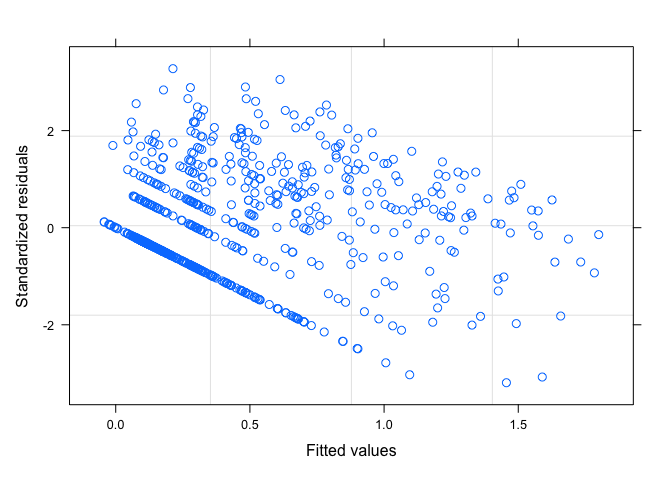<!-- -->

``` r
qqnorm(resid(model_sub2))
qqline(resid(model_sub2))
```

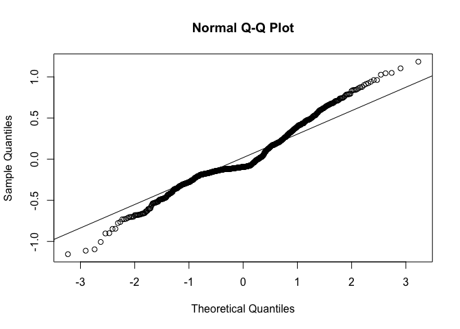<!-- -->

``` r
# Test for significance 
summary(model_sub2)
```

    ## Generalized least squares fit by maximum likelihood
    ##   Model: log10(Num_Introduced + 1) ~ NewPloidy * Fixer + AbsLatNative +      areaNativeScale + Human_Uses + annual 
    ##   Data: ploidy_data1 
    ##        AIC      BIC    logLik
    ##   654.9941 701.9768 -317.4971
    ## 
    ## Correlation Structure: corPagel
    ##  Formula: ~"Species" 
    ##  Parameter estimate(s):
    ##     lambda 
    ## 0.04424329 
    ## 
    ## Coefficients:
    ##                         Value  Std.Error   t-value p-value
    ## (Intercept)        0.14718037 0.07306654  2.014333  0.0443
    ## NewPloidy1         0.12862245 0.09270510  1.387437  0.1657
    ## Fixer1             0.00204796 0.06006921  0.034093  0.9728
    ## AbsLatNative      -0.00218817 0.00093790 -2.333055  0.0199
    ## areaNativeScale   -0.04197123 0.01194299 -3.514299  0.0005
    ## Human_Uses         0.18777460 0.00687942 27.295120  0.0000
    ## annual             0.07353937 0.03344086  2.199087  0.0282
    ## NewPloidy1:Fixer1 -0.11777689 0.09719271 -1.211787  0.2260
    ## 
    ##  Correlation: 
    ##                   (Intr) NwPld1 Fixer1 AbsLtN arNtvS Hmn_Us annual
    ## NewPloidy1        -0.469                                          
    ## Fixer1            -0.753  0.561                                   
    ## AbsLatNative      -0.250  0.058 -0.094                            
    ## areaNativeScale    0.045  0.013 -0.056  0.111                     
    ## Human_Uses        -0.259 -0.053  0.108  0.076 -0.366              
    ## annual            -0.011  0.016 -0.042 -0.093 -0.034  0.078       
    ## NewPloidy1:Fixer1  0.456 -0.952 -0.575 -0.077 -0.023  0.068 -0.032
    ## 
    ## Standardized residuals:
    ##        Min         Q1        Med         Q3        Max 
    ## -3.1933995 -0.4802500 -0.2610835  0.5827916  3.2760135 
    ## 
    ## Residual standard error: 0.3616302 
    ## Degrees of freedom: 811 total; 803 residual

``` r
Anova(model_sub2, contrasts=list(topic=contr.sum, sys=contr.sum), type=3) # Type 3 for interaction and contrasts set 
```

    ## Analysis of Deviance Table (Type III tests)
    ## 
    ## Response: log10(Num_Introduced + 1)
    ##                 Df    Chisq Pr(>Chisq)    
    ## (Intercept)      1   4.0575  0.0439745 *  
    ## NewPloidy        1   1.9250  0.1653087    
    ## Fixer            1   0.0012  0.9728027    
    ## AbsLatNative     1   5.4431  0.0196453 *  
    ## areaNativeScale  1  12.3503  0.0004409 ***
    ## Human_Uses       1 745.0236  < 2.2e-16 ***
    ## annual           1   4.8360  0.0278717 *  
    ## NewPloidy:Fixer  1   1.4684  0.2255938    
    ## ---
    ## Signif. codes:  0 '***' 0.001 '**' 0.01 '*' 0.05 '.' 0.1 ' ' 1

``` r
# Ploidy estimates have the expected sign, interaction is non-significant, but fixer estimate is opposite to what is expected 

# Get means from the model 
model_sub2_results<-lsmeans(model_sub2, pairwise~NewPloidy+Fixer, mode = "df.error")
model_sub2_results<-data.frame(model_sub2_results$lsmeans)

#Lambda is negative, so no phylogenetic clustering of trait
#Therefore compare to a phylogenetically uncorrected model

#Let's start with a Poisson model
model_poisson <- glm(Num_Introduced ~ NewPloidy*Fixer + AbsLatNative + areaNativeScale + Human_Uses + annual, data=ploidy_data1, family="poisson")

#Inspect model fit
plot(model_poisson) #Fit isn't awesome
```

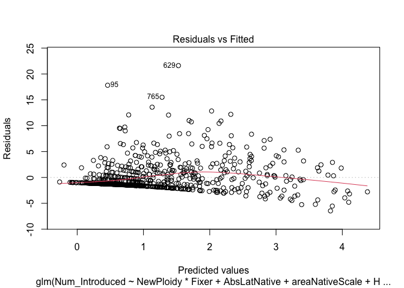<!-- -->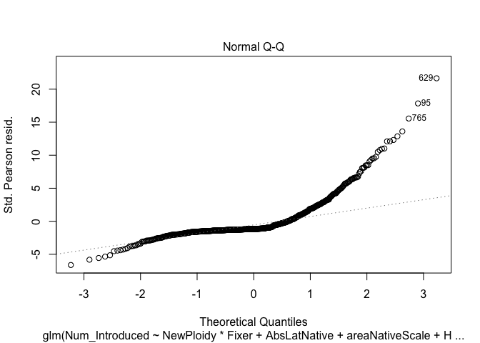<!-- -->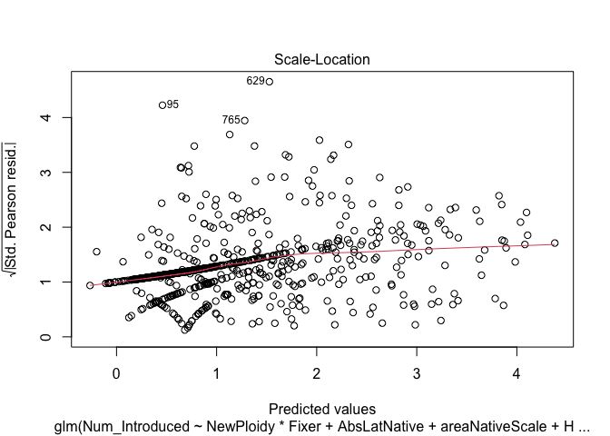<!-- --><!-- -->

``` r
qqnorm(resid(model_poisson))
qqline(resid(model_poisson))
```

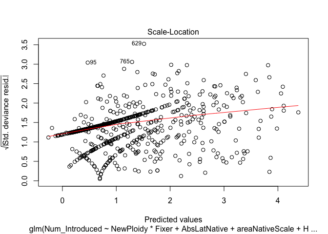<!-- -->

``` r
summary(model_poisson) #Probably not correct because of over-dispersion
```

    ## 
    ## Call:
    ## glm(formula = Num_Introduced ~ NewPloidy * Fixer + AbsLatNative + 
    ##     areaNativeScale + Human_Uses + annual, family = "poisson", 
    ##     data = ploidy_data1)
    ## 
    ## Deviance Residuals: 
    ##     Min       1Q   Median       3Q      Max  
    ## -8.6505  -1.9724  -1.6309   0.2977  12.3472  
    ## 
    ## Coefficients:
    ##                    Estimate Std. Error z value Pr(>|z|)    
    ## (Intercept)        0.403115   0.069960   5.762 8.31e-09 ***
    ## NewPloidy1         0.531661   0.078600   6.764 1.34e-11 ***
    ## Fixer1             0.268504   0.062130   4.322 1.55e-05 ***
    ## AbsLatNative      -0.010771   0.001115  -9.658  < 2e-16 ***
    ## areaNativeScale   -0.120011   0.011944 -10.048  < 2e-16 ***
    ## Human_Uses         0.430389   0.005847  73.603  < 2e-16 ***
    ## annual             0.404416   0.039917  10.131  < 2e-16 ***
    ## NewPloidy1:Fixer1 -0.634903   0.087161  -7.284 3.23e-13 ***
    ## ---
    ## Signif. codes:  0 '***' 0.001 '**' 0.01 '*' 0.05 '.' 0.1 ' ' 1
    ## 
    ## (Dispersion parameter for poisson family taken to be 1)
    ## 
    ##     Null deviance: 10821.6  on 810  degrees of freedom
    ## Residual deviance:  5151.9  on 803  degrees of freedom
    ##   (54 observations deleted due to missingness)
    ## AIC: 6577.9
    ## 
    ## Number of Fisher Scoring iterations: 6

``` r
coeftest(model_poisson, vcov = sandwich) #Recompute Wald tests using sandwich standard errors, and it's likely more correct
```

    ## 
    ## z test of coefficients:
    ## 
    ##                     Estimate Std. Error z value  Pr(>|z|)    
    ## (Intercept)        0.4031152  0.2156317  1.8695  0.061559 .  
    ## NewPloidy1         0.5316608  0.2209895  2.4058  0.016136 *  
    ## Fixer1             0.2685044  0.1925074  1.3948  0.163084    
    ## AbsLatNative      -0.0107713  0.0036823 -2.9252  0.003443 ** 
    ## areaNativeScale   -0.1200108  0.0404212 -2.9690  0.002988 ** 
    ## Human_Uses         0.4303892  0.0176316 24.4101 < 2.2e-16 ***
    ## annual             0.4044161  0.1367858  2.9566  0.003111 ** 
    ## NewPloidy1:Fixer1 -0.6349034  0.2511534 -2.5280  0.011473 *  
    ## ---
    ## Signif. codes:  0 '***' 0.001 '**' 0.01 '*' 0.05 '.' 0.1 ' ' 1

``` r
#Quasipoisson model for number of introductions is probably preferrable given over-dispersion
model_qpoisson <-glm(Num_Introduced ~ NewPloidy*Fixer + AbsLatNative + areaNativeScale + Human_Uses + annual, data=ploidy_data1, family="quasipoisson")

#Inspect model fit
plot(model_qpoisson) #Fit isn't awesome
```

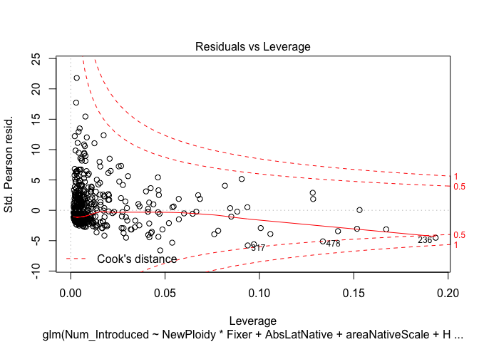<!-- -->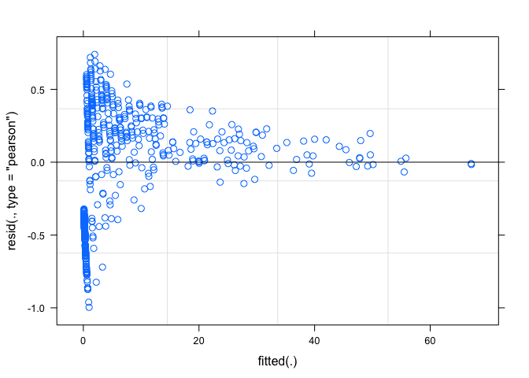<!-- -->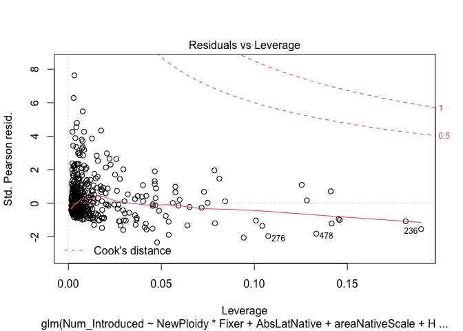<!-- -->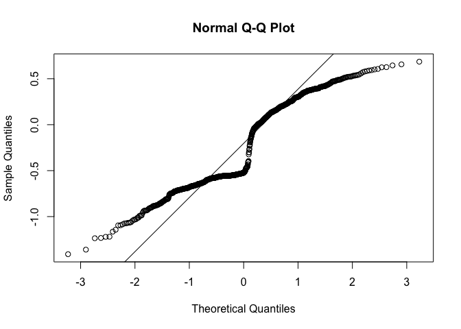<!-- -->

``` r
qqnorm(resid(model_qpoisson))
qqline(resid(model_qpoisson))
```

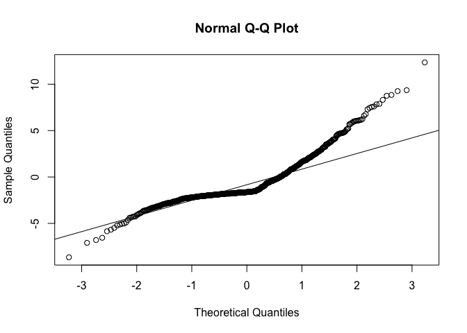<!-- -->

``` r
summary(model_qpoisson)
```

    ## 
    ## Call:
    ## glm(formula = Num_Introduced ~ NewPloidy * Fixer + AbsLatNative + 
    ##     areaNativeScale + Human_Uses + annual, family = "quasipoisson", 
    ##     data = ploidy_data1)
    ## 
    ## Deviance Residuals: 
    ##     Min       1Q   Median       3Q      Max  
    ## -8.6505  -1.9724  -1.6309   0.2977  12.3472  
    ## 
    ## Coefficients:
    ##                    Estimate Std. Error t value Pr(>|t|)    
    ## (Intercept)        0.403115   0.198575   2.030 0.042682 *  
    ## NewPloidy1         0.531661   0.223099   2.383 0.017400 *  
    ## Fixer1             0.268504   0.176350   1.523 0.128261    
    ## AbsLatNative      -0.010771   0.003166  -3.403 0.000700 ***
    ## areaNativeScale   -0.120011   0.033902  -3.540 0.000423 ***
    ## Human_Uses         0.430389   0.016597  25.931  < 2e-16 ***
    ## annual             0.404416   0.113302   3.569 0.000379 ***
    ## NewPloidy1:Fixer1 -0.634903   0.247398  -2.566 0.010459 *  
    ## ---
    ## Signif. codes:  0 '***' 0.001 '**' 0.01 '*' 0.05 '.' 0.1 ' ' 1
    ## 
    ## (Dispersion parameter for quasipoisson family taken to be 8.056593)
    ## 
    ##     Null deviance: 10821.6  on 810  degrees of freedom
    ## Residual deviance:  5151.9  on 803  degrees of freedom
    ##   (54 observations deleted due to missingness)
    ## AIC: NA
    ## 
    ## Number of Fisher Scoring iterations: 6

``` r
coeftest(model_qpoisson, vcov = sandwich) 
```

    ## 
    ## z test of coefficients:
    ## 
    ##                     Estimate Std. Error z value  Pr(>|z|)    
    ## (Intercept)        0.4031152  0.2156317  1.8695  0.061559 .  
    ## NewPloidy1         0.5316608  0.2209895  2.4058  0.016136 *  
    ## Fixer1             0.2685044  0.1925074  1.3948  0.163084    
    ## AbsLatNative      -0.0107713  0.0036823 -2.9252  0.003443 ** 
    ## areaNativeScale   -0.1200108  0.0404212 -2.9690  0.002988 ** 
    ## Human_Uses         0.4303892  0.0176316 24.4101 < 2.2e-16 ***
    ## annual             0.4044161  0.1367858  2.9566  0.003111 ** 
    ## NewPloidy1:Fixer1 -0.6349034  0.2511534 -2.5280  0.011473 *  
    ## ---
    ## Signif. codes:  0 '***' 0.001 '**' 0.01 '*' 0.05 '.' 0.1 ' ' 1

``` r
Anova(model_qpoisson, contrasts=list(topic=contr.sum, sys=contr.sum), type=3)
```

    ## Analysis of Deviance Table (Type III tests)
    ## 
    ## Response: Num_Introduced
    ##                 LR Chisq Df Pr(>Chisq)    
    ## NewPloidy           5.70  1  0.0169598 *  
    ## Fixer               2.47  1  0.1158945    
    ## AbsLatNative       11.71  1  0.0006232 ***
    ## areaNativeScale    13.44  1  0.0002468 ***
    ## Human_Uses        592.01  1  < 2.2e-16 ***
    ## annual             11.92  1  0.0005565 ***
    ## NewPloidy:Fixer     6.63  1  0.0100457 *  
    ## ---
    ## Signif. codes:  0 '***' 0.001 '**' 0.01 '*' 0.05 '.' 0.1 ' ' 1

``` r
# Run pgls for specificity on rhizobia 
model_sub_spec2<-gls(log10(Num_Introduced+1) ~ NewPloidy*Specialist + AbsLatNative + areaNativeScale + Human_Uses + annual, data=ploidy_data1, correlation=corPagel(value=0, phy=pruned, fixed=FALSE, form=~"Species"), method = "ML", na.action=na.exclude, control=glsControl(opt="optim",optimMethod="Nelder-Mead"))
```

    ## Warning in optim(c(coef(glsSt)), function(glsPars) -logLik(glsSt, glsPars), : one-dimensional optimization by Nelder-Mead is unreliable:
    ## use "Brent" or optimize() directly

``` r
# Inspect model fit 
plot(model_sub_spec2)
```

<!-- -->

``` r
qqnorm(resid(model_sub_spec2))
qqline(resid(model_sub_spec2))
```

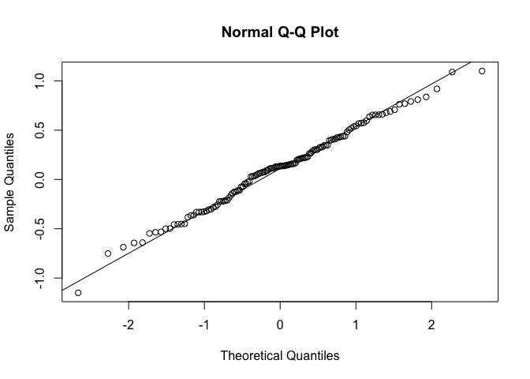<!-- -->

``` r
# Test for significance 
summary(model_sub_spec2)
```

    ## Generalized least squares fit by maximum likelihood
    ##   Model: log10(Num_Introduced + 1) ~ NewPloidy * Specialist + AbsLatNative +      areaNativeScale + Human_Uses + annual 
    ##   Data: ploidy_data1 
    ##        AIC      BIC    logLik
    ##   125.4096 154.0849 -52.70479
    ## 
    ## Correlation Structure: corPagel
    ##  Formula: ~"Species" 
    ##  Parameter estimate(s):
    ##     lambda 
    ## -0.1992188 
    ## 
    ## Coefficients:
    ##                             Value  Std.Error   t-value p-value
    ## (Intercept)             0.4000346 0.11142427  3.590193  0.0005
    ## NewPloidy1              0.4789848 0.17175214  2.788814  0.0061
    ## Specialist1             0.1678036 0.08716170  1.925199  0.0565
    ## AbsLatNative           -0.0118812 0.00231142 -5.140226  0.0000
    ## areaNativeScale        -0.1164701 0.02381255 -4.891124  0.0000
    ## Human_Uses              0.1725507 0.01541866 11.191030  0.0000
    ## annual                  0.0074739 0.09777208  0.076442  0.9392
    ## NewPloidy1:Specialist1 -0.5298943 0.19225704 -2.756176  0.0067
    ## 
    ##  Correlation: 
    ##                        (Intr) NwPld1 Spcls1 AbsLtN arNtvS Hmn_Us annual
    ## NewPloidy1             -0.270                                          
    ## Specialist1            -0.624  0.416                                   
    ## AbsLatNative           -0.655 -0.174  0.099                            
    ## areaNativeScale        -0.192 -0.143 -0.023  0.265                     
    ## Human_Uses             -0.536  0.017  0.110  0.134 -0.272              
    ## annual                 -0.242 -0.065  0.036  0.094  0.075  0.018       
    ## NewPloidy1:Specialist1  0.269 -0.869 -0.546  0.177  0.138 -0.010  0.065
    ## 
    ## Standardized residuals:
    ##        Min         Q1        Med         Q3        Max 
    ## -3.1396684 -0.4907200  0.3693319  1.0901147  3.0033505 
    ## 
    ## Residual standard error: 0.3662198 
    ## Degrees of freedom: 130 total; 122 residual

``` r
Anova(model_sub_spec2, contrasts=list(topic=contr.sum), type=3)
```

    ## Analysis of Deviance Table (Type III tests)
    ## 
    ## Response: log10(Num_Introduced + 1)
    ##                      Df    Chisq Pr(>Chisq)    
    ## (Intercept)           1  12.8895  0.0003304 ***
    ## NewPloidy             1   7.7775  0.0052901 ** 
    ## Specialist            1   3.7064  0.0542045 .  
    ## AbsLatNative          1  26.4219  2.744e-07 ***
    ## areaNativeScale       1  23.9231  1.003e-06 ***
    ## Human_Uses            1 125.2392  < 2.2e-16 ***
    ## annual                1   0.0058  0.9390675    
    ## NewPloidy:Specialist  1   7.5965  0.0058481 ** 
    ## ---
    ## Signif. codes:  0 '***' 0.001 '**' 0.01 '*' 0.05 '.' 0.1 ' ' 1

``` r
# Ploidy estimate sign is correct, specialist estimate is opposite sign as to what expected, interaction is significant 

# Grab the model means 
model_sub_spec2_results<-lsmeans(model_sub_spec2, pairwise~NewPloidy+Specialist, mode = "df.error")
model_sub_spec2_results<-data.frame(model_sub_spec2_results$lsmeans)

#Fit Poisson model for specificity 
model_spec_poisson <- glm(Num_Introduced ~ NewPloidy*Specialist + AbsLatNative + areaNativeScale + Human_Uses + annual, data=ploidy_data1, family="poisson")

#Inspect model fit
plot(model_spec_poisson) #Fit isn't terrible
```

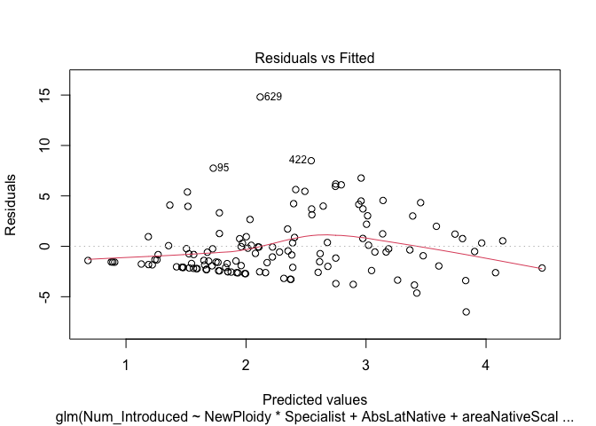<!-- --><!-- -->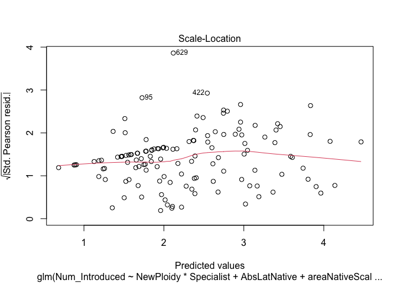<!-- --><!-- -->

``` r
qqnorm(resid(model_spec_poisson))
qqline(resid(model_spec_poisson))
```

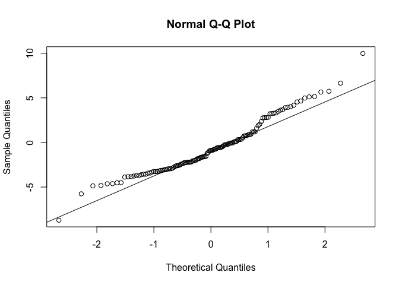<!-- -->

``` r
summary(model_spec_poisson) 
```

    ## 
    ## Call:
    ## glm(formula = Num_Introduced ~ NewPloidy * Specialist + AbsLatNative + 
    ##     areaNativeScale + Human_Uses + annual, family = "poisson", 
    ##     data = ploidy_data1)
    ## 
    ## Deviance Residuals: 
    ##     Min       1Q   Median       3Q      Max  
    ## -8.7162  -2.8554  -0.8980   0.8747   9.9823  
    ## 
    ## Coefficients:
    ##                         Estimate Std. Error z value Pr(>|z|)    
    ## (Intercept)             1.945549   0.078400  24.816  < 2e-16 ***
    ## NewPloidy1              0.498004   0.085805   5.804 6.48e-09 ***
    ## Specialist1             0.115956   0.056597   2.049   0.0405 *  
    ## AbsLatNative           -0.020266   0.001624 -12.480  < 2e-16 ***
    ## areaNativeScale        -0.220055   0.015883 -13.854  < 2e-16 ***
    ## Human_Uses              0.290491   0.009940  29.224  < 2e-16 ***
    ## annual                  0.238563   0.055540   4.295 1.74e-05 ***
    ## NewPloidy1:Specialist1 -0.930729   0.112206  -8.295  < 2e-16 ***
    ## ---
    ## Signif. codes:  0 '***' 0.001 '**' 0.01 '*' 0.05 '.' 0.1 ' ' 1
    ## 
    ## (Dispersion parameter for poisson family taken to be 1)
    ## 
    ##     Null deviance: 2517  on 129  degrees of freedom
    ## Residual deviance: 1193  on 122  degrees of freedom
    ##   (735 observations deleted due to missingness)
    ## AIC: 1627.7
    ## 
    ## Number of Fisher Scoring iterations: 5

``` r
coeftest(model_spec_poisson, vcov = sandwich) #Recompute Wald tests using sandwich standard errors, and it's likely more correct
```

    ## 
    ## z test of coefficients:
    ## 
    ##                          Estimate Std. Error z value  Pr(>|z|)    
    ## (Intercept)             1.9455492  0.2312515  8.4131 < 2.2e-16 ***
    ## NewPloidy1              0.4980043  0.2516343  1.9791  0.047807 *  
    ## Specialist1             0.1159561  0.1777887  0.6522  0.514264    
    ## AbsLatNative           -0.0202660  0.0045768 -4.4280 9.511e-06 ***
    ## areaNativeScale        -0.2200550  0.0435145 -5.0570 4.258e-07 ***
    ## Human_Uses              0.2904914  0.0296879  9.7849 < 2.2e-16 ***
    ## annual                  0.2385632  0.1656679  1.4400  0.149865    
    ## NewPloidy1:Specialist1 -0.9307286  0.3123907 -2.9794  0.002888 ** 
    ## ---
    ## Signif. codes:  0 '***' 0.001 '**' 0.01 '*' 0.05 '.' 0.1 ' ' 1

``` r
#Quasipoisson model for number of introductions is probably preferrable given over-dispersion
model_spec_qpoisson <-glm(Num_Introduced ~ NewPloidy*Specialist + AbsLatNative + areaNativeScale + Human_Uses + annual, data=ploidy_data1, family="quasipoisson")

#Inspect model fit
plot(model_spec_qpoisson) 
```

<!-- -->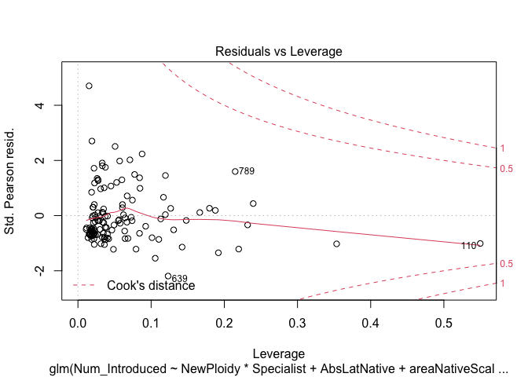<!-- --><!-- --><!-- -->

``` r
qqnorm(resid(model_spec_qpoisson))
qqline(resid(model_spec_qpoisson))
```

<!-- -->

``` r
summary(model_spec_qpoisson)
```

    ## 
    ## Call:
    ## glm(formula = Num_Introduced ~ NewPloidy * Specialist + AbsLatNative + 
    ##     areaNativeScale + Human_Uses + annual, family = "quasipoisson", 
    ##     data = ploidy_data1)
    ## 
    ## Deviance Residuals: 
    ##     Min       1Q   Median       3Q      Max  
    ## -8.7162  -2.8554  -0.8980   0.8747   9.9823  
    ## 
    ## Coefficients:
    ##                         Estimate Std. Error t value Pr(>|t|)    
    ## (Intercept)             1.945549   0.248660   7.824 2.07e-12 ***
    ## NewPloidy1              0.498004   0.272147   1.830 0.069705 .  
    ## Specialist1             0.115956   0.179509   0.646 0.519516    
    ## AbsLatNative           -0.020266   0.005151  -3.935 0.000139 ***
    ## areaNativeScale        -0.220055   0.050377  -4.368 2.65e-05 ***
    ## Human_Uses              0.290491   0.031528   9.214 1.13e-15 ***
    ## annual                  0.238563   0.176156   1.354 0.178153    
    ## NewPloidy1:Specialist1 -0.930729   0.355885  -2.615 0.010041 *  
    ## ---
    ## Signif. codes:  0 '***' 0.001 '**' 0.01 '*' 0.05 '.' 0.1 ' ' 1
    ## 
    ## (Dispersion parameter for quasipoisson family taken to be 10.05968)
    ## 
    ##     Null deviance: 2517  on 129  degrees of freedom
    ## Residual deviance: 1193  on 122  degrees of freedom
    ##   (735 observations deleted due to missingness)
    ## AIC: NA
    ## 
    ## Number of Fisher Scoring iterations: 5

``` r
coeftest(model_spec_qpoisson, vcov = sandwich) 
```

    ## 
    ## z test of coefficients:
    ## 
    ##                          Estimate Std. Error z value  Pr(>|z|)    
    ## (Intercept)             1.9455492  0.2312515  8.4131 < 2.2e-16 ***
    ## NewPloidy1              0.4980043  0.2516343  1.9791  0.047807 *  
    ## Specialist1             0.1159561  0.1777887  0.6522  0.514264    
    ## AbsLatNative           -0.0202660  0.0045768 -4.4280 9.511e-06 ***
    ## areaNativeScale        -0.2200550  0.0435145 -5.0570 4.258e-07 ***
    ## Human_Uses              0.2904914  0.0296879  9.7849 < 2.2e-16 ***
    ## annual                  0.2385632  0.1656679  1.4400  0.149865    
    ## NewPloidy1:Specialist1 -0.9307286  0.3123907 -2.9794  0.002888 ** 
    ## ---
    ## Signif. codes:  0 '***' 0.001 '**' 0.01 '*' 0.05 '.' 0.1 ' ' 1

``` r
Anova(model_spec_qpoisson, contrasts=list(topic=contr.sum, sys=contr.sum), type=3)
```

    ## Analysis of Deviance Table (Type III tests)
    ## 
    ## Response: Num_Introduced
    ##                      LR Chisq Df Pr(>Chisq)    
    ## NewPloidy               3.114  1    0.07762 .  
    ## Specialist              0.420  1    0.51673    
    ## AbsLatNative           15.868  1  6.793e-05 ***
    ## areaNativeScale        22.078  1  2.618e-06 ***
    ## Human_Uses             89.031  1  < 2.2e-16 ***
    ## annual                  1.764  1    0.18408    
    ## NewPloidy:Specialist    6.640  1    0.00997 ** 
    ## ---
    ## Signif. codes:  0 '***' 0.001 '**' 0.01 '*' 0.05 '.' 0.1 ' ' 1

### Analyzing the non-symbiotic and symbiotic species separately

Here we subset the data to only the non-symbiotic species in the
combined genus+subfamily dataset to look for an effect of ploidy on
invasion.

``` r
# Subset the data to non-symbiotic species 
ploidy_data_non <- ploidy_data1 %>%
  filter(Fixer == 0)
ploidy_data_non # Reduces the dataset to 68 species and two categories (diploid and polyploid)
```

    ##                        Species          Genus areaIntroduced
    ## 1           Acacia_bonariensis         Acacia   0.000000e+00
    ## 2               Acacia_greggii         Acacia   2.060000e+12
    ## 3     Acrocarpus_fraxinifolius     Acrocarpus   6.430000e+12
    ## 4           Amburana_cearensis       Amburana   0.000000e+00
    ## 5            Apuleia_leiocarpa        Apuleia   0.000000e+00
    ## 6           Bauhinia_forficata       Bauhinia   7.761980e+08
    ## 7            Bauhinia_galpinii       Bauhinia   4.960000e+12
    ## 8            Bauhinia_monandra       Bauhinia   9.760000e+12
    ## 9          Bauhinia_petersiana       Bauhinia   8.243619e+10
    ## 10           Bauhinia_purpurea       Bauhinia   2.230000e+13
    ## 11          Bauhinia_rufescens       Bauhinia   2.880000e+12
    ## 12           Bauhinia_ungulata       Bauhinia   3.285052e+08
    ## 13          Bauhinia_variegata       Bauhinia   2.570000e+13
    ## 14          Caesalpinia_bonduc    Caesalpinia   5.220000e+12
    ## 15      Caesalpinia_decapetala    Caesalpinia   1.840000e+13
    ## 16        Caesalpinia_echinata    Caesalpinia   0.000000e+00
    ## 17  Caesalpinia_paraguariensis    Caesalpinia   0.000000e+00
    ## 18        Caesalpinia_pluviosa    Caesalpinia   0.000000e+00
    ## 19          Caesalpinia_sappan    Caesalpinia   1.830000e+13
    ## 20         Caesalpinia_spinosa    Caesalpinia   5.920000e+12
    ## 21              Cassia_fistula         Cassia   3.900000e+13
    ## 22              Cassia_grandis         Cassia   9.330000e+12
    ## 23     Castanospermum_australe Castanospermum   8.870000e+12
    ## 24           Cercis_canadensis         Cercis   3.650000e+12
    ## 25         Cercis_siliquastrum         Cercis   1.500000e+13
    ## 26          Colvillea_racemosa      Colvillea   3.680000e+12
    ## 27      Copaifera_langsdorffii      Copaifera   0.000000e+00
    ## 28       Copaifera_officinalis      Copaifera   3.790000e+11
    ## 29                Dalea_mollis          Dalea   0.000000e+00
    ## 30               Delonix_elata        Delonix   7.910000e+12
    ## 31            Dipteryx_odorata       Dipteryx   2.891642e+07
    ## 32 Distemonanthus_benthamianus Distemonanthus   0.000000e+00
    ## 33       Gleditsia_amorphoides      Gleditsia   3.330000e+12
    ## 34          Gleditsia_japonica      Gleditsia   4.080000e+11
    ## 35       Gleditsia_triacanthos      Gleditsia   2.910000e+13
    ## 36      Guibourtia_coleosperma     Guibourtia   0.000000e+00
    ## 37       Gymnocladus_chinensis    Gymnocladus   0.000000e+00
    ## 38          Gymnocladus_dioica    Gymnocladus   1.330000e+13
    ## 39   Haematoxylum_campechianum   Haematoxylum   2.040000e+13
    ## 40       Hoffmannseggia_glauca Hoffmannseggia   0.000000e+00
    ## 41          Hymenaea_courbaril       Hymenaea   4.440000e+12
    ## 42         Hymenaea_parvifolia       Hymenaea   0.000000e+00
    ## 43          Hymenaea_verrucosa       Hymenaea   5.590000e+12
    ## 44        Hymenostegia_afzelii   Hymenostegia   0.000000e+00
    ## 45          Maackia_hupehensis        Maackia   0.000000e+00
    ## 46         Parkia_biglandulosa         Parkia   2.870000e+12
    ## 47        Parkinsonia_aculeata    Parkinsonia   4.250000e+13
    ## 48          Peltophorum_dubium    Peltophorum   3.800000e+12
    ## 49     Peltophorum_pterocarpum    Peltophorum   2.000000e+13
    ## 50   Petalostylis_labicheoides   Petalostylis   0.000000e+00
    ## 51         Pickeringia_montana    Pickeringia   0.000000e+00
    ## 52      Psorothamnus_fremontii   Psorothamnus   0.000000e+00
    ## 53        Pterodon_emarginatus       Pterodon   0.000000e+00
    ## 54            Pterogyne_nitens      Pterogyne   8.240000e+11
    ## 55       Schizolobium_parahyba   Schizolobium   1.100000e+13
    ## 56        Schotia_brachypetala        Schotia   4.530000e+12
    ## 57           Senna_alexandrina          Senna   2.020000e+12
    ## 58           Senna_candolleana          Senna   0.000000e+00
    ## 59          Senna_didymobotrya          Senna   6.790000e+12
    ## 60           Senna_obtusifolia          Senna   3.750000e+13
    ## 61          Senna_occidentalis          Senna   3.020000e+13
    ## 62               Senna_pendula          Senna   7.030000e+12
    ## 63            Senna_reticulata          Senna   0.000000e+00
    ## 64           Senna_surattensis          Senna   8.970000e+12
    ## 65                  Senna_tora          Senna   9.940000e+12
    ## 66           Sindora_siamensis        Sindora   0.000000e+00
    ## 67                Sindora_supa        Sindora   0.000000e+00
    ## 68           Tamarindus_indica     Tamarindus   4.370000e+13
    ##    areaIntroducedScale areaNative areaNativeScale Num_Introduced Fixer numOTUs
    ## 1          -0.33887512   4.27e+12     -0.35701649              0     0      NA
    ## 2          -0.07408562   2.28e+12     -0.61289484              1     0      NA
    ## 3           0.48762802   8.76e+12      0.22031709              5     0      NA
    ## 4          -0.33887512         NA              NA              0     0      NA
    ## 5          -0.33887512   1.46e+13      0.97123649              0     0      NA
    ## 6          -0.33877535   1.40e+13      0.89408724              1     0      NA
    ## 7           0.29867629   3.86e+12     -0.40973514             15     0      NA
    ## 8           0.91566152   5.93e+11     -0.82981283             15     0      NA
    ## 9          -0.32827889   1.06e+13      0.45690814              1     0      NA
    ## 10          2.52753545   1.71e+13      1.29269172             29     0      NA
    ## 11          0.03131602   9.90e+12      0.36690068              4     0      NA
    ## 12         -0.33883290   1.07e+13      0.46976635              1     0      NA
    ## 13          2.96456666   1.48e+13      0.99695291             27     0      NA
    ## 14          0.33209632   3.00e+13      2.95140066              5     0      NA
    ## 15          2.02623495   1.55e+13      1.08696037             14     0      NA
    ## 16         -0.33887512   8.47e+12      0.18302829              0     0      NA
    ## 17         -0.33887512   4.27e+12     -0.35701649              0     0      NA
    ## 18         -0.33887512   8.47e+12      0.18302829              0     0      NA
    ## 19          2.01338109   8.04e+12      0.12773799             20     0      NA
    ## 20          0.42207334   5.91e+12     -0.14614186              7     0      NA
    ## 21          4.67412991   1.02e+13      0.40547530             47     0      NA
    ## 22          0.86038993   1.27e+13      0.72693052             17     0      NA
    ## 23          0.80126218   2.69e+12     -0.56017619             15     0      NA
    ## 24          0.13029073   1.43e+13      0.93266187              5     0      NA
    ## 25          1.58920374   5.14e+12     -0.24515007             21     0      NA
    ## 26          0.13414689   5.93e+11     -0.82981283             12     0      NA
    ## 27         -0.33887512   6.13e+12     -0.11785380              0     0      NA
    ## 28         -0.29015899   3.05e+12     -0.51388663              5     0      NA
    ## 29         -0.33887512   7.02e+11     -0.81579738              0     0      NA
    ## 30          0.67786513   1.23e+13      0.67549769             12     0      NA
    ## 31         -0.33887140   6.95e+12     -0.01241649              1     0      NA
    ## 32         -0.33887512   2.45e+12     -0.59103589              0     0      NA
    ## 33          0.08915839   1.18e+13      0.61120664              3     0      NA
    ## 34         -0.28643137   2.52e+12     -0.58203514              1     0      NA
    ## 35          3.40159786   1.52e+13      1.04838575             25     0      NA
    ## 36         -0.33887512   6.09e+12     -0.12299708              0     0      NA
    ## 37         -0.33887512   1.83e+12     -0.67075678              0     0      NA
    ## 38          1.37068813   1.63e+13      1.18982604              9     0      NA
    ## 39          2.28331213   2.44e+12     -0.59232171             31     0      NA
    ## 40         -0.33887512   9.16e+12      0.27174993              0     0      NA
    ## 41          0.23183622   4.84e+12     -0.28372470             11     0      NA
    ## 42         -0.33887512   1.29e+13      0.75264694              0     0      NA
    ## 43          0.37965560   5.10e+12     -0.25029335             12     0      NA
    ## 44         -0.33887512   2.40e+12     -0.59746499              0     0      NA
    ## 45         -0.33887512   1.75e+12     -0.68104335              0     0      NA
    ## 46          0.03003063   8.07e+11     -0.80229626             10     0      NA
    ## 47          5.12401498   1.76e+13      1.35698276             26     0      NA
    ## 48          0.14957152   1.18e+13      0.61120664              6     0      NA
    ## 49          2.23189669   8.83e+12      0.22931784             32     0      NA
    ## 50         -0.33887512   6.04e+12     -0.12942619              0     0      NA
    ## 51         -0.33887512   4.74e+11     -0.84511410              0     0      NA
    ## 52         -0.33887512   1.21e+12     -0.75047768              0     0      NA
    ## 53         -0.33887512   4.66e+12     -0.30686947              0     0      NA
    ## 54         -0.23295932   1.05e+13      0.44404993              1     0      NA
    ## 55          1.07504938   9.85e+12      0.36047157             10     0      NA
    ## 56          0.24340470   3.86e+12     -0.40973514              5     0      NA
    ## 57         -0.07922717   1.91e+13      1.54985589              9     0      NA
    ## 58         -0.33887512         NA              NA              0     0      NA
    ## 59          0.53390191   1.12e+13      0.53405739             20     0      NA
    ## 60          4.48132203   2.06e+12     -0.64118290             20     0      NA
    ## 61          3.54299031   2.75e+13      2.62994544             48     0      NA
    ## 62          0.56475117   1.31e+11     -0.88921775              7     0      NA
    ## 63         -0.33887512   1.42e+13      0.91980366              0     0      NA
    ## 64          0.81411604   1.71e+13      1.29269172             27     0      NA
    ## 65          0.93879847   1.46e+13      0.97123649             19     0      NA
    ## 66         -0.33887512   4.17e+12     -0.36987469              0     0      NA
    ## 67         -0.33887512   2.02e+12     -0.64632619              0     0      NA
    ## 68          5.27826129   2.04e+13      1.71701261             49     0      NA
    ##    numGenera Specialist Human_Uses AbsLatNative   LatNative ChromosomeCount
    ## 1       <NA>       <NA>          0   26.9470519 -26.9470519              26
    ## 2       <NA>       <NA>          1   27.1950111  27.1950111              26
    ## 3       <NA>       <NA>          2   17.3649915  17.3649915              24
    ## 4       <NA>       <NA>          0           NA          NA              22
    ## 5       <NA>       <NA>          0    4.5631422  -4.5631422              28
    ## 6       <NA>       <NA>          0   15.9895911 -15.9895911              28
    ## 7       <NA>       <NA>          1   21.7294751 -21.7294751              28
    ## 8       <NA>       <NA>          1   19.3735274 -19.3735274              28
    ## 9       <NA>       <NA>          0   18.5853378 -18.5853378              26
    ## 10      <NA>       <NA>          9   22.9386032  22.9386032              28
    ## 11      <NA>       <NA>          6   14.3408522  14.3408522              23
    ## 12      <NA>       <NA>          0    7.8624843  -7.8624843              28
    ## 13      <NA>       <NA>          6   24.0086267  24.0086267              28
    ## 14      <NA>       <NA>          4    6.2806233   6.2806233              24
    ## 15      <NA>       <NA>          5   16.7971417  16.7971417              22
    ## 16      <NA>       <NA>          0   10.7722795 -10.7722795              24
    ## 17      <NA>       <NA>          1   26.9470519 -26.9470519              24
    ## 18      <NA>       <NA>          0   10.7722795 -10.7722795              24
    ## 19      <NA>       <NA>          6    9.4601436   9.4601436              24
    ## 20      <NA>       <NA>          2   10.2682571 -10.2682571              24
    ## 21      <NA>       <NA>          7   10.6892249  10.6892249              28
    ## 22      <NA>       <NA>          4    2.3461862   2.3461862              28
    ## 23      <NA>       <NA>          5   17.6442593 -17.6442593              26
    ## 24      <NA>       <NA>          3   34.0843962  34.0843962              12
    ## 25      <NA>       <NA>          4   39.4039814  39.4039814              14
    ## 26      <NA>       <NA>          2   19.3735274 -19.3735274              27
    ## 27      <NA>       <NA>          0   16.7355339 -16.7355339              24
    ## 28      <NA>       <NA>          5    5.6211657   5.6211657              24
    ## 29      <NA>       <NA>          0   36.0327801  36.0327801              16
    ## 30      <NA>       <NA>          5   15.1395972  15.1395972              28
    ## 31      <NA>       <NA>          7    2.8627333  -2.8627333              32
    ## 32      <NA>       <NA>          3    7.6159951   7.6159951              24
    ## 33      <NA>       <NA>          0   24.5855168 -24.5855168              28
    ## 34      <NA>       <NA>          5   35.8532940  35.8532940              28
    ## 35      <NA>       <NA>          7   41.0748998  41.0748998              28
    ## 36      <NA>       <NA>          4   11.7395381 -11.7395381              48
    ## 37      <NA>       <NA>          2   27.6064912  27.6064912              28
    ## 38      <NA>       <NA>          4   54.1279384  54.1279384              28
    ## 39      <NA>       <NA>          5   19.2976685  19.2976685              24
    ## 40      <NA>       <NA>          0    3.5130894   3.5130894              24
    ## 41      <NA>       <NA>          3    9.2242963   9.2242963              24
    ## 42      <NA>       <NA>          0    3.6844597  -3.6844597              24
    ## 43      <NA>       <NA>          5    4.7628879  -4.7628879              24
    ## 44      <NA>       <NA>          3    8.4438118   8.4438118              24
    ## 45      <NA>       <NA>          0   31.0424924  31.0424924              18
    ## 46      <NA>       <NA>          2   21.6102924  21.6102924              26
    ## 47      <NA>       <NA>          6   10.4745755  10.4745755              28
    ## 48      <NA>       <NA>          3   24.5855168 -24.5855168              26
    ## 49      <NA>       <NA>          7    2.5322752   2.5322752              26
    ## 50      <NA>       <NA>          0   26.3807675 -26.3807675              28
    ## 51      <NA>       <NA>          0   28.1855382  28.1855382              28
    ## 52      <NA>       <NA>          0   37.4554773  37.4554773              20
    ## 53      <NA>       <NA>          4    3.9619395  -3.9619395              16
    ## 54      <NA>       <NA>          2   18.3368459 -18.3368459              20
    ## 55      <NA>       <NA>          2    3.4997450   3.4997450              24
    ## 56      <NA>       <NA>          4   21.7294751 -21.7294751              24
    ## 57      <NA>       <NA>          1   19.6454854  19.6454854              28
    ## 58      <NA>       <NA>          0           NA          NA              28
    ## 59      <NA>       <NA>          5    3.4715157   3.4715157              28
    ## 60      <NA>       <NA>          5    0.5392246   0.5392246              26
    ## 61      <NA>       <NA>          6    7.5869245   7.5869245              28
    ## 62      <NA>       <NA>          1    7.2886344  -7.2886344              28
    ## 63      <NA>       <NA>          0    6.8275492   6.8275492              28
    ## 64      <NA>       <NA>          3   10.4469946  10.4469946              30
    ## 65      <NA>       <NA>          5   20.3914665  20.3914665              26
    ## 66      <NA>       <NA>          4    6.4051709   6.4051709              12
    ## 67      <NA>       <NA>          2    5.4131884  -5.4131884              16
    ## 68      <NA>       <NA>          8    1.3893721   1.3893721              24
    ##    PloidyLow diPloidyLow sfPloidy disfPloidy     annual disfPloidy_corrected
    ## 1          2           0        2          0 0.00000000                    0
    ## 2          2           0        2          0 0.00000000                    0
    ## 3         NA        <NA>        3          1 0.00000000                    1
    ## 4          2           0        2          0 0.00000000                    0
    ## 5         NA        <NA>        4          1 0.00000000                    0
    ## 6          2           0        4          1 0.00000000                    1
    ## 7          2           0        4          1 0.00000000                    1
    ## 8          2           0        4          1 0.00000000                    1
    ## 9          2           0        4          1 0.00000000                    1
    ## 10         2           0        4          1 0.00000000                    1
    ## 11         2           0        3          1 0.00000000                    1
    ## 12         2           0        4          1 0.00000000                    1
    ## 13         2           0        4          1 0.00000000                    1
    ## 14         2           0        3          1 0.00000000                    1
    ## 15         2           0        3          1 0.00000000                    1
    ## 16         2           0        3          1 0.00000000                    1
    ## 17         2           0        3          1 0.00000000                    1
    ## 18         2           0        3          1 0.00000000                    1
    ## 19         2           0        3          1 0.00000000                    1
    ## 20         2           0        3          1 0.00000000                    1
    ## 21         4           1        4          1 0.00000000                    1
    ## 22         4           1        4          1 0.00000000                    1
    ## 23         2           0        2          0 0.00000000                    0
    ## 24        NA        <NA>        2          0 0.00000000                    0
    ## 25        NA        <NA>        2          0 0.00000000                    0
    ## 26        NA        <NA>        4          1 0.00000000                    1
    ## 27        NA        <NA>        3          1 0.00000000                    0
    ## 28        NA        <NA>        3          1 0.00000000                    1
    ## 29         2           0        2          0 1.00000000                    0
    ## 30        NA        <NA>        4          1 0.00000000                    1
    ## 31         2           0        3          1 0.00000000                    1
    ## 32        NA        <NA>        3          1 0.00000000                    1
    ## 33        NA        <NA>        4          1 0.00000000                    0
    ## 34        NA        <NA>        4          1 0.00000000                    0
    ## 35        NA        <NA>        4          1 0.00000000                    0
    ## 36        NA        <NA>        7          1 0.00000000                    1
    ## 37        NA        <NA>        4          1 0.00000000                    0
    ## 38        NA        <NA>        4          1 0.00000000                    0
    ## 39        NA        <NA>        3          1 0.00000000                    1
    ## 40        NA        <NA>        3          1 0.00000000                    0
    ## 41        NA        <NA>        3          1 0.00000000                    0
    ## 42        NA        <NA>        3          1 0.00000000                    0
    ## 43        NA        <NA>        3          1 0.00000000                    0
    ## 44        NA        <NA>        3          1 0.00000000                    1
    ## 45        NA        <NA>        2          0 0.00000000                    0
    ## 46        NA        <NA>        2          0 0.00000000                    0
    ## 47        NA        <NA>        4          1 0.00000000                    1
    ## 48        NA        <NA>        4          1 0.00000000                    1
    ## 49        NA        <NA>        4          1 0.00000000                    1
    ## 50        NA        <NA>        2          0 0.06306306                    0
    ## 51        NA        <NA>        3          1 0.00000000                    1
    ## 52        NA        <NA>        2          0 0.00000000                    0
    ## 53        NA        <NA>        2          0 0.00000000                    0
    ## 54        NA        <NA>        3          1 0.00000000                    1
    ## 55        NA        <NA>        3          1 0.00000000                    1
    ## 56        NA        <NA>        3          1 0.00000000                    1
    ## 57        NA        <NA>        4          1 0.00000000                    1
    ## 58        NA        <NA>        4          1 0.02777778                    1
    ## 59        NA        <NA>        4          1 0.00000000                    1
    ## 60        NA        <NA>        4          1 0.00000000                    1
    ## 61        NA        <NA>        4          1 0.00000000                    1
    ## 62        NA        <NA>        4          1 0.00000000                    1
    ## 63        NA        <NA>        4          1 0.00000000                    1
    ## 64        NA        <NA>        4          1 0.00000000                    1
    ## 65        NA        <NA>        4          1 0.00000000                    1
    ## 66        NA        <NA>        2          0 0.00000000                    0
    ## 67        NA        <NA>        2          0 0.00000000                    0
    ## 68        NA        <NA>        2          0 0.00000000                    0
    ##    NewPloidy
    ## 1          0
    ## 2          0
    ## 3          1
    ## 4          0
    ## 5          0
    ## 6          0
    ## 7          0
    ## 8          0
    ## 9          0
    ## 10         0
    ## 11         0
    ## 12         0
    ## 13         0
    ## 14         0
    ## 15         0
    ## 16         0
    ## 17         0
    ## 18         0
    ## 19         0
    ## 20         0
    ## 21         1
    ## 22         1
    ## 23         0
    ## 24         0
    ## 25         0
    ## 26         1
    ## 27         0
    ## 28         1
    ## 29         0
    ## 30         1
    ## 31         0
    ## 32         1
    ## 33         0
    ## 34         0
    ## 35         0
    ## 36         1
    ## 37         0
    ## 38         0
    ## 39         1
    ## 40         0
    ## 41         0
    ## 42         0
    ## 43         0
    ## 44         1
    ## 45         0
    ## 46         0
    ## 47         1
    ## 48         1
    ## 49         1
    ## 50         0
    ## 51         1
    ## 52         0
    ## 53         0
    ## 54         1
    ## 55         1
    ## 56         1
    ## 57         1
    ## 58         1
    ## 59         1
    ## 60         1
    ## 61         1
    ## 62         1
    ## 63         1
    ## 64         1
    ## 65         1
    ## 66         0
    ## 67         0
    ## 68         0

``` r
# Run pgls and allow lambda to vary
model_sub_non<-gls(log10(Num_Introduced + 1) ~ NewPloidy + AbsLatNative + areaNativeScale + Human_Uses + annual, data=ploidy_data_non, correlation=corPagel(value=0, phy=pruned, fixed=FALSE, form=~"Species"), method = "ML", na.action=na.exclude)

# Inspect model fit 
plot(model_sub_non)
```

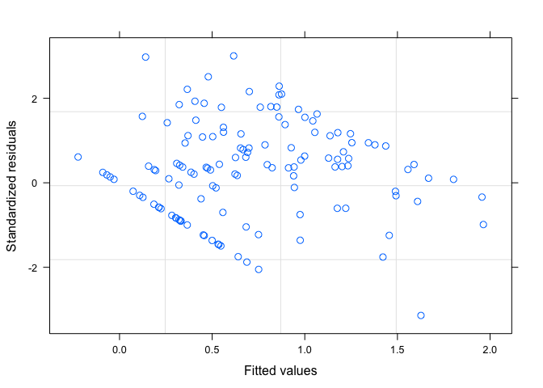<!-- -->

``` r
qqnorm(resid(model_sub_non))
qqline(resid(model_sub_non)) # This looks pretty ok with the raw data but maybe a bit better with the logged values 
```

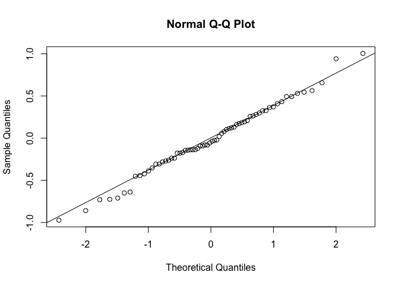<!-- -->

``` r
# Test for significance 
summary(model_sub_non)
```

    ## Generalized least squares fit by maximum likelihood
    ##   Model: log10(Num_Introduced + 1) ~ NewPloidy + AbsLatNative + areaNativeScale +      Human_Uses + annual 
    ##   Data: ploidy_data_non 
    ##        AIC      BIC    logLik
    ##   78.84103 96.35827 -31.42051
    ## 
    ## Correlation Structure: corPagel
    ##  Formula: ~"Species" 
    ##  Parameter estimate(s):
    ##    lambda 
    ## 0.3159921 
    ## 
    ## Coefficients:
    ##                       Value Std.Error   t-value p-value
    ## (Intercept)     -0.01916736 0.1595369 -0.120144  0.9048
    ## NewPloidy1       0.25556737 0.1133062  2.255546  0.0278
    ## AbsLatNative     0.00744467 0.0044432  1.675504  0.0990
    ## areaNativeScale  0.11014047 0.0628510  1.752407  0.0848
    ## Human_Uses       0.16554541 0.0221661  7.468403  0.0000
    ## annual           0.10171056 0.4160290  0.244479  0.8077
    ## 
    ##  Correlation: 
    ##                 (Intr) NwPld1 AbsLtN arNtvS Hmn_Us
    ## NewPloidy1      -0.197                            
    ## AbsLatNative    -0.535  0.226                     
    ## areaNativeScale -0.059 -0.006  0.042              
    ## Human_Uses      -0.382 -0.168  0.065 -0.267       
    ## annual          -0.036  0.047 -0.157  0.081  0.141
    ## 
    ## Standardized residuals:
    ##        Min         Q1        Med         Q3        Max 
    ## -2.3179156 -0.6077655 -0.1104878  0.6257097  2.3953282 
    ## 
    ## Residual standard error: 0.4195285 
    ## Degrees of freedom: 66 total; 60 residual

``` r
Anova(model_sub_non, type=2,  contrasts=list(topic=contr.sum)) # Type 2 anova 
```

    ## Analysis of Deviance Table (Type II tests)
    ## 
    ## Response: log10(Num_Introduced + 1)
    ##                 Df   Chisq Pr(>Chisq)    
    ## NewPloidy        1  5.0875    0.02410 *  
    ## AbsLatNative     1  2.8073    0.09384 .  
    ## areaNativeScale  1  3.0709    0.07970 .  
    ## Human_Uses       1 55.7770  8.117e-14 ***
    ## annual           1  0.0598    0.80686    
    ## ---
    ## Signif. codes:  0 '***' 0.001 '**' 0.01 '*' 0.05 '.' 0.1 ' ' 1

``` r
# Not significant but the estimate is in the direction we would expect and is getting close to significance (p = 0.0977)
# Maybe this can be reported as marginally significant? 


# Subset the data to symbiotic species 
ploidy_data_sym <- ploidy_data1 %>%
  filter(Fixer == 1)
ploidy_data_sym
```

    ##                           Species           Genus areaIntroduced
    ## 1               Abrus_precatorius           Abrus   1.480000e+11
    ## 2                Acacia_acuminata          Acacia   0.000000e+00
    ## 3                    Acacia_alata          Acacia   0.000000e+00
    ## 4                Acacia_ampliceps          Acacia   0.000000e+00
    ## 5              Acacia_aulacocarpa          Acacia   0.000000e+00
    ## 6           Acacia_auriculiformis          Acacia   1.120000e+13
    ## 7                Acacia_baileyana          Acacia   1.070000e+13
    ## 8              Acacia_berlandieri          Acacia   0.000000e+00
    ## 9             Acacia_brachybotrya          Acacia   1.150000e+11
    ## 10                  Acacia_caffra          Acacia   1.890000e+11
    ## 11             Acacia_calamifolia          Acacia   1.284364e+09
    ## 12            Acacia_cardiophylla          Acacia   2.680000e+11
    ## 13                 Acacia_catechu          Acacia   2.290000e+12
    ## 14                   Acacia_caven          Acacia   0.000000e+00
    ## 15              Acacia_cincinnata          Acacia   0.000000e+00
    ## 16                   Acacia_colei          Acacia   0.000000e+00
    ## 17                 Acacia_confusa          Acacia   3.580000e+12
    ## 18            Acacia_cultriformis          Acacia   2.080000e+13
    ## 19                Acacia_dealbata          Acacia   1.450000e+13
    ## 20                  Acacia_deanei          Acacia   0.000000e+00
    ## 21               Acacia_decurrens          Acacia   1.000000e+13
    ## 22                   Acacia_elata          Acacia   9.680000e+12
    ## 23                Acacia_elongata          Acacia   0.000000e+00
    ## 24             Acacia_falciformis          Acacia   2.680000e+11
    ## 25                Acacia_galpinii          Acacia   0.000000e+00
    ## 26               Acacia_gerrardii          Acacia   0.000000e+00
    ## 27             Acacia_glaucoptera          Acacia   0.000000e+00
    ## 28                  Acacia_hockii          Acacia   0.000000e+00
    ## 29                Acacia_irrorata          Acacia   2.680000e+11
    ## 30                  Acacia_karroo          Acacia   8.220000e+12
    ## 31                  Acacia_kirkii          Acacia   0.000000e+00
    ## 32                     Acacia_koa          Acacia   8.508123e+10
    ## 33               Acacia_leiocalyx          Acacia   0.000000e+00
    ## 34              Acacia_leucoclada          Acacia   0.000000e+00
    ## 35                Acacia_ligulata          Acacia   0.000000e+00
    ## 36              Acacia_longifolia          Acacia   2.050000e+13
    ## 37                Acacia_mearnsii          Acacia   1.780000e+13
    ## 38             Acacia_melanoxylon          Acacia   1.710000e+13
    ## 39                 Acacia_modesta          Acacia   0.000000e+00
    ## 40              Acacia_nigrescens          Acacia   0.000000e+00
    ## 41                Acacia_nilotica          Acacia   4.860000e+12
    ## 42               Acacia_notabilis          Acacia   1.890000e+11
    ## 43             Acacia_papyrocarpa          Acacia   0.000000e+00
    ## 44                Acacia_paradoxa          Acacia   4.290000e+12
    ## 45          Acacia_podalyriifolia          Acacia   2.260000e+13
    ## 46             Acacia_polyacantha          Acacia   2.581957e+10
    ## 47               Acacia_pubescens          Acacia   0.000000e+00
    ## 48               Acacia_pulchella          Acacia   3.980000e+11
    ## 49             Acacia_rehmanniana          Acacia   0.000000e+00
    ## 50                 Acacia_saligna          Acacia   2.030000e+13
    ## 51                 Acacia_senegal          Acacia   9.430000e+12
    ## 52                   Acacia_seyal          Acacia   3.610000e+12
    ## 53             Acacia_spectabilis          Acacia   2.410000e+12
    ## 54              Acacia_spinescens          Acacia   1.890000e+11
    ## 55              Acacia_suaveolens          Acacia   2.120000e+12
    ## 56              Acacia_terminalis          Acacia   3.190000e+11
    ## 57         Acacia_tetragonophylla          Acacia   0.000000e+00
    ## 58                Acacia_tortilis          Acacia   3.350000e+12
    ## 59                Acacia_triptera          Acacia   0.000000e+00
    ## 60            Acacia_verticillata          Acacia   2.280000e+12
    ## 61               Acacia_victoriae          Acacia   0.000000e+00
    ## 62            Acacia_xanthophloea          Acacia   0.000000e+00
    ## 63          Acmispon_brachycarpus        Acmispon   0.000000e+00
    ## 64           Acmispon_parviflorus        Acmispon   0.000000e+00
    ## 65          Acmispon_wrangelianus        Acmispon   0.000000e+00
    ## 66        Adenocarpus_complicatus     Adenocarpus   0.000000e+00
    ## 67        Adenocarpus_decorticans     Adenocarpus   0.000000e+00
    ## 68         Adenocarpus_foliolosus     Adenocarpus   0.000000e+00
    ## 69         Aeschynomene_afraspera    Aeschynomene   0.000000e+00
    ## 70         Aeschynomene_americana    Aeschynomene   1.320000e+13
    ## 71           Aeschynomene_ciliata    Aeschynomene   0.000000e+00
    ## 72           Aeschynomene_falcata    Aeschynomene   1.140000e+12
    ## 73            Aeschynomene_indica    Aeschynomene   5.746899e+10
    ## 74         Aeschynomene_pratensis    Aeschynomene   0.000000e+00
    ## 75             Aeschynomene_rudis    Aeschynomene   1.700000e+12
    ## 76            Aeschynomene_scabra            <NA>             NA
    ## 77         Aeschynomene_schimperi    Aeschynomene   0.000000e+00
    ## 78         Aeschynomene_sensitiva    Aeschynomene   3.779767e+09
    ## 79         Aeschynomene_virginica    Aeschynomene   0.000000e+00
    ## 80             Albizia_guachapele         Albizia   8.080000e+11
    ## 81            Albizia_julibrissin         Albizia   3.040000e+13
    ## 82                Albizia_kalkora         Albizia   0.000000e+00
    ## 83                Albizia_lebbeck         Albizia   4.660000e+13
    ## 84            Albizia_lebbekoides         Albizia   0.000000e+00
    ## 85                Albizia_procera         Albizia   1.640000e+13
    ## 86             Alhagi_sparsifolia          Alhagi   0.000000e+00
    ## 87               Amicia_zygomeris          Amicia   0.000000e+00
    ## 88      Ammopiptanthus_mongolicus  Ammopiptanthus   0.000000e+00
    ## 89            Amorpha_californica         Amorpha   0.000000e+00
    ## 90              Amorpha_canescens         Amorpha   0.000000e+00
    ## 91              Amorpha_fruticosa         Amorpha   2.400000e+13
    ## 92         Amphicarpaea_bracteata    Amphicarpaea   0.000000e+00
    ## 93         Amphithalea_ericifolia     Amphithalea   0.000000e+00
    ## 94         Amphithalea_intermedia     Amphithalea   0.000000e+00
    ## 95        Anadenanthera_colubrina   Anadenanthera   2.055545e+09
    ## 96        Anadenanthera_peregrina            <NA>             NA
    ## 97                 Andira_inermis          Andira   2.840000e+12
    ## 98            Anthyllis_cornicina       Anthyllis   0.000000e+00
    ## 99             Anthyllis_lotoides       Anthyllis   0.000000e+00
    ## 100             Anthyllis_montana       Anthyllis   0.000000e+00
    ## 101          Anthyllis_vulneraria            <NA>             NA
    ## 102        Antopetitia_abyssinica     Antopetitia   0.000000e+00
    ## 103               Aotus_ericoides           Aotus   0.000000e+00
    ## 104               Apios_americana           Apios   1.520000e+12
    ## 105              Arachis_hypogaea         Arachis   6.370000e+13
    ## 106        Argyrolobium_uniflorum            <NA>             NA
    ## 107          Argyrolobium_zanonii    Argyrolobium   0.000000e+00
    ## 108         Aspalathus_cephalotes      Aspalathus   0.000000e+00
    ## 109          Aspalathus_pachyloba      Aspalathus   0.000000e+00
    ## 110            Aspalathus_recurva      Aspalathus   0.000000e+00
    ## 111          Astragalus_adsurgens      Astragalus   0.000000e+00
    ## 112         Astragalus_allochrous      Astragalus   0.000000e+00
    ## 113         Astragalus_americanus      Astragalus   0.000000e+00
    ## 114      Astragalus_atropilosulus      Astragalus   0.000000e+00
    ## 115           Astragalus_boeticus      Astragalus   0.000000e+00
    ## 116         Astragalus_canadensis      Astragalus   0.000000e+00
    ## 117              Astragalus_cicer      Astragalus   2.750000e+12
    ## 118         Astragalus_corrugatus      Astragalus   0.000000e+00
    ## 119         Astragalus_epiglottis      Astragalus   0.000000e+00
    ## 120           Astragalus_eucosmus      Astragalus   0.000000e+00
    ## 121           Astragalus_frigidus      Astragalus   0.000000e+00
    ## 122              Astragalus_miser      Astragalus   0.000000e+00
    ## 123        Astragalus_mollissimus      Astragalus   0.000000e+00
    ## 124          Astragalus_neglectus      Astragalus   0.000000e+00
    ## 125           Astragalus_nothoxys      Astragalus   0.000000e+00
    ## 126           Astragalus_odoratus      Astragalus   2.310000e+11
    ## 127         Astragalus_pehuenches      Astragalus   0.000000e+00
    ## 128        Astragalus_scaberrimus      Astragalus   0.000000e+00
    ## 129            Astragalus_sinicus      Astragalus   0.000000e+00
    ## 130         Astragalus_spatulatus      Astragalus   0.000000e+00
    ## 131        Astragalus_stevenianus      Astragalus   0.000000e+00
    ## 132           Astragalus_tenellus      Astragalus   0.000000e+00
    ## 133        Astragalus_tribuloides      Astragalus   0.000000e+00
    ## 134         Astragalus_uliginosus      Astragalus   0.000000e+00
    ## 135         Astragalus_umbellatus      Astragalus   0.000000e+00
    ## 136            Baphia_massaiensis          Baphia   0.000000e+00
    ## 137                 Baptisia_alba        Baptisia   0.000000e+00
    ## 138            Baptisia_australis        Baptisia   1.360000e+13
    ## 139            Baptisia_bracteata        Baptisia   0.000000e+00
    ## 140            Baptisia_tinctoria        Baptisia   0.000000e+00
    ## 141               Bauhinia_vahlii        Bauhinia   2.400000e+12
    ## 142        Bituminaria_bituminosa     Bituminaria   1.320000e+11
    ## 143    Bobgunnia_madagascariensis       Bobgunnia   1.470000e+11
    ## 144         Bolusanthus_speciosus     Bolusanthus   3.680000e+12
    ## 145           Bossiaea_linophylla        Bossiaea   0.000000e+00
    ## 146        Bowdichia_virgilioides       Bowdichia   0.000000e+00
    ## 147                   Brya_ebenus            Brya   4.300000e+11
    ## 148                Cadia_purpurea           Cadia   0.000000e+00
    ## 149                 Cajanus_cajan         Cajanus   4.600000e+13
    ## 150              Cajanus_lineatus         Cajanus   0.000000e+00
    ## 151         Calliandra_eriophylla      Calliandra   0.000000e+00
    ## 152        Calliandra_houstoniana      Calliandra   2.180000e+12
    ## 153               Calpurnia_aurea       Calpurnia   2.190000e+12
    ## 154         Camptosema_rubicundum      Camptosema   7.460000e+11
    ## 155      Campylotropis_macrocarpa   Campylotropis   0.000000e+00
    ## 156        Canavalia_brasiliensis       Canavalia   1.470000e+11
    ## 157          Canavalia_cathartica       Canavalia   1.685873e+10
    ## 158            Canavalia_gladiata       Canavalia   2.740000e+13
    ## 159               Canavalia_rosea       Canavalia   2.527217e+08
    ## 160             Caragana_erinacea        Caragana   0.000000e+00
    ## 161          Caragana_korshinskii        Caragana   0.000000e+00
    ## 162          Caragana_microphylla        Caragana   1.320000e+12
    ## 163          Carmichaelia_arborea    Carmichaelia   0.000000e+00
    ## 164           Carmichaelia_kirkii    Carmichaelia   0.000000e+00
    ## 165         Centrolobium_paraense            <NA>             NA
    ## 166       Centrolobium_tomentosum    Centrolobium   0.000000e+00
    ## 167          Centrosema_pubescens      Centrosema   2.510000e+13
    ## 168        Centrosema_virginianum      Centrosema   5.540000e+11
    ## 169                Chadsia_grevei         Chadsia   0.000000e+00
    ## 170      Chamaecrista_fasciculata    Chamaecrista   2.055545e+09
    ## 171        Chamaecrista_nictitans    Chamaecrista   2.160000e+12
    ## 172            Chorizema_cordatum       Chorizema   0.000000e+00
    ## 173               Cicer_arietinum           Cicer   7.410000e+13
    ## 174           Cicer_echinospermum           Cicer   0.000000e+00
    ## 175            Cicer_pinnatifidum           Cicer   0.000000e+00
    ## 176             Cicer_reticulatum           Cicer   0.000000e+00
    ## 177            Clianthus_puniceus       Clianthus   3.610000e+11
    ## 178           Colutea_arborescens         Colutea   1.170000e+13
    ## 179            Coronilla_coronata       Coronilla   0.000000e+00
    ## 180              Coronilla_juncea       Coronilla   0.000000e+00
    ## 181              Coronilla_minima       Coronilla   0.000000e+00
    ## 182             Coronilla_repanda       Coronilla   0.000000e+00
    ## 183         Coronilla_scorpioides       Coronilla   7.940000e+12
    ## 184           Coronilla_vaginalis       Coronilla   0.000000e+00
    ## 185           Crotalaria_assamica      Crotalaria   0.000000e+00
    ## 186         Crotalaria_atrorubens      Crotalaria   0.000000e+00
    ## 187           Crotalaria_calycina      Crotalaria   0.000000e+00
    ## 188           Crotalaria_capensis      Crotalaria   8.480000e+11
    ## 189             Crotalaria_comosa      Crotalaria   0.000000e+00
    ## 190         Crotalaria_glaucoides      Crotalaria   0.000000e+00
    ## 191          Crotalaria_goreensis      Crotalaria   2.100000e+13
    ## 192             Crotalaria_incana      Crotalaria   1.430000e+13
    ## 193         Crotalaria_lanceolata      Crotalaria   2.080000e+12
    ## 194         Crotalaria_ochroleuca      Crotalaria   1.260000e+13
    ## 195            Crotalaria_pallida      Crotalaria   1.730000e+13
    ## 196          Crotalaria_podocarpa      Crotalaria   0.000000e+00
    ## 197       Crotalaria_senegalensis      Crotalaria   3.420000e+11
    ## 198       Crotalaria_sphaerocarpa      Crotalaria   0.000000e+00
    ## 199         Crotalaria_trichotoma      Crotalaria   9.410000e+12
    ## 200             Cyamopsis_serrata       Cyamopsis   0.000000e+00
    ## 201       Cyamopsis_tetragonoloba       Cyamopsis   1.580000e+13
    ## 202          Cyclopia_genistoides            <NA>             NA
    ## 203             Cyclopia_maculata        Cyclopia   0.000000e+00
    ## 204            Cyclopia_meyeriana            <NA>             NA
    ## 205            Cyclopia_pubescens            <NA>             NA
    ## 206              Cytisus_arboreus         Cytisus   0.000000e+00
    ## 207           Cytisus_multiflorus            <NA>             NA
    ## 208             Cytisus_scoparius            <NA>             NA
    ## 209              Cytisus_striatus            <NA>             NA
    ## 210              Cytisus_villosus         Cytisus   0.000000e+00
    ## 211            Dalbergia_assamica       Dalbergia   5.820000e+11
    ## 212          Dalbergia_frutescens       Dalbergia   0.000000e+00
    ## 213         Dalbergia_melanoxylon       Dalbergia   1.060000e+12
    ## 214         Dalbergia_miscolobium       Dalbergia   0.000000e+00
    ## 215           Dalbergia_monetaria       Dalbergia   0.000000e+00
    ## 216               Dalbergia_nigra       Dalbergia   0.000000e+00
    ## 217              Dalbergia_sissoo       Dalbergia   1.660000e+13
    ## 218                 Dalea_candida           Dalea   0.000000e+00
    ## 219                Dalea_leporina           Dalea   0.000000e+00
    ## 220              Dalea_mollissima           Dalea   0.000000e+00
    ## 221             Dalea_pogonathera           Dalea   0.000000e+00
    ## 222                Dalea_purpurea           Dalea   0.000000e+00
    ## 223           Daviesia_acicularis        Daviesia   0.000000e+00
    ## 224            Daviesia_corymbosa        Daviesia   0.000000e+00
    ## 225         Daviesia_genistifolia        Daviesia   0.000000e+00
    ## 226          Daviesia_leptophylla        Daviesia   0.000000e+00
    ## 227           Daviesia_ulicifolia        Daviesia   0.000000e+00
    ## 228              Derris_elliptica          Derris   3.240000e+12
    ## 229        Desmanthus_illinoensis      Desmanthus   3.827134e+10
    ## 230           Desmanthus_virgatus      Desmanthus   1.420000e+13
    ## 231            Desmodium_barbatum       Desmodium   0.000000e+00
    ## 232          Desmodium_cuspidatum       Desmodium   0.000000e+00
    ## 233             Desmodium_elegans       Desmodium   2.310000e+11
    ## 234          Desmodium_gangeticum       Desmodium   2.387763e+10
    ## 235          Desmodium_glutinosum       Desmodium   0.000000e+00
    ## 236        Desmodium_heterocarpon       Desmodium   1.520000e+12
    ## 237        Desmodium_microphyllum       Desmodium   0.000000e+00
    ## 238          Desmodium_scorpiurus       Desmodium   9.580000e+12
    ## 239           Desmodium_tortuosum       Desmodium   2.920000e+13
    ## 240           Desmodium_uncinatum       Desmodium   7.270000e+12
    ## 241         Dichilus_lebeckioides        Dichilus   0.000000e+00
    ## 242             Dichilus_strictus        Dichilus   0.000000e+00
    ## 243               Dioclea_virgata         Dioclea   2.550000e+12
    ## 244             Diphysa_americana         Diphysa   6.080000e+11
    ## 245              Dipogon_lignosus         Dipogon   1.950000e+13
    ## 246             Dolichos_trilobus        Dolichos   0.000000e+00
    ## 247        Dorycnium_pentaphyllum       Dorycnium   2.680000e+11
    ## 248              Dorycnium_rectum       Dorycnium   0.000000e+00
    ## 249               Dumasia_villosa         Dumasia   0.000000e+00
    ## 250                Ebenus_pinnata          Ebenus   0.000000e+00
    ## 251             Entada_abyssinica          Entada   0.000000e+00
    ## 252 Enterolobium_contortisiliquum    Enterolobium   9.720000e+11
    ## 253      Enterolobium_cyclocarpum    Enterolobium   4.290000e+12
    ## 254       Erythrina_costaricensis       Erythrina   0.000000e+00
    ## 255               Erythrina_fusca       Erythrina   4.530000e+12
    ## 256          Erythrina_lysistemon       Erythrina   6.530000e+12
    ## 257            Erythrina_speciosa       Erythrina   3.600000e+12
    ## 258            Euchresta_japonica       Euchresta   0.000000e+00
    ## 259             Faidherbia_albida      Faidherbia   9.970000e+11
    ## 260         Flemingia_macrophylla       Flemingia   7.600000e+12
    ## 261              Galactia_striata        Galactia   6.139767e+08
    ## 262            Galega_officinalis          Galega   1.720000e+13
    ## 263             Galega_orientalis          Galega   8.740000e+12
    ## 264          Gastrolobium_bilobum    Gastrolobium   0.000000e+00
    ## 265      Gastrolobium_parviflorum    Gastrolobium   0.000000e+00
    ## 266               Genista_anglica         Genista   0.000000e+00
    ## 267           Genista_canariensis         Genista   8.470000e+12
    ## 268               Genista_cinerea         Genista   0.000000e+00
    ## 269               Genista_falcata         Genista   0.000000e+00
    ## 270               Genista_florida         Genista   0.000000e+00
    ## 271             Genista_germanica         Genista   1.110000e+11
    ## 272             Genista_linifolia         Genista   5.090000e+12
    ## 273         Genista_monspessulana         Genista   1.660000e+13
    ## 274               Genista_radiata         Genista   0.000000e+00
    ## 275                Genista_tenera         Genista   0.000000e+00
    ## 276             Gliricidia_sepium      Gliricidia   1.920000e+13
    ## 277             Glycine_canescens         Glycine   0.000000e+00
    ## 278           Glycine_clandestina         Glycine   0.000000e+00
    ## 279                   Glycine_max         Glycine   8.870000e+13
    ## 280           Glycine_microphylla         Glycine   0.000000e+00
    ## 281              Glycine_tabacina         Glycine   5.820000e+11
    ## 282            Glycyrrhiza_glabra     Glycyrrhiza   1.540000e+13
    ## 283          Glycyrrhiza_lepidota     Glycyrrhiza   0.000000e+00
    ## 284      Glycyrrhiza_pallidiflora     Glycyrrhiza   0.000000e+00
    ## 285         Glycyrrhiza_uralensis     Glycyrrhiza   0.000000e+00
    ## 286            Gompholobium_minus    Gompholobium   0.000000e+00
    ## 287              Goodia_lotifolia          Goodia   1.150000e+11
    ## 288         Gueldenstaedtia_verna Gueldenstaedtia   0.000000e+00
    ## 289     Halimodendron_halodendron   Halimodendron   7.170000e+12
    ## 290      Hardenbergia_comptoniana    Hardenbergia   1.320000e+11
    ## 291         Hardenbergia_violacea    Hardenbergia   2.055545e+09
    ## 292              Havardia_pallens        Havardia   0.000000e+00
    ## 293            Hebestigma_cubense      Hebestigma   0.000000e+00
    ## 294             Hedysarum_alpinum       Hedysarum   0.000000e+00
    ## 295             Hedysarum_boreale       Hedysarum   0.000000e+00
    ## 296          Hedysarum_caucasicum       Hedysarum   0.000000e+00
    ## 297          Hedysarum_coronarium       Hedysarum   6.850000e+12
    ## 298           Hedysarum_vicioides       Hedysarum   0.000000e+00
    ## 299   Hesperolaburnum_platycarpum Hesperolaburnum   0.000000e+00
    ## 300            Hippocrepis_emerus     Hippocrepis   7.170000e+11
    ## 301      Hippocrepis_unisiliquosa     Hippocrepis   0.000000e+00
    ## 302            Hoita_macrostachya           Hoita   0.000000e+00
    ## 303               Hovea_elliptica           Hovea   1.150000e+11
    ## 304               Hovea_trisperma           Hovea   0.000000e+00
    ## 305      Hypocalyptus_coluteoides    Hypocalyptus   0.000000e+00
    ## 306      Hypocalyptus_sophoroides    Hypocalyptus   0.000000e+00
    ## 307        Indigastrum_argyroides     Indigastrum   0.000000e+00
    ## 308          Indigofera_alternans      Indigofera   0.000000e+00
    ## 309           Indigofera_argentea      Indigofera   0.000000e+00
    ## 310            Indigofera_arrecta            <NA>             NA
    ## 311        Indigofera_astragalina      Indigofera   3.556257e+08
    ## 312          Indigofera_australis      Indigofera   2.670000e+12
    ## 313         Indigofera_cordifolia      Indigofera   0.000000e+00
    ## 314             Indigofera_decora      Indigofera   2.740000e+12
    ## 315            Indigofera_demissa      Indigofera   0.000000e+00
    ## 316        Indigofera_emarginella      Indigofera   0.000000e+00
    ## 317          Indigofera_filifolia            <NA>             NA
    ## 318          Indigofera_hedyantha      Indigofera   0.000000e+00
    ## 319            Indigofera_hirsuta      Indigofera   2.150000e+12
    ## 320          Indigofera_kirilowii      Indigofera   8.170000e+12
    ## 321          Indigofera_linifolia      Indigofera   2.645045e+09
    ## 322           Indigofera_lupatana      Indigofera   0.000000e+00
    ## 323         Indigofera_microcarpa      Indigofera   0.000000e+00
    ## 324    Indigofera_nummulariifolia      Indigofera   0.000000e+00
    ## 325       Indigofera_oblongifolia      Indigofera   0.000000e+00
    ## 326          Indigofera_praticola      Indigofera   0.000000e+00
    ## 327    Indigofera_pseudotinctoria      Indigofera   0.000000e+00
    ## 328            Indigofera_pulchra      Indigofera   0.000000e+00
    ## 329       Indigofera_rhynchocarpa      Indigofera   0.000000e+00
    ## 330          Indigofera_schimperi      Indigofera   0.000000e+00
    ## 331       Indigofera_sessiliflora      Indigofera   0.000000e+00
    ## 332            Indigofera_spicata      Indigofera   1.280000e+11
    ## 333       Indigofera_strobilifera      Indigofera   0.000000e+00
    ## 334       Indigofera_suffruticosa      Indigofera   5.580000e+12
    ## 335         Indigofera_swaziensis      Indigofera   0.000000e+00
    ## 336          Indigofera_tinctoria      Indigofera   3.140000e+12
    ## 337               Inga_densiflora            Inga   0.000000e+00
    ## 338                   Inga_edulis            Inga   6.600000e+12
    ## 339             Inga_heterophylla            Inga   0.000000e+00
    ## 340                  Inga_laurina            Inga   2.120000e+12
    ## 341             Inga_leiocalycina            Inga   0.000000e+00
    ## 342              Inga_oerstediana            Inga   0.000000e+00
    ## 343                 Inga_punctata            Inga   0.000000e+00
    ## 344              Inga_sertulifera            Inga   0.000000e+00
    ## 345              Inga_spectabilis            Inga   0.000000e+00
    ## 346              Inga_umbellifera            Inga   0.000000e+00
    ## 347                     Inga_vera            Inga   2.120000e+12
    ## 348             Inocarpus_fagifer       Inocarpus   4.700590e+09
    ## 349          Isotropis_cuneifolia       Isotropis   0.000000e+00
    ## 350             Jacksonia_horrida       Jacksonia   0.000000e+00
    ## 351            Kennedia_beckxiana        Kennedia   0.000000e+00
    ## 352             Kennedia_coccinea        Kennedia   0.000000e+00
    ## 353            Kennedia_nigricans        Kennedia   0.000000e+00
    ## 354            Kennedia_prostrata        Kennedia   0.000000e+00
    ## 355            Kennedia_rubicunda        Kennedia   4.340000e+11
    ## 356         Kummerowia_stipulacea      Kummerowia   2.800000e+12
    ## 357            Kummerowia_striata      Kummerowia   2.530000e+12
    ## 358              Lablab_purpureus          Lablab   3.350000e+13
    ## 359          Laburnum_anagyroides        Laburnum   2.410000e+13
    ## 360       Lamprolobium_fruticosum    Lamprolobium   1.300000e+11
    ## 361               Lathyrus_aphaca        Lathyrus   1.120000e+13
    ## 362               Lathyrus_cicera        Lathyrus   6.060000e+11
    ## 363             Lathyrus_clymenum        Lathyrus   8.970000e+11
    ## 364             Lathyrus_hirsutus        Lathyrus   4.970000e+12
    ## 365            Lathyrus_japonicus        Lathyrus   0.000000e+00
    ## 366           Lathyrus_littoralis        Lathyrus   0.000000e+00
    ## 367           Lathyrus_nevadensis        Lathyrus   0.000000e+00
    ## 368                Lathyrus_niger        Lathyrus   3.460000e+11
    ## 369             Lathyrus_nissolia        Lathyrus   8.380000e+12
    ## 370               Lathyrus_ochrus        Lathyrus   1.170000e+11
    ## 371             Lathyrus_odoratus        Lathyrus   6.380000e+13
    ## 372            Lathyrus_palustris        Lathyrus   0.000000e+00
    ## 373            Lathyrus_pratensis            <NA>             NA
    ## 374              Lathyrus_sativus        Lathyrus   5.410000e+13
    ## 375           Lathyrus_sphaericus        Lathyrus   8.420000e+12
    ## 376           Lathyrus_tingitanus        Lathyrus   7.130000e+12
    ## 377           Lebeckia_cytisoides        Lebeckia   0.000000e+00
    ## 378                Lens_culinaris            Lens   2.780000e+13
    ## 379                 Lens_ervoides            Lens   0.000000e+00
    ## 380        Lespedeza_angustifolia       Lespedeza   0.000000e+00
    ## 381             Lespedeza_bicolor       Lespedeza   8.250000e+12
    ## 382            Lespedeza_capitata       Lespedeza   0.000000e+00
    ## 383         Lespedeza_cyrtobotrya       Lespedeza   8.170000e+12
    ## 384             Lespedeza_davidii       Lespedeza   0.000000e+00
    ## 385          Lespedeza_floribunda       Lespedeza   0.000000e+00
    ## 386               Lespedeza_hirta       Lespedeza   0.000000e+00
    ## 387            Lespedeza_japonica       Lespedeza   8.540000e+12
    ## 388              Lespedeza_juncea       Lespedeza   1.090000e+13
    ## 389        Lespedeza_maximowiczii       Lespedeza   0.000000e+00
    ## 390          Lespedeza_procumbens       Lespedeza   0.000000e+00
    ## 391              Lespedeza_repens       Lespedeza   0.000000e+00
    ## 392             Lespedeza_stuevei       Lespedeza   0.000000e+00
    ## 393          Lespedeza_thunbergii       Lespedeza   6.120000e+11
    ## 394           Lespedeza_tomentosa       Lespedeza   0.000000e+00
    ## 395             Lespedeza_virgata       Lespedeza   2.750000e+11
    ## 396           Lespedeza_virginica       Lespedeza   0.000000e+00
    ## 397            Lessertia_herbacea            <NA>             NA
    ## 398         Leucaena_diversifolia        Leucaena   2.490000e+12
    ## 399              Leucaena_greggii        Leucaena   2.940000e+11
    ## 400          Leucaena_involucrata        Leucaena   0.000000e+00
    ## 401         Leucaena_leucocephala            <NA>             NA
    ## 402        Leucaena_multicapitula        Leucaena   0.000000e+00
    ## 403         Leucaena_pulverulenta        Leucaena   5.470000e+12
    ## 404               Leucaena_retusa        Leucaena   1.120000e+11
    ## 405        Leucaena_salvadorensis        Leucaena   0.000000e+00
    ## 406            Leucaena_shannonii        Leucaena   0.000000e+00
    ## 407            Leucaena_trichodes        Leucaena   0.000000e+00
    ## 408             Liparia_splendens         Liparia   0.000000e+00
    ## 409    Lonchocarpus_eriocarinalis    Lonchocarpus   0.000000e+00
    ## 410          Lotononis_platycarpa       Lotononis   0.000000e+00
    ## 411         Lotononis_rabenaviana       Lotononis   0.000000e+00
    ## 412           Lotus_angustissimus           Lotus   1.100000e+13
    ## 413                Lotus_arabicus           Lotus   0.000000e+00
    ## 414               Lotus_arenarius           Lotus   0.000000e+00
    ## 415               Lotus_australis           Lotus   0.000000e+00
    ## 416          Lotus_conimbricensis           Lotus   0.000000e+00
    ## 417            Lotus_corniculatus            <NA>             NA
    ## 418                Lotus_cruentus           Lotus   0.000000e+00
    ## 419              Lotus_cytisoides           Lotus   0.000000e+00
    ## 420                  Lotus_edulis           Lotus   0.000000e+00
    ## 421              Lotus_halophilus           Lotus   0.000000e+00
    ## 422         Lotus_longesiliquosus           Lotus   0.000000e+00
    ## 423              Lotus_maroccanus           Lotus   0.000000e+00
    ## 424        Lotus_ornithopodioides           Lotus   7.940000e+12
    ## 425             Lotus_parviflorus           Lotus   0.000000e+00
    ## 426            Lotus_pedunculatus            <NA>             NA
    ## 427              Lotus_peregrinus           Lotus   0.000000e+00
    ## 428              Lotus_schoelleri           Lotus   0.000000e+00
    ## 429             Lotus_subbiflorus           Lotus   0.000000e+00
    ## 430                  Lotus_tenuis           Lotus   8.460000e+11
    ## 431                Lotus_weilleri           Lotus   0.000000e+00
    ## 432             Lupinus_albifrons         Lupinus   0.000000e+00
    ## 433                 Lupinus_albus         Lupinus   3.770000e+13
    ## 434         Lupinus_angustifolius         Lupinus   3.150000e+13
    ## 435              Lupinus_arboreus         Lupinus   5.590000e+12
    ## 436              Lupinus_arcticus         Lupinus   0.000000e+00
    ## 437             Lupinus_argenteus         Lupinus   0.000000e+00
    ## 438            Lupinus_atlanticus         Lupinus   0.000000e+00
    ## 439            Lupinus_cosentinii         Lupinus   1.280000e+13
    ## 440             Lupinus_digitatus         Lupinus   0.000000e+00
    ## 441            Lupinus_hispanicus         Lupinus   0.000000e+00
    ## 442            Lupinus_latifolius         Lupinus   0.000000e+00
    ## 443               Lupinus_lepidus         Lupinus   0.000000e+00
    ## 444                Lupinus_luteus         Lupinus   3.320000e+13
    ## 445             Lupinus_mexicanus         Lupinus   4.560000e+11
    ## 446             Lupinus_mutabilis         Lupinus   7.120000e+12
    ## 447                 Lupinus_nanus         Lupinus   0.000000e+00
    ## 448          Lupinus_nootkatensis         Lupinus   7.270000e+11
    ## 449           Lupinus_palaestinus         Lupinus   0.000000e+00
    ## 450              Lupinus_perennis         Lupinus   1.190000e+13
    ## 451               Lupinus_pilosus         Lupinus   1.130000e+13
    ## 452           Lupinus_polyphyllus         Lupinus   3.010000e+13
    ## 453               Lupinus_princei         Lupinus   0.000000e+00
    ## 454              Lupinus_pusillus         Lupinus   0.000000e+00
    ## 455              Lupinus_sericeus         Lupinus   0.000000e+00
    ## 456           Lupinus_succulentus         Lupinus   0.000000e+00
    ## 457          Lysiloma_divaricatum        Lysiloma   0.000000e+00
    ## 458             Maackia_amurensis         Maackia   1.450000e+13
    ## 459          Machaerium_aculeatum      Machaerium   0.000000e+00
    ## 460        Machaerium_brasiliense      Machaerium   0.000000e+00
    ## 461         Machaerium_stipitatum      Machaerium   0.000000e+00
    ## 462           Machaerium_villosum      Machaerium   0.000000e+00
    ## 463    Macroptilium_atropurpureum    Macroptilium   1.280000e+13
    ## 464          Macroptilium_gracile    Macroptilium   0.000000e+00
    ## 465      Macroptilium_lathyroides    Macroptilium   2.040000e+13
    ## 466         Macrotyloma_uniflorum     Macrotyloma   2.270000e+12
    ## 467              Medicago_arabica        Medicago   2.200000e+13
    ## 468              Medicago_arborea        Medicago   1.590000e+13
    ## 469          Medicago_brachycarpa        Medicago   0.000000e+00
    ## 470           Medicago_cancellata        Medicago   0.000000e+00
    ## 471          Medicago_carstiensis        Medicago   0.000000e+00
    ## 472           Medicago_constricta        Medicago   0.000000e+00
    ## 473             Medicago_heyniana        Medicago   0.000000e+00
    ## 474              Medicago_hybrida        Medicago   0.000000e+00
    ## 475             Medicago_hypogaea        Medicago   0.000000e+00
    ## 476           Medicago_intertexta            <NA>             NA
    ## 477            Medicago_laciniata        Medicago   5.390000e+12
    ## 478             Medicago_lupulina            <NA>             NA
    ## 479               Medicago_marina        Medicago   0.000000e+00
    ## 480       Medicago_medicaginoides        Medicago   0.000000e+00
    ## 481             Medicago_monantha        Medicago   5.820000e+11
    ## 482          Medicago_monspeliaca        Medicago   1.640000e+13
    ## 483                Medicago_murex        Medicago   0.000000e+00
    ## 484               Medicago_noeana        Medicago   0.000000e+00
    ## 485          Medicago_orbicularis        Medicago   1.450000e+13
    ## 486            Medicago_papillosa        Medicago   0.000000e+00
    ## 487          Medicago_polyceratia        Medicago   0.000000e+00
    ## 488           Medicago_polymorpha        Medicago   4.380000e+13
    ## 489              Medicago_praecox        Medicago   9.780000e+12
    ## 490              Medicago_radiata        Medicago   7.900000e+11
    ## 491            Medicago_ruthenica        Medicago   0.000000e+00
    ## 492               Medicago_sativa            <NA>             NA
    ## 493           Medicago_scutellata        Medicago   7.520000e+12
    ## 494         Medicago_secundiflora        Medicago   0.000000e+00
    ## 495           Medicago_soleirolii        Medicago   5.390000e+11
    ## 496         Medicago_suffruticosa        Medicago   0.000000e+00
    ## 497           Medicago_truncatula        Medicago   7.620000e+12
    ## 498            Medicago_turbinata        Medicago   0.000000e+00
    ## 499               Melilotus_albus       Melilotus   3.620000e+13
    ## 500             Melilotus_indicus       Melilotus   4.920000e+13
    ## 501         Melilotus_officinalis            <NA>             NA
    ## 502            Melilotus_sulcatus       Melilotus   1.640000e+13
    ## 503         Melolobium_obcordatum      Melolobium   0.000000e+00
    ## 504          Microlobius_foetidus     Microlobius   0.000000e+00
    ## 505          Millettia_thonningii       Millettia   4.380000e+12
    ## 506          Mimosa_aculeaticarpa          Mimosa   0.000000e+00
    ## 507                 Mimosa_albida          Mimosa   4.700590e+09
    ## 508                Mimosa_debilis          Mimosa   0.000000e+00
    ## 509           Mimosa_hirsutissima          Mimosa   0.000000e+00
    ## 510                  Mimosa_pigra          Mimosa   7.260000e+12
    ## 511              Mimosa_polycarpa          Mimosa   0.000000e+00
    ## 512                 Mimosa_pudica          Mimosa   3.070000e+13
    ## 513           Mimosa_quadrivalvis          Mimosa   1.290000e+12
    ## 514               Mimosa_somnians          Mimosa   0.000000e+00
    ## 515            Mimosa_strigillosa            <NA>             NA
    ## 516             Mimosa_tenuiflora          Mimosa   0.000000e+00
    ## 517       Mimozyganthus_carinatus   Mimozyganthus   0.000000e+00
    ## 518              Mirbelia_pungens        Mirbelia   0.000000e+00
    ## 519              Mucuna_nigricans          Mucuna   0.000000e+00
    ## 520              Mundulea_sericea        Mundulea   2.120000e+12
    ## 521           Neorautanenia_mitis   Neorautanenia   0.000000e+00
    ## 522           Neptunia_monosperma        Neptunia   0.000000e+00
    ## 523             Neptunia_oleracea        Neptunia   2.055545e+09
    ## 524                Neptunia_plena        Neptunia   4.450000e+12
    ## 525            Neptunia_pubescens        Neptunia   0.000000e+00
    ## 526                 Olneya_tesota          Olneya   0.000000e+00
    ## 527           Onobrychis_arenaria      Onobrychis   0.000000e+00
    ## 528               Onobrychis_cyri      Onobrychis   0.000000e+00
    ## 529     Onobrychis_transcaucasica      Onobrychis   0.000000e+00
    ## 530         Onobrychis_viciifolia            <NA>             NA
    ## 531              Ononis_mitissima          Ononis   0.000000e+00
    ## 532                 Ononis_natrix          Ononis   9.370000e+12
    ## 533           Ononis_rotundifolia          Ononis   0.000000e+00
    ## 534                Ononis_serrata          Ononis   5.390000e+11
    ## 535              Ononis_vaginalis          Ononis   0.000000e+00
    ## 536            Ophrestia_radicosa       Ophrestia   0.000000e+00
    ## 537       Ormocarpum_trichocarpum      Ormocarpum   0.000000e+00
    ## 538                Ormosia_henryi         Ormosia   0.000000e+00
    ## 539                Ormosia_krugii         Ormosia   0.000000e+00
    ## 540          Ormosia_semicastrata         Ormosia   0.000000e+00
    ## 541         Ornithopus_compressus      Ornithopus   1.830000e+13
    ## 542        Ornithopus_perpusillus            <NA>             NA
    ## 543           Ornithopus_pinnatus      Ornithopus   1.110000e+13
    ## 544            Ornithopus_sativus            <NA>             NA
    ## 545              Ottleya_strigosa         Ottleya   0.000000e+00
    ## 546          Oxylobium_ellipticum       Oxylobium   0.000000e+00
    ## 547            Oxylobium_robustum       Oxylobium   0.000000e+00
    ## 548         Oxyrhynchus_volubilis     Oxyrhynchus   0.000000e+00
    ## 549             Oxytropis_arctica       Oxytropis   0.000000e+00
    ## 550             Oxytropis_deflexa       Oxytropis   0.000000e+00
    ## 551           Oxytropis_lambertii       Oxytropis   0.000000e+00
    ## 552         Oxytropis_maydelliana       Oxytropis   0.000000e+00
    ## 553              Oxytropis_pilosa       Oxytropis   0.000000e+00
    ## 554             Oxytropis_sericea       Oxytropis   0.000000e+00
    ## 555           Oxytropis_splendens       Oxytropis   0.000000e+00
    ## 556            Pachyrhizus_erosus     Pachyrhizus   2.910000e+13
    ## 557    Parapiptadenia_pterosperma            <NA>             NA
    ## 558         Parapiptadenia_rigida  Parapiptadenia   2.670000e+12
    ## 559      Paraserianthes_lophantha  Paraserianthes   1.340000e+13
    ## 560           Parochetus_communis      Parochetus   2.680000e+11
    ## 561         Peltophorum_africanum     Peltophorum   4.900000e+12
    ## 562           Petteria_ramentacea        Petteria   0.000000e+00
    ## 563         Phaseolus_acutifolius       Phaseolus   1.070000e+13
    ## 564           Phaseolus_coccineus       Phaseolus   3.740000e+13
    ## 565          Phaseolus_filiformis       Phaseolus   0.000000e+00
    ## 566             Phaseolus_lunatus       Phaseolus   4.080000e+13
    ## 567           Phaseolus_maculatus       Phaseolus   0.000000e+00
    ## 568        Phaseolus_polystachios       Phaseolus   0.000000e+00
    ## 569            Phaseolus_vulgaris       Phaseolus   4.890000e+13
    ## 570         Phyllodium_pulchellum      Phyllodium   4.700590e+09
    ## 571          Phyllota_phylicoides        Phyllota   0.000000e+00
    ## 572              Piptadenia_flava            <NA>             NA
    ## 573        Piptadenia_gonoacantha            <NA>             NA
    ## 574            Piptadenia_obliqua      Piptadenia   0.000000e+00
    ## 575         Piptadenia_stipulacea      Piptadenia   0.000000e+00
    ## 576         Piptanthus_nepalensis      Piptanthus   2.310000e+11
    ## 577            Piscidia_piscipula        Piscidia   2.770000e+12
    ## 578                 Pisum_sativum           Pisum   7.900000e+13
    ## 579          Pithecellobium_dulce  Pithecellobium   2.580000e+13
    ## 580          Platylobium_formosum     Platylobium   0.000000e+00
    ## 581      Platylobium_obtusangulum     Platylobium   0.000000e+00
    ## 582         Platymiscium_pinnatum    Platymiscium   6.628851e+10
    ## 583          Podalyria_calyptrata            <NA>             NA
    ## 584             Podalyria_sericea       Podalyria   1.170000e+11
    ## 585        Podolobium_ilicifolium      Podolobium   0.000000e+00
    ## 586             Poiretia_punctata        Poiretia   0.000000e+00
    ## 587             Prosopis_africana        Prosopis   0.000000e+00
    ## 588            Prosopis_cineraria        Prosopis   2.250000e+12
    ## 589           Prosopis_glandulosa        Prosopis   2.340000e+13
    ## 590            Prosopis_juliflora            <NA>             NA
    ## 591            Prosopis_laevigata        Prosopis   0.000000e+00
    ## 592                Prosopis_nigra        Prosopis   0.000000e+00
    ## 593              Prosopis_pallida        Prosopis   1.080000e+13
    ## 594             Prosopis_tamarugo        Prosopis   0.000000e+00
    ## 595             Prosopis_velutina        Prosopis   3.470000e+12
    ## 596            Pseudeminia_comosa     Pseudeminia   0.000000e+00
    ## 597          Pseudovigna_argentea     Pseudovigna   3.920000e+11
    ## 598         Psophocarpus_scandens    Psophocarpus   3.370000e+12
    ## 599   Psophocarpus_tetragonolobus    Psophocarpus   2.660000e+13
    ## 600           Pterocarpus_indicus     Pterocarpus   5.360000e+12
    ## 601       Pterocarpus_macrocarpus     Pterocarpus   8.040000e+12
    ## 602       Pterocarpus_officinalis            <NA>             NA
    ## 603              Pueraria_montana        Pueraria   4.680000e+12
    ## 604         Pueraria_phaseoloides        Pueraria   1.670000e+13
    ## 605            Pultenaea_blakelyi       Pultenaea   0.000000e+00
    ## 606          Pultenaea_daphnoides       Pultenaea   1.150000e+11
    ## 607          Pultenaea_densifolia       Pultenaea   0.000000e+00
    ## 608            Pultenaea_flexilis       Pultenaea   0.000000e+00
    ## 609           Pultenaea_myrtoides       Pultenaea   0.000000e+00
    ## 610              Pultenaea_scabra       Pultenaea   0.000000e+00
    ## 611          Pultenaea_stipularis       Pultenaea   0.000000e+00
    ## 612          Pultenaea_tenuifolia       Pultenaea   0.000000e+00
    ## 613         Pultenaea_verruculosa       Pultenaea   0.000000e+00
    ## 614             Retama_monosperma          Retama   1.080000e+13
    ## 615                 Retama_raetam          Retama   1.440000e+12
    ## 616           Retama_sphaerocarpa          Retama   2.890000e+12
    ## 617             Rhynchosia_minima      Rhynchosia   1.685873e+10
    ## 618               Robinia_hispida         Robinia   6.750000e+12
    ## 619          Robinia_pseudoacacia         Robinia   3.760000e+13
    ## 620               Robinia_viscosa         Robinia   7.890000e+12
    ## 621          Scorpiurus_muricatus      Scorpiurus   2.680000e+11
    ## 622         Securigera_securidaca      Securigera   9.750000e+12
    ## 623              Securigera_varia      Securigera   2.990000e+13
    ## 624            Sesbania_cannabina        Sesbania   6.670000e+12
    ## 625           Sesbania_drummondii        Sesbania   0.000000e+00
    ## 626          Sesbania_grandiflora        Sesbania   1.750000e+13
    ## 627             Sesbania_herbacea        Sesbania   0.000000e+00
    ## 628              Sesbania_punicea        Sesbania   5.330000e+12
    ## 629               Sesbania_sesban        Sesbania   9.750000e+12
    ## 630           Sesbania_tetraptera        Sesbania   0.000000e+00
    ## 631            Sesbania_tomentosa        Sesbania   0.000000e+00
    ## 632          Shuteria_involucrata        Shuteria   1.060000e+12
    ## 633             Sophora_arizonica         Sophora   0.000000e+00
    ## 634          Sophora_chrysophylla         Sophora   0.000000e+00
    ## 635               Sophora_davidii         Sophora   3.250000e+12
    ## 636            Sophora_flavescens         Sophora   2.310000e+11
    ## 637           Sophora_microphylla         Sophora   8.690000e+12
    ## 638             Sophora_prostrata         Sophora   2.310000e+11
    ## 639          Sophora_secundiflora         Sophora   2.020000e+12
    ## 640            Sophora_tetraptera         Sophora   0.000000e+00
    ## 641             Sophora_tomentosa         Sophora   3.580000e+12
    ## 642              Spartium_junceum            <NA>             NA
    ## 643      Strongylodon_macrobotrys    Strongylodon   2.290000e+11
    ## 644       Strophostyles_umbellata   Strophostyles   0.000000e+00
    ## 645   Stryphnodendron_adstringens Stryphnodendron   0.000000e+00
    ## 646     Stylosanthes_angustifolia    Stylosanthes   0.000000e+00
    ## 647          Stylosanthes_biflora    Stylosanthes   0.000000e+00
    ## 648           Stylosanthes_erecta    Stylosanthes   0.000000e+00
    ## 649        Stylosanthes_fruticosa    Stylosanthes   0.000000e+00
    ## 650       Stylosanthes_guianensis    Stylosanthes   1.910000e+13
    ## 651           Stylosanthes_hamata    Stylosanthes   2.750000e+11
    ## 652          Stylosanthes_humilis    Stylosanthes   1.260000e+13
    ## 653     Stylosanthes_macrocephala    Stylosanthes   0.000000e+00
    ## 654           Stylosanthes_scabra    Stylosanthes   0.000000e+00
    ## 655          Stylosanthes_viscosa    Stylosanthes   7.249777e+10
    ## 656       Sutherlandia_frutescens    Sutherlandia   4.900000e+12
    ## 657             Swainsona_formosa       Swainsona   6.628851e+10
    ## 658         Swainsona_pterostylis            <NA>             NA
    ## 659           Swartzia_laevicarpa        Swartzia   0.000000e+00
    ## 660         Swartzia_langsdorffii        Swartzia   0.000000e+00
    ## 661          Swartzia_leptopetala        Swartzia   0.000000e+00
    ## 662           Swartzia_polyphylla        Swartzia   1.300000e+11
    ## 663              Swartzia_simplex        Swartzia   0.000000e+00
    ## 664            Templetonia_retusa     Templetonia   0.000000e+00
    ## 665         Tephrosia_grandiflora       Tephrosia   8.130000e+11
    ## 666             Tephrosia_villosa       Tephrosia   0.000000e+00
    ## 667            Teramnus_uncinatus        Teramnus   0.000000e+00
    ## 668         Thermopsis_lanceolata      Thermopsis   0.000000e+00
    ## 669         Thermopsis_lupinoides      Thermopsis   0.000000e+00
    ## 670            Thermopsis_villosa      Thermopsis   0.000000e+00
    ## 671                  Tipuana_tipu         Tipuana   1.490000e+13
    ## 672           Trifolium_africanum       Trifolium   0.000000e+00
    ## 673       Trifolium_albopurpureum       Trifolium   0.000000e+00
    ## 674        Trifolium_alexandrinum       Trifolium   2.980000e+13
    ## 675            Trifolium_alpestre       Trifolium   4.597801e+10
    ## 676             Trifolium_amabile       Trifolium   0.000000e+00
    ## 677            Trifolium_ambiguum       Trifolium   9.190000e+11
    ## 678       Trifolium_angustifolium       Trifolium   8.580000e+12
    ## 679             Trifolium_argutum       Trifolium   3.070000e+12
    ## 680             Trifolium_arvense            <NA>             NA
    ## 681              Trifolium_aureum       Trifolium   1.050000e+12
    ## 682          Trifolium_baccarinii       Trifolium   0.000000e+00
    ## 683          Trifolium_beckwithii       Trifolium   0.000000e+00
    ## 684             Trifolium_bifidum       Trifolium   0.000000e+00
    ## 685            Trifolium_bocconei       Trifolium   3.580000e+11
    ## 686           Trifolium_boissieri       Trifolium   0.000000e+00
    ## 687       Trifolium_burchellianum       Trifolium   0.000000e+00
    ## 688           Trifolium_campestre       Trifolium   4.090000e+13
    ## 689             Trifolium_cernuum       Trifolium   1.280000e+13
    ## 690      Trifolium_cheranganiense       Trifolium   2.670000e+12
    ## 691            Trifolium_cherleri       Trifolium   3.510000e+12
    ## 692          Trifolium_ciliolatum       Trifolium   0.000000e+00
    ## 693           Trifolium_clypeatum       Trifolium   0.000000e+00
    ## 694         Trifolium_cyathiferum       Trifolium   0.000000e+00
    ## 695         Trifolium_dasyphyllum       Trifolium   0.000000e+00
    ## 696        Trifolium_depauperatum       Trifolium   0.000000e+00
    ## 697              Trifolium_dubium       Trifolium   4.030000e+13
    ## 698           Trifolium_echinatum       Trifolium   7.950000e+11
    ## 699          Trifolium_fragiferum       Trifolium   2.390000e+13
    ## 700             Trifolium_fucatum       Trifolium   0.000000e+00
    ## 701       Trifolium_glanduliferum       Trifolium   0.000000e+00
    ## 702          Trifolium_glomeratum       Trifolium   1.410000e+13
    ## 703         Trifolium_gracilentum       Trifolium   0.000000e+00
    ## 704        Trifolium_grandiflorum       Trifolium   0.000000e+00
    ## 705              Trifolium_hirtum       Trifolium   9.190000e+12
    ## 706          Trifolium_incarnatum       Trifolium   3.160000e+13
    ## 707           Trifolium_lappaceum       Trifolium   5.160000e+12
    ## 708            Trifolium_longipes       Trifolium   0.000000e+00
    ## 709          Trifolium_micranthum       Trifolium   6.520000e+12
    ## 710       Trifolium_microcephalum       Trifolium   0.000000e+00
    ## 711               Trifolium_nanum       Trifolium   0.000000e+00
    ## 712          Trifolium_nigrescens       Trifolium   6.330000e+11
    ## 713            Trifolium_obscurum       Trifolium   0.000000e+00
    ## 714    Trifolium_ornithopodioides       Trifolium   7.550000e+12
    ## 715         Trifolium_palaestinum       Trifolium   0.000000e+00
    ## 716            Trifolium_pallidum       Trifolium   5.390000e+11
    ## 717              Trifolium_patens       Trifolium   0.000000e+00
    ## 718            Trifolium_pratense            <NA>             NA
    ## 719      Trifolium_pseudostriatum       Trifolium   0.000000e+00
    ## 720            Trifolium_reflexum       Trifolium   0.000000e+00
    ## 721              Trifolium_repens       Trifolium   6.310000e+13
    ## 722         Trifolium_resupinatum       Trifolium   1.540000e+13
    ## 723              Trifolium_rubens       Trifolium   0.000000e+00
    ## 724       Trifolium_rueppellianum       Trifolium   9.160000e+11
    ## 725             Trifolium_scabrum       Trifolium   4.720000e+12
    ## 726            Trifolium_scutatum       Trifolium   0.000000e+00
    ## 727         Trifolium_semipilosum       Trifolium   1.080000e+13
    ## 728             Trifolium_simense       Trifolium   0.000000e+00
    ## 729            Trifolium_spumosum       Trifolium   2.790000e+12
    ## 730           Trifolium_squamosum       Trifolium   7.870000e+12
    ## 731          Trifolium_squarrosum       Trifolium   5.990000e+11
    ## 732           Trifolium_stellatum       Trifolium   4.040000e+12
    ## 733        Trifolium_stoloniferum       Trifolium   0.000000e+00
    ## 734            Trifolium_striatum       Trifolium   1.480000e+13
    ## 735            Trifolium_strictum       Trifolium   3.580000e+11
    ## 736          Trifolium_suffocatum       Trifolium   7.550000e+12
    ## 737          Trifolium_sylvaticum       Trifolium   3.580000e+11
    ## 738              Trifolium_thalii       Trifolium   0.000000e+00
    ## 739          Trifolium_tomentosum       Trifolium   1.130000e+13
    ## 740         Trifolium_usambarense       Trifolium   3.060000e+12
    ## 741          Trifolium_variegatum       Trifolium   0.000000e+00
    ## 742         Trifolium_willdenovii       Trifolium   0.000000e+00
    ## 743        Trifolium_wormskioldii       Trifolium   0.000000e+00
    ## 744            Trigonella_arabica      Trigonella   0.000000e+00
    ## 745           Trigonella_balansae      Trigonella   1.160000e+11
    ## 746           Trigonella_caerulea      Trigonella   4.380000e+13
    ## 747         Trigonella_calliceras      Trigonella   0.000000e+00
    ## 748            Trigonella_cretica      Trigonella   0.000000e+00
    ## 749           Trigonella_stellata      Trigonella   0.000000e+00
    ## 750        Tripodion_tetraphyllum       Tripodion   0.000000e+00
    ## 751                Ulex_europaeus            Ulex   5.400000e+13
    ## 752                   Ulex_gallii            Ulex   0.000000e+00
    ## 753                  Uraria_picta          Uraria   2.055545e+09
    ## 754              Vandasina_retusa       Vandasina   0.000000e+00
    ## 755               Vicia_americana           Vicia   0.000000e+00
    ## 756                  Vicia_amoena           Vicia   0.000000e+00
    ## 757              Vicia_articulata           Vicia   9.560000e+12
    ## 758            Vicia_benghalensis           Vicia   6.650000e+12
    ## 759               Vicia_bithynica           Vicia   0.000000e+00
    ## 760               Vicia_cassubica           Vicia   0.000000e+00
    ## 761                  Vicia_cracca            <NA>             NA
    ## 762                Vicia_disperma           Vicia   9.090000e+12
    ## 763                 Vicia_ervilia           Vicia   4.070000e+12
    ## 764                    Vicia_faba            <NA>             NA
    ## 765             Vicia_grandiflora           Vicia   2.650000e+12
    ## 766                 Vicia_hirsuta            <NA>             NA
    ## 767                 Vicia_hybrida           Vicia   4.150741e+10
    ## 768             Vicia_lathyroides           Vicia   8.920000e+12
    ## 769             Vicia_ludoviciana           Vicia   0.000000e+00
    ## 770                   Vicia_lutea           Vicia   3.840000e+12
    ## 771                Vicia_monantha           Vicia   8.740000e+12
    ## 772             Vicia_narbonensis           Vicia   1.650000e+13
    ## 773               Vicia_pannonica           Vicia   1.410000e+13
    ## 774              Vicia_parviflora           Vicia   6.628851e+10
    ## 775               Vicia_peregrina           Vicia   4.600000e+11
    ## 776                  Vicia_sativa            <NA>             NA
    ## 777                  Vicia_sepium            <NA>             NA
    ## 778              Vicia_tenuifolia           Vicia   2.840000e+11
    ## 779             Vicia_tetrasperma            <NA>             NA
    ## 780                 Vicia_unijuga           Vicia   0.000000e+00
    ## 781                 Vicia_villosa           Vicia   1.300000e+13
    ## 782               Vigna_angularis           Vigna   5.000000e+12
    ## 783                 Vigna_luteola           Vigna   3.290000e+12
    ## 784                  Vigna_marina           Vigna   5.763480e+09
    ## 785                   Vigna_mungo           Vigna   1.980000e+13
    ## 786                 Vigna_radiata            <NA>             NA
    ## 787             Vigna_subterranea           Vigna   2.000000e+13
    ## 788               Vigna_trilobata           Vigna   5.040000e+12
    ## 789             Vigna_unguiculata           Vigna   1.880000e+13
    ## 790           Virgilia_divaricata            <NA>             NA
    ## 791            Virgilia_oroboides        Virgilia   1.240000e+13
    ## 792     Wallaceodendron_celebicum Wallaceodendron   0.000000e+00
    ## 793           Wisteria_floribunda        Wisteria   1.340000e+13
    ## 794           Wisteria_frutescens        Wisteria   2.780000e+12
    ## 795             Wisteria_sinensis        Wisteria   8.570000e+12
    ## 796        Xeroderris_stuhlmannii      Xeroderris   0.000000e+00
    ## 797              Zapoteca_formosa        Zapoteca   0.000000e+00
    ##     areaIntroducedScale    areaNative areaNativeScale Num_Introduced Fixer
    ## 1          -0.319851409  5.340000e+13     5.960221547              4     1
    ## 2          -0.338875120  3.330000e+12    -0.477883650              0     1
    ## 3          -0.338875120  2.530000e+12    -0.580749321              0     1
    ## 4          -0.338875120  3.880000e+12    -0.407163501              0     1
    ## 5          -0.338875120  9.340000e+12     0.294894705              0     1
    ## 6           1.100757094  4.090000e+12    -0.380161262             23     1
    ## 7           1.036487799  6.270000e+12    -0.099852308             13     1
    ## 8          -0.338875120  7.510000e+11    -0.809496857              0     1
    ## 9          -0.324093182  2.010000e+12    -0.647612007              1     1
    ## 10         -0.314581327  4.050000e+12    -0.385304546              1     1
    ## 11         -0.338710030  2.010000e+12    -0.647612007              1     1
    ## 12         -0.304426778  8.020000e+11    -0.802939171              2     1
    ## 13         -0.044521748  8.610000e+12     0.201029780              5     1
    ## 14         -0.338875120  5.010000e+12    -0.261865740              0     1
    ## 15         -0.338875120  1.730000e+12    -0.683614992              0     1
    ## 16         -0.338875120  5.610000e+12    -0.184716487              0     1
    ## 17          0.121293034  1.250000e+12    -0.745334395             13     1
    ## 18          2.334727564  2.530000e+12    -0.580749321             13     1
    ## 19          1.524934443  4.610000e+12    -0.313298576             28     1
    ## 20         -0.338875120  3.160000e+12    -0.499742605              0     1
    ## 21          0.946510786  6.400000e+12    -0.083136637             19     1
    ## 22          0.905378437  3.560000e+12    -0.448309769             11     1
    ## 23         -0.338875120  8.020000e+11    -0.802939171              0     1
    ## 24         -0.304426778  2.760000e+12    -0.551175441              2     1
    ## 25         -0.338875120  6.240000e+12    -0.103709771              0     1
    ## 26         -0.338875120  1.500000e+13     1.022669329              0     1
    ## 27         -0.338875120  2.530000e+12    -0.580749321              0     1
    ## 28         -0.338875120  1.750000e+13     1.344124552              0     1
    ## 29         -0.304426778  2.760000e+12    -0.551175441              2     1
    ## 30          0.717712094  6.520000e+12    -0.067706786             10     1
    ## 31         -0.338875120  9.130000e+12     0.267892467              0     1
    ## 32         -0.327938899  1.685873e+10    -0.903894275              2     1
    ## 33         -0.338875120  2.530000e+12    -0.580749321              0     1
    ## 34         -0.338875120  2.530000e+12    -0.580749321              0     1
    ## 35         -0.338875120  7.620000e+12     0.073733512              0     1
    ## 36          2.296165986  3.810000e+12    -0.416164247             20     1
    ## 37          1.949111792  6.750000e+12    -0.038132905             34     1
    ## 38          1.859134779  6.340000e+12    -0.090851562             26     1
    ## 39         -0.338875120  5.440000e+12    -0.206575442              0     1
    ## 40         -0.338875120  7.060000e+12     0.001727542              0     1
    ## 41          0.285822430  3.070000e+13     3.041408127             21     1
    ## 42         -0.314581327  2.010000e+12    -0.647612007              1     1
    ## 43         -0.338875120  3.510000e+12    -0.454738874              0     1
    ## 44          0.212555433  6.270000e+12    -0.099852308              8     1
    ## 45          2.566097027  6.170000e+12    -0.112710517             13     1
    ## 46         -0.335556308  2.290000e+13     2.038467832              8     1
    ## 47         -0.338875120  8.020000e+11    -0.802939171              0     1
    ## 48         -0.287716761  2.530000e+12    -0.580749321              3     1
    ## 49         -0.338875120  4.390000e+12    -0.341586635              0     1
    ## 50          2.270458268  6.270000e+12    -0.099852308             21     1
    ## 51          0.873243789  2.720000e+13     2.591370815              3     1
    ## 52          0.125149192  1.790000e+13     1.395557387              3     1
    ## 53         -0.029097117  2.660000e+12    -0.564033649              2     1
    ## 54         -0.314581327  1.210000e+12    -0.750477679              1     1
    ## 55         -0.066373308  3.940000e+12    -0.399448575              1     1
    ## 56         -0.297871310  1.100000e+12    -0.764621708              1     1
    ## 57         -0.338875120  7.390000e+12     0.044159632              0     1
    ## 58          0.091729158  2.520000e+13     2.334206637              4     1
    ## 59         -0.338875120  2.760000e+12    -0.551175441              0     1
    ## 60         -0.045807134  2.080000e+12    -0.638611261              6     1
    ## 61         -0.338875120  7.620000e+12     0.073733512              0     1
    ## 62         -0.338875120  6.140000e+12    -0.116567980              0     1
    ## 63         -0.338875120  1.990000e+12    -0.650183649              0     1
    ## 64         -0.338875120  1.120000e+12    -0.762050067              0     1
    ## 65         -0.338875120  2.620000e+12    -0.569176933              0     1
    ## 66         -0.338875120  5.190000e+12    -0.238720964              0     1
    ## 67         -0.338875120  3.210000e+12    -0.493313500              0     1
    ## 68         -0.338875120  7.521102e+09    -0.905094927              0     1
    ## 69         -0.338875120  1.640000e+13     1.202684254              0     1
    ## 70          1.357834275  2.630000e+13     2.475646935             24     1
    ## 71         -0.338875120  8.600000e+12     0.199743959              0     1
    ## 72         -0.192341127            NA              NA              1     1
    ## 73         -0.331488137  4.640000e+13     5.060146924              8     1
    ## 74         -0.338875120            NA              NA              0     1
    ## 75         -0.120359516  1.280000e+11    -0.889603499              3     1
    ## 76                   NA            NA              NA             NA     1
    ## 77         -0.338875120  1.300000e+13     0.765505151              0     1
    ## 78         -0.338389274  1.740000e+13     1.331266343              2     1
    ## 79         -0.338875120  7.760000e+11    -0.806282305              0     1
    ## 80         -0.235015939  4.310000e+12    -0.351873203              2     1
    ## 81          3.568698033  1.730000e+13     1.318408134             19     1
    ## 82         -0.338875120  8.990000e+12     0.249890974              0     1
    ## 83          5.651023200  9.600000e+12     0.328326048             55     1
    ## 84         -0.338875120  5.160000e+12    -0.242578427              0     1
    ## 85          1.769157765  1.180000e+13     0.611206644             14     1
    ## 86         -0.338875120  9.350000e+12     0.296180526              0     1
    ## 87         -0.338875120            NA              NA              0     1
    ## 88         -0.338875120  3.200000e+12    -0.494599321              0     1
    ## 89         -0.338875120  7.680000e+11    -0.807310962              0     1
    ## 90         -0.338875120  1.730000e+13     1.318408134              0     1
    ## 91          2.746051053  1.810000e+13     1.421273805             24     1
    ## 92         -0.338875120  1.910000e+13     1.549855894              0     1
    ## 93         -0.338875120  2.670000e+12    -0.562747829              0     1
    ## 94         -0.338875120  2.670000e+12    -0.562747829              0     1
    ## 95         -0.338610903            NA              NA              1     1
    ## 96                   NA            NA              NA             NA     1
    ## 97          0.026174477  2.280000e+13     2.025609623              6     1
    ## 98         -0.338875120  9.850000e+11    -0.779408649              0     1
    ## 99         -0.338875120  4.030000e+11    -0.854243424              0     1
    ## 100        -0.338875120  4.480000e+12    -0.330014247              0     1
    ## 101                  NA  3.852705e-01    -0.906062006              2     1
    ## 102        -0.338875120  8.710000e+12     0.213887989              0     1
    ## 103        -0.338875120  2.830000e+12    -0.542174694              0     1
    ## 104        -0.143496463  1.760000e+13     1.356982761              2     1
    ## 105         7.849033099  1.200000e+13     0.636923062             67     1
    ## 106                  NA            NA              NA             NA     1
    ## 107        -0.338875120  4.570000e+12    -0.318441859              0     1
    ## 108        -0.338875120  2.670000e+12    -0.562747829              0     1
    ## 109        -0.338875120  2.670000e+12    -0.562747829              0     1
    ## 110        -0.338875120  2.670000e+12    -0.562747829              0     1
    ## 111        -0.338875120  4.340000e+13     4.674400657              0     1
    ## 112        -0.338875120  1.700000e+12    -0.687472455              0     1
    ## 113        -0.338875120  1.100000e+12    -0.764621708              0     1
    ## 114        -0.338875120  1.280000e+13     0.739788733              0     1
    ## 115        -0.338875120  1.000000e+13     0.379758884              0     1
    ## 116        -0.338875120  2.210000e+13     1.935602161              0     1
    ## 117         0.014606004  1.570000e+13     1.112676791              6     1
    ## 118        -0.338875120  1.170000e+13     0.598348435              0     1
    ## 119        -0.338875120  7.130000e+12     0.010728288              0     1
    ## 120        -0.338875120  1.540000e+12    -0.708045589              0     1
    ## 121        -0.338875120  5.090000e+12    -0.251579173              0     1
    ## 122        -0.338875120  2.320000e+12    -0.607751560              0     1
    ## 123        -0.338875120  2.120000e+12    -0.633467978              0     1
    ## 124        -0.338875120  9.220000e+12     0.279464855              0     1
    ## 125        -0.338875120  6.090000e+11    -0.827755514              0     1
    ## 126        -0.309182706  6.070000e+12    -0.125568726              1     1
    ## 127        -0.338875120            NA              NA              0     1
    ## 128        -0.338875120  1.250000e+13     0.701214107              0     1
    ## 129        -0.338875120  3.440000e+12    -0.463739620              0     1
    ## 130        -0.338875120  1.920000e+12    -0.659184395              0     1
    ## 131        -0.338875120  1.250000e+13     0.701214107              0     1
    ## 132        -0.338875120  2.750000e+12    -0.552461261              0     1
    ## 133        -0.338875120  1.280000e+13     0.739788733              0     1
    ## 134        -0.338875120  1.840000e+13     1.459848432              0     1
    ## 135        -0.338875120  1.220000e+13     0.662639480              0     1
    ## 136        -0.338875120  1.050000e+13     0.444049928              0     1
    ## 137        -0.338875120  1.760000e+13     1.356982761              0     1
    ## 138         1.409249712  1.090000e+13     0.495482764              2     1
    ## 139        -0.338875120  3.470000e+12    -0.459882157              0     1
    ## 140        -0.338875120  1.110000e+13     0.521199182              0     1
    ## 141        -0.030382503  6.280000e+12    -0.098566487              3     1
    ## 142        -0.321908026  7.970000e+12     0.118737243              2     1
    ## 143        -0.319979947  1.550000e+13     1.086960374              1     1
    ## 144         0.134146893  5.310000e+12    -0.223291114              5     1
    ## 145        -0.338875120  2.530000e+12    -0.580749321              0     1
    ## 146        -0.338875120  1.130000e+13     0.546915600              0     1
    ## 147        -0.283603526  1.210000e+11    -0.890503573              4     1
    ## 148        -0.338875120  5.320000e+12    -0.222005293              0     1
    ## 149         5.573900046  6.610000e+12    -0.056134398             67     1
    ## 150        -0.338875120  7.410000e+11    -0.810782678              0     1
    ## 151        -0.338875120  3.660000e+12    -0.435451560              0     1
    ## 152        -0.058660993  2.870000e+12    -0.537031411              7     1
    ## 153        -0.057375607  1.830000e+13     1.446990223              2     1
    ## 154        -0.242985332  1.180000e+13     0.611206644              1     1
    ## 155        -0.338875120  5.120000e+12    -0.247721710              0     1
    ## 156        -0.319979947  1.770000e+13     1.369840969              1     1
    ## 157        -0.336708123  2.050000e+13     1.729870819              1     1
    ## 158         3.183082261  9.060000e+12     0.258891720             26     1
    ## 159        -0.338842636  5.300000e+13     5.908788712              1     1
    ## 160        -0.338875120  3.610000e+12    -0.441880665              0     1
    ## 161        -0.338875120  3.400000e+12    -0.468882904              0     1
    ## 162        -0.169204181  8.010000e+12     0.123880527              3     1
    ## 163        -0.338875120  1.530000e+11    -0.886388947              0     1
    ## 164        -0.338875120  1.530000e+11    -0.886388947              0     1
    ## 165                  NA -9.010859e-01    -0.906062006              4     1
    ## 166        -0.338875120  2.080000e+12    -0.638611261              0     1
    ## 167         2.887443503  2.110000e+13     1.807020072             31     1
    ## 168        -0.267664741  1.100000e+13     0.508340973              5     1
    ## 169        -0.338875120  5.930000e+11    -0.829812827              0     1
    ## 170        -0.338610903  1.220000e+13     0.662639480              1     1
    ## 171        -0.061231765  1.370000e+13     0.855512613              5     1
    ## 172        -0.338875120  2.530000e+12    -0.580749321              0     1
    ## 173         9.185834441  7.460000e+12     0.053160378             48     1
    ## 174        -0.338875120  1.190000e+12    -0.753049320              0     1
    ## 175        -0.338875120  1.400000e+12    -0.726047082              0     1
    ## 176        -0.338875120  7.560000e+11    -0.808853947              0     1
    ## 177        -0.292472689  1.150000e+11    -0.891275066              2     1
    ## 178         1.165026389  2.670000e+12    -0.562747829             16     1
    ## 179        -0.338875120  9.850000e+12     0.360471571              0     1
    ## 180        -0.338875120  4.630000e+12    -0.310726934              0     1
    ## 181        -0.338875120  4.290000e+12    -0.354444844              0     1
    ## 182        -0.338875120  5.540000e+12    -0.193717233              0     1
    ## 183         0.681721289  2.370000e+13     2.141333504              1     1
    ## 184        -0.338875120  1.650000e+12    -0.693901559              0     1
    ## 185        -0.338875120  6.190000e+12    -0.110138875              0     1
    ## 186        -0.338875120  8.030000e+12     0.126452169              0     1
    ## 187        -0.338875120  3.790000e+13     3.967199168              0     1
    ## 188        -0.229874395  3.980000e+12    -0.394305292              5     1
    ## 189        -0.338875120  1.450000e+13     0.958378285              0     1
    ## 190        -0.338875120  1.480000e+12    -0.715760514              0     1
    ## 191         2.360435282  1.920000e+13     1.562714103              8     1
    ## 192         1.499226725  2.930000e+12    -0.529316485             20     1
    ## 193        -0.071514852  1.080000e+13     0.482624555              4     1
    ## 194         1.280711121  1.960000e+13     1.614146939              9     1
    ## 195         1.884842497  3.480000e+13     3.568594692             37     1
    ## 196        -0.338875120  1.770000e+13     1.369840969              0     1
    ## 197        -0.294914922  2.050000e+13     1.729870819              1     1
    ## 198        -0.338875120  1.630000e+13     1.189826045              0     1
    ## 199         0.870673017  2.920000e+12    -0.530602306             32     1
    ## 200        -0.338875120  4.050000e+12    -0.385304546              0     1
    ## 201         1.692034611  1.310000e+11    -0.889217753             18     1
    ## 202                  NA            NA              NA             NA     1
    ## 203        -0.338875120  2.670000e+12    -0.562747829              0     1
    ## 204                  NA            NA              NA             NA     1
    ## 205                  NA            NA              NA             NA     1
    ## 206        -0.338875120  2.720000e+12    -0.556318724              0     1
    ## 207                  NA            NA              NA             NA     1
    ## 208                  NA -6.716556e-01    -0.906062006             27     1
    ## 209                  NA -1.007745e+00    -0.906062006              4     1
    ## 210        -0.338875120  5.380000e+12    -0.214290367              0     1
    ## 211        -0.264065660  3.960000e+12    -0.396876934              1     1
    ## 212        -0.338875120  1.050000e+13     0.444049928              0     1
    ## 213        -0.202624214  2.180000e+13     1.897027534              4     1
    ## 214        -0.338875120  3.570000e+12    -0.447023948              0     1
    ## 215        -0.338875120  8.950000e+12     0.244747690              0     1
    ## 216        -0.338875120  1.480000e+12    -0.715760514              0     1
    ## 217         1.794865483  1.100000e+13     0.508340973             14     1
    ## 218        -0.338875120  2.360000e+12    -0.602608276              0     1
    ## 219        -0.338875120  3.310000e+12    -0.480455292              0     1
    ## 220        -0.338875120  9.890000e+11    -0.778894320              0     1
    ## 221        -0.338875120  1.290000e+12    -0.740191111              0     1
    ## 222        -0.338875120  4.570000e+12    -0.318441859              0     1
    ## 223        -0.338875120  2.530000e+12    -0.580749321              0     1
    ## 224        -0.338875120  8.020000e+11    -0.802939171              0     1
    ## 225        -0.338875120  3.740000e+12    -0.425164993              0     1
    ## 226        -0.338875120  3.740000e+12    -0.425164993              0     1
    ## 227        -0.338875120  6.340000e+12    -0.090851562              0     1
    ## 228         0.077589913  9.740000e+12     0.346327541             11     1
    ## 229        -0.333955775  4.890000e+12    -0.277295591              2     1
    ## 230         1.486372866  7.270000e+12     0.028729781             29     1
    ## 231        -0.338875120  1.850000e+13     1.472706641              0     1
    ## 232        -0.338875120  1.060000e+12    -0.769764992              0     1
    ## 233        -0.309182706  5.760000e+12    -0.165429173              1     1
    ## 234        -0.335805923  4.050000e+13     4.301512599              8     1
    ## 235        -0.338875120  1.730000e+13     1.318408134              0     1
    ## 236        -0.143496463  1.870000e+13     1.498423058              6     1
    ## 237        -0.338875120  1.760000e+13     1.356982761              0     1
    ## 238         0.892524577  6.510000e+11    -0.822355066             12     1
    ## 239         3.414451724  1.340000e+13     0.816937987             28     1
    ## 240         0.595600433  6.910000e+11    -0.817211783              6     1
    ## 241        -0.338875120  4.460000e+12    -0.332585889              0     1
    ## 242        -0.338875120  2.700000e+12    -0.558890366              0     1
    ## 243        -0.011101714  1.740000e+13     1.331266343              4     1
    ## 244        -0.260723657  6.200000e+11    -0.826341111              2     1
    ## 245         2.167627396  2.670000e+12    -0.562747829              7     1
    ## 246        -0.338875120  3.230000e+13     3.247139469              0     1
    ## 247        -0.304426778  6.960000e+12    -0.011130667              2     1
    ## 248        -0.338875120  7.190000e+12     0.018443214              0     1
    ## 249        -0.338875120  2.490000e+13     2.295632010              0     1
    ## 250        -0.338875120  4.490000e+12    -0.328728427              0     1
    ## 251        -0.338875120  1.620000e+13     1.176967836              0     1
    ## 252        -0.213935610  1.290000e+13     0.752646942              2     1
    ## 253         0.212555433  1.370000e+13     0.855512613             14     1
    ## 254        -0.338875120  1.260000e+12    -0.744048574              0     1
    ## 255         0.243404695  2.560000e+13     2.385639473              7     1
    ## 256         0.500481876  5.500000e+12    -0.198860517              7     1
    ## 257         0.123863806  8.470000e+12     0.183028288              2     1
    ## 258        -0.338875120  1.960000e+12    -0.654041112              0     1
    ## 259        -0.210722145  3.050000e+13     3.015691709              5     1
    ## 260         0.638018168  1.430000e+13     0.932661867             12     1
    ## 261        -0.338796200  3.700000e+13     3.851475288              1     1
    ## 262         1.871988638  1.620000e+13     1.176967836             12     1
    ## 263         0.784552161  4.920000e+12    -0.273438128              5     1
    ## 264        -0.338875120  2.530000e+12    -0.580749321              0     1
    ## 265        -0.338875120  2.530000e+12    -0.580749321              0     1
    ## 266        -0.338875120  2.920000e+12    -0.530602306              0     1
    ## 267         0.749846742  7.521102e+09    -0.905094927              5     1
    ## 268        -0.338875120  3.760000e+12    -0.422593352              0     1
    ## 269        -0.338875120  5.820000e+11    -0.831227230              0     1
    ## 270        -0.338875120  1.520000e+12    -0.710617231              0     1
    ## 271        -0.324607337  1.020000e+13     0.405475302              2     1
    ## 272         0.315386306  3.770000e+12    -0.421307531              4     1
    ## 273         1.794865483  5.780000e+12    -0.162857532             12     1
    ## 274        -0.338875120  1.550000e+12    -0.706759768              0     1
    ## 275        -0.338875120  8.251545e+08    -0.905955906              0     1
    ## 276         2.129065819  2.330000e+12    -0.606465739             46     1
    ## 277        -0.338875120  7.620000e+12     0.073733512              0     1
    ## 278        -0.338875120  1.570000e+13     1.112676791              0     1
    ## 279        11.062497860  1.060000e+13     0.456908137             50     1
    ## 280        -0.338875120  2.830000e+12    -0.542174694              0     1
    ## 281        -0.264065660  8.440000e+12     0.179170825              1     1
    ## 282         1.640619175  2.460000e+13     2.257057384              9     1
    ## 283        -0.338875120  1.940000e+13     1.588430521              0     1
    ## 284        -0.338875120  5.160000e+12    -0.242578427              0     1
    ## 285        -0.338875120  2.370000e+13     2.141333504              0     1
    ## 286        -0.338875120  8.020000e+11    -0.802939171              0     1
    ## 287        -0.324093182  2.830000e+12    -0.542174694              1     1
    ## 288        -0.338875120  1.520000e+13     1.048385747              0     1
    ## 289         0.582746574  1.860000e+13     1.485564850             10     1
    ## 290        -0.321908026  7.690000e+12     0.082734258              2     1
    ## 291        -0.338610903  3.810000e+12    -0.416164247              1     1
    ## 292        -0.338875120  9.880000e+11    -0.779022902              0     1
    ## 293        -0.338875120  1.100000e+11    -0.891917976              0     1
    ## 294        -0.338875120  4.920000e+13     5.420176774              0     1
    ## 295        -0.338875120  1.620000e+13     1.176967836              0     1
    ## 296        -0.338875120  4.750000e+12    -0.295297083              0     1
    ## 297         0.541614225  3.370000e+12    -0.472740366             15     1
    ## 298        -0.338875120  6.830000e+12    -0.027846338              0     1
    ## 299        -0.338875120  4.030000e+11    -0.854243424              0     1
    ## 300        -0.246712951  6.200000e+12    -0.108853054              5     1
    ## 301        -0.338875120  4.440000e+12    -0.335157531              0     1
    ## 302        -0.338875120  4.740000e+11    -0.845114096              0     1
    ## 303        -0.324093182  2.530000e+12    -0.580749321              1     1
    ## 304        -0.338875120  2.530000e+12    -0.580749321              0     1
    ## 305        -0.338875120  2.670000e+12    -0.562747829              0     1
    ## 306        -0.338875120  2.670000e+12    -0.562747829              0     1
    ## 307        -0.338875120  3.480000e+12    -0.458596336              0     1
    ## 308        -0.338875120  5.290000e+12    -0.225862755              0     1
    ## 309        -0.338875120  2.090000e+13     1.781303654              0     1
    ## 310                  NA  5.721660e-01    -0.906062006             10     1
    ## 311        -0.338829409  2.890000e+13     2.809960366              1     1
    ## 312         0.004322917  7.760000e+12     0.091735005              2     1
    ## 313        -0.338875120  2.540000e+13     2.359923055              0     1
    ## 314         0.013320618  2.110000e+12    -0.634753798              2     1
    ## 315        -0.338875120  7.870000e+12     0.105879034              0     1
    ## 316        -0.338875120  1.310000e+13     0.778363360              0     1
    ## 317                  NA            NA              NA             NA     1
    ## 318        -0.338875120  3.500000e+12    -0.456024695              0     1
    ## 319        -0.062517150  3.940000e+13     4.160072301              8     1
    ## 320         0.711285165  1.370000e+12    -0.729904544              2     1
    ## 321        -0.338535130  2.430000e+13     2.218482757              1     1
    ## 322        -0.338875120  7.370000e+12     0.041587990              0     1
    ## 323        -0.338875120  8.870000e+11    -0.792009693              0     1
    ## 324        -0.338875120  2.340000e+13     2.102758877              0     1
    ## 325        -0.338875120  2.530000e+13     2.347064846              0     1
    ## 326        -0.338875120  4.960000e+12    -0.268294845              0     1
    ## 327        -0.338875120  2.710000e+12    -0.557604545              0     1
    ## 328        -0.338875120  1.680000e+13     1.254117089              0     1
    ## 329        -0.338875120  9.460000e+12     0.310324556              0     1
    ## 330        -0.338875120  1.580000e+13     1.125535000              0     1
    ## 331        -0.338875120  2.080000e+13     1.768445445              0     1
    ## 332        -0.322422181  1.550000e+13     1.086960374              1     1
    ## 333        -0.338875120  1.180000e+13     0.611206644              0     1
    ## 334         0.378370215  9.180000e+12     0.274321571             28     1
    ## 335        -0.338875120  9.000000e+12     0.251176795              0     1
    ## 336         0.064736054  3.690000e+13     3.838617079             16     1
    ## 337        -0.338875120  6.640000e+11    -0.820683499              0     1
    ## 338         0.509479578  1.040000e+13     0.431191720              7     1
    ## 339        -0.338875120  1.350000e+13     0.829796196              0     1
    ## 340        -0.066373308  1.780000e+13     1.382699178              3     1
    ## 341        -0.338875120  3.380000e+12    -0.471454545              0     1
    ## 342        -0.338875120  4.410000e+12    -0.339014994              0     1
    ## 343        -0.338875120  1.410000e+13     0.906945449              0     1
    ## 344        -0.338875120  1.260000e+13     0.714072315              0     1
    ## 345        -0.338875120  2.690000e+11    -0.871473424              0     1
    ## 346        -0.338875120  1.190000e+12    -0.753049320              0     1
    ## 347        -0.066373308  5.410000e+12    -0.210432905              1     1
    ## 348        -0.338270913  6.560000e+12    -0.062563502              2     1
    ## 349        -0.338875120  2.530000e+12    -0.580749321              0     1
    ## 350        -0.338875120  2.530000e+12    -0.580749321              0     1
    ## 351        -0.338875120  2.530000e+12    -0.580749321              0     1
    ## 352        -0.338875120  2.530000e+12    -0.580749321              0     1
    ## 353        -0.338875120  3.510000e+12    -0.454738874              0     1
    ## 354        -0.338875120  7.690000e+12     0.082734258              0     1
    ## 355        -0.283089372  2.830000e+12    -0.542174694              2     1
    ## 356         0.021032933  7.380000e+12     0.042873811              1     1
    ## 357        -0.013672486  1.080000e+13     0.482624555              2     1
    ## 358         3.967167664  2.960000e+13     2.899967829             56     1
    ## 359         2.758904913  2.050000e+12    -0.642468724             27     1
    ## 360        -0.322165103  1.730000e+12    -0.683614992              1     1
    ## 361         1.100757094  2.750000e+13     2.629945442              8     1
    ## 362        -0.260980734  2.000000e+13     1.665579774              3     1
    ## 363        -0.223576004  7.130000e+12     0.010728288              4     1
    ## 364         0.299961675  1.820000e+13     1.434132014              7     1
    ## 365        -0.338875120  2.980000e+13     2.925684247              0     1
    ## 366        -0.338875120  8.340000e+11    -0.798824544              0     1
    ## 367        -0.338875120  1.470000e+12    -0.717046335              0     1
    ## 368        -0.294400768  1.520000e+13     1.048385747              2     1
    ## 369         0.738278269  1.490000e+13     1.009811120              4     1
    ## 370        -0.323836105  7.030000e+12    -0.002129920              2     1
    ## 371         7.861886958  4.130000e+11    -0.852957603             41     1
    ## 372        -0.338875120  3.770000e+13     3.941482750              0     1
    ## 373                  NA  1.506643e+00    -0.906062006              8     1
    ## 374         6.615062630  1.070000e+12    -0.768479171             36     1
    ## 375         0.743419812  2.350000e+13     2.115617086              4     1
    ## 376         0.577605031  3.330000e+12    -0.477883650              7     1
    ## 377        -0.338875120  2.670000e+12    -0.562747829              0     1
    ## 378         3.234497698  1.650000e+13     1.215542463             43     1
    ## 379        -0.338875120  7.840000e+12     0.102021572              0     1
    ## 380        -0.338875120  7.890000e+11    -0.804610738              0     1
    ## 381         0.721568252  1.540000e+13     1.074102165              9     1
    ## 382        -0.338875120  1.730000e+13     1.318408134              0     1
    ## 383         0.711285165  3.080000e+12    -0.510029172              2     1
    ## 384        -0.338875120  2.080000e+12    -0.638611261              0     1
    ## 385        -0.338875120  6.100000e+12    -0.121711263              0     1
    ## 386        -0.338875120  1.090000e+13     0.495482764              0     1
    ## 387         0.758844443            NA              NA              3     1
    ## 388         1.062195517  3.140000e+13     3.131415589              6     1
    ## 389        -0.338875120  9.970000e+11    -0.777865663              0     1
    ## 390        -0.338875120  2.960000e+12    -0.525459023              0     1
    ## 391        -0.338875120  3.090000e+12    -0.508743351              0     1
    ## 392        -0.338875120  2.670000e+12    -0.562747829              0     1
    ## 393        -0.260209503  3.990000e+12    -0.393019471              4     1
    ## 394        -0.338875120  1.320000e+13     0.791221569              0     1
    ## 395        -0.303527008  2.200000e+12    -0.623181410              2     1
    ## 396        -0.338875120  3.380000e+12    -0.471454545              0     1
    ## 397                  NA            NA              NA             NA     1
    ## 398        -0.018814030  2.370000e+12    -0.601322455              5     1
    ## 399        -0.301084775  6.627582e+10    -0.897540122              1     1
    ## 400        -0.338875120  6.627582e+10    -0.897540122              0     1
    ## 401                  NA            NA              NA             NA     1
    ## 402        -0.338875120  2.540000e+11    -0.873402156              0     1
    ## 403         0.364230970  3.240000e+12    -0.489456038              5     1
    ## 404        -0.324478798  1.070000e+12    -0.768479171              1     1
    ## 405        -0.338875120  2.610000e+11    -0.872502081              0     1
    ## 406        -0.338875120  6.060000e+11    -0.828141260              0     1
    ## 407        -0.338875120  3.710000e+12    -0.429022456              0     1
    ## 408        -0.338875120  2.670000e+12    -0.562747829              0     1
    ## 409        -0.338875120  2.450000e+11    -0.874559394              0     1
    ## 410        -0.338875120  2.380000e+13     2.154191712              0     1
    ## 411        -0.338875120  8.050000e+11    -0.802553425              0     1
    ## 412         1.075049376  2.320000e+13     2.077042459              5     1
    ## 413        -0.338875120  1.720000e+13     1.305549925              0     1
    ## 414        -0.338875120  1.180000e+12    -0.754335141              0     1
    ## 415        -0.338875120  7.790000e+12     0.095592467              0     1
    ## 416        -0.338875120  6.050000e+12    -0.128140368              0     1
    ## 417                  NA  2.176889e+00    -0.906062006              9     1
    ## 418        -0.338875120  7.620000e+12     0.073733512              0     1
    ## 419        -0.338875120  7.150000e+12     0.013299930              0     1
    ## 420        -0.338875120  8.380000e+12     0.171455900              0     1
    ## 421        -0.338875120  5.820000e+12    -0.157714248              0     1
    ## 422        -0.338875120  4.940000e+11    -0.842542454              0     1
    ## 423        -0.338875120  4.030000e+11    -0.854243424              0     1
    ## 424         0.681721289  9.030000e+12     0.255034258              1     1
    ## 425        -0.338875120  4.920000e+12    -0.273438128              0     1
    ## 426                  NA -3.687560e-01    -0.906062006             15     1
    ## 427        -0.338875120  2.700000e+12    -0.558890366              0     1
    ## 428        -0.338875120  4.210000e+12    -0.364731411              0     1
    ## 429        -0.338875120  4.060000e+12    -0.384018725              0     1
    ## 430        -0.230131473            NA              NA              2     1
    ## 431        -0.338875120  4.030000e+11    -0.854243424              0     1
    ## 432        -0.338875120  9.460000e+11    -0.784423350              0     1
    ## 433         4.507029744  1.310000e+12    -0.737619470             23     1
    ## 434         3.710090483  8.200000e+12     0.148311124             23     1
    ## 435         0.379655601  8.340000e+11    -0.798824544              8     1
    ## 436        -0.338875120  2.160000e+13     1.871311117              0     1
    ## 437        -0.338875120  3.650000e+12    -0.436737381              0     1
    ## 438        -0.338875120  4.030000e+11    -0.854243424              0     1
    ## 439         1.306418839  1.450000e+12    -0.719617977              5     1
    ## 440        -0.338875120  5.730000e+12    -0.169286636              0     1
    ## 441        -0.338875120  5.820000e+11    -0.831227230              0     1
    ## 442        -0.338875120  2.020000e+12    -0.646326186              0     1
    ## 443        -0.338875120            NA              NA              0     1
    ## 444         3.928606087  7.180000e+11    -0.813740066             21     1
    ## 445        -0.280261523  1.750000e+11    -0.883560141              2     1
    ## 446         0.576319645  3.890000e+12    -0.405877680              5     1
    ## 447        -0.338875120  1.610000e+12    -0.699044843              0     1
    ## 448        -0.245427565  1.360000e+13     0.842654404              3     1
    ## 449        -0.338875120  1.730000e+11    -0.883817305              0     1
    ## 450         1.190734108  3.400000e+12    -0.468882904             11     1
    ## 451         1.113610953  2.060000e+12    -0.641182903             10     1
    ## 452         3.530136456  6.850000e+12    -0.025274696             13     1
    ## 453        -0.338875120  2.650000e+12    -0.565319470              0     1
    ## 454        -0.338875120  5.360000e+12    -0.216862009              0     1
    ## 455        -0.338875120  5.080000e+12    -0.252864994              0     1
    ## 456        -0.338875120  7.680000e+11    -0.807310962              0     1
    ## 457        -0.338875120  1.280000e+11    -0.889603499              0     1
    ## 458         1.524934443  8.960000e+12     0.246033511              6     1
    ## 459        -0.338875120            NA              NA              0     1
    ## 460        -0.338875120            NA              NA              0     1
    ## 461        -0.338875120            NA              NA              0     1
    ## 462        -0.338875120  9.560000e+12     0.323182765              0     1
    ## 463         1.306418839  1.060000e+13     0.456908137             22     1
    ## 464        -0.338875120  2.910000e+12    -0.531888127              0     1
    ## 465         2.283312127  5.390000e+12    -0.213004546             28     1
    ## 466        -0.047092520  3.340000e+13     3.388579767              2     1
    ## 467         2.488973872  9.670000e+12     0.337326795             15     1
    ## 468         1.704888470  1.670000e+12    -0.691329918             11     1
    ## 469        -0.338875120  3.090000e+12    -0.508743351              0     1
    ## 470        -0.338875120  8.420000e+12     0.176599183              0     1
    ## 471        -0.338875120  7.300000e+11    -0.812197081              0     1
    ## 472        -0.338875120  1.320000e+12    -0.736333649              0     1
    ## 473        -0.338875120  8.880000e+11    -0.791881111              0     1
    ## 474        -0.338875120  5.390000e+11    -0.836756260              0     1
    ## 475        -0.338875120  3.590000e+12    -0.444452307              0     1
    ## 476                  NA            NA              NA             NA     1
    ## 477         0.353947883  1.640000e+13     1.202684254              6     1
    ## 478                  NA  2.331561e+00    -0.906062006             25     1
    ## 479        -0.338875120  8.900000e+12     0.238318586              0     1
    ## 480        -0.338875120  1.070000e+13     0.469766346              0     1
    ## 481        -0.264065660  1.190000e+13     0.624064853              1     1
    ## 482         1.769157765  1.370000e+13     0.855512613              4     1
    ## 483        -0.338875120  7.420000e+12     0.048017094              0     1
    ## 484        -0.338875120  1.190000e+12    -0.753049320              0     1
    ## 485         1.524934443  2.140000e+13     1.845594699              8     1
    ## 486        -0.338875120  8.620000e+11    -0.795224246              0     1
    ## 487        -0.338875120  5.950000e+12    -0.140998577              0     1
    ## 488         5.291115147  1.610000e+13     1.164109627             30     1
    ## 489         0.918232296  2.810000e+12    -0.544746336              2     1
    ## 490        -0.237329634  3.880000e+12    -0.407163501              1     1
    ## 491        -0.338875120  1.020000e+13     0.405475302              0     1
    ## 492                  NA            NA              NA             NA     1
    ## 493         0.627735081  5.710000e+12    -0.171858278              5     1
    ## 494        -0.338875120  3.910000e+12    -0.403306038              0     1
    ## 495        -0.269592820  2.470000e+12    -0.588464246              1     1
    ## 496        -0.338875120  1.440000e+12    -0.720903798              0     1
    ## 497         0.640588940  8.960000e+12     0.246033511              1     1
    ## 498        -0.338875120  1.040000e+13     0.431191720              0     1
    ## 499         4.314221858  4.100000e+13     4.365803644             22     1
    ## 500         5.985223536  2.520000e+13     2.334206637             29     1
    ## 501                  NA  5.979447e-01    -0.906062006             19     1
    ## 502         1.769157765  8.440000e+12     0.179170825              4     1
    ## 503        -0.338875120  2.700000e+12    -0.558890366              0     1
    ## 504        -0.338875120  9.230000e+12     0.280750675              0     1
    ## 505         0.224123907  1.480000e+12    -0.715760514              4     1
    ## 506        -0.338875120  1.600000e+12    -0.700330664              0     1
    ## 507        -0.338270913            NA              NA              2     1
    ## 508        -0.338875120            NA              NA              0     1
    ## 509        -0.338875120  4.350000e+12    -0.346729919              0     1
    ## 510         0.594315047  4.260000e+13     4.571534986             14     1
    ## 511        -0.338875120            NA              NA              0     1
    ## 512         3.607259610  1.610000e+13     1.164109627             50     1
    ## 513        -0.173060338  2.140000e+13     1.845594699              4     1
    ## 514        -0.338875120  1.580000e+13     1.125535000              0     1
    ## 515                  NA            NA              NA             NA     1
    ## 516        -0.338875120  1.100000e+13     0.508340973              0     1
    ## 517        -0.338875120  5.230000e+11    -0.838813574              0     1
    ## 518        -0.338875120  2.760000e+12    -0.551175441              0     1
    ## 519        -0.338875120  3.210000e+12    -0.493313500              0     1
    ## 520        -0.066373308  2.070000e+13     1.755587236              2     1
    ## 521        -0.338875120  1.510000e+13     1.035527538              0     1
    ## 522        -0.338875120  5.610000e+12    -0.184716487              0     1
    ## 523        -0.338610903  3.470000e+13     3.555736483              1     1
    ## 524         0.233121608  6.700000e+12    -0.044562010              9     1
    ## 525        -0.338875120  1.830000e+12    -0.670756783              0     1
    ## 526        -0.338875120  7.680000e+11    -0.807310962              0     1
    ## 527        -0.338875120  4.780000e+12    -0.291439621              0     1
    ## 528        -0.338875120  4.920000e+12    -0.273438128              0     1
    ## 529        -0.338875120  2.510000e+12    -0.583320963              0     1
    ## 530                  NA            NA              NA             NA     1
    ## 531        -0.338875120  7.170000e+12     0.015871572              0     1
    ## 532         0.865531473  1.070000e+13     0.469766346              1     1
    ## 533        -0.338875120  1.410000e+12    -0.724761261              0     1
    ## 534        -0.269592820  1.170000e+13     0.598348435              1     1
    ## 535        -0.338875120  3.020000e+12    -0.517744097              0     1
    ## 536        -0.338875120  6.530000e+12    -0.066420965              0     1
    ## 537        -0.338875120  1.060000e+13     0.456908137              0     1
    ## 538        -0.338875120  2.860000e+12    -0.538317232              0     1
    ## 539        -0.338875120  8.736993e+10    -0.894827798              0     1
    ## 540        -0.338875120  1.120000e+12    -0.762050067              0     1
    ## 541         2.013381087  7.570000e+12     0.067304408              4     1
    ## 542                  NA -7.148349e-01    -0.906062006              9     1
    ## 543         1.087903235  5.750000e+12    -0.166714994              5     1
    ## 544                  NA            NA              NA             NA     1
    ## 545        -0.338875120  3.010000e+12    -0.519029918              0     1
    ## 546        -0.338875120  1.100000e+12    -0.764621708              0     1
    ## 547        -0.338875120  2.530000e+12    -0.580749321              0     1
    ## 548        -0.338875120  9.880000e+11    -0.779022902              0     1
    ## 549        -0.338875120  4.610000e+12    -0.313298576              0     1
    ## 550        -0.338875120  3.440000e+13     3.517161856              0     1
    ## 551        -0.338875120  1.760000e+13     1.356982761              0     1
    ## 552        -0.338875120  5.960000e+12    -0.139712756              0     1
    ## 553        -0.338875120  2.360000e+13     2.128475295              0     1
    ## 554        -0.338875120  3.420000e+12    -0.466311262              0     1
    ## 555        -0.338875120  1.630000e+12    -0.696473201              0     1
    ## 556         3.401597865  1.330000e+12    -0.735047828             55     1
    ## 557                  NA            NA              NA             NA     1
    ## 558         0.004322917  1.510000e+12    -0.711903052              1     1
    ## 559         1.383541993  8.370000e+12     0.170170079             13     1
    ## 560        -0.304426778  1.130000e+13     0.546915600              2     1
    ## 561         0.290963974  9.680000e+12     0.338612615              7     1
    ## 562        -0.338875120  2.840000e+11    -0.869544693              0     1
    ## 563         1.036487799  9.790000e+11    -0.780180141              7     1
    ## 564         4.468468167  3.570000e+12    -0.447023948             31     1
    ## 565        -0.338875120  1.770000e+12    -0.678471709              0     1
    ## 566         4.905499375  2.720000e+11    -0.871087678             46     1
    ## 567        -0.338875120  1.360000e+12    -0.731190365              0     1
    ## 568        -0.338875120  2.380000e+12    -0.600036634              0     1
    ## 569         5.946661959  2.930000e+12    -0.529316485             49     1
    ## 570        -0.338270913  1.430000e+13     0.932661867              2     1
    ## 571        -0.338875120  2.530000e+12    -0.580749321              0     1
    ## 572                  NA            NA              NA             NA     1
    ## 573                  NA            NA              NA              0     1
    ## 574        -0.338875120  6.260000e+11    -0.825569619              0     1
    ## 575        -0.338875120            NA              NA              0     1
    ## 576        -0.309182706  5.800000e+12    -0.160285890              1     1
    ## 577         0.017176776  1.110000e+12    -0.763335887              3     1
    ## 578         9.815673535  1.230000e+13     0.675497689             51     1
    ## 579         2.977420516  1.710000e+13     1.292691716             39     1
    ## 580        -0.338875120  2.830000e+12    -0.542174694              0     1
    ## 581        -0.338875120  1.280000e+12    -0.741476932              0     1
    ## 582        -0.330354488            NA              NA              1     1
    ## 583                  NA            NA              NA             NA     1
    ## 584        -0.323836105  2.670000e+12    -0.562747829              2     1
    ## 585        -0.338875120  2.760000e+12    -0.551175441              0     1
    ## 586        -0.338875120  2.380000e+11    -0.875459469              0     1
    ## 587        -0.338875120  1.420000e+13     0.919803658              0     1
    ## 588        -0.049663291  8.100000e+12     0.135452915              2     1
    ## 589         2.668927899  2.670000e+12    -0.562747829             13     1
    ## 590                  NA            NA              NA             NA     1
    ## 591        -0.338875120  3.420000e+12    -0.466311262              0     1
    ## 592        -0.338875120  4.440000e+12    -0.335157531              0     1
    ## 593         1.049341658  4.050000e+11    -0.853986260              4     1
    ## 594        -0.338875120  5.706563e+10    -0.898724389              0     1
    ## 595         0.107153789  1.370000e+12    -0.729904544              2     1
    ## 596        -0.338875120  2.990000e+12    -0.521601560              0     1
    ## 597        -0.288487993  2.720000e+12    -0.556318724              2     1
    ## 598         0.094299930  1.270000e+13     0.726930524              5     1
    ## 599         3.080251389  1.050000e+12    -0.771050813             22     1
    ## 600         0.350091725  7.390000e+12     0.044159632             14     1
    ## 601         0.694575148  4.590000e+12    -0.315870218              4     1
    ## 602                  NA -7.625255e-01    -0.906062006              0     1
    ## 603         0.262685484  9.760000e+12     0.348899183             11     1
    ## 604         1.807719342  8.370000e+12     0.170170079             25     1
    ## 605        -0.338875120  8.020000e+11    -0.802939171              0     1
    ## 606        -0.324093182  3.810000e+12    -0.416164247              1     1
    ## 607        -0.338875120  1.210000e+12    -0.750477679              0     1
    ## 608        -0.338875120  2.530000e+12    -0.580749321              0     1
    ## 609        -0.338875120  2.530000e+12    -0.580749321              0     1
    ## 610        -0.338875120  2.010000e+12    -0.647612007              0     1
    ## 611        -0.338875120  8.020000e+11    -0.802939171              0     1
    ## 612        -0.338875120  3.810000e+12    -0.416164247              0     1
    ## 613        -0.338875120  2.530000e+12    -0.580749321              0     1
    ## 614         1.049341658  4.230000e+12    -0.362159770              4     1
    ## 615        -0.153779550  8.040000e+12     0.127737989              2     1
    ## 616         0.032601407  3.460000e+12    -0.461167978              2     1
    ## 617        -0.336708123  5.910000e+13     6.693139455              1     1
    ## 618         0.528760366  2.460000e+12    -0.589750067             11     1
    ## 619         4.494175885  2.070000e+13     1.755587236             26     1
    ## 620         0.675294359  1.390000e+12    -0.727332902              9     1
    ## 621        -0.304426778  1.560000e+13     1.099818582              2     1
    ## 622         0.914376138  5.560000e+12    -0.191145591              4     1
    ## 623         3.504428738  1.830000e+13     1.446990223             15     1
    ## 624         0.518477279  1.030000e+13     0.418333511              9     1
    ## 625        -0.338875120  1.270000e+12    -0.742762753              0     1
    ## 626         1.910550215  2.380000e+12    -0.600036634             39     1
    ## 627        -0.338875120  2.690000e+12    -0.560176187              0     1
    ## 628         0.346235568  2.780000e+12    -0.548603799              9     1
    ## 629         0.914376138  4.170000e+13     4.455811106             11     1
    ## 630        -0.338875120  1.230000e+13     0.675497689              0     1
    ## 631        -0.338875120            NA              NA              0     1
    ## 632        -0.202624214  1.240000e+13     0.688355898              4     1
    ## 633        -0.338875120  2.940000e+11    -0.868258872              0     1
    ## 634        -0.338875120  1.685873e+10    -0.903894275              0     1
    ## 635         0.078875299  3.550000e+12    -0.449595590              2     1
    ## 636        -0.309182706  1.900000e+13     1.536997685              1     1
    ## 637         0.778125232  2.680000e+11    -0.871602006              2     1
    ## 638        -0.309182706  1.530000e+11    -0.886388947              1     1
    ## 639        -0.079227167  1.070000e+12    -0.768479171              3     1
    ## 640        -0.338875120  1.150000e+11    -0.891275066              0     1
    ## 641         0.121293034  2.640000e+13     2.488505144              2     1
    ## 642                  NA            NA              NA             NA     1
    ## 643        -0.309439783  2.950000e+11    -0.868130290              6     1
    ## 644        -0.338875120  3.000000e+12    -0.520315739              0     1
    ## 645        -0.338875120            NA              NA              0     1
    ## 646        -0.338875120            NA              NA              0     1
    ## 647        -0.338875120  2.500000e+12    -0.584606784              0     1
    ## 648        -0.338875120  9.930000e+12     0.370758138              0     1
    ## 649        -0.338875120  2.700000e+13     2.565654397              0     1
    ## 650         2.116211960  5.220000e+12    -0.234863502             23     1
    ## 651        -0.303527008            NA              NA              2     1
    ## 652         1.280711121  3.840000e+12    -0.412306784             14     1
    ## 653        -0.338875120            NA              NA              0     1
    ## 654        -0.338875120            NA              NA              0     1
    ## 655        -0.329556359  1.280000e+11    -0.889603499              1     1
    ## 656         0.290963974  4.080000e+12    -0.381447083              3     1
    ## 657        -0.330354488  7.390000e+12     0.044159632              1     1
    ## 658                  NA            NA              NA             NA     1
    ## 659        -0.338875120  6.800000e+12    -0.031703801              0     1
    ## 660        -0.338875120            NA              NA              0     1
    ## 661        -0.338875120            NA              NA              0     1
    ## 662        -0.322165103            NA              NA              1     1
    ## 663        -0.338875120  4.820000e+11    -0.844085439              0     1
    ## 664        -0.338875120  3.510000e+12    -0.454738874              0     1
    ## 665        -0.234373246  2.670000e+12    -0.562747829              2     1
    ## 666        -0.338875120  2.570000e+13     2.398497682              0     1
    ## 667        -0.338875120  3.170000e+13     3.169990216              0     1
    ## 668        -0.338875120  5.520000e+12    -0.196288875              0     1
    ## 669        -0.338875120  7.380000e+12     0.042873811              0     1
    ## 670        -0.338875120  9.470000e+11    -0.784294768              0     1
    ## 671         1.576349879  1.320000e+12    -0.736333649             11     1
    ## 672        -0.338875120  2.700000e+12    -0.558890366              0     1
    ## 673        -0.338875120  1.620000e+13     1.176967836              0     1
    ## 674         3.491574879  1.310000e+11    -0.889217753             25     1
    ## 675        -0.332965171  1.280000e+13     0.739788733              1     1
    ## 676        -0.338875120  9.700000e+12     0.341184257              0     1
    ## 677        -0.220748155  8.600000e+12     0.199743959              2     1
    ## 678         0.763985987  1.110000e+13     0.521199182              9     1
    ## 679         0.055738353  2.070000e+12    -0.639897082              2     1
    ## 680                  NA  1.429307e+00    -0.906062006             13     1
    ## 681        -0.203909600  2.260000e+13     1.999893206              7     1
    ## 682        -0.338875120  6.620000e+12    -0.054848577              0     1
    ## 683        -0.338875120  1.960000e+12    -0.654041112              0     1
    ## 684        -0.338875120  8.340000e+11    -0.798824544              0     1
    ## 685        -0.292858305  6.060000e+12    -0.126854547              1     1
    ## 686        -0.338875120  1.650000e+12    -0.693901559              0     1
    ## 687        -0.338875120  6.830000e+12    -0.027846338              0     1
    ## 688         4.918353234  3.560000e+13     3.671460363             20     1
    ## 689         1.306418839  1.540000e+12    -0.708045589             15     1
    ## 690         0.004322917  8.240000e+11    -0.800110365              1     1
    ## 691         0.112295333  9.630000e+12     0.332183511              1     1
    ## 692        -0.338875120  8.340000e+11    -0.798824544              0     1
    ## 693        -0.338875120  1.090000e+12    -0.765907529              0     1
    ## 694        -0.338875120  4.620000e+12    -0.312012755              0     1
    ## 695        -0.338875120  1.440000e+12    -0.720903798              0     1
    ## 696        -0.338875120  3.880000e+12    -0.407163501              0     1
    ## 697         4.841230080  1.300000e+13     0.765505151             33     1
    ## 698        -0.236686941  6.240000e+12    -0.103709771              1     1
    ## 699         2.733197194  3.470000e+13     3.555736483              7     1
    ## 700        -0.338875120  8.340000e+11    -0.798824544              0     1
    ## 701        -0.338875120  1.220000e+12    -0.749191858              0     1
    ## 702         1.473519007  8.450000e+12     0.180456646             12     1
    ## 703        -0.338875120  1.680000e+13     1.254117089              0     1
    ## 704        -0.338875120  3.970000e+12    -0.395591113              0     1
    ## 705         0.842394527  8.070000e+12     0.131595452              7     1
    ## 706         3.722944342  5.030000e+12    -0.259294098             28     1
    ## 707         0.324384007  1.100000e+13     0.508340973              2     1
    ## 708        -0.338875120  1.340000e+12    -0.733762007              0     1
    ## 709         0.499196490  1.080000e+13     0.482624555              5     1
    ## 710        -0.338875120  4.540000e+12    -0.322299322              0     1
    ## 711        -0.338875120  1.440000e+12    -0.720903798              0     1
    ## 712        -0.257510192  8.930000e+12     0.242176049              1     1
    ## 713        -0.338875120  3.550000e+12    -0.449595590              0     1
    ## 714         0.631591239  5.420000e+12    -0.209147084              6     1
    ## 715        -0.338875120  3.140000e+11    -0.865687230              0     1
    ## 716        -0.269592820  5.320000e+12    -0.222005293              1     1
    ## 717        -0.338875120  5.200000e+12    -0.237435143              0     1
    ## 718                  NA  1.390639e+00    -0.906062006             27     1
    ## 719        -0.338875120  3.680000e+12    -0.432879919              0     1
    ## 720        -0.338875120  1.900000e+13     1.536997685              0     1
    ## 721         7.771909945  4.120000e+13     4.391520061             39     1
    ## 722         1.640619175  1.210000e+13     0.649781271             16     1
    ## 723        -0.338875120  3.690000e+12    -0.431594098              0     1
    ## 724        -0.221133771  9.120000e+12     0.266606646              4     1
    ## 725         0.267827027  1.290000e+13     0.752646942              3     1
    ## 726        -0.338875120  1.620000e+12    -0.697759022              0     1
    ## 727         1.049341658  3.070000e+12    -0.511314993              4     1
    ## 728        -0.338875120  9.130000e+12     0.267892467              0     1
    ## 729         0.019747548  8.720000e+12     0.215173810              3     1
    ## 730         0.672723588  8.820000e+12     0.228032019              3     1
    ## 731        -0.261880504  6.450000e+12    -0.076707532              2     1
    ## 732         0.180420786  1.060000e+13     0.456908137              3     1
    ## 733        -0.338875120  1.060000e+12    -0.769764992              0     1
    ## 734         1.563496020  1.460000e+13     0.971236493              6     1
    ## 735        -0.292858305  6.740000e+12    -0.039418726              1     1
    ## 736         0.631591239  9.740000e+12     0.346327541              5     1
    ## 737        -0.292858305  3.750000e+12    -0.423879172              1     1
    ## 738        -0.338875120  2.170000e+12    -0.627038873              0     1
    ## 739         1.113610953  1.500000e+13     1.022669329              9     1
    ## 740         0.054452967  8.300000e+12     0.161169333              2     1
    ## 741        -0.338875120  1.810000e+13     1.421273805              0     1
    ## 742        -0.338875120  1.950000e+12    -0.655326933              0     1
    ## 743        -0.338875120  3.700000e+12    -0.430308277              0     1
    ## 744        -0.338875120  1.300000e+12    -0.738905291              0     1
    ## 745        -0.323964644  3.270000e+12    -0.485598575              1     1
    ## 746         5.291115147            NA              NA             15     1
    ## 747        -0.338875120  2.250000e+12    -0.616752306              0     1
    ## 748        -0.338875120  7.620000e+11    -0.808082454              0     1
    ## 749        -0.338875120  1.020000e+13     0.405475302              0     1
    ## 750        -0.338875120  8.380000e+12     0.171455900              0     1
    ## 751         6.602208771  2.250000e+12    -0.616752306             40     1
    ## 752        -0.338875120  1.330000e+12    -0.735047828              0     1
    ## 753        -0.338610903  3.110000e+13     3.092840962              1     1
    ## 754        -0.338875120  4.670000e+12    -0.305583651              0     1
    ## 755        -0.338875120  5.920000e+12    -0.144856039              0     1
    ## 756        -0.338875120  1.980000e+13     1.639863356              0     1
    ## 757         0.889953806  3.800000e+12    -0.417450068              4     1
    ## 758         0.515906507  4.430000e+12    -0.336443352              7     1
    ## 759        -0.338875120  7.270000e+12     0.028729781              0     1
    ## 760        -0.338875120  1.230000e+13     0.675497689              0     1
    ## 761                  NA  1.616203e+00    -0.906062006              9     1
    ## 762         0.829540668  4.310000e+12    -0.351873203              3     1
    ## 763         0.184276943  1.280000e+13     0.739788733              6     1
    ## 764                  NA -1.052922e+00    -0.906062006             45     1
    ## 765         0.001752145  1.130000e+13     0.546915600              2     1
    ## 766                  NA  1.654871e+00    -0.906062006             16     1
    ## 767        -0.333539816  1.920000e+13     1.562714103              1     1
    ## 768         0.807689108  1.170000e+13     0.598348435              6     1
    ## 769        -0.338875120  3.180000e+12    -0.497170963              0     1
    ## 770         0.154713068  1.150000e+13     0.572632018              6     1
    ## 771         0.784552161  1.350000e+13     0.829796196              3     1
    ## 772         1.782011624  1.740000e+13     1.331266343              5     1
    ## 773         1.473519007  1.110000e+13     0.521199182             10     1
    ## 774        -0.330354488  1.060000e+13     0.456908137              1     1
    ## 775        -0.279747369  2.390000e+13     2.167049921              3     1
    ## 776                  NA  1.339283e-01    -0.906062006             39     1
    ## 777                  NA            NA              NA             NA     1
    ## 778        -0.302370160  3.040000e+13     3.002833500              3     1
    ## 779                  NA  1.339082e+00    -0.906062006             11     1
    ## 780        -0.338875120  2.450000e+13     2.244199175              0     1
    ## 781         1.332126557  2.920000e+13     2.848534993             12     1
    ## 782         0.303817833  3.260000e+11    -0.864144245             11     1
    ## 783         0.084016843  2.490000e+13     2.295632010              6     1
    ## 784        -0.338134291  8.320000e+12     0.163740974              4     1
    ## 785         2.206188973  2.850000e+12    -0.539603053             16     1
    ## 786                  NA -6.626331e-01    -0.906062006             36     1
    ## 787         2.231896691  2.310000e+12    -0.609037381             10     1
    ## 788         0.308959376  1.940000e+13     1.588430521              6     1
    ## 789         2.077650383  2.090000e+13     1.781303654             30     1
    ## 790                  NA            NA              NA             NA     1
    ## 791         1.255003403  2.670000e+12    -0.562747829              8     1
    ## 792        -0.338875120  2.600000e+12    -0.571748575              0     1
    ## 793         1.383541993  3.710000e+11    -0.858358051              6     1
    ## 794         0.018462162  1.630000e+12    -0.696473201              1     1
    ## 795         0.762700601  1.350000e+12    -0.732476186             24     1
    ## 796        -0.338875120  1.230000e+13     0.675497689              0     1
    ## 797        -0.338875120  6.100000e+12    -0.121711263              0     1
    ##     numOTUs numGenera Specialist Human_Uses AbsLatNative    LatNative
    ## 1        NA         1          1          7   9.00301812   9.00301812
    ## 2        NA      <NA>       <NA>          2  28.81814120 -28.81814120
    ## 3        NA      <NA>       <NA>          0  25.46607155 -25.46607155
    ## 4        NA      <NA>       <NA>          0  23.42045320 -23.42045320
    ## 5        NA      <NA>       <NA>          1   8.51803986  -8.51803986
    ## 6        NA         1          1          4   5.85860106  -5.85860106
    ## 7        NA      <NA>       <NA>          2  26.80596132 -26.80596132
    ## 8        NA      <NA>       <NA>          0  25.31401375  25.31401375
    ## 9        NA      <NA>       <NA>          0  31.74043124 -31.74043124
    ## 10       NA      <NA>       <NA>          0  21.71309195 -21.71309195
    ## 11       NA      <NA>       <NA>          1  31.74043124 -31.74043124
    ## 12       NA      <NA>       <NA>          1  32.17021086 -32.17021086
    ## 13       NA      <NA>       <NA>          4  22.36270805  22.36270805
    ## 14       NA      <NA>       <NA>          0  27.21964295 -27.21964295
    ## 15       NA      <NA>       <NA>          1  22.57378083 -22.57378083
    ## 16       NA      <NA>       <NA>          3  23.16077529 -23.16077529
    ## 17       NA      <NA>       <NA>          3  21.89229771  21.89229771
    ## 18       NA      <NA>       <NA>          1  25.79163463 -25.79163463
    ## 19       NA      <NA>       <NA>          6  35.13929898 -35.13929898
    ## 20       NA      <NA>       <NA>          1  16.73557126 -16.73557126
    ## 21       NA      <NA>       <NA>          4  17.04729784 -17.04729784
    ## 22       NA      <NA>       <NA>          1  29.35867544 -29.35867544
    ## 23       NA      <NA>       <NA>          0  32.17021086 -32.17021086
    ## 24       NA      <NA>       <NA>          2  26.81043334 -26.81043334
    ## 25       NA      <NA>       <NA>          0  20.01409488 -20.01409488
    ## 26       NA      <NA>       <NA>          0  16.42384857 -16.42384857
    ## 27       NA      <NA>       <NA>          0  25.46607155 -25.46607155
    ## 28       NA      <NA>       <NA>          0  11.67782942  11.67782942
    ## 29       NA      <NA>       <NA>          1  26.80239184 -26.80239184
    ## 30       NA      <NA>       <NA>          7  24.27751659 -24.27751659
    ## 31       NA      <NA>       <NA>          0   3.77832300   3.77832300
    ## 32       NA      <NA>       <NA>          0  20.26898313  20.26898313
    ## 33       NA      <NA>       <NA>          0  25.79163463 -25.79163463
    ## 34       NA      <NA>       <NA>          0  25.79163463 -25.79163463
    ## 35       NA      <NA>       <NA>          1  25.55398159 -25.55398159
    ## 36       NA      <NA>       <NA>          1  34.81475557 -34.81475557
    ## 37       NA         1          1          5  25.13916559 -25.13916559
    ## 38       NA         1          1          4  34.37437305 -34.37437305
    ## 39       NA      <NA>       <NA>          3  22.67013251  22.67013251
    ## 40       NA      <NA>       <NA>          0  20.76721650 -20.76721650
    ## 41       NA      <NA>       <NA>          6  17.54782283  17.54782283
    ## 42       NA      <NA>       <NA>          0  31.74043124 -31.74043124
    ## 43       NA      <NA>       <NA>          0  26.80243548 -26.80243548
    ## 44       NA      <NA>       <NA>          2  26.80596132 -26.80596132
    ## 45       NA      <NA>       <NA>          1  11.17061857 -11.17061857
    ## 46       NA      <NA>       <NA>          2   7.27375193   7.27375193
    ## 47       NA      <NA>       <NA>          1  32.17021086 -32.17021086
    ## 48       NA      <NA>       <NA>          1  25.46607155 -25.46607155
    ## 49       NA      <NA>       <NA>          0  21.60644316 -21.60644316
    ## 50       NA         3          0          6  26.80241625 -26.80241625
    ## 51       NA      <NA>       <NA>          7  12.45705244  12.45705244
    ## 52       NA      <NA>       <NA>          5  16.45877917  16.45877917
    ## 53       NA      <NA>       <NA>          1  16.54013450 -16.54013450
    ## 54       NA      <NA>       <NA>          0  31.45395160 -31.45395160
    ## 55       NA      <NA>       <NA>          1  25.63938184 -25.63938184
    ## 56       NA      <NA>       <NA>          1  37.59703205 -37.59703205
    ## 57       NA      <NA>       <NA>          2  25.16284830 -25.16284830
    ## 58       NA      <NA>       <NA>          7   7.84844836   7.84844836
    ## 59       NA      <NA>       <NA>          0  26.80239184 -26.80239184
    ## 60       NA      <NA>       <NA>          1  36.84160801 -36.84160801
    ## 61       NA      <NA>       <NA>          3  25.55398159 -25.55398159
    ## 62       NA      <NA>       <NA>          0  11.66992496 -11.66992496
    ## 63       NA      <NA>       <NA>          0  38.70713460  38.70713460
    ## 64       NA      <NA>       <NA>          0  41.08761401  41.08761401
    ## 65       NA      <NA>       <NA>          0  31.95131923  31.95131923
    ## 66       NA      <NA>       <NA>          1  36.55830366  36.55830366
    ## 67       NA      <NA>       <NA>          1  34.56156123  34.56156123
    ## 68       NA      <NA>       <NA>          1  28.33813027  28.33813027
    ## 69       NA         1          1          1   0.82786884  -0.82786884
    ## 70       NA         1          1          4   6.39935826   6.39935826
    ## 71       NA         1          1          0   1.03371626   1.03371626
    ## 72       NA      <NA>       <NA>          0           NA           NA
    ## 73       NA         1          1          8  11.15298163  11.15298163
    ## 74       NA      <NA>       <NA>          0           NA           NA
    ## 75       NA         1          1          0  12.83971200  12.83971200
    ## 76       NA         1          1         NA           NA           NA
    ## 77       NA      <NA>       <NA>          0   7.96008943   7.96008943
    ## 78       NA         1          1          0   0.91210461   0.91210461
    ## 79       NA      <NA>       <NA>          0  35.02338879  35.02338879
    ## 80       NA      <NA>       <NA>          1   6.25866759   6.25866759
    ## 81       NA      <NA>       <NA>          5  27.01483409  27.01483409
    ## 82       NA      <NA>       <NA>          0  30.47597992  30.47597992
    ## 83       NA      <NA>       <NA>          9  11.73152247  11.73152247
    ## 84       NA      <NA>       <NA>          5   1.29421849  -1.29421849
    ## 85       NA      <NA>       <NA>          5   8.77720443   8.77720443
    ## 86       NA         1          1          3  43.35612615  43.35612615
    ## 87       NA      <NA>       <NA>          0           NA           NA
    ## 88       NA         4          0          0  42.77144618  42.77144618
    ## 89       NA      <NA>       <NA>          0  27.58193304  27.58193304
    ## 90       NA      <NA>       <NA>          0  54.20867293  54.20867293
    ## 91       NA         2          0          1  34.25752634  34.25752634
    ## 92       NA         1          1          0  40.19097826  40.19097826
    ## 93       NA      <NA>       <NA>          0  25.48651667 -25.48651667
    ## 94       NA      <NA>       <NA>          0  25.48651667 -25.48651667
    ## 95       NA      <NA>       <NA>          0           NA           NA
    ## 96       NA         1          1         NA           NA           NA
    ## 97       NA      <NA>       <NA>          6   9.47607629   9.47607629
    ## 98       NA      <NA>       <NA>          0  36.08495238  36.08495238
    ## 99       NA      <NA>       <NA>          0  31.88356133  31.88356133
    ## 100      NA      <NA>       <NA>          0  39.96671939  39.96671939
    ## 101       7      <NA>       <NA>          3  42.22690675  42.22690675
    ## 102      NA      <NA>       <NA>          0   1.71495961   1.71495961
    ## 103      NA      <NA>       <NA>          1  34.37258831 -34.37258831
    ## 104      NA      <NA>       <NA>          2  51.04190951  51.04190951
    ## 105      NA         2          0          7   5.36188821  -5.36188821
    ## 106      NA         1          1         NA           NA           NA
    ## 107      NA      <NA>       <NA>          0  39.95072343  39.95072343
    ## 108      NA      <NA>       <NA>          0  25.48651667 -25.48651667
    ## 109      NA      <NA>       <NA>          0  25.48651667 -25.48651667
    ## 110      NA      <NA>       <NA>          0  25.48651667 -25.48651667
    ## 111      NA      <NA>       <NA>          3  50.50480983  50.50480983
    ## 112      NA      <NA>       <NA>          0  33.95816113  33.95816113
    ## 113      NA      <NA>       <NA>          0  43.82268732  43.82268732
    ## 114      NA      <NA>       <NA>          0   2.61975671  -2.61975671
    ## 115      NA      <NA>       <NA>          1  36.63369143  36.63369143
    ## 116      NA      <NA>       <NA>          0  50.81115160  50.81115160
    ## 117      NA      <NA>       <NA>          3  48.64765782  48.64765782
    ## 118      NA      <NA>       <NA>          2  37.51944817  37.51944817
    ## 119      NA      <NA>       <NA>          0  36.77551761  36.77551761
    ## 120      NA      <NA>       <NA>          0  43.14909047  43.14909047
    ## 121      NA      <NA>       <NA>          0  45.42187024  45.42187024
    ## 122      NA      <NA>       <NA>          0  42.08428343  42.08428343
    ## 123      NA      <NA>       <NA>          0  36.49303904  36.49303904
    ## 124      NA      <NA>       <NA>          0  42.53155377  42.53155377
    ## 125      NA      <NA>       <NA>          0  34.36209004  34.36209004
    ## 126      NA      <NA>       <NA>          0  40.88179525  40.88179525
    ## 127      NA      <NA>       <NA>          0           NA           NA
    ## 128      NA         2          0          1  47.07382447  47.07382447
    ## 129      NA      <NA>       <NA>          1  26.06009224  26.06009224
    ## 130      NA      <NA>       <NA>          0  43.54344311  43.54344311
    ## 131      NA      <NA>       <NA>          2  49.97005713  49.97005713
    ## 132      NA      <NA>       <NA>          0  42.43797609  42.43797609
    ## 133      NA      <NA>       <NA>          2  38.23611007  38.23611007
    ## 134      NA      <NA>       <NA>          3  52.28284247  52.28284247
    ## 135      NA      <NA>       <NA>          1  58.41555631  58.41555631
    ## 136      NA      <NA>       <NA>          0  18.57377333 -18.57377333
    ## 137      NA      <NA>       <NA>          0  53.69006494  53.69006494
    ## 138      NA      <NA>       <NA>          0  38.25573071  38.25573071
    ## 139      NA      <NA>       <NA>          0  37.69622659  37.69622659
    ## 140      NA      <NA>       <NA>          0  43.10744572  43.10744572
    ## 141      NA      <NA>       <NA>          5  26.10273350  26.10273350
    ## 142      NA      <NA>       <NA>          2  37.79856088  37.79856088
    ## 143      NA      <NA>       <NA>          3   8.00369318  -8.00369318
    ## 144      NA      <NA>       <NA>          3  21.46859611 -21.46859611
    ## 145      NA      <NA>       <NA>          1  25.46607155 -25.46607155
    ## 146      NA      <NA>       <NA>          0   5.92922206  -5.92922206
    ## 147      NA      <NA>       <NA>          2  19.88572709  19.88572709
    ## 148      NA      <NA>       <NA>          0  14.84365695  14.84365695
    ## 149      NA         1          1          8  12.78552409  12.78552409
    ## 150      NA      <NA>       <NA>          1  11.81041171  11.81041171
    ## 151      NA      <NA>       <NA>          0  28.95454198  28.95454198
    ## 152      NA      <NA>       <NA>          2  14.78757483  14.78757483
    ## 153      NA      <NA>       <NA>          1   6.87526861   6.87526861
    ## 154      NA      <NA>       <NA>          0  24.58551684 -24.58551684
    ## 155      NA      <NA>       <NA>          0  29.27761405  29.27761405
    ## 156      NA      <NA>       <NA>          0  11.04797933  11.04797933
    ## 157      NA      <NA>       <NA>          2   0.20727858  -0.20727858
    ## 158      NA      <NA>       <NA>          5  15.36986344  15.36986344
    ## 159      NA         1          1          5   4.95202097   4.95202097
    ## 160      NA         2          0          1  36.88903646  36.88903646
    ## 161      NA      <NA>       <NA>          0  42.50806299  42.50806299
    ## 162      NA         1          1          3  48.83800956  48.83800956
    ## 163      NA      <NA>       <NA>          0  44.02210596 -44.02210596
    ## 164      NA      <NA>       <NA>          0  44.02210596 -44.02210596
    ## 165      28         1          1          0   4.21552165   4.21552165
    ## 166      NA      <NA>       <NA>          0   1.04259791   1.04259791
    ## 167      NA         1          1          3   2.21745880   2.21745880
    ## 168      NA      <NA>       <NA>          2   9.70656574   9.70656574
    ## 169      NA      <NA>       <NA>          2  19.37352737 -19.37352737
    ## 170      NA      <NA>       <NA>          0  38.59928601  38.59928601
    ## 171      NA      <NA>       <NA>          1  15.47217365  15.47217365
    ## 172      NA      <NA>       <NA>          0  25.46607155 -25.46607155
    ## 173      NA         1          1          6  21.96767801  21.96767801
    ## 174      NA      <NA>       <NA>          1  36.91611149  36.91611149
    ## 175      NA      <NA>       <NA>          1  35.84304725  35.84304725
    ## 176      NA      <NA>       <NA>          0  38.98893748  38.98893748
    ## 177      NA         1          1          1  38.57756132 -38.57756132
    ## 178      NA         3          0          1  41.85513442  41.85513442
    ## 179      NA      <NA>       <NA>          3  43.56715216  43.56715216
    ## 180      NA      <NA>       <NA>          0  39.12613704  39.12613704
    ## 181      NA      <NA>       <NA>          0  36.32295421  36.32295421
    ## 182      NA      <NA>       <NA>          0  35.66804786  35.66804786
    ## 183      NA      <NA>       <NA>          4  41.75047739  41.75047739
    ## 184      NA      <NA>       <NA>          0  44.97894097  44.97894097
    ## 185      NA      <NA>       <NA>          2  20.88899351  20.88899351
    ## 186      NA      <NA>       <NA>          0  11.12052421  11.12052421
    ## 187      NA      <NA>       <NA>          2   8.58280147   8.58280147
    ## 188      NA      <NA>       <NA>          1  21.51923206 -21.51923206
    ## 189      NA         1          1          0   8.26275908   8.26275908
    ## 190      NA      <NA>       <NA>          0  16.84150600  16.84150600
    ## 191      NA      <NA>       <NA>          3   1.07734205   1.07734205
    ## 192      NA      <NA>       <NA>          4  13.62616928  13.62616928
    ## 193      NA      <NA>       <NA>          0  12.23774936  12.23774936
    ## 194      NA      <NA>       <NA>          0   2.46809908   2.46809908
    ## 195      NA         3          0          7  12.53796268  12.53796268
    ## 196      NA         1          1          0  11.21861723 -11.21861723
    ## 197      NA      <NA>       <NA>          0   7.09224006   7.09224006
    ## 198      NA      <NA>       <NA>          0  14.03089939 -14.03089939
    ## 199      NA      <NA>       <NA>          3   4.85462577  -4.85462577
    ## 200      NA      <NA>       <NA>          0  23.84985133 -23.84985133
    ## 201      NA      <NA>       <NA>          6   7.28863437  -7.28863437
    ## 202      NA         1          1         NA           NA           NA
    ## 203      NA         1          1          1  25.48651667 -25.48651667
    ## 204      NA         1          1         NA           NA           NA
    ## 205      NA         1          1         NA           NA           NA
    ## 206      NA      <NA>       <NA>          0  28.73118401  28.73118401
    ## 207      NA         1          1         NA           NA           NA
    ## 208      28         1          1          9  47.69759600  47.69759600
    ## 209       4         1          1          2  36.08495238  36.08495238
    ## 210      NA         1          1          0  39.43761371  39.43761371
    ## 211      NA      <NA>       <NA>          1  22.46971874  22.46971874
    ## 212      NA      <NA>       <NA>          0   9.28867515  -9.28867515
    ## 213      NA      <NA>       <NA>          1   2.84434797   2.84434797
    ## 214      NA      <NA>       <NA>          1   0.09009240  -0.09009240
    ## 215      NA      <NA>       <NA>          0   8.93837106   8.93837106
    ## 216      NA      <NA>       <NA>          3  18.27126198 -18.27126198
    ## 217      NA      <NA>       <NA>          5  18.61983451  18.61983451
    ## 218      NA      <NA>       <NA>          0  40.10070269  40.10070269
    ## 219      NA      <NA>       <NA>          0  25.86225468  25.86225468
    ## 220      NA      <NA>       <NA>          0  37.02692903  37.02692903
    ## 221      NA      <NA>       <NA>          0  32.86823684  32.86823684
    ## 222      NA         2          0          0  39.31050305  39.31050305
    ## 223      NA      <NA>       <NA>          0  25.79163463 -25.79163463
    ## 224      NA      <NA>       <NA>          0  32.17021086 -32.17021086
    ## 225      NA      <NA>       <NA>          0  27.68672637 -27.68672637
    ## 226      NA      <NA>       <NA>          0  27.68672637 -27.68672637
    ## 227      NA      <NA>       <NA>          0  34.37260051 -34.37260051
    ## 228      NA      <NA>       <NA>          2  12.58703429  12.58703429
    ## 229      NA         1          1          1  37.70964374  37.70964374
    ## 230      NA         1          1          4   3.88421519   3.88421519
    ## 231      NA      <NA>       <NA>          2   0.11577346  -0.11577346
    ## 232      NA      <NA>       <NA>          0  36.86744811  36.86744811
    ## 233      NA         2          0          1  27.40509156  27.40509156
    ## 234      NA         1          1          4   8.72706435   8.72706435
    ## 235      NA      <NA>       <NA>          0  45.49505463  45.49505463
    ## 236      NA      <NA>       <NA>          0  12.71907338  12.71907338
    ## 237      NA         3          0          3  10.02566695  10.02566695
    ## 238      NA      <NA>       <NA>          1   1.77862400  -1.77862400
    ## 239      NA      <NA>       <NA>          4  13.26064840  13.26064840
    ## 240      NA      <NA>       <NA>          1   3.81233789   3.81233789
    ## 241      NA      <NA>       <NA>          0  24.52231448 -24.52231448
    ## 242      NA      <NA>       <NA>          0  27.53376098 -27.53376098
    ## 243      NA      <NA>       <NA>          1   3.21793533   3.21793533
    ## 244      NA      <NA>       <NA>          0  14.96718777  14.96718777
    ## 245      NA         1          1          1  25.48651667 -25.48651667
    ## 246      NA      <NA>       <NA>          2  13.35202591  13.35202591
    ## 247      NA      <NA>       <NA>          2  39.33877667  39.33877667
    ## 248      NA      <NA>       <NA>          1  37.65614101  37.65614101
    ## 249      NA      <NA>       <NA>          2   7.31191747   7.31191747
    ## 250      NA      <NA>       <NA>          0  28.32858923  28.32858923
    ## 251      NA      <NA>       <NA>          1   6.69235724   6.69235724
    ## 252      NA      <NA>       <NA>          0  23.01261806 -23.01261806
    ## 253      NA      <NA>       <NA>          2   9.46497930   9.46497930
    ## 254      NA      <NA>       <NA>          0   4.42204644   4.42204644
    ## 255      NA      <NA>       <NA>          2   2.88239997   2.88239997
    ## 256      NA      <NA>       <NA>          1  20.19571327 -20.19571327
    ## 257      NA      <NA>       <NA>          0  10.77227947 -10.77227947
    ## 258      NA      <NA>       <NA>          1  31.33289896  31.33289896
    ## 259      NA         1          1          8  14.74294836  14.74294836
    ## 260      NA      <NA>       <NA>          2  16.21859796  16.21859796
    ## 261      NA      <NA>       <NA>          2   8.38727896   8.38727896
    ## 262      NA         1          1          5  42.77776493  42.77776493
    ## 263      NA         1          1          2  48.41342464  48.41342464
    ## 264      NA      <NA>       <NA>          0  25.46607155 -25.46607155
    ## 265      NA      <NA>       <NA>          1  25.46607155 -25.46607155
    ## 266      NA      <NA>       <NA>          1  48.65681151  48.65681151
    ## 267      NA      <NA>       <NA>          1  28.33813027  28.33813027
    ## 268      NA      <NA>       <NA>          1  36.15607191  36.15607191
    ## 269      NA      <NA>       <NA>          0  40.28634342  40.28634342
    ## 270      NA      <NA>       <NA>          0  37.69307065  37.69307065
    ## 271      NA      <NA>       <NA>          1  51.61577304  51.61577304
    ## 272      NA      <NA>       <NA>          1  36.51914693  36.51914693
    ## 273      NA      <NA>       <NA>          6  39.32579831  39.32579831
    ## 274      NA      <NA>       <NA>          0  43.91005404  43.91005404
    ## 275      NA      <NA>       <NA>          0  32.76736726  32.76736726
    ## 276      NA         2          0          7  10.25334026  10.25334026
    ## 277      NA      <NA>       <NA>          1  25.55398159 -25.55398159
    ## 278      NA      <NA>       <NA>          2   2.10967042  -2.10967042
    ## 279      NA         3          0          7  15.45352811  15.45352811
    ## 280      NA      <NA>       <NA>          0  34.37258831 -34.37258831
    ## 281      NA      <NA>       <NA>          0   3.16652588  -3.16652588
    ## 282      NA         2          0          9  39.48689989  39.48689989
    ## 283      NA      <NA>       <NA>          0  45.75607157  45.75607157
    ## 284      NA         1          1          1  45.83855736  45.83855736
    ## 285      NA         2          0          3  45.63301501  45.63301501
    ## 286      NA      <NA>       <NA>          0  32.17021086 -32.17021086
    ## 287      NA      <NA>       <NA>          2  34.37660906 -34.37660906
    ## 288      NA      <NA>       <NA>          1  42.37155701  42.37155701
    ## 289      NA         1          1          4  44.12523883  44.12523883
    ## 290      NA      <NA>       <NA>          1  25.73253015 -25.73253015
    ## 291      NA      <NA>       <NA>          1  34.81740116 -34.81740116
    ## 292      NA      <NA>       <NA>          0  23.04533937  23.04533937
    ## 293      NA      <NA>       <NA>          0  21.62012560  21.62012560
    ## 294      NA      <NA>       <NA>          4  46.02940052  46.02940052
    ## 295      NA      <NA>       <NA>          0  54.53496801  54.53496801
    ## 296      NA      <NA>       <NA>          2  48.62324659  48.62324659
    ## 297      NA         1          1          2  35.18906387  35.18906387
    ## 298      NA      <NA>       <NA>          1  49.92638554  49.92638554
    ## 299      NA      <NA>       <NA>          0  31.88356133  31.88356133
    ## 300      NA      <NA>       <NA>          0  40.79162240  40.79162240
    ## 301      NA      <NA>       <NA>          0  34.86618740  34.86618740
    ## 302      NA      <NA>       <NA>          0  28.18553821  28.18553821
    ## 303      NA      <NA>       <NA>          1  25.46607155 -25.46607155
    ## 304      NA      <NA>       <NA>          0  25.46607155 -25.46607155
    ## 305      NA         1          1          0  25.48651667 -25.48651667
    ## 306      NA         1          1          0  25.48651667 -25.48651667
    ## 307      NA      <NA>       <NA>          0  23.86102812 -23.86102812
    ## 308      NA      <NA>       <NA>          0  21.57866224 -21.57866224
    ## 309      NA      <NA>       <NA>          1  20.85600830  20.85600830
    ## 310       3      <NA>       <NA>          5   2.82239508   2.82239508
    ## 311      NA         1          1          1  14.71175566  14.71175566
    ## 312      NA      <NA>       <NA>          1  33.83765746 -33.83765746
    ## 313      NA      <NA>       <NA>          3   9.06013282   9.06013282
    ## 314      NA      <NA>       <NA>          1  29.92440523  29.92440523
    ## 315      NA      <NA>       <NA>          0  10.13600900 -10.13600900
    ## 316      NA      <NA>       <NA>          1   3.15826185   3.15826185
    ## 317      NA         1          1         NA           NA           NA
    ## 318      NA      <NA>       <NA>          0  24.17941176 -24.17941176
    ## 319      NA         1          1          5   6.00354518   6.00354518
    ## 320      NA      <NA>       <NA>          2  38.56462883  38.56462883
    ## 321      NA      <NA>       <NA>          5  11.63265646  11.63265646
    ## 322      NA      <NA>       <NA>          0  10.86319881 -10.86319881
    ## 323      NA      <NA>       <NA>          0   3.55225494  -3.55225494
    ## 324      NA      <NA>       <NA>          1  13.15762855  13.15762855
    ## 325      NA      <NA>       <NA>          2  13.97712348  13.97712348
    ## 326      NA      <NA>       <NA>          0  17.68876937 -17.68876937
    ## 327      NA      <NA>       <NA>          3  32.75775076  32.75775076
    ## 328      NA      <NA>       <NA>          1   7.25518741   7.25518741
    ## 329      NA      <NA>       <NA>          0   3.61598767   3.61598767
    ## 330      NA      <NA>       <NA>          1   2.71656697   2.71656697
    ## 331      NA      <NA>       <NA>          0  22.43540713  22.43540713
    ## 332      NA      <NA>       <NA>          4   4.12735407   4.12735407
    ## 333      NA      <NA>       <NA>          0   0.08851722  -0.08851722
    ## 334      NA      <NA>       <NA>          7  12.57671965  12.57671965
    ## 335      NA      <NA>       <NA>          0  13.05058121 -13.05058121
    ## 336      NA         1          1          6   8.91410948   8.91410948
    ## 337      NA      <NA>       <NA>          0   9.69430938   9.69430938
    ## 338      NA         1          1          3   7.70557519  -7.70557519
    ## 339      NA      <NA>       <NA>          0   3.78920047  -3.78920047
    ## 340      NA         1          1          1   4.48952238   4.48952238
    ## 341      NA      <NA>       <NA>          0   9.20895421   9.20895421
    ## 342      NA      <NA>       <NA>          0  11.11982358  11.11982358
    ## 343      NA      <NA>       <NA>          0   6.28999587   6.28999587
    ## 344      NA      <NA>       <NA>          0   0.83196226  -0.83196226
    ## 345      NA      <NA>       <NA>          0  13.49207570  13.49207570
    ## 346      NA      <NA>       <NA>          0   6.93521168   6.93521168
    ## 347      NA      <NA>       <NA>          0  14.41102883  14.41102883
    ## 348      NA      <NA>       <NA>          2   4.19180059  -4.19180059
    ## 349      NA      <NA>       <NA>          0  25.46607155 -25.46607155
    ## 350      NA      <NA>       <NA>          0  25.46607155 -25.46607155
    ## 351      NA      <NA>       <NA>          0  25.46607155 -25.46607155
    ## 352      NA      <NA>       <NA>          0  25.46607155 -25.46607155
    ## 353      NA      <NA>       <NA>          1  26.80243548 -26.80243548
    ## 354      NA      <NA>       <NA>          0  25.73253015 -25.73253015
    ## 355      NA      <NA>       <NA>          2  34.37258831 -34.37258831
    ## 356      NA         2          0          5  43.35430442  43.35430442
    ## 357      NA         3          0          6  33.99370230  33.99370230
    ## 358      NA         1          1          7   0.09818241   0.09818241
    ## 359      NA      <NA>       <NA>          2  34.85868258  34.85868258
    ## 360      NA      <NA>       <NA>          1  22.57378083 -22.57378083
    ## 361      NA         1          1          5  39.11839808  39.11839808
    ## 362      NA      <NA>       <NA>          6  36.55834479  36.55834479
    ## 363      NA      <NA>       <NA>          1  38.60567236  38.60567236
    ## 364      NA      <NA>       <NA>          3  41.67807573  41.67807573
    ## 365      NA         1          1          4  50.22068001  50.22068001
    ## 366      NA      <NA>       <NA>          0  41.66077745  41.66077745
    ## 367      NA      <NA>       <NA>          0  42.74920082  42.74920082
    ## 368      NA      <NA>       <NA>          4  44.88183931  44.88183931
    ## 369      NA         1          1          1  42.66530031  42.66530031
    ## 370      NA      <NA>       <NA>          2  38.13711824  38.13711824
    ## 371      NA         1          1          3  27.90132043  27.90132043
    ## 372      NA      <NA>       <NA>          1  43.83747701  43.83747701
    ## 373      10         1          1          3  42.09266119  42.09266119
    ## 374      NA      <NA>       <NA>          7   6.77941557  -6.77941557
    ## 375      NA      <NA>       <NA>          1  37.82259621  37.82259621
    ## 376      NA      <NA>       <NA>          2  36.84475817  36.84475817
    ## 377      NA      <NA>       <NA>          0  25.48651667 -25.48651667
    ## 378      NA         1          1          4  20.36272679  20.36272679
    ## 379      NA      <NA>       <NA>          0  34.01195498  34.01195498
    ## 380      NA      <NA>       <NA>          0  37.09097654  37.09097654
    ## 381      NA         3          0          3  39.58768972  39.58768972
    ## 382      NA         1          1          0  53.69834215  53.69834215
    ## 383      NA      <NA>       <NA>          3  33.79614164  33.79614164
    ## 384      NA         1          1          0  26.18860960  26.18860960
    ## 385      NA      <NA>       <NA>          0  33.79418863  33.79418863
    ## 386      NA      <NA>       <NA>          0  39.15670326  39.15670326
    ## 387      NA      <NA>       <NA>          1           NA           NA
    ## 388      NA         1          1          4  22.49597644  22.49597644
    ## 389      NA      <NA>       <NA>          1  36.05270502  36.05270502
    ## 390      NA         1          1          0  35.12841750  35.12841750
    ## 391      NA      <NA>       <NA>          0  38.70316066  38.70316066
    ## 392      NA      <NA>       <NA>          0  34.59060583  34.59060583
    ## 393      NA      <NA>       <NA>          1  30.63943753  30.63943753
    ## 394      NA         1          1          2  30.59548435  30.59548435
    ## 395      NA      <NA>       <NA>          1  33.18706468  33.18706468
    ## 396      NA      <NA>       <NA>          0  35.78194358  35.78194358
    ## 397      NA         1          1         NA           NA           NA
    ## 398      NA      <NA>       <NA>          2  19.32307644  19.32307644
    ## 399      NA      <NA>       <NA>          1  19.13108596  19.13108596
    ## 400      NA      <NA>       <NA>          0  19.13108596  19.13108596
    ## 401      NA         3          0         NA           NA           NA
    ## 402      NA      <NA>       <NA>          1  11.00127451  11.00127451
    ## 403      NA      <NA>       <NA>          4  27.93920268  27.93920268
    ## 404      NA      <NA>       <NA>          0  25.78519056  25.78519056
    ## 405      NA      <NA>       <NA>          1  13.76383318  13.76383318
    ## 406      NA      <NA>       <NA>          2  16.42326836  16.42326836
    ## 407      NA      <NA>       <NA>          3   5.67378507   5.67378507
    ## 408      NA      <NA>       <NA>          0  25.48651667 -25.48651667
    ## 409      NA      <NA>       <NA>          0  15.57946675  15.57946675
    ## 410      NA      <NA>       <NA>          0  12.74632667  12.74632667
    ## 411      NA      <NA>       <NA>          0  22.23553957 -22.23553957
    ## 412      NA      <NA>       <NA>          1  40.50607279  40.50607279
    ## 413      NA         1          1          0   8.09032416   8.09032416
    ## 414      NA      <NA>       <NA>          0  28.84562738  28.84562738
    ## 415      NA      <NA>       <NA>          0   7.36775735  -7.36775735
    ## 416      NA      <NA>       <NA>          0  38.04066449  38.04066449
    ## 417      11         1          1          3  37.14945239  37.14945239
    ## 418      NA      <NA>       <NA>          0  25.55398159 -25.55398159
    ## 419      NA      <NA>       <NA>          0  38.87996670  38.87996670
    ## 420      NA      <NA>       <NA>          0  37.97305081  37.97305081
    ## 421      NA      <NA>       <NA>          0  36.74453944  36.74453944
    ## 422      NA      <NA>       <NA>          0  40.39193845  40.39193845
    ## 423      NA      <NA>       <NA>          0  31.88356133  31.88356133
    ## 424      NA      <NA>       <NA>          1  39.13045918  39.13045918
    ## 425      NA      <NA>       <NA>          0  38.57238282  38.57238282
    ## 426      17      <NA>       <NA>          2  44.99702249  44.99702249
    ## 427      NA      <NA>       <NA>          0  34.74885067  34.74885067
    ## 428      NA      <NA>       <NA>          0  10.68836640  10.68836640
    ## 429      NA      <NA>       <NA>          0  41.84978999  41.84978999
    ## 430      NA         2          0          0           NA           NA
    ## 431      NA      <NA>       <NA>          0  31.88356133  31.88356133
    ## 432      NA      <NA>       <NA>          0  39.77316376  39.77316376
    ## 433      NA         1          1          6  39.45133558  39.45133558
    ## 434      NA         1          1          8  37.55619092  37.55619092
    ## 435      NA      <NA>       <NA>          2  41.66077745  41.66077745
    ## 436      NA      <NA>       <NA>          0  56.48509800  56.48509800
    ## 437      NA      <NA>       <NA>          0  41.40478753  41.40478753
    ## 438      NA      <NA>       <NA>          0  31.88356133  31.88356133
    ## 439      NA      <NA>       <NA>          1  38.52069805  38.52069805
    ## 440      NA      <NA>       <NA>          0  21.01150356  21.01150356
    ## 441      NA      <NA>       <NA>          0  40.28634342  40.28634342
    ## 442      NA      <NA>       <NA>          0  29.02057111  29.02057111
    ## 443      NA      <NA>       <NA>          0           NA           NA
    ## 444      NA         1          1          5  23.59231907  23.59231907
    ## 445      NA      <NA>       <NA>          1  17.41669617  17.41669617
    ## 446      NA      <NA>       <NA>          3   7.15188118  -7.15188118
    ## 447      NA      <NA>       <NA>          0  47.35289347  47.35289347
    ## 448      NA      <NA>       <NA>          0  61.82404495  61.82404495
    ## 449      NA      <NA>       <NA>          0  30.50619505  30.50619505
    ## 450      NA      <NA>       <NA>          2  43.42084312  43.42084312
    ## 451      NA      <NA>       <NA>          1  38.86744634  38.86744634
    ## 452      NA         1          1          3  48.85857516  48.85857516
    ## 453      NA      <NA>       <NA>          0   0.18968826  -0.18968826
    ## 454      NA      <NA>       <NA>          1  45.11700069  45.11700069
    ## 455      NA      <NA>       <NA>          1  46.28722037  46.28722037
    ## 456      NA      <NA>       <NA>          0  27.58193304  27.58193304
    ## 457      NA      <NA>       <NA>          0  12.83971200  12.83971200
    ## 458      NA      <NA>       <NA>          3  46.95941412  46.95941412
    ## 459      NA      <NA>       <NA>          0           NA           NA
    ## 460      NA      <NA>       <NA>          0           NA           NA
    ## 461      NA      <NA>       <NA>          0           NA           NA
    ## 462      NA      <NA>       <NA>          0  13.74369646 -13.74369646
    ## 463      NA      <NA>       <NA>          4   9.75409644   9.75409644
    ## 464      NA      <NA>       <NA>          0  11.26848002 -11.26848002
    ## 465      NA      <NA>       <NA>          3   6.47875062   6.47875062
    ## 466      NA      <NA>       <NA>          4  12.96417812  12.96417812
    ## 467      NA      <NA>       <NA>          2  41.22666334  41.22666334
    ## 468      NA      <NA>       <NA>          1  39.87021767  39.87021767
    ## 469      NA      <NA>       <NA>          0  37.43764190  37.43764190
    ## 470      NA      <NA>       <NA>          1  54.27359222  54.27359222
    ## 471      NA      <NA>       <NA>          0  43.16628503  43.16628503
    ## 472      NA      <NA>       <NA>          0  36.33986007  36.33986007
    ## 473      NA      <NA>       <NA>          0  37.84480352  37.84480352
    ## 474      NA      <NA>       <NA>          0  46.63137209  46.63137209
    ## 475      NA      <NA>       <NA>          0  33.85016155  33.85016155
    ## 476      NA         1          1         NA           NA           NA
    ## 477      NA         2          0          2  13.83832373  13.83832373
    ## 478      28         1          1          3  36.30563226  36.30563226
    ## 479      NA      <NA>       <NA>          0  38.13796149  38.13796149
    ## 480      NA      <NA>       <NA>          2  43.29148654  43.29148654
    ## 481      NA      <NA>       <NA>          1  35.27603536  35.27603536
    ## 482      NA      <NA>       <NA>          3  39.11929705  39.11929705
    ## 483      NA      <NA>       <NA>          0  37.62185772  37.62185772
    ## 484      NA      <NA>       <NA>          0  36.91611149  36.91611149
    ## 485      NA         1          1          3  39.22951887  39.22951887
    ## 486      NA      <NA>       <NA>          1  39.67143819  39.67143819
    ## 487      NA      <NA>       <NA>          0  32.18767388  32.18767388
    ## 488      NA         2          0          5  35.90556071  35.90556071
    ## 489      NA      <NA>       <NA>          0  39.83903327  39.83903327
    ## 490      NA      <NA>       <NA>          1  37.32165736  37.32165736
    ## 491      NA         1          1          2  47.38076659  47.38076659
    ## 492      NA         3          0         NA           NA           NA
    ## 493      NA         1          1          1  38.04722988  38.04722988
    ## 494      NA      <NA>       <NA>          0  37.46843017  37.46843017
    ## 495      NA      <NA>       <NA>          0  28.55837994  28.55837994
    ## 496      NA      <NA>       <NA>          0  37.84620140  37.84620140
    ## 497      NA         1          1          2  37.40641767  37.40641767
    ## 498      NA      <NA>       <NA>          0  37.93253960  37.93253960
    ## 499      NA      <NA>       <NA>          5  38.37683966  38.37683966
    ## 500      NA         1          1          5  29.40293849  29.40293849
    ## 501      10         1          1          6  45.88771339  45.88771339
    ## 502      NA      <NA>       <NA>          1  36.78636783  36.78636783
    ## 503      NA      <NA>       <NA>          0  27.53376098 -27.53376098
    ## 504      NA         2          0          0   5.16284123  -5.16284123
    ## 505      NA      <NA>       <NA>          2   7.81118696   7.81118696
    ## 506      NA      <NA>       <NA>          0  23.50243780  23.50243780
    ## 507      NA         2          0          0           NA           NA
    ## 508      NA      <NA>       <NA>          0           NA           NA
    ## 509      NA      <NA>       <NA>          0   4.10185460  -4.10185460
    ## 510      NA         2          0          3   1.62469983   1.62469983
    ## 511      NA      <NA>       <NA>          0           NA           NA
    ## 512      NA         4          0          6   9.32751251   9.32751251
    ## 513      NA      <NA>       <NA>          0  11.98397195  11.98397195
    ## 514      NA      <NA>       <NA>          1   6.15014585   6.15014585
    ## 515      NA         1          1         NA           NA           NA
    ## 516      NA      <NA>       <NA>          2   8.80336654   8.80336654
    ## 517      NA      <NA>       <NA>          1  30.83563357 -30.83563357
    ## 518      NA      <NA>       <NA>          0  26.80239184 -26.80239184
    ## 519      NA      <NA>       <NA>          0  21.93993429  21.93993429
    ## 520      NA      <NA>       <NA>          3   3.32137047   3.32137047
    ## 521      NA      <NA>       <NA>          2   5.67464587   5.67464587
    ## 522      NA      <NA>       <NA>          0  23.16077529 -23.16077529
    ## 523      NA      <NA>       <NA>          2   8.17614923   8.17614923
    ## 524      NA      <NA>       <NA>          1  11.89659651  11.89659651
    ## 525      NA      <NA>       <NA>          0  19.15791531  19.15791531
    ## 526      NA      <NA>       <NA>          0  27.58193304  27.58193304
    ## 527      NA      <NA>       <NA>          0  43.70029865  43.70029865
    ## 528      NA      <NA>       <NA>          1  48.41342464  48.41342464
    ## 529      NA      <NA>       <NA>          2  40.11503091  40.11503091
    ## 530      NA         1          1         NA           NA           NA
    ## 531      NA      <NA>       <NA>          0  36.34145256  36.34145256
    ## 532      NA      <NA>       <NA>          1  36.93878911  36.93878911
    ## 533      NA      <NA>       <NA>          0  44.09075458  44.09075458
    ## 534      NA      <NA>       <NA>          1  35.37832272  35.37832272
    ## 535      NA      <NA>       <NA>          0  29.74251309  29.74251309
    ## 536      NA      <NA>       <NA>          0   3.35552793  -3.35552793
    ## 537      NA      <NA>       <NA>          0  12.36080776 -12.36080776
    ## 538      NA      <NA>       <NA>          0  20.91981446  20.91981446
    ## 539      NA      <NA>       <NA>          0  17.19296761  17.19296761
    ## 540      NA      <NA>       <NA>          0  22.80529782  22.80529782
    ## 541      NA         1          1          3  37.85351828  37.85351828
    ## 542      10      <NA>       <NA>          2  45.71810203  45.71810203
    ## 543      NA      <NA>       <NA>          0  39.18209087  39.18209087
    ## 544      NA         1          1         NA           NA           NA
    ## 545      NA      <NA>       <NA>          0  26.70297927  26.70297927
    ## 546      NA      <NA>       <NA>          0  37.59966070 -37.59966070
    ## 547      NA      <NA>       <NA>          1  25.79163463 -25.79163463
    ## 548      NA      <NA>       <NA>          1  23.04533937  23.04533937
    ## 549      NA      <NA>       <NA>          0  57.65008403  57.65008403
    ## 550      NA      <NA>       <NA>          2  52.88996636  52.88996636
    ## 551      NA      <NA>       <NA>          0  45.58619140  45.58619140
    ## 552      NA      <NA>       <NA>          0  55.98878309  55.98878309
    ## 553      NA      <NA>       <NA>          4  49.86941703  49.86941703
    ## 554      NA      <NA>       <NA>          0  39.27623486  39.27623486
    ## 555      NA      <NA>       <NA>          0  42.94065744  42.94065744
    ## 556      NA         2          0          7   8.73780415   8.73780415
    ## 557      NA         1          1         NA           NA           NA
    ## 558      NA         3          0          0  27.44343513 -27.44343513
    ## 559      NA      <NA>       <NA>          4  10.04267138 -10.04267138
    ## 560      NA      <NA>       <NA>          2  14.64779606  14.64779606
    ## 561      NA      <NA>       <NA>          3  18.95882990 -18.95882990
    ## 562      NA      <NA>       <NA>          0  42.65139375  42.65139375
    ## 563      NA      <NA>       <NA>          3  32.89681885  32.89681885
    ## 564      NA      <NA>       <NA>          3  30.44236219  30.44236219
    ## 565      NA      <NA>       <NA>          0  26.54462355  26.54462355
    ## 566      NA         2          0          5   9.90592018   9.90592018
    ## 567      NA      <NA>       <NA>          0  25.99966140  25.99966140
    ## 568      NA      <NA>       <NA>          0  37.06489832  37.06489832
    ## 569      NA         5          0          3  10.51720157  10.51720157
    ## 570      NA      <NA>       <NA>          1   8.83878791   8.83878791
    ## 571      NA      <NA>       <NA>          0  25.79163463 -25.79163463
    ## 572      NA         1          1         NA           NA           NA
    ## 573       6         2          0          0           NA           NA
    ## 574      NA      <NA>       <NA>          0   3.32798888   3.32798888
    ## 575      NA         1          1          0           NA           NA
    ## 576      NA      <NA>       <NA>          2  26.42720691  26.42720691
    ## 577      NA      <NA>       <NA>          2  19.07652737  19.07652737
    ## 578      NA         1          1          3  32.88369430  32.88369430
    ## 579      NA      <NA>       <NA>          6   8.79750942   8.79750942
    ## 580      NA      <NA>       <NA>          0  34.37660906 -34.37660906
    ## 581      NA      <NA>       <NA>          0  36.69836819 -36.69836819
    ## 582      NA      <NA>       <NA>          0           NA           NA
    ## 583      NA         1          1         NA           NA           NA
    ## 584      NA         1          1          1  25.48651667 -25.48651667
    ## 585      NA      <NA>       <NA>          0  26.80239184 -26.80239184
    ## 586      NA      <NA>       <NA>          0  17.22991880  17.22991880
    ## 587      NA      <NA>       <NA>          2  16.99333532  16.99333532
    ## 588      NA         1          1          8  25.71605681  25.71605681
    ## 589      NA      <NA>       <NA>          4  27.34254024  27.34254024
    ## 590      NA         2          0         NA           NA           NA
    ## 591      NA      <NA>       <NA>          2   6.63149697   6.63149697
    ## 592      NA      <NA>       <NA>          1  28.89789088 -28.89789088
    ## 593      NA      <NA>       <NA>          4   6.66875068  -6.66875068
    ## 594      NA      <NA>       <NA>          0  19.70296898 -19.70296898
    ## 595      NA      <NA>       <NA>          0  27.77214475  27.77214475
    ## 596      NA      <NA>       <NA>          0  12.99390002 -12.99390002
    ## 597      NA      <NA>       <NA>          0   1.59710190   1.59710190
    ## 598      NA      <NA>       <NA>          3   4.90145755  -4.90145755
    ## 599      NA      <NA>       <NA>          4   2.59999035  -2.59999035
    ## 600      NA         1          1          3   4.25613314   4.25613314
    ## 601      NA      <NA>       <NA>          2  19.71369820  19.71369820
    ## 602       5         1          1          0   5.78049149   5.78049149
    ## 603      NA      <NA>       <NA>          7   1.22280551   1.22280551
    ## 604      NA         1          1          6   7.92125254   7.92125254
    ## 605      NA      <NA>       <NA>          0  32.17021086 -32.17021086
    ## 606      NA      <NA>       <NA>          0  34.81475557 -34.81475557
    ## 607      NA      <NA>       <NA>          0  31.45395160 -31.45395160
    ## 608      NA      <NA>       <NA>          0  25.79163463 -25.79163463
    ## 609      NA      <NA>       <NA>          0  25.79163463 -25.79163463
    ## 610      NA      <NA>       <NA>          0  31.74043124 -31.74043124
    ## 611      NA      <NA>       <NA>          0  32.17021086 -32.17021086
    ## 612      NA      <NA>       <NA>          0  34.71005178 -34.71005178
    ## 613      NA      <NA>       <NA>          0  25.46607155 -25.46607155
    ## 614      NA         1          1          1  31.79177941  31.79177941
    ## 615      NA         1          1          1  30.77954673  30.77954673
    ## 616      NA         2          0          0  34.66170169  34.66170169
    ## 617      NA         1          1          3   9.98521864   9.98521864
    ## 618      NA      <NA>       <NA>          1  34.64423126  34.64423126
    ## 619      NA      <NA>       <NA>          8  49.06747650  49.06747650
    ## 620      NA      <NA>       <NA>          1  39.98053909  39.98053909
    ## 621      NA      <NA>       <NA>          1  33.31893815  33.31893815
    ## 622      NA      <NA>       <NA>          3  38.73265964  38.73265964
    ## 623      NA      <NA>       <NA>          5  46.56016777  46.56016777
    ## 624      NA         3          0          4   5.43986796   5.43986796
    ## 625      NA      <NA>       <NA>          2  25.63312311  25.63312311
    ## 626      NA         1          1          8   0.28125397   0.28125397
    ## 627      NA         1          1          3  33.64704721  33.64704721
    ## 628      NA         3          0          3  35.37667204 -35.37667204
    ## 629      NA         3          0          7  12.35948341  12.35948341
    ## 630      NA      <NA>       <NA>          0   4.07106647  -4.07106647
    ## 631      NA      <NA>       <NA>          0           NA           NA
    ## 632      NA      <NA>       <NA>          0  12.64409112  12.64409112
    ## 633      NA      <NA>       <NA>          0  34.29669616  34.29669616
    ## 634      NA      <NA>       <NA>          0  20.26898313  20.26898313
    ## 635      NA      <NA>       <NA>          1  31.09521025  31.09521025
    ## 636      NA         5          0          5  44.26742487  44.26742487
    ## 637      NA         1          1          1  42.18644320 -42.18644320
    ## 638      NA         1          1          1  44.02210596 -44.02210596
    ## 639      NA      <NA>       <NA>          4  25.78519056  25.78519056
    ## 640      NA         1          1          0  38.57756132 -38.57756132
    ## 641      NA      <NA>       <NA>          5   7.72459812   7.72459812
    ## 642      NA         2          0         NA           NA           NA
    ## 643      NA      <NA>       <NA>          1  11.74740395  11.74740395
    ## 644      NA      <NA>       <NA>          0  35.10328538  35.10328538
    ## 645      NA      <NA>       <NA>          0           NA           NA
    ## 646      NA      <NA>       <NA>          0           NA           NA
    ## 647      NA      <NA>       <NA>          0  37.01983418  37.01983418
    ## 648      NA      <NA>       <NA>          2   1.03652644  -1.03652644
    ## 649      NA      <NA>       <NA>          2   1.12232498   1.12232498
    ## 650      NA      <NA>       <NA>          2   1.48378641   1.48378641
    ## 651      NA      <NA>       <NA>          0           NA           NA
    ## 652      NA      <NA>       <NA>          2   7.09600800   7.09600800
    ## 653      NA      <NA>       <NA>          0           NA           NA
    ## 654      NA      <NA>       <NA>          0           NA           NA
    ## 655      NA      <NA>       <NA>          0  12.83971200  12.83971200
    ## 656      NA      <NA>       <NA>          0  25.76023599 -25.76023599
    ## 657      NA      <NA>       <NA>          1  25.16284830 -25.16284830
    ## 658      NA         1          1         NA           NA           NA
    ## 659      NA      <NA>       <NA>          0   0.12535957  -0.12535957
    ## 660      NA      <NA>       <NA>          0           NA           NA
    ## 661      NA      <NA>       <NA>          0           NA           NA
    ## 662      NA      <NA>       <NA>          1           NA           NA
    ## 663      NA      <NA>       <NA>          0  16.55564137  16.55564137
    ## 664      NA      <NA>       <NA>          0  26.80243548 -26.80243548
    ## 665      NA      <NA>       <NA>          1  25.48651667 -25.48651667
    ## 666      NA         2          0          4  10.39529783  10.39529783
    ## 667      NA      <NA>       <NA>          0  11.10780341  11.10780341
    ## 668      NA      <NA>       <NA>          3  39.67495457  39.67495457
    ## 669      NA         1          1          3  48.86736966  48.86736966
    ## 670      NA      <NA>       <NA>          1  40.23929028  40.23929028
    ## 671      NA      <NA>       <NA>          6  20.52628580 -20.52628580
    ## 672      NA      <NA>       <NA>          1  27.53376098 -27.53376098
    ## 673      NA      <NA>       <NA>          0  46.88768209  46.88768209
    ## 674      NA      <NA>       <NA>          3   7.28863437  -7.28863437
    ## 675      NA      <NA>       <NA>          1  47.26635450  47.26635450
    ## 676      NA      <NA>       <NA>          0   6.83057108   6.83057108
    ## 677      NA      <NA>       <NA>          1  45.89829828  45.89829828
    ## 678      NA      <NA>       <NA>          1  37.51986559  37.51986559
    ## 679      NA      <NA>       <NA>          0  34.10546659  34.10546659
    ## 680       8      <NA>       <NA>          3  42.63744678  42.63744678
    ## 681      NA      <NA>       <NA>          3  46.74245057  46.74245057
    ## 682      NA      <NA>       <NA>          0   3.92614346   3.92614346
    ## 683      NA      <NA>       <NA>          0  42.26664486  42.26664486
    ## 684      NA      <NA>       <NA>          0  41.66077745  41.66077745
    ## 685      NA      <NA>       <NA>          0  39.72909208  39.72909208
    ## 686      NA      <NA>       <NA>          0  35.89738153  35.89738153
    ## 687      NA      <NA>       <NA>          0  16.46299407 -16.46299407
    ## 688      NA      <NA>       <NA>          3  40.42564479  40.42564479
    ## 689      NA      <NA>       <NA>          0  38.95373887  38.95373887
    ## 690      NA      <NA>       <NA>          0   0.75017422   0.75017422
    ## 691      NA      <NA>       <NA>          0  37.06337654  37.06337654
    ## 692      NA      <NA>       <NA>          0  41.66077745  41.66077745
    ## 693      NA      <NA>       <NA>          0  35.55338876  35.55338876
    ## 694      NA      <NA>       <NA>          0  35.86690149  35.86690149
    ## 695      NA      <NA>       <NA>          0  41.19535332  41.19535332
    ## 696      NA      <NA>       <NA>          0   5.38386362   5.38386362
    ## 697      NA      <NA>       <NA>          2  42.81116957  42.81116957
    ## 698      NA      <NA>       <NA>          2  38.74593397  38.74593397
    ## 699      NA         3          0          4  39.85261222  39.85261222
    ## 700      NA      <NA>       <NA>          0  41.66077745  41.66077745
    ## 701      NA      <NA>       <NA>          0  36.55123389  36.55123389
    ## 702      NA      <NA>       <NA>          2  39.12665103  39.12665103
    ## 703      NA      <NA>       <NA>          0  41.60963901  41.60963901
    ## 704      NA      <NA>       <NA>          0  39.44310870  39.44310870
    ## 705      NA      <NA>       <NA>          1  38.56370637  38.56370637
    ## 706      NA      <NA>       <NA>          2  45.14121498  45.14121498
    ## 707      NA      <NA>       <NA>          2  37.74679038  37.74679038
    ## 708      NA      <NA>       <NA>          0  41.64647681  41.64647681
    ## 709      NA      <NA>       <NA>          0  40.98117311  40.98117311
    ## 710      NA      <NA>       <NA>          0  35.28688776  35.28688776
    ## 711      NA      <NA>       <NA>          0  41.19535332  41.19535332
    ## 712      NA      <NA>       <NA>          1  37.34547043  37.34547043
    ## 713      NA      <NA>       <NA>          0  37.51432969  37.51432969
    ## 714      NA      <NA>       <NA>          0  42.88993222  42.88993222
    ## 715      NA      <NA>       <NA>          0  33.64322829  33.64322829
    ## 716      NA      <NA>       <NA>          0  40.31677478  40.31677478
    ## 717      NA      <NA>       <NA>          0  38.09975311  38.09975311
    ## 718      72         2          0          7  40.12460519  40.12460519
    ## 719      NA      <NA>       <NA>          1   3.81123699  -3.81123699
    ## 720      NA      <NA>       <NA>          0  45.85925832  45.85925832
    ## 721      NA         3          0          8  41.56482510  41.56482510
    ## 722      NA      <NA>       <NA>          4  39.56886028  39.56886028
    ## 723      NA      <NA>       <NA>          1  46.65877329  46.65877329
    ## 724      NA      <NA>       <NA>          0   6.23086329   6.23086329
    ## 725      NA      <NA>       <NA>          1  39.50421833  39.50421833
    ## 726      NA      <NA>       <NA>          0  27.04405009  27.04405009
    ## 727      NA      <NA>       <NA>          1   5.15251223   5.15251223
    ## 728      NA      <NA>       <NA>          0   3.96551634   3.96551634
    ## 729      NA      <NA>       <NA>          1  35.12159617  35.12159617
    ## 730      NA      <NA>       <NA>          0  39.58028659  39.58028659
    ## 731      NA      <NA>       <NA>          0  37.63878603  37.63878603
    ## 732      NA      <NA>       <NA>          2  37.70347598  37.70347598
    ## 733      NA      <NA>       <NA>          0  38.52351837  38.52351837
    ## 734      NA      <NA>       <NA>          1  42.77789671  42.77789671
    ## 735      NA      <NA>       <NA>          0  41.41517701  41.41517701
    ## 736      NA      <NA>       <NA>          0  37.88026930  37.88026930
    ## 737      NA      <NA>       <NA>          0  39.07788928  39.07788928
    ## 738      NA      <NA>       <NA>          0  38.77501787  38.77501787
    ## 739      NA      <NA>       <NA>          1  37.33372012  37.33372012
    ## 740      NA      <NA>       <NA>          1   2.04366440   2.04366440
    ## 741      NA      <NA>       <NA>          0  47.32604603  47.32604603
    ## 742      NA      <NA>       <NA>          0  39.51948825  39.51948825
    ## 743      NA      <NA>       <NA>          1  31.84253896  31.84253896
    ## 744      NA      <NA>       <NA>          1  30.09974272  30.09974272
    ## 745      NA      <NA>       <NA>          2  30.83723646  30.83723646
    ## 746      NA      <NA>       <NA>          4           NA           NA
    ## 747      NA      <NA>       <NA>          0  37.68241100  37.68241100
    ## 748      NA      <NA>       <NA>          0  38.38409282  38.38409282
    ## 749      NA      <NA>       <NA>          2  29.27185970  29.27185970
    ## 750      NA      <NA>       <NA>          0  37.97305081  37.97305081
    ## 751      NA         1          1          6  37.52703143  37.52703143
    ## 752      NA      <NA>       <NA>          0  50.37284987  50.37284987
    ## 753      NA      <NA>       <NA>          1  11.47219786  11.47219786
    ## 754      NA      <NA>       <NA>          1   8.06949004  -8.06949004
    ## 755      NA      <NA>       <NA>          0  33.80589323  33.80589323
    ## 756      NA         1          1          2  47.31120259  47.31120259
    ## 757      NA      <NA>       <NA>          3  42.41501197  42.41501197
    ## 758      NA      <NA>       <NA>          2  38.38885688  38.38885688
    ## 759      NA      <NA>       <NA>          1  38.92581147  38.92581147
    ## 760      NA      <NA>       <NA>          1  47.25878122  47.25878122
    ## 761      15         1          1          5  45.91831254  45.91831254
    ## 762      NA      <NA>       <NA>          0  38.60172960  38.60172960
    ## 763      NA      <NA>       <NA>          4  42.00751036  42.00751036
    ## 764      10         1          1          4  25.65537016 -25.65537016
    ## 765      NA      <NA>       <NA>          1  45.12639523  45.12639523
    ## 766      10         1          1          4  36.75835276  36.75835276
    ## 767      NA      <NA>       <NA>          2  40.80149549  40.80149549
    ## 768      NA      <NA>       <NA>          1  43.37482171  43.37482171
    ## 769      NA      <NA>       <NA>          0  35.25005538  35.25005538
    ## 770      NA      <NA>       <NA>          2  41.26644544  41.26644544
    ## 771      NA      <NA>       <NA>          2  35.31470237  35.31470237
    ## 772      NA      <NA>       <NA>          3  41.95922051  41.95922051
    ## 773      NA      <NA>       <NA>          2  42.54681710  42.54681710
    ## 774      NA      <NA>       <NA>          1  39.62380702  39.62380702
    ## 775      NA      <NA>       <NA>          2  39.77698458  39.77698458
    ## 776      16         1          1          4  33.47215976  33.47215976
    ## 777      NA         1          1         NA           NA           NA
    ## 778      NA      <NA>       <NA>          3  42.96808331  42.96808331
    ## 779       3         1          1          2  42.24375010  42.24375010
    ## 780      NA      <NA>       <NA>          4  48.60652714  48.60652714
    ## 781      NA         1          1          4  39.40769423  39.40769423
    ## 782      NA         3          0          2  16.65164518  16.65164518
    ## 783      NA      <NA>       <NA>          2   7.99001409   7.99001409
    ## 784      NA      <NA>       <NA>          4   3.75145798   3.75145798
    ## 785      NA      <NA>       <NA>          3   6.94315476   6.94315476
    ## 786       9         3          0          4  16.41430090  16.41430090
    ## 787      NA         3          0          3   7.08178697  -7.08178697
    ## 788      NA      <NA>       <NA>          3  19.17627597  19.17627597
    ## 789      NA         4          0          5   0.09107861   0.09107861
    ## 790      NA         1          1         NA           NA           NA
    ## 791      NA         1          1          3  25.48651667 -25.48651667
    ## 792      NA      <NA>       <NA>          1   3.54859150   3.54859150
    ## 793      NA      <NA>       <NA>          5  32.30508668  32.30508668
    ## 794      NA      <NA>       <NA>          0  35.99240550  35.99240550
    ## 795      NA      <NA>       <NA>          5  29.23043211  29.23043211
    ## 796      NA      <NA>       <NA>          3   2.12954975  -2.12954975
    ## 797      NA      <NA>       <NA>          0  10.44864759  10.44864759
    ##     ChromosomeCount PloidyLow diPloidyLow sfPloidy disfPloidy     annual
    ## 1                22         2           0        2          0 0.00000000
    ## 2                26         2           0        2          0 0.00000000
    ## 3                26         2           0        2          0 0.00000000
    ## 4                26         2           0        2          0 0.00000000
    ## 5                26         2           0        2          0 0.00000000
    ## 6                26         2           0        2          0 0.00000000
    ## 7                26         2           0        2          0 0.00000000
    ## 8                26         2           0        2          0 0.00000000
    ## 9                26         2           0        2          0 0.00000000
    ## 10               26         2           0        2          0 0.00000000
    ## 11               26         2           0        2          0 0.00000000
    ## 12               26         2           0        2          0 0.00000000
    ## 13               26         2           0        2          0 0.00000000
    ## 14               26         2           0        2          0 0.00000000
    ## 15               26         2           0        2          0 0.00000000
    ## 16               52         4           1        4          1 0.00000000
    ## 17               26         2           0        2          0 0.00000000
    ## 18               26         2           0        2          0 0.00000000
    ## 19               26         2           0        2          0 0.00000000
    ## 20               26         2           0        2          0 0.00000000
    ## 21               26         2           0        2          0 0.00000000
    ## 22               26         2           0        2          0 0.00000000
    ## 23               26         2           0        2          0 0.00000000
    ## 24               26         2           0        2          0 0.00000000
    ## 25               40         3           1        3          1 0.00000000
    ## 26               52         4           1        4          1 0.00000000
    ## 27               26         2           0        2          0 0.00000000
    ## 28               52         4           1        4          1 0.00000000
    ## 29               26         2           0        2          0 0.00000000
    ## 30               52         4           1        4          1 0.00000000
    ## 31               52         4           1        4          1 0.00000000
    ## 32               26         2           0        2          0 0.00000000
    ## 33               26         2           0        2          0 0.00000000
    ## 34               26         2           0        2          0 0.00000000
    ## 35               26         2           0        2          0 0.00000000
    ## 36               26         2           0        2          0 0.00000000
    ## 37               26         2           0        2          0 0.00000000
    ## 38               26         2           0        2          0 0.00000000
    ## 39               26         2           0        2          0 0.00000000
    ## 40               26         2           0        2          0 0.00000000
    ## 41               52         4           1        4          1 0.00000000
    ## 42               26         2           0        2          0 0.00000000
    ## 43               38         3           1        3          1 0.00000000
    ## 44               26         2           0        2          0 0.00000000
    ## 45               26         2           0        2          0 0.00000000
    ## 46               26         2           0        2          0 0.00000000
    ## 47               26         2           0        2          0 0.00000000
    ## 48               26         2           0        2          0 0.00000000
    ## 49               52         4           1        4          1 0.00000000
    ## 50               26         2           0        2          0 0.00000000
    ## 51               26         2           0        2          0 0.00000000
    ## 52              104         8           1        8          1 0.00000000
    ## 53               26         2           0        2          0 0.00000000
    ## 54               26         2           0        2          0 0.00000000
    ## 55               26         2           0        2          0 0.00000000
    ## 56               26         2           0        2          0 0.00000000
    ## 57               26         2           0        2          0 0.00000000
    ## 58               78         6           1        6          1 0.00000000
    ## 59               26         2           0        2          0 0.00000000
    ## 60               26         2           0        2          0 0.00000000
    ## 61               26         2           0        2          0 0.00000000
    ## 62               52         4           1        4          1 0.00000000
    ## 63               12        NA        <NA>        1          0 1.00000000
    ## 64               14        NA        <NA>        1          0 1.00000000
    ## 65               14        NA        <NA>        1          0 1.00000000
    ## 66               52         4           1        5          1 0.00000000
    ## 67               52         4           1        5          1 0.00000000
    ## 68               52         4           1        5          1 0.00000000
    ## 69               80         8           1        8          1 1.00000000
    ## 70               20         2           0        2          0 0.00000000
    ## 71               22         2           0        2          0 0.00000000
    ## 72               20         2           0        2          0 1.00000000
    ## 73               40         4           1        4          1 0.00000000
    ## 74               20         2           0        2          0 0.00000000
    ## 75               40         4           1        4          1 0.00000000
    ## 76               NA        NA        <NA>       NA         NA 0.00000000
    ## 77               20         2           0        2          0 0.00000000
    ## 78               20         2           0        2          0 0.00000000
    ## 79               40         4           1        4          1 1.00000000
    ## 80               26         2           0        2          0 0.00000000
    ## 81               26         2           0        2          0 0.00000000
    ## 82               26         2           0        2          0 0.00000000
    ## 83               26         2           0        2          0 0.00000000
    ## 84               26         2           0        2          0 0.00000000
    ## 85               26         2           0        2          0 0.00000000
    ## 86               16         2           0        2          0 0.00000000
    ## 87               38        NA        <NA>        4          1 0.12393162
    ## 88               18         2           0        2          0 0.00000000
    ## 89               20         2           0        2          0 0.00000000
    ## 90               20         2           0        2          0 0.00000000
    ## 91               40         4           1        4          1 0.00000000
    ## 92               22         2           0        2          0 0.00000000
    ## 93               18        NA        <NA>        2          0 0.00000000
    ## 94               18        NA        <NA>        2          0 0.00000000
    ## 95               26        NA        <NA>        2          0 0.00000000
    ## 96               NA        NA        <NA>       NA         NA 0.00000000
    ## 97               20         2           0        2          0 0.00000000
    ## 98               13         2           0        1          0 1.00000000
    ## 99               14         2           0        1          0 0.16666667
    ## 100              14         2           0        1          0 0.00000000
    ## 101              12         2           0        2          0 0.00000000
    ## 102              14        NA        <NA>        1          0 1.00000000
    ## 103              16        NA        <NA>        2          0 0.00000000
    ## 104              22         2           0        2          0 0.00000000
    ## 105              40         4           1        4          1 1.00000000
    ## 106              NA        NA        <NA>       NA         NA 0.00000000
    ## 107              48         4           1        5          1 0.00000000
    ## 108              18         3           1        2          0 0.00000000
    ## 109              18         3           1        2          0 0.00000000
    ## 110              18         3           1        2          0 0.00000000
    ## 111              32         4           1        3          1 0.00000000
    ## 112              22         3           1        2          0 0.00000000
    ## 113              16         2           0        2          0 0.00000000
    ## 114              16         2           0        2          0 0.00000000
    ## 115              30         4           1        3          1 1.00000000
    ## 116              16         2           0        2          0 0.00000000
    ## 117              64         8           1        6          1 0.00000000
    ## 118              32         4           1        3          1 0.00000000
    ## 119              16         2           0        2          0 1.00000000
    ## 120              24         3           1        2          0 0.00000000
    ## 121              16         2           0        2          0 0.00000000
    ## 122              22         3           1        2          0 0.00000000
    ## 123              24         3           1        2          0 0.00000000
    ## 124              22         3           1        2          0 0.00000000
    ## 125              28         4           1        3          1 0.00000000
    ## 126              16         2           0        2          0 0.00000000
    ## 127              22         3           1        2          0 0.17164179
    ## 128              16         2           0        2          0 0.00000000
    ## 129              16         2           0        2          0 0.00000000
    ## 130              24         3           1        2          0 0.00000000
    ## 131              24         3           1        2          0 0.00000000
    ## 132              16         2           0        2          0 0.00000000
    ## 133              16         2           0        2          0 1.00000000
    ## 134              16         2           0        2          0 0.00000000
    ## 135              16         2           0        2          0 0.00000000
    ## 136              46         4           1        4          1 0.00000000
    ## 137              18         1           0        2          0 0.00000000
    ## 138              18         1           0        2          0 0.00000000
    ## 139              18         1           0        2          0 0.00000000
    ## 140              18         1           0        2          0 0.00000000
    ## 141              28         2           0        4          1 0.00000000
    ## 142              20        NA        <NA>        2          0 0.00000000
    ## 143              16        NA        <NA>        2          0 0.00000000
    ## 144              16         1           0        2          0 0.00000000
    ## 145              18         2           0        2          0 0.00000000
    ## 146              18        NA        <NA>        2          0 0.00000000
    ## 147              20         2           0        2          0 0.00000000
    ## 148              18        NA        <NA>        2          0 0.00000000
    ## 149              22         2           0        2          0 0.00000000
    ## 150              22         2           0        2          0 0.00000000
    ## 151              16         2           0        1          0 0.00000000
    ## 152              19         2           0        1          0 0.00000000
    ## 153              18         2           0        2          0 0.00000000
    ## 154              22         2           0        2          0 0.00000000
    ## 155              22        NA        <NA>        2          0 0.00000000
    ## 156              22         2           0        2          0 0.00000000
    ## 157              22         2           0        2          0 0.00000000
    ## 158              22         2           0        2          0 0.00000000
    ## 159              22         2           0        2          0 0.00000000
    ## 160              16         2           0        2          0 0.00000000
    ## 161              16         2           0        2          0 0.00000000
    ## 162              16         2           0        2          0 0.00000000
    ## 163              32         2           0        3          1 0.00000000
    ## 164              32         2           0        3          1 0.00000000
    ## 165              20         2           0        2          0 0.00000000
    ## 166              18         2           0        2          0 0.00000000
    ## 167              20         2           0        2          0 0.00000000
    ## 168              18         2           0        2          0 0.00000000
    ## 169              22        NA        <NA>        2          0 0.00000000
    ## 170              16        NA        <NA>        2          0 1.00000000
    ## 171              32        NA        <NA>        5          1 0.00000000
    ## 172              16        NA        <NA>        2          0 0.00000000
    ## 173              16         2           0        2          0 1.00000000
    ## 174              16         2           0        2          0 1.00000000
    ## 175              16         2           0        2          0 1.00000000
    ## 176              16         2           0        2          0 1.00000000
    ## 177              32         2           0        3          1 0.00000000
    ## 178              16         2           0        2          0 0.00000000
    ## 179              12         2           0        1          0 0.00000000
    ## 180              12         2           0        1          0 0.00000000
    ## 181              24         4           1        2          0 0.00000000
    ## 182              24         4           1        2          0 1.00000000
    ## 183              12         2           0        1          0 1.00000000
    ## 184              12         2           0        1          0 0.00000000
    ## 185              16         2           0        2          0 0.00000000
    ## 186              16         2           0        2          0 1.00000000
    ## 187              16         2           0        2          0 1.00000000
    ## 188              14         2           0        1          0 0.00000000
    ## 189              16         2           0        2          0 1.00000000
    ## 190              16         2           0        2          0 1.00000000
    ## 191              16         2           0        2          0 0.00000000
    ## 192              14         2           0        1          0 0.00000000
    ## 193              16         2           0        2          0 1.00000000
    ## 194              16         2           0        2          0 0.00000000
    ## 195              16         2           0        2          0 0.00000000
    ## 196              16         2           0        2          0 1.00000000
    ## 197              16         2           0        2          0 1.00000000
    ## 198              16         2           0        2          0 1.00000000
    ## 199              16         2           0        2          0 0.00000000
    ## 200              14         2           0        1          0 1.00000000
    ## 201              14         2           0        1          0 0.00000000
    ## 202              NA        NA        <NA>       NA         NA 0.00000000
    ## 203              36        NA        <NA>        3          1 0.00000000
    ## 204              NA        NA        <NA>       NA         NA 0.00000000
    ## 205              NA        NA        <NA>       NA         NA 0.00000000
    ## 206              50         5           1        5          1 0.00000000
    ## 207              NA        NA        <NA>       NA         NA 0.00000000
    ## 208              46         4           1        4          1 0.00000000
    ## 209              46         4           1        4          1 0.00000000
    ## 210              48         4           1        5          1 0.00000000
    ## 211              20         2           0        2          0 0.00000000
    ## 212              20         2           0        2          0 0.00000000
    ## 213              20         2           0        2          0 0.00000000
    ## 214              20         2           0        2          0 0.00000000
    ## 215              20         2           0        2          0 0.00000000
    ## 216              20         2           0        2          0 0.00000000
    ## 217              20         2           0        2          0 0.00000000
    ## 218              14         2           0        1          0 0.00000000
    ## 219              14         2           0        1          0 1.00000000
    ## 220              16         2           0        2          0 1.00000000
    ## 221              14         2           0        1          0 0.00000000
    ## 222              14         2           0        1          0 0.00000000
    ## 223              18        NA        <NA>        2          0 0.00000000
    ## 224              18        NA        <NA>        2          0 0.00000000
    ## 225              18        NA        <NA>        2          0 0.00000000
    ## 226              18        NA        <NA>        2          0 0.00000000
    ## 227              18        NA        <NA>        2          0 0.00000000
    ## 228              22         2           0        2          0 0.00000000
    ## 229              28        NA        <NA>        2          0 0.00000000
    ## 230              28        NA        <NA>        2          0 0.00000000
    ## 231              22         2           0        2          0 0.00000000
    ## 232              22         2           0        2          0 0.00000000
    ## 233              22         2           0        2          0 0.00000000
    ## 234              22         2           0        2          0 0.00000000
    ## 235              22         2           0        2          0 0.00000000
    ## 236              22         2           0        2          0 0.00000000
    ## 237              22         2           0        2          0 0.00000000
    ## 238              22         2           0        2          0 0.00000000
    ## 239              22         2           0        2          0 0.00000000
    ## 240              22         2           0        2          0 0.00000000
    ## 241              28        NA        <NA>        3          1 0.00000000
    ## 242              28        NA        <NA>        3          1 0.00000000
    ## 243              22         2           0        2          0 0.00000000
    ## 244              16         2           0        2          0 0.00000000
    ## 245              22        NA        <NA>        2          0 0.00000000
    ## 246              20         2           0        2          0 0.00000000
    ## 247              14         2           0        1          0 0.00000000
    ## 248              14         2           0        1          0 0.00000000
    ## 249              20        NA        <NA>        2          0 0.00000000
    ## 250              18         3           1        2          0 0.00000000
    ## 251              28        NA        <NA>        2          0 0.00000000
    ## 252              26        NA        <NA>        2          0 0.00000000
    ## 253              26        NA        <NA>        2          0 0.00000000
    ## 254              42         3           1        4          1 0.00000000
    ## 255              42         3           1        4          1 0.00000000
    ## 256              42         3           1        4          1 0.00000000
    ## 257              42         3           1        4          1 0.00000000
    ## 258              18        NA        <NA>        2          0 0.00000000
    ## 259              26        NA        <NA>        2          0 0.00000000
    ## 260              22         2           0        2          0 0.00000000
    ## 261              20         2           0        2          0 0.00000000
    ## 262              16         2           0        2          0 0.00000000
    ## 263              16         2           0        2          0 0.00000000
    ## 264              16        NA        <NA>        2          0 0.00000000
    ## 265              16        NA        <NA>        2          0 0.00000000
    ## 266              42         4           1        4          1 0.00000000
    ## 267              47         4           1        4          1 0.00000000
    ## 268              48         4           1        5          1 0.00000000
    ## 269              36         3           1        3          1 0.00000000
    ## 270              48         4           1        5          1 0.00000000
    ## 271              44         4           1        4          1 0.00000000
    ## 272              48         4           1        5          1 0.00000000
    ## 273              48         4           1        5          1 0.00000000
    ## 274              48         4           1        5          1 0.00000000
    ## 275              48         4           1        5          1 0.00000000
    ## 276              22         2           0        2          0 0.00000000
    ## 277              40         2           0        4          1 0.00000000
    ## 278              40         2           0        4          1 0.00000000
    ## 279              40         2           0        4          1 1.00000000
    ## 280              40         2           0        4          1 0.00000000
    ## 281              80         4           1        8          1 0.00000000
    ## 282              16         2           0        2          0 0.00000000
    ## 283              16         2           0        2          0 0.00000000
    ## 284              16         2           0        2          0 0.00000000
    ## 285              16         2           0        2          0 0.00000000
    ## 286              18        NA        <NA>        2          0 0.00000000
    ## 287              16        NA        <NA>        2          0 0.00000000
    ## 288              16         2           0        2          0 0.00000000
    ## 289              16         2           0        2          0 0.00000000
    ## 290              22         2           0        2          0 0.00000000
    ## 291              22         2           0        2          0 0.00000000
    ## 292              26        NA        <NA>        2          0 0.00000000
    ## 293              20         2           0        2          0 0.00000000
    ## 294              14         2           0        1          0 0.00000000
    ## 295              16         2           0        2          0 0.00000000
    ## 296              14         2           0        1          0 0.00000000
    ## 297              16         2           0        2          0 0.00000000
    ## 298              15         2           0        1          0 0.00000000
    ## 299              50        NA        <NA>        5          1 0.00000000
    ## 300              14         2           0        1          0 0.00000000
    ## 301              14         2           0        1          0 1.00000000
    ## 302              20        NA        <NA>        2          0 0.00000000
    ## 303              18        NA        <NA>        2          0 0.00000000
    ## 304              18        NA        <NA>        2          0 0.00000000
    ## 305              20         2           0        2          0 0.00000000
    ## 306              20         2           0        2          0 0.00000000
    ## 307              14        NA        <NA>        1          0 1.00000000
    ## 308              32         8           1        3          1 0.00000000
    ## 309              16         4           1        2          0 0.00000000
    ## 310              16         4           1        2          0 0.00000000
    ## 311              16         4           1        2          0 1.00000000
    ## 312              16         4           1        2          0 0.00000000
    ## 313              16         4           1        2          0 1.00000000
    ## 314              48        12           1        5          1 0.00000000
    ## 315              16         4           1        2          0 0.00000000
    ## 316              24         6           1        2          0 0.00000000
    ## 317              NA        NA        <NA>       NA         NA 0.00000000
    ## 318              16         4           1        2          0 0.00000000
    ## 319              16         4           1        2          0 0.00000000
    ## 320              16         4           1        2          0 0.00000000
    ## 321              16         4           1        2          0 0.00000000
    ## 322              16         4           1        2          0 0.00000000
    ## 323              16         4           1        2          0 0.00000000
    ## 324              16         4           1        2          0 0.00000000
    ## 325              16         4           1        2          0 0.00000000
    ## 326              16         4           1        2          0 1.00000000
    ## 327              16         4           1        2          0 0.00000000
    ## 328              16         4           1        2          0 1.00000000
    ## 329              16         4           1        2          0 0.00000000
    ## 330              16         4           1        2          0 0.00000000
    ## 331              32         8           1        3          1 1.00000000
    ## 332              16         4           1        2          0 0.00000000
    ## 333              14         4           1        1          0 1.00000000
    ## 334              16         4           1        2          0 0.00000000
    ## 335              16         4           1        2          0 0.00000000
    ## 336              16         4           1        2          0 0.00000000
    ## 337              26         2           0        2          0 0.00000000
    ## 338              26         2           0        2          0 0.00000000
    ## 339              26         2           0        2          0 0.00000000
    ## 340              52         4           1        4          1 0.00000000
    ## 341              26         2           0        2          0 0.00000000
    ## 342              26         2           0        2          0 0.00000000
    ## 343              26         2           0        2          0 0.00000000
    ## 344              26         2           0        2          0 0.00000000
    ## 345              26         2           0        2          0 0.00000000
    ## 346              26         2           0        2          0 0.00000000
    ## 347              26         2           0        2          0 0.00000000
    ## 348              20         2           0        2          0 0.00000000
    ## 349              26         1           0        2          0 0.00000000
    ## 350              18        NA        <NA>        2          0 0.00000000
    ## 351              22         2           0        2          0 0.00000000
    ## 352              22         2           0        2          0 0.00000000
    ## 353              22         2           0        2          0 0.00000000
    ## 354              22         2           0        2          0 0.00000000
    ## 355              22         2           0        2          0 0.00000000
    ## 356              20         2           0        2          0 1.00000000
    ## 357              22         2           0        2          0 0.00000000
    ## 358              22         2           0        2          0 0.00000000
    ## 359              48        NA        <NA>        5          1 0.00000000
    ## 360              18        NA        <NA>        2          0 0.00000000
    ## 361              14         2           0        1          0 1.00000000
    ## 362              14         2           0        1          0 1.00000000
    ## 363              14         2           0        1          0 1.00000000
    ## 364              14         2           0        1          0 1.00000000
    ## 365              14         2           0        1          0 0.00000000
    ## 366              14         2           0        1          0 0.00000000
    ## 367              28         5           1        3          1 0.00000000
    ## 368              14         2           0        1          0 0.00000000
    ## 369              14         2           0        1          0 1.00000000
    ## 370              14         2           0        1          0 1.00000000
    ## 371              14         2           0        1          0 1.00000000
    ## 372              14         2           0        1          0 0.00000000
    ## 373              14         2           0        2          0 0.00000000
    ## 374              14         2           0        1          0 1.00000000
    ## 375              14         2           0        1          0 1.00000000
    ## 376              14         2           0        1          0 1.00000000
    ## 377              18        NA        <NA>        2          0 0.00000000
    ## 378              14         2           0        1          0 0.00000000
    ## 379              14         2           0        1          0 1.00000000
    ## 380              20         2           0        2          0 0.00000000
    ## 381              22         2           0        2          0 0.00000000
    ## 382              20         2           0        2          0 0.00000000
    ## 383              22         2           0        2          0 0.00000000
    ## 384              22         2           0        2          0 0.00000000
    ## 385              22         2           0        2          0 0.00000000
    ## 386              20         2           0        2          0 0.00000000
    ## 387              22         2           0        2          0 0.00000000
    ## 388              20         2           0        2          0 0.00000000
    ## 389              20         2           0        2          0 0.00000000
    ## 390              20         2           0        2          0 0.00000000
    ## 391              20         2           0        2          0 0.00000000
    ## 392              20         2           0        2          0 0.00000000
    ## 393              22         2           0        2          0 0.00000000
    ## 394              20         2           0        2          0 0.00000000
    ## 395              22         2           0        2          0 0.00000000
    ## 396              20         2           0        2          0 0.00000000
    ## 397              NA        NA        <NA>       NA         NA 1.00000000
    ## 398             104        NA        <NA>        8          1 0.00000000
    ## 399              56        NA        <NA>        4          1 0.00000000
    ## 400             112        NA        <NA>        9          1 0.00000000
    ## 401              NA        NA        <NA>       NA         NA 0.00000000
    ## 402              52        NA        <NA>        4          1 0.00000000
    ## 403              56        NA        <NA>        4          1 0.00000000
    ## 404              54        NA        <NA>        4          1 0.00000000
    ## 405              56        NA        <NA>        4          1 0.00000000
    ## 406              52        NA        <NA>        4          1 0.00000000
    ## 407              54        NA        <NA>        4          1 0.00000000
    ## 408              18        NA        <NA>        2          0 0.00000000
    ## 409              22         2           0        2          0 0.00000000
    ## 410              18        NA        <NA>        2          0 1.00000000
    ## 411              18        NA        <NA>        2          0 0.00000000
    ## 412              12         2           0        1          0 0.00000000
    ## 413              14         2           0        1          0 1.00000000
    ## 414              14         2           0        1          0 1.00000000
    ## 415              28         5           1        3          1 0.00000000
    ## 416              12         2           0        1          0 1.00000000
    ## 417              24         4           1        2          0 0.00000000
    ## 418              28         5           1        3          1 0.00000000
    ## 419              14         2           0        1          0 0.00000000
    ## 420              14         2           0        1          0 1.00000000
    ## 421              14         2           0        1          0 1.00000000
    ## 422              14         2           0        1          0 0.00000000
    ## 423              14         2           0        1          0 0.00000000
    ## 424              14         2           0        1          0 1.00000000
    ## 425              12         2           0        1          0 1.00000000
    ## 426              12         2           0        1          0 0.00000000
    ## 427              28         5           1        3          1 1.00000000
    ## 428              12         2           0        1          0 0.00000000
    ## 429              12         2           0        1          0 1.00000000
    ## 430              12         2           0        1          0 0.00000000
    ## 431              14         2           0        1          0 1.00000000
    ## 432              48         3           1        5          1 0.00000000
    ## 433              50         3           1        5          1 1.00000000
    ## 434              40         2           0        4          1 1.00000000
    ## 435              48         3           1        5          1 0.00000000
    ## 436              48         3           1        5          1 0.00000000
    ## 437              48         3           1        5          1 0.00000000
    ## 438              38         2           0        4          1 0.46153846
    ## 439              32         2           0        3          1 0.00000000
    ## 440              41         3           1        4          1 1.00000000
    ## 441              52         3           1        5          1 0.46153846
    ## 442              48         3           1        5          1 0.00000000
    ## 443              48         3           1        5          1 0.00000000
    ## 444              52         3           1        5          1 1.00000000
    ## 445              48         3           1        5          1 0.00000000
    ## 446              48         3           1        5          1 0.00000000
    ## 447              48         3           1        5          1 1.00000000
    ## 448              48         3           1        5          1 0.00000000
    ## 449              42         3           1        4          1 1.00000000
    ## 450              48         3           1        5          1 0.00000000
    ## 451              42         3           1        4          1 1.00000000
    ## 452              48         3           1        5          1 0.00000000
    ## 453              38         2           0        4          1 1.00000000
    ## 454              48         3           1        5          1 1.00000000
    ## 455              48         3           1        5          1 0.00000000
    ## 456              48         3           1        5          1 1.00000000
    ## 457              26        NA        <NA>        2          0 0.00000000
    ## 458              18        NA        <NA>        2          0 0.00000000
    ## 459              20        NA        <NA>        2          0 0.00000000
    ## 460              20        NA        <NA>        2          0 0.00000000
    ## 461              20        NA        <NA>        2          0 0.00000000
    ## 462              20        NA        <NA>        2          0 0.00000000
    ## 463              22         2           0        2          0 0.00000000
    ## 464              22         2           0        2          0 0.00000000
    ## 465              22         2           0        2          0 0.00000000
    ## 466              20         2           0        2          0 0.00000000
    ## 467              16         2           0        2          0 1.00000000
    ## 468              32         5           1        3          1 0.00000000
    ## 469              16         2           0        2          0 0.00000000
    ## 470              48         7           1        5          1 0.00000000
    ## 471              16         2           0        2          0 0.00000000
    ## 472              14         2           0        1          0 1.00000000
    ## 473              16         2           0        2          0 1.00000000
    ## 474              16         2           0        2          0 0.00000000
    ## 475              14         2           0        1          0 1.00000000
    ## 476              NA        NA        <NA>       NA         NA 1.00000000
    ## 477              16         2           0        2          0 1.00000000
    ## 478              16         2           0        2          0 0.00000000
    ## 479              16         2           0        2          0 0.00000000
    ## 480              16         2           0        2          0 1.00000000
    ## 481              44         6           1        4          1 0.00000000
    ## 482              16         2           0        2          0 1.00000000
    ## 483              14         2           0        1          0 1.00000000
    ## 484              16         2           0        2          0 1.00000000
    ## 485              16         2           0        2          0 1.00000000
    ## 486              16         2           0        2          0 0.00000000
    ## 487              28         4           1        3          1 1.00000000
    ## 488              14         2           0        1          0 0.00000000
    ## 489              14         2           0        1          0 1.00000000
    ## 490              16         2           0        2          0 1.00000000
    ## 491              16         2           0        2          0 0.00000000
    ## 492              NA        NA        <NA>       NA         NA 0.00000000
    ## 493              32         5           1        3          1 0.00000000
    ## 494              16         2           0        2          0 1.00000000
    ## 495              16         2           0        2          0 1.00000000
    ## 496              16         2           0        2          0 0.00000000
    ## 497              16         2           0        2          0 0.00000000
    ## 498              16         2           0        2          0 1.00000000
    ## 499              16         2           0        2          0 0.00000000
    ## 500              16         2           0        2          0 1.00000000
    ## 501              16         2           0        1          0 0.00000000
    ## 502              16         2           0        2          0 1.00000000
    ## 503              18         2           0        2          0 0.00000000
    ## 504              26        NA        <NA>        2          0 0.00000000
    ## 505              16         1           0        2          0 0.00000000
    ## 506              52         4           1        4          1 0.00000000
    ## 507              26         2           0        2          0 0.00000000
    ## 508              52         4           1        4          1 0.03333333
    ## 509              26         2           0        2          0 0.00000000
    ## 510              26         2           0        2          0 0.00000000
    ## 511              26         2           0        2          0 0.03333333
    ## 512              52         4           1        4          1 0.00000000
    ## 513              26         2           0        2          0 0.00000000
    ## 514              26         2           0        2          0 0.00000000
    ## 515              NA        NA        <NA>       NA         NA 0.00000000
    ## 516              26         2           0        2          0 0.00000000
    ## 517              28        NA        <NA>        2          0 0.00000000
    ## 518              16        NA        <NA>        2          0 0.00000000
    ## 519              22         2           0        2          0 0.00000000
    ## 520              22         2           0        2          0 0.00000000
    ## 521              22        NA        <NA>        2          0 0.00000000
    ## 522              28        NA        <NA>        2          0 0.00000000
    ## 523              56        NA        <NA>        4          1 0.00000000
    ## 524              75        NA        <NA>        6          1 0.00000000
    ## 525              28        NA        <NA>        2          0 0.00000000
    ## 526              18         2           0        2          0 0.00000000
    ## 527              14         2           0        1          0 0.00000000
    ## 528              28         4           1        3          1 0.00000000
    ## 529              28         4           1        3          1 0.00000000
    ## 530              NA        NA        <NA>       NA         NA 0.00000000
    ## 531              30         4           1        3          1 1.00000000
    ## 532              32         4           1        3          1 0.00000000
    ## 533              32         4           1        3          1 0.00000000
    ## 534              32         4           1        3          1 1.00000000
    ## 535              32         4           1        3          1 0.00000000
    ## 536              22        NA        <NA>        2          0 0.00000000
    ## 537              24         2           0        2          0 0.00000000
    ## 538              16         2           0        2          0 0.00000000
    ## 539              16         2           0        2          0 0.00000000
    ## 540              16         2           0        2          0 0.00000000
    ## 541              14         2           0        1          0 1.00000000
    ## 542              14         2           0        1          0 1.00000000
    ## 543              14         2           0        1          0 1.00000000
    ## 544              NA        NA        <NA>       NA         NA 0.00000000
    ## 545              14        NA        <NA>        1          0 1.00000000
    ## 546              16        NA        <NA>        2          0 0.00000000
    ## 547              16        NA        <NA>        2          0 0.00000000
    ## 548              22        NA        <NA>        2          0 0.00000000
    ## 549              96        12           1        9          1 0.00000000
    ## 550              16         2           0        2          0 0.00000000
    ## 551              48         6           1        5          1 0.00000000
    ## 552              96        12           1        9          1 0.00000000
    ## 553              16         2           0        2          0 0.00000000
    ## 554              48         6           1        5          1 0.00000000
    ## 555              16         2           0        2          0 0.00000000
    ## 556              22         2           0        2          0 0.00000000
    ## 557              NA        NA        <NA>       NA         NA 0.00000000
    ## 558              26        NA        <NA>        2          0 0.00000000
    ## 559              26        NA        <NA>        2          0 0.00000000
    ## 560              16         2           0        2          0 0.00000000
    ## 561              26        NA        <NA>        4          1 0.00000000
    ## 562              52        NA        <NA>        5          1 0.00000000
    ## 563              22         2           0        2          0 1.00000000
    ## 564              22         2           0        2          0 0.00000000
    ## 565              22         2           0        2          0 0.00000000
    ## 566              22         2           0        2          0 0.00000000
    ## 567              22         2           0        2          0 0.00000000
    ## 568              22         2           0        2          0 0.00000000
    ## 569              22         2           0        2          0 1.00000000
    ## 570              22        NA        <NA>        2          0 0.00000000
    ## 571              14        NA        <NA>        1          0 0.00000000
    ## 572              NA        NA        <NA>       NA         NA 0.00000000
    ## 573              NA        NA        <NA>       NA         NA 0.00000000
    ## 574              26         2           0        2          0 0.00000000
    ## 575              26         2           0        2          0 0.00000000
    ## 576              18         2           0        2          0 0.00000000
    ## 577              22         2           0        2          0 0.00000000
    ## 578              14         2           0        1          0 0.00000000
    ## 579              26        NA        <NA>        2          0 0.00000000
    ## 580              16        NA        <NA>        2          0 0.00000000
    ## 581              16        NA        <NA>        2          0 0.00000000
    ## 582              20         1           0        2          0 0.00000000
    ## 583              NA        NA        <NA>       NA         NA 0.00000000
    ## 584              18         2           0        2          0 0.00000000
    ## 585              16        NA        <NA>        2          0 0.00000000
    ## 586              20        NA        <NA>        2          0 0.12393162
    ## 587              28        NA        <NA>        2          0 0.00000000
    ## 588              28        NA        <NA>        2          0 0.00000000
    ## 589              28        NA        <NA>        2          0 0.00000000
    ## 590              NA        NA        <NA>       NA         NA 0.00000000
    ## 591              28        NA        <NA>        2          0 0.00000000
    ## 592              28        NA        <NA>        2          0 0.00000000
    ## 593              28        NA        <NA>        2          0 0.00000000
    ## 594              28        NA        <NA>        2          0 0.00000000
    ## 595              28        NA        <NA>        2          0 0.00000000
    ## 596              22        NA        <NA>        2          0 0.00000000
    ## 597              22        NA        <NA>        2          0 0.00000000
    ## 598              18         2           0        2          0 0.00000000
    ## 599              19         2           0        2          0 0.00000000
    ## 600              44         4           1        4          1 0.00000000
    ## 601              22         2           0        2          0 0.00000000
    ## 602              NA        NA        <NA>       NA         NA 0.00000000
    ## 603              22        NA        <NA>        2          0 0.00000000
    ## 604              22        NA        <NA>        2          0 0.00000000
    ## 605              16         2           0        2          0 0.00000000
    ## 606              16         2           0        2          0 0.00000000
    ## 607              16         2           0        2          0 0.00000000
    ## 608              16         2           0        2          0 0.00000000
    ## 609              16         2           0        2          0 0.00000000
    ## 610              16         2           0        2          0 0.00000000
    ## 611              16         2           0        2          0 0.00000000
    ## 612              16         2           0        2          0 0.00000000
    ## 613              14         2           0        1          0 0.00000000
    ## 614              48        NA        <NA>        5          1 0.00000000
    ## 615              48        NA        <NA>        5          1 0.00000000
    ## 616              48        NA        <NA>        5          1 0.00000000
    ## 617              22         2           0        2          0 0.00000000
    ## 618              30         3           1        3          1 0.00000000
    ## 619              22         2           0        2          0 0.00000000
    ## 620              20         2           0        2          0 0.00000000
    ## 621              28         4           1        3          1 1.00000000
    ## 622              12         2           0        1          0 1.00000000
    ## 623              24         4           1        2          0 0.00000000
    ## 624              24         4           1        2          0 0.00000000
    ## 625              12         2           0        1          0 0.00000000
    ## 626              24         4           1        2          0 0.00000000
    ## 627              12         2           0        1          0 0.00000000
    ## 628              12         2           0        1          0 0.00000000
    ## 629              12         2           0        1          0 0.00000000
    ## 630              12         2           0        1          0 1.00000000
    ## 631              12         2           0        1          0 0.00000000
    ## 632              22        NA        <NA>        2          0 0.00000000
    ## 633              18         2           0        2          0 0.00000000
    ## 634              16         2           0        2          0 0.00000000
    ## 635              18         2           0        2          0 0.00000000
    ## 636              18         2           0        2          0 0.00000000
    ## 637              18         2           0        2          0 0.00000000
    ## 638              18         2           0        2          0 0.00000000
    ## 639              18         2           0        2          0 0.00000000
    ## 640              18         2           0        2          0 0.00000000
    ## 641              18         2           0        2          0 0.00000000
    ## 642              NA        NA        <NA>       NA         NA 0.00000000
    ## 643              28        NA        <NA>        3          1 0.00000000
    ## 644              22        NA        <NA>        2          0 0.00000000
    ## 645              26        NA        <NA>        2          0 0.00000000
    ## 646              20         2           0        2          0 0.00000000
    ## 647              20         2           0        2          0 0.00000000
    ## 648              60         6           1        6          1 0.00000000
    ## 649              20         2           0        2          0 0.00000000
    ## 650              20         2           0        2          0 0.00000000
    ## 651              20         2           0        2          0 0.00000000
    ## 652              20         2           0        2          0 0.00000000
    ## 653              20         2           0        2          0 0.00000000
    ## 654              40         4           1        4          1 0.00000000
    ## 655              20         2           0        2          0 0.00000000
    ## 656              16         2           0        2          0 0.00000000
    ## 657              16         1           0        2          0 0.00000000
    ## 658              NA        NA        <NA>       NA         NA 0.00000000
    ## 659              28        NA        <NA>        3          1 0.00000000
    ## 660              26        NA        <NA>        2          0 0.00000000
    ## 661              26        NA        <NA>        2          0 0.00000000
    ## 662              26        NA        <NA>        2          0 0.00000000
    ## 663              26        NA        <NA>        2          0 0.00000000
    ## 664              16        NA        <NA>        2          0 0.00000000
    ## 665              22         2           0        2          0 0.00000000
    ## 666              22         2           0        2          0 0.00000000
    ## 667              28        NA        <NA>        3          1 0.00000000
    ## 668              18        NA        <NA>        2          0 0.00000000
    ## 669              18        NA        <NA>        2          0 0.00000000
    ## 670              18        NA        <NA>        2          0 0.00000000
    ## 671              20         2           0        2          0 0.00000000
    ## 672              32         6           1        3          1 0.00000000
    ## 673              16         3           1        2          0 0.00000000
    ## 674              16         3           1        2          0 1.00000000
    ## 675              16         3           1        2          0 0.00000000
    ## 676              16         3           1        2          0 0.00000000
    ## 677              16         3           1        2          0 0.00000000
    ## 678              16         3           1        2          0 1.00000000
    ## 679              16         3           1        2          0 1.00000000
    ## 680              14         2           0        1          0 1.00000000
    ## 681              14         3           1        1          0 0.00000000
    ## 682              16         3           1        2          0 1.00000000
    ## 683              48        10           1        5          1 0.00000000
    ## 684              16         3           1        2          0 0.00000000
    ## 685              14         3           1        1          0 1.00000000
    ## 686              16         3           1        2          0 1.00000000
    ## 687              48        10           1        5          1 0.00000000
    ## 688              14         3           1        1          0 1.00000000
    ## 689              16         3           1        2          0 1.00000000
    ## 690              16         3           1        2          0 0.00000000
    ## 691              10         2           0        1          0 1.00000000
    ## 692              16         3           1        2          0 1.00000000
    ## 693              16         3           1        2          0 1.00000000
    ## 694              16         3           1        2          0 1.00000000
    ## 695              16         3           1        2          0 0.00000000
    ## 696              16         3           1        2          0 1.00000000
    ## 697              28         6           1        3          1 1.00000000
    ## 698              16         3           1        2          0 1.00000000
    ## 699              16         3           1        2          0 0.00000000
    ## 700              16         3           1        2          0 1.00000000
    ## 701              16         3           1        2          0 1.00000000
    ## 702              16         3           1        2          0 0.00000000
    ## 703              16         3           1        2          0 1.00000000
    ## 704              16         3           1        2          0 1.00000000
    ## 705              10         2           0        1          0 1.00000000
    ## 706              14         3           1        1          0 1.00000000
    ## 707              16         3           1        2          0 1.00000000
    ## 708              24         5           1        2          0 0.00000000
    ## 709              16         3           1        2          0 1.00000000
    ## 710              16         3           1        2          0 1.00000000
    ## 711              16         3           1        2          0 0.00000000
    ## 712              16         3           1        2          0 1.00000000
    ## 713              16         3           1        2          0 1.00000000
    ## 714              16         3           1        2          0 1.00000000
    ## 715              16         3           1        2          0 1.00000000
    ## 716              16         3           1        2          0 1.00000000
    ## 717              14         3           1        1          0 1.00000000
    ## 718              14         2           0        1          0 0.00000000
    ## 719              16         3           1        2          0 1.00000000
    ## 720              16         3           1        2          0 1.00000000
    ## 721              32         6           1        3          1 0.00000000
    ## 722              16         3           1        2          0 1.00000000
    ## 723              16         3           1        2          0 0.00000000
    ## 724              16         3           1        2          0 0.00000000
    ## 725              10         2           0        1          0 1.00000000
    ## 726              16         3           1        2          0 1.00000000
    ## 727              16         3           1        2          0 0.00000000
    ## 728              32         6           1        3          1 1.00000000
    ## 729              16         3           1        2          0 1.00000000
    ## 730              16         3           1        2          0 1.00000000
    ## 731              16         3           1        2          0 1.00000000
    ## 732              14         3           1        1          0 1.00000000
    ## 733              16         3           1        2          0 0.00000000
    ## 734              14         3           1        1          0 0.00000000
    ## 735              16         3           1        2          0 1.00000000
    ## 736              16         3           1        2          0 1.00000000
    ## 737              14         3           1        1          0 1.00000000
    ## 738              16         3           1        2          0 0.00000000
    ## 739              16         3           1        2          0 1.00000000
    ## 740              16         3           1        2          0 1.00000000
    ## 741              16         3           1        2          0 1.00000000
    ## 742              16         3           1        2          0 1.00000000
    ## 743              32         6           1        3          1 0.00000000
    ## 744              16         2           0        2          0 1.00000000
    ## 745              16         2           0        2          0 1.00000000
    ## 746              16         2           0        2          0 1.00000000
    ## 747              16         2           0        2          0 0.00000000
    ## 748              16         2           0        2          0 1.00000000
    ## 749              16         2           0        2          0 1.00000000
    ## 750              16        NA        <NA>        2          0 1.00000000
    ## 751              96         6           1        9          1 0.00000000
    ## 752              88         6           1        8          1 0.00000000
    ## 753              22        NA        <NA>        2          0 0.00000000
    ## 754              22        NA        <NA>        2          0 0.00000000
    ## 755              14         3           1        1          0 0.00000000
    ## 756              24         5           1        2          0 0.00000000
    ## 757              14         3           1        1          0 1.00000000
    ## 758              14         3           1        1          0 1.00000000
    ## 759              14         3           1        1          0 1.00000000
    ## 760              12         2           0        1          0 0.00000000
    ## 761              28         5           1        2          0 0.00000000
    ## 762              14         3           1        1          0 1.00000000
    ## 763              14         3           1        1          0 0.00000000
    ## 764              12         2           0        1          0 1.00000000
    ## 765              14         3           1        1          0 0.00000000
    ## 766              14         2           0        1          0 0.00000000
    ## 767              12         2           0        1          0 1.00000000
    ## 768              12         2           0        1          0 1.00000000
    ## 769              14         3           1        1          0 1.00000000
    ## 770              14         3           1        1          0 1.00000000
    ## 771              14         3           1        1          0 1.00000000
    ## 772              14         3           1        1          0 0.00000000
    ## 773              12         2           0        1          0 1.00000000
    ## 774              14         3           1        1          0 1.00000000
    ## 775              14         3           1        1          0 1.00000000
    ## 776              10         2           0        1          0 0.00000000
    ## 777              NA        NA        <NA>       NA         NA 0.00000000
    ## 778              24         5           1        2          0 0.00000000
    ## 779              NA        NA        <NA>       NA         NA 0.00000000
    ## 780              12         2           0        1          0 0.00000000
    ## 781              14         3           1        1          0 0.00000000
    ## 782              22         2           0        2          0 1.00000000
    ## 783              22         2           0        2          0 0.00000000
    ## 784              22         2           0        2          0 0.00000000
    ## 785              22         2           0        2          0 1.00000000
    ## 786              22         2           0        2          0 0.00000000
    ## 787              22         2           0        2          0 1.00000000
    ## 788              22         2           0        2          0 0.00000000
    ## 789              22         2           0        2          0 0.00000000
    ## 790              NA        NA        <NA>       NA         NA 0.00000000
    ## 791              54        NA        <NA>        5          1 0.00000000
    ## 792              26        NA        <NA>        2          0 0.00000000
    ## 793              16        NA        <NA>        2          0 0.00000000
    ## 794              16        NA        <NA>        2          0 0.00000000
    ## 795              16        NA        <NA>        2          0 0.00000000
    ## 796              24        NA        <NA>        2          0 0.00000000
    ## 797              26        NA        <NA>        2          0 0.00000000
    ##     disfPloidy_corrected NewPloidy
    ## 1                      0         0
    ## 2                      0         0
    ## 3                      0         0
    ## 4                      0         0
    ## 5                      0         0
    ## 6                      0         0
    ## 7                      0         0
    ## 8                      0         0
    ## 9                      0         0
    ## 10                     0         0
    ## 11                     0         0
    ## 12                     0         0
    ## 13                     0         0
    ## 14                     0         0
    ## 15                     0         0
    ## 16                     1         1
    ## 17                     0         0
    ## 18                     0         0
    ## 19                     0         0
    ## 20                     0         0
    ## 21                     0         0
    ## 22                     0         0
    ## 23                     0         0
    ## 24                     0         0
    ## 25                     1         1
    ## 26                     1         1
    ## 27                     0         0
    ## 28                     1         1
    ## 29                     0         0
    ## 30                     1         1
    ## 31                     1         1
    ## 32                     0         0
    ## 33                     0         0
    ## 34                     0         0
    ## 35                     0         0
    ## 36                     0         0
    ## 37                     0         0
    ## 38                     0         0
    ## 39                     0         0
    ## 40                     0         0
    ## 41                     1         1
    ## 42                     0         0
    ## 43                     1         1
    ## 44                     0         0
    ## 45                     0         0
    ## 46                     0         0
    ## 47                     0         0
    ## 48                     0         0
    ## 49                     1         1
    ## 50                     0         0
    ## 51                     0         0
    ## 52                     1         1
    ## 53                     0         0
    ## 54                     0         0
    ## 55                     0         0
    ## 56                     0         0
    ## 57                     0         0
    ## 58                     1         1
    ## 59                     0         0
    ## 60                     0         0
    ## 61                     0         0
    ## 62                     1         1
    ## 63                     0         0
    ## 64                     0         0
    ## 65                     0         0
    ## 66                     1         1
    ## 67                     1         1
    ## 68                     1         1
    ## 69                     1         1
    ## 70                     0         0
    ## 71                     0         0
    ## 72                     0         0
    ## 73                     1         1
    ## 74                     0         0
    ## 75                     1         1
    ## 76                    NA      <NA>
    ## 77                     0         0
    ## 78                     0         0
    ## 79                     1         1
    ## 80                     0         0
    ## 81                     0         0
    ## 82                     0         0
    ## 83                     0         0
    ## 84                     0         0
    ## 85                     0         0
    ## 86                     0         0
    ## 87                     1         1
    ## 88                     0         0
    ## 89                     0         0
    ## 90                     0         0
    ## 91                     1         1
    ## 92                     0         0
    ## 93                     0         0
    ## 94                     0         0
    ## 95                     0         0
    ## 96                    NA      <NA>
    ## 97                     0         0
    ## 98                     0         0
    ## 99                     0         0
    ## 100                    0         0
    ## 101                    0         0
    ## 102                    0         0
    ## 103                    0         0
    ## 104                    0         0
    ## 105                    1         1
    ## 106                   NA      <NA>
    ## 107                    1         1
    ## 108                    0         1
    ## 109                    0         1
    ## 110                    0         1
    ## 111                    1         1
    ## 112                    0         1
    ## 113                    0         0
    ## 114                    0         0
    ## 115                    1         1
    ## 116                    0         0
    ## 117                    1         1
    ## 118                    1         1
    ## 119                    0         0
    ## 120                    0         1
    ## 121                    0         0
    ## 122                    0         1
    ## 123                    0         1
    ## 124                    0         1
    ## 125                    1         1
    ## 126                    0         0
    ## 127                    0         1
    ## 128                    0         0
    ## 129                    0         0
    ## 130                    0         1
    ## 131                    0         1
    ## 132                    0         0
    ## 133                    0         0
    ## 134                    0         0
    ## 135                    0         0
    ## 136                    1         1
    ## 137                    0         0
    ## 138                    0         0
    ## 139                    0         0
    ## 140                    0         0
    ## 141                    1         0
    ## 142                    0         0
    ## 143                    0         0
    ## 144                    0         0
    ## 145                    0         0
    ## 146                    0         0
    ## 147                    0         0
    ## 148                    0         0
    ## 149                    0         0
    ## 150                    0         0
    ## 151                    0         0
    ## 152                    0         0
    ## 153                    0         0
    ## 154                    0         0
    ## 155                    0         0
    ## 156                    0         0
    ## 157                    0         0
    ## 158                    0         0
    ## 159                    0         0
    ## 160                    0         0
    ## 161                    0         0
    ## 162                    0         0
    ## 163                    1         0
    ## 164                    1         0
    ## 165                    0         0
    ## 166                    0         0
    ## 167                    0         0
    ## 168                    0         0
    ## 169                    0         0
    ## 170                    0         0
    ## 171                    1         1
    ## 172                    0         0
    ## 173                    0         0
    ## 174                    0         0
    ## 175                    0         0
    ## 176                    0         0
    ## 177                    1         0
    ## 178                    0         0
    ## 179                    0         0
    ## 180                    0         0
    ## 181                    0         1
    ## 182                    0         1
    ## 183                    0         0
    ## 184                    0         0
    ## 185                    0         0
    ## 186                    0         0
    ## 187                    0         0
    ## 188                    0         0
    ## 189                    0         0
    ## 190                    0         0
    ## 191                    0         0
    ## 192                    0         0
    ## 193                    0         0
    ## 194                    0         0
    ## 195                    0         0
    ## 196                    0         0
    ## 197                    0         0
    ## 198                    0         0
    ## 199                    0         0
    ## 200                    0         0
    ## 201                    0         0
    ## 202                   NA      <NA>
    ## 203                    1         1
    ## 204                   NA      <NA>
    ## 205                   NA      <NA>
    ## 206                    1         1
    ## 207                   NA      <NA>
    ## 208                    1         1
    ## 209                    1         1
    ## 210                    1         1
    ## 211                    0         0
    ## 212                    0         0
    ## 213                    0         0
    ## 214                    0         0
    ## 215                    0         0
    ## 216                    0         0
    ## 217                    0         0
    ## 218                    0         0
    ## 219                    0         0
    ## 220                    0         0
    ## 221                    0         0
    ## 222                    0         0
    ## 223                    0         0
    ## 224                    0         0
    ## 225                    0         0
    ## 226                    0         0
    ## 227                    0         0
    ## 228                    0         0
    ## 229                    0         0
    ## 230                    0         0
    ## 231                    0         0
    ## 232                    0         0
    ## 233                    0         0
    ## 234                    0         0
    ## 235                    0         0
    ## 236                    0         0
    ## 237                    0         0
    ## 238                    0         0
    ## 239                    0         0
    ## 240                    0         0
    ## 241                    1         1
    ## 242                    1         1
    ## 243                    0         0
    ## 244                    0         0
    ## 245                    0         0
    ## 246                    0         0
    ## 247                    0         0
    ## 248                    0         0
    ## 249                    0         0
    ## 250                    0         1
    ## 251                    0         0
    ## 252                    0         0
    ## 253                    0         0
    ## 254                    1         1
    ## 255                    1         1
    ## 256                    1         1
    ## 257                    1         1
    ## 258                    0         0
    ## 259                    0         0
    ## 260                    0         0
    ## 261                    0         0
    ## 262                    0         0
    ## 263                    0         0
    ## 264                    0         0
    ## 265                    0         0
    ## 266                    1         1
    ## 267                    1         1
    ## 268                    1         1
    ## 269                    1         1
    ## 270                    1         1
    ## 271                    1         1
    ## 272                    1         1
    ## 273                    1         1
    ## 274                    1         1
    ## 275                    1         1
    ## 276                    0         0
    ## 277                    1         0
    ## 278                    1         0
    ## 279                    1         0
    ## 280                    1         0
    ## 281                    1         1
    ## 282                    0         0
    ## 283                    0         0
    ## 284                    0         0
    ## 285                    0         0
    ## 286                    0         0
    ## 287                    0         0
    ## 288                    0         0
    ## 289                    0         0
    ## 290                    0         0
    ## 291                    0         0
    ## 292                    0         0
    ## 293                    0         0
    ## 294                    0         0
    ## 295                    0         0
    ## 296                    0         0
    ## 297                    0         0
    ## 298                    0         0
    ## 299                    1         1
    ## 300                    0         0
    ## 301                    0         0
    ## 302                    0         0
    ## 303                    0         0
    ## 304                    0         0
    ## 305                    0         0
    ## 306                    0         0
    ## 307                    0         0
    ## 308                    1         1
    ## 309                    0         1
    ## 310                    0         1
    ## 311                    0         1
    ## 312                    0         1
    ## 313                    0         1
    ## 314                    1         1
    ## 315                    0         1
    ## 316                    0         1
    ## 317                   NA      <NA>
    ## 318                    0         1
    ## 319                    0         1
    ## 320                    0         1
    ## 321                    0         1
    ## 322                    0         1
    ## 323                    0         1
    ## 324                    0         1
    ## 325                    0         1
    ## 326                    0         1
    ## 327                    0         1
    ## 328                    0         1
    ## 329                    0         1
    ## 330                    0         1
    ## 331                    1         1
    ## 332                    0         1
    ## 333                    0         1
    ## 334                    0         1
    ## 335                    0         1
    ## 336                    0         1
    ## 337                    0         0
    ## 338                    0         0
    ## 339                    0         0
    ## 340                    1         1
    ## 341                    0         0
    ## 342                    0         0
    ## 343                    0         0
    ## 344                    0         0
    ## 345                    0         0
    ## 346                    0         0
    ## 347                    0         0
    ## 348                    0         0
    ## 349                    0         0
    ## 350                    0         0
    ## 351                    0         0
    ## 352                    0         0
    ## 353                    0         0
    ## 354                    0         0
    ## 355                    0         0
    ## 356                    0         0
    ## 357                    0         0
    ## 358                    0         0
    ## 359                    1         1
    ## 360                    0         0
    ## 361                    0         0
    ## 362                    0         0
    ## 363                    0         0
    ## 364                    0         0
    ## 365                    0         0
    ## 366                    0         0
    ## 367                    1         1
    ## 368                    0         0
    ## 369                    0         0
    ## 370                    0         0
    ## 371                    0         0
    ## 372                    0         0
    ## 373                    0         0
    ## 374                    0         0
    ## 375                    0         0
    ## 376                    0         0
    ## 377                    0         0
    ## 378                    0         0
    ## 379                    0         0
    ## 380                    0         0
    ## 381                    0         0
    ## 382                    0         0
    ## 383                    0         0
    ## 384                    0         0
    ## 385                    0         0
    ## 386                    0         0
    ## 387                    0         0
    ## 388                    0         0
    ## 389                    0         0
    ## 390                    0         0
    ## 391                    0         0
    ## 392                    0         0
    ## 393                    0         0
    ## 394                    0         0
    ## 395                    0         0
    ## 396                    0         0
    ## 397                   NA      <NA>
    ## 398                    1         1
    ## 399                    1         1
    ## 400                    1         1
    ## 401                   NA      <NA>
    ## 402                    1         1
    ## 403                    1         1
    ## 404                    1         1
    ## 405                    1         1
    ## 406                    1         1
    ## 407                    1         1
    ## 408                    0         0
    ## 409                    0         0
    ## 410                    0         0
    ## 411                    0         0
    ## 412                    0         0
    ## 413                    0         0
    ## 414                    0         0
    ## 415                    1         1
    ## 416                    0         0
    ## 417                    0         1
    ## 418                    1         1
    ## 419                    0         0
    ## 420                    0         0
    ## 421                    0         0
    ## 422                    0         0
    ## 423                    0         0
    ## 424                    0         0
    ## 425                    0         0
    ## 426                    0         0
    ## 427                    1         1
    ## 428                    0         0
    ## 429                    0         0
    ## 430                    0         0
    ## 431                    0         0
    ## 432                    1         1
    ## 433                    1         1
    ## 434                    1         0
    ## 435                    1         1
    ## 436                    1         1
    ## 437                    1         1
    ## 438                    1         0
    ## 439                    1         0
    ## 440                    1         1
    ## 441                    1         1
    ## 442                    1         1
    ## 443                    1         1
    ## 444                    1         1
    ## 445                    1         1
    ## 446                    1         1
    ## 447                    1         1
    ## 448                    1         1
    ## 449                    1         1
    ## 450                    1         1
    ## 451                    1         1
    ## 452                    1         1
    ## 453                    1         0
    ## 454                    1         1
    ## 455                    1         1
    ## 456                    1         1
    ## 457                    0         0
    ## 458                    0         0
    ## 459                    0         0
    ## 460                    0         0
    ## 461                    0         0
    ## 462                    0         0
    ## 463                    0         0
    ## 464                    0         0
    ## 465                    0         0
    ## 466                    0         0
    ## 467                    0         0
    ## 468                    1         1
    ## 469                    0         0
    ## 470                    1         1
    ## 471                    0         0
    ## 472                    0         0
    ## 473                    0         0
    ## 474                    0         0
    ## 475                    0         0
    ## 476                   NA      <NA>
    ## 477                    0         0
    ## 478                    0         0
    ## 479                    0         0
    ## 480                    0         0
    ## 481                    1         1
    ## 482                    0         0
    ## 483                    0         0
    ## 484                    0         0
    ## 485                    0         0
    ## 486                    0         0
    ## 487                    1         1
    ## 488                    0         0
    ## 489                    0         0
    ## 490                    0         0
    ## 491                    0         0
    ## 492                   NA      <NA>
    ## 493                    1         1
    ## 494                    0         0
    ## 495                    0         0
    ## 496                    0         0
    ## 497                    0         0
    ## 498                    0         0
    ## 499                    0         0
    ## 500                    0         0
    ## 501                    0         0
    ## 502                    0         0
    ## 503                    0         0
    ## 504                    0         0
    ## 505                    0         0
    ## 506                    1         1
    ## 507                    0         0
    ## 508                    1         1
    ## 509                    0         0
    ## 510                    0         0
    ## 511                    0         0
    ## 512                    1         1
    ## 513                    0         0
    ## 514                    0         0
    ## 515                   NA      <NA>
    ## 516                    0         0
    ## 517                    0         0
    ## 518                    0         0
    ## 519                    0         0
    ## 520                    0         0
    ## 521                    0         0
    ## 522                    0         0
    ## 523                    1         1
    ## 524                    1         1
    ## 525                    0         0
    ## 526                    0         0
    ## 527                    0         0
    ## 528                    1         1
    ## 529                    1         1
    ## 530                   NA      <NA>
    ## 531                    1         1
    ## 532                    1         1
    ## 533                    1         1
    ## 534                    1         1
    ## 535                    1         1
    ## 536                    0         0
    ## 537                    0         0
    ## 538                    0         0
    ## 539                    0         0
    ## 540                    0         0
    ## 541                    0         0
    ## 542                    0         0
    ## 543                    0         0
    ## 544                   NA      <NA>
    ## 545                    0         0
    ## 546                    0         0
    ## 547                    0         0
    ## 548                    0         0
    ## 549                    1         1
    ## 550                    0         0
    ## 551                    1         1
    ## 552                    1         1
    ## 553                    0         0
    ## 554                    1         1
    ## 555                    0         0
    ## 556                    0         0
    ## 557                   NA      <NA>
    ## 558                    0         0
    ## 559                    0         0
    ## 560                    0         0
    ## 561                    1         1
    ## 562                    1         1
    ## 563                    0         0
    ## 564                    0         0
    ## 565                    0         0
    ## 566                    0         0
    ## 567                    0         0
    ## 568                    0         0
    ## 569                    0         0
    ## 570                    0         0
    ## 571                    0         0
    ## 572                   NA      <NA>
    ## 573                   NA      <NA>
    ## 574                    0         0
    ## 575                    0         0
    ## 576                    0         0
    ## 577                    0         0
    ## 578                    0         0
    ## 579                    0         0
    ## 580                    0         0
    ## 581                    0         0
    ## 582                    0         0
    ## 583                   NA      <NA>
    ## 584                    0         0
    ## 585                    0         0
    ## 586                    0         0
    ## 587                    0         0
    ## 588                    0         0
    ## 589                    0         0
    ## 590                   NA      <NA>
    ## 591                    0         0
    ## 592                    0         0
    ## 593                    0         0
    ## 594                    0         0
    ## 595                    0         0
    ## 596                    0         0
    ## 597                    0         0
    ## 598                    0         0
    ## 599                    0         0
    ## 600                    1         1
    ## 601                    0         0
    ## 602                   NA      <NA>
    ## 603                    0         0
    ## 604                    0         0
    ## 605                    0         0
    ## 606                    0         0
    ## 607                    0         0
    ## 608                    0         0
    ## 609                    0         0
    ## 610                    0         0
    ## 611                    0         0
    ## 612                    0         0
    ## 613                    0         0
    ## 614                    1         1
    ## 615                    1         1
    ## 616                    1         1
    ## 617                    0         0
    ## 618                    1         1
    ## 619                    0         0
    ## 620                    0         0
    ## 621                    1         1
    ## 622                    0         0
    ## 623                    0         1
    ## 624                    0         1
    ## 625                    0         0
    ## 626                    0         1
    ## 627                    0         0
    ## 628                    0         0
    ## 629                    0         0
    ## 630                    0         0
    ## 631                    0         0
    ## 632                    0         0
    ## 633                    0         0
    ## 634                    0         0
    ## 635                    0         0
    ## 636                    0         0
    ## 637                    0         0
    ## 638                    0         0
    ## 639                    0         0
    ## 640                    0         0
    ## 641                    0         0
    ## 642                   NA      <NA>
    ## 643                    1         1
    ## 644                    0         0
    ## 645                    0         0
    ## 646                    0         0
    ## 647                    0         0
    ## 648                    1         1
    ## 649                    0         0
    ## 650                    0         0
    ## 651                    0         0
    ## 652                    0         0
    ## 653                    0         0
    ## 654                    1         1
    ## 655                    0         0
    ## 656                    0         0
    ## 657                    0         0
    ## 658                   NA      <NA>
    ## 659                    1         1
    ## 660                    0         0
    ## 661                    0         0
    ## 662                    0         0
    ## 663                    0         0
    ## 664                    0         0
    ## 665                    0         0
    ## 666                    0         0
    ## 667                    1         1
    ## 668                    0         0
    ## 669                    0         0
    ## 670                    0         0
    ## 671                    0         0
    ## 672                    1         1
    ## 673                    0         1
    ## 674                    0         1
    ## 675                    0         1
    ## 676                    0         1
    ## 677                    0         1
    ## 678                    0         1
    ## 679                    0         1
    ## 680                    0         0
    ## 681                    0         1
    ## 682                    0         1
    ## 683                    1         1
    ## 684                    0         1
    ## 685                    0         1
    ## 686                    0         1
    ## 687                    1         1
    ## 688                    0         1
    ## 689                    0         1
    ## 690                    0         1
    ## 691                    0         0
    ## 692                    0         1
    ## 693                    0         1
    ## 694                    0         1
    ## 695                    0         1
    ## 696                    0         1
    ## 697                    1         1
    ## 698                    0         1
    ## 699                    0         1
    ## 700                    0         1
    ## 701                    0         1
    ## 702                    0         1
    ## 703                    0         1
    ## 704                    0         1
    ## 705                    0         0
    ## 706                    0         1
    ## 707                    0         1
    ## 708                    0         1
    ## 709                    0         1
    ## 710                    0         1
    ## 711                    0         1
    ## 712                    0         1
    ## 713                    0         1
    ## 714                    0         1
    ## 715                    0         1
    ## 716                    0         1
    ## 717                    0         1
    ## 718                    0         0
    ## 719                    0         1
    ## 720                    0         1
    ## 721                    1         1
    ## 722                    0         1
    ## 723                    0         1
    ## 724                    0         1
    ## 725                    0         0
    ## 726                    0         1
    ## 727                    0         1
    ## 728                    1         1
    ## 729                    0         1
    ## 730                    0         1
    ## 731                    0         1
    ## 732                    0         1
    ## 733                    0         1
    ## 734                    0         1
    ## 735                    0         1
    ## 736                    0         1
    ## 737                    0         1
    ## 738                    0         1
    ## 739                    0         1
    ## 740                    0         1
    ## 741                    0         1
    ## 742                    0         1
    ## 743                    1         1
    ## 744                    0         0
    ## 745                    0         0
    ## 746                    0         0
    ## 747                    0         0
    ## 748                    0         0
    ## 749                    0         0
    ## 750                    0         0
    ## 751                    1         1
    ## 752                    1         1
    ## 753                    0         0
    ## 754                    0         0
    ## 755                    0         1
    ## 756                    0         1
    ## 757                    0         1
    ## 758                    0         1
    ## 759                    0         1
    ## 760                    0         0
    ## 761                    0         1
    ## 762                    0         1
    ## 763                    0         1
    ## 764                    0         0
    ## 765                    0         1
    ## 766                    0         0
    ## 767                    0         0
    ## 768                    0         0
    ## 769                    0         1
    ## 770                    0         1
    ## 771                    0         1
    ## 772                    0         1
    ## 773                    0         0
    ## 774                    0         1
    ## 775                    0         1
    ## 776                    0         0
    ## 777                   NA      <NA>
    ## 778                    0         1
    ## 779                   NA      <NA>
    ## 780                    0         0
    ## 781                    0         1
    ## 782                    0         0
    ## 783                    0         0
    ## 784                    0         0
    ## 785                    0         0
    ## 786                    0         0
    ## 787                    0         0
    ## 788                    0         0
    ## 789                    0         0
    ## 790                   NA      <NA>
    ## 791                    1         1
    ## 792                    0         0
    ## 793                    0         0
    ## 794                    0         0
    ## 795                    0         0
    ## 796                    0         0
    ## 797                    0         0

``` r
# Run pgls and allow lambda to vary 
model_sub_sym<-gls(log10(Num_Introduced + 1) ~ NewPloidy + AbsLatNative + areaNativeScale + Human_Uses + annual, data=ploidy_data_sym, correlation=corPagel(value=0, phy=pruned, fixed=FALSE, form=~"Species"), method = "ML", na.action=na.exclude)

# Inspect model fit 
plot(model_sub_sym)
```

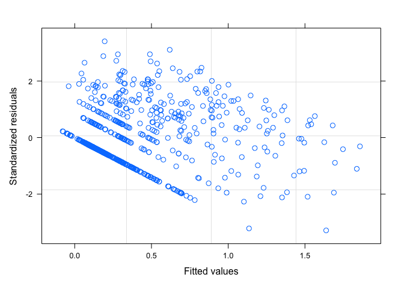<!-- -->

``` r
qqnorm(resid(model_sub_sym))
qqline(resid(model_sub_sym))
```

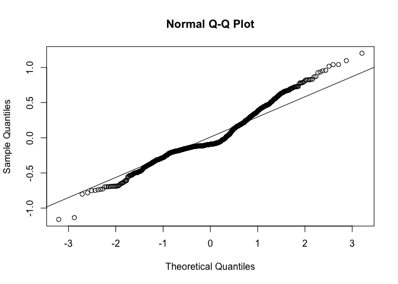<!-- -->

``` r
# Test for significance 
summary(model_sub_sym)
```

    ## Generalized least squares fit by maximum likelihood
    ##   Model: log10(Num_Introduced + 1) ~ NewPloidy + AbsLatNative + areaNativeScale +      Human_Uses + annual 
    ##   Data: ploidy_data_sym 
    ##        AIC      BIC    logLik
    ##   565.1794 602.0865 -274.5897
    ## 
    ## Correlation Structure: corPagel
    ##  Formula: ~"Species" 
    ##  Parameter estimate(s):
    ##     lambda 
    ## 0.04302553 
    ## 
    ## Coefficients:
    ##                       Value  Std.Error   t-value p-value
    ## (Intercept)      0.15348134 0.04767661  3.219216  0.0013
    ## NewPloidy1       0.00720020 0.02873715  0.250554  0.8022
    ## AbsLatNative    -0.00253587 0.00093606 -2.709093  0.0069
    ## areaNativeScale -0.05149200 0.01194693 -4.310060  0.0000
    ## Human_Uses       0.19459881 0.00720993 26.990371  0.0000
    ## annual           0.08798791 0.03263117  2.696437  0.0072
    ## 
    ##  Correlation: 
    ##                 (Intr) NwPld1 AbsLtN arNtvS Hmn_Us
    ## NewPloidy1      -0.135                            
    ## AbsLatNative    -0.517 -0.071                     
    ## areaNativeScale  0.018 -0.044  0.103              
    ## Human_Uses      -0.269  0.062  0.077 -0.377       
    ## annual          -0.070 -0.044 -0.093 -0.040  0.074
    ## 
    ## Standardized residuals:
    ##        Min         Q1        Med         Q3        Max 
    ## -3.2873233 -0.5202143 -0.2629220  0.5746847  3.4055491 
    ## 
    ## Residual standard error: 0.3531637 
    ## Degrees of freedom: 745 total; 739 residual

``` r
Anova(model_sub_sym, type=2,  contrasts=list(topic=contr.sum))
```

    ## Analysis of Deviance Table (Type II tests)
    ## 
    ## Response: log10(Num_Introduced + 1)
    ##                 Df    Chisq Pr(>Chisq)    
    ## NewPloidy        1   0.0628   0.802159    
    ## AbsLatNative     1   7.3392   0.006747 ** 
    ## areaNativeScale  1  18.5766  1.632e-05 ***
    ## Human_Uses       1 728.4801  < 2.2e-16 ***
    ## annual           1   7.2708   0.007009 ** 
    ## ---
    ## Signif. codes:  0 '***' 0.001 '**' 0.01 '*' 0.05 '.' 0.1 ' ' 1

## Plotting the results

### Raw genus+subfamily level data

Here we plot the means and standard error calculated from the raw data
in the expanded dataset (more data points in each category).

``` r
# Prep the data for plotting 
ploidy_sub_sum<- ploidy_data1 %>%
  filter(!is.na(Fixer) & !is.na(NewPloidy)) %>%
  dplyr::group_by(NewPloidy, Fixer) %>%
  dplyr::summarise(mean=mean(Num_Introduced), se=std.error(Num_Introduced))
```

    ## `summarise()` has grouped output by 'NewPloidy'. You can override using the `.groups` argument.

``` r
# Reaction norm plot 
sub_interaction<-ggplot(ploidy_sub_sum, aes(x=Fixer, y=mean, fill=NewPloidy)) + 
  geom_errorbar(aes(ymin=mean-se, ymax=mean+se), width=0.1, position=position_dodge(0.2)) +
  geom_line(aes(group=NewPloidy), position=position_dodge(0.2)) +
  geom_point(pch =21, size=4, position=position_dodge(0.2)) + 
  (ylab("Introduced ranges (no.)")) +
  (xlab("Symbiotic state")) +
 # scale_fill_manual(name="", labels=c("Diploid", "Polyploid"), values=ploidy_colours[c(6,4)]) +
  scale_x_discrete(labels=c("1" = "Symbiotic", "0" = "Non-symbiotic"), limits=c("1", "0")) + 
  theme_classic() +
  theme(axis.title.x = element_text(size=13), 
        axis.title.y = element_text(size=13), 
        axis.text.y= element_text(size=12), 
        axis.text.x= element_text(size=12),
        legend.title= element_text(size=12), 
        legend.text=element_text(size=12), 
        legend.position="top")

# Prep data for specificity on rhizobia 
ploidy_sub_spec<- ploidy_data1 %>%
  filter(!is.na(Specialist) & !is.na(NewPloidy)) %>%
  dplyr::group_by(NewPloidy, Specialist) %>%
  dplyr::summarise(mean=mean(Num_Introduced), se=std.error(Num_Introduced))
```

    ## `summarise()` has grouped output by 'NewPloidy'. You can override using the `.groups` argument.

``` r
# Reaction norm for specificity 
sub_spec<-ggplot(ploidy_sub_spec, aes(x=Specialist, y=mean, fill=NewPloidy)) + 
  geom_errorbar(aes(ymin=mean-se, ymax=mean+se), width=0.1, position=position_dodge(0.2)) +
  geom_line(aes(group=NewPloidy), position=position_dodge(0.2)) +
  geom_point(pch =21, size=4, position=position_dodge(0.2)) + 
  (ylab("Introduced ranges (no.)")) +
  (xlab("Specificity on rhizobia")) +
 # scale_fill_manual(name="", labels=c("Diploid", "Polyploid"), values=ploidy_colours[c(6,4)]) +
  scale_x_discrete(labels=c("1" = "Specialist", "0" = "Generalist"), limits=c("1", "0")) + 
  theme_classic() +
  theme(axis.title.x = element_text(size=13), 
        axis.title.y = element_text(size=13), 
        axis.text.y= element_text(size=12), 
        axis.text.x= element_text(size=12),
        legend.title= element_text(size=12), 
        legend.text=element_text(size=12), 
        legend.position="top")

# Combine the two plots 
Figure_sub <- ggarrange(sub_interaction, sub_spec,
                    labels=c("a", "b"), 
                    ncol = 2, nrow=1,
                    common.legend=TRUE, 
                    legend = "top")
Figure_sub
```

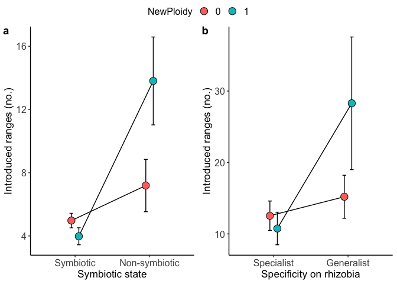<!-- -->

### PGLS interaction of ploidy and symbiosis

The means and standard deviation plotted here are output from the pgls
models in our analyses.

``` r
# Prep the output from the model  
model_sub2_results <- model_sub2_results %>%
  mutate(NewPloidy=as.factor(NewPloidy)) %>%
  mutate(Fixer=as.factor(Fixer))
model_sub2_results
```

    ##   NewPloidy Fixer    lsmean         SE  df  lower.CL  upper.CL
    ## 1         0     0 0.3983174 0.06943741 801 0.2620166 0.5346181
    ## 2         1     0 0.5269398 0.08509955 801 0.3598953 0.6939843
    ## 3         0     1 0.4003653 0.04041725 801 0.3210291 0.4797015
    ## 4         1     1 0.4112109 0.04564199 801 0.3216188 0.5008029

``` r
# Plot the means 
sub_interaction2<-ggplot(model_sub2_results, aes(x=Fixer, y=lsmean, fill=NewPloidy)) + 
  geom_errorbar(aes(ymin=lsmean-SE, ymax=lsmean+SE), width=0.1, position=position_dodge(0.2)) +
  geom_line(aes(group=NewPloidy), position=position_dodge(0.2)) +
  geom_point(pch =21, size=4, position=position_dodge(0.2)) + 
  (ylab("Introduced ranges (log)")) +
  (xlab("Symbiotic state")) +
#  scale_fill_manual(name="", labels=c("Diploid", "Polyploid"), values=ploidy_colours[c(6,4)]) +
  scale_x_discrete(labels=c("1" = "Symbiotic", "0" = "Non-symbiotic"), limits=c("1", "0")) + 
  theme_classic() +
  theme(axis.title.x = element_text(size=13), 
        axis.title.y = element_text(size=13), 
        axis.text.y= element_text(size=12), 
        axis.text.x= element_text(size=12),
        legend.title= element_text(size=12), 
        legend.text=element_text(size=12), 
        legend.position="top")

# Prep the output from the model  
model_sub_spec2_results <- model_sub_spec2_results %>%
  mutate(NewPloidy=as.factor(NewPloidy)) %>%
  mutate(Specialist=as.factor(Specialist))

# Plot the model means 
sub_spec2<-ggplot(model_sub_spec2_results, aes(x=Specialist, y=lsmean, fill=NewPloidy)) + 
  geom_errorbar(aes(ymin=lsmean-SE, ymax=lsmean+SE), width=0.1, position=position_dodge(0.2)) +
  geom_line(aes(group=NewPloidy), position=position_dodge(0.2)) +
  geom_point(pch =21, size=4, position=position_dodge(0.2)) + 
  (ylab("Introduced ranges (log)")) +
  (xlab("Specificity on rhizobia")) +
# scale_fill_manual(name="", labels=c("Diploid", "Polyploid"), values=ploidy_colours[c(6,4)]) +
  scale_x_discrete(labels=c("1" = "Specialist", "0" = "Generalist"), limits=c("1", "0")) + 
  theme_classic() +
  theme(axis.title.x = element_text(size=13), 
        axis.title.y = element_text(size=13), 
        axis.text.y= element_text(size=12), 
        axis.text.x= element_text(size=12),
        legend.title= element_text(size=12), 
        legend.text=element_text(size=12), 
        legend.position="top")

# Combine the plots 
Figure_sub2 <- ggarrange(sub_interaction2, sub_spec2,
                    labels=c("a", "b"), 
                    ncol = 2, nrow=1,
                    common.legend=TRUE, 
                    legend = "top")
Figure_sub2
```

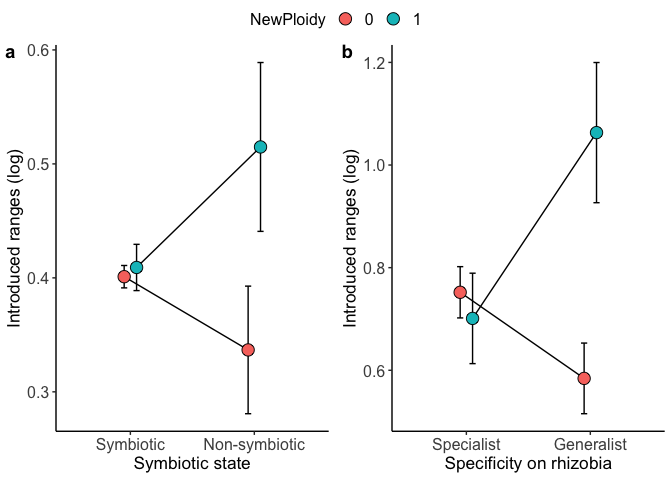<!-- -->

### Plot symbiotic and non-symbiotic results separately

Here we are plotting the raw data for just the symbiotic species and
just the non-symbiotic species.

``` r
# Plot just the non-symbiotic species 
non_plot<-ploidy_data1 %>% 
  filter(Fixer==0) %>%
  ggplot(aes(x=NewPloidy, y=log(Num_Introduced+1), fill=NewPloidy)) +
  geom_boxplot(colour="grey42") + 
  theme_classic() + 
  (ylab("Introduced ranges (log)")) +
  (xlab("Ploidy level")) +
  scale_x_discrete(labels=c("1" = "Polyploid", "0" = "Diploid"), limits=c("1", "0")) +
#  scale_fill_manual(values=ploidy_colours[c(6,4)]) +
  theme(axis.title.x = element_text(size=13), 
        axis.title.y = element_text(size=13), 
        axis.text.y= element_text(size=12), 
        axis.text.x= element_text(size=12),
        legend.title= element_text(size=12), 
        legend.text=element_text(size=12), 
        legend.position="none")
non_plot
```

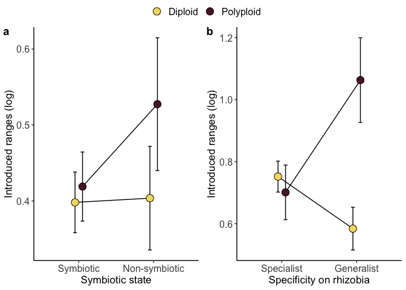<!-- -->

``` r
# Plot just the symbiotic species 
sym_plot<-ploidy_data1 %>% 
  filter(Fixer==1) %>%
  ggplot(aes(x=NewPloidy, y=log(Num_Introduced+1), fill=NewPloidy)) +
  geom_boxplot(colour="grey42") + 
  theme_classic() + 
  (ylab("Introduced ranges (log)")) +
  (xlab("Ploidy level")) +
  scale_x_discrete(labels=c("1" = "Polyploid", "0" = "Diploid"), limits=c("1", "0")) +
 # scale_fill_manual(values=ploidy_colours[c(6,4)]) +
  theme(axis.title.x = element_text(size=13), 
        axis.title.y = element_text(size=13), 
        axis.text.y= element_text(size=12), 
        axis.text.x= element_text(size=12),
        legend.title= element_text(size=12), 
        legend.text=element_text(size=12), 
        legend.position="none")
sym_plot
```

    ## Warning: Removed 26 rows containing missing values (stat_boxplot).

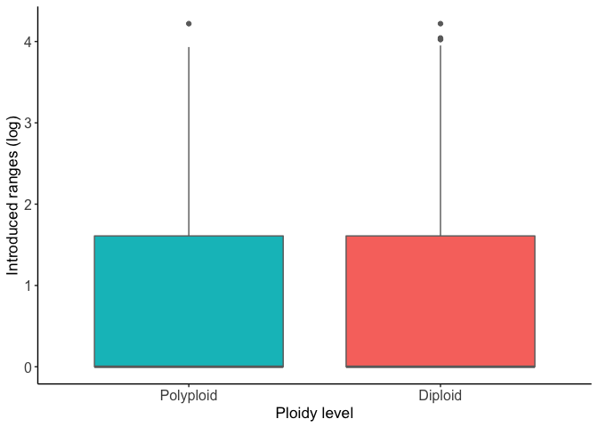<!-- -->

``` r
# Combine the plots for supplemental file 
Figure_supp <- ggarrange(non_plot, sym_plot,
                    labels=c("a", "b"), 
                    ncol = 2, nrow=1,
                    common.legend=TRUE, 
                    legend = "none")
```

    ## Warning: Removed 26 rows containing missing values (stat_boxplot).
    
    ## Warning: Removed 26 rows containing missing values (stat_boxplot).

``` r
Figure_supp
```

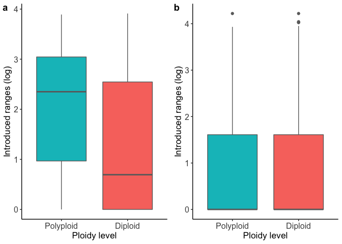<!-- -->
