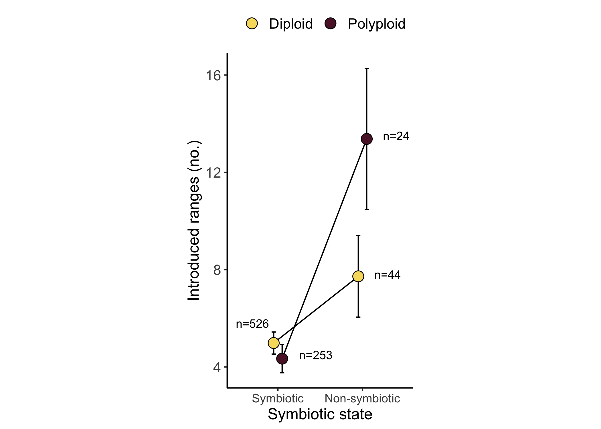

PGLS analysis
================
Tia Harrison
2022-02-07

## Overall setup

### Load the packages for analysis

``` r
# Packages 
library(tidyverse)
library(car)
library(lsmeans)
library(lme4)
library(MASS)
library(ape)
library(inauguration)
library(ggpubr)
library(plotrix)
library(nlme)
library(geiger)
library(lmtest)
library(sandwich)
library(performance)
library(phytools)
```

## Dataset

### Ploidy dataset and phylogeny

The spreadsheet contains information about the symbiotic status (Fixer
column) of each legume species where 1 indicates a legume that forms
nodules with rhizobia (symbiotic) and where 0 indicates a plant that
forms no association with rhizobia (nonsymbiotic). The diPloidyLow
column indicates whether plant species are diploids (coded as 0) or
polyploid (coded as 1). The diPloidyLow values were calculated from
genus-level data. The Num_Introduced column indicates how many separate
ranges a plant species has been introduced to as calculated in Simonsen
et al (2017).

The phylogeny used in this analysis is a version of the Zanne et al
(2014) angiosperm phylogeny where the full phylogeny was pruned for the
species in our dataset.

``` r
# Dataset 
ploidy<- read.csv("Legume_ploidy_dataset.csv", row.names=1)

# Phylogeny 
legumes1<-read.tree("Vascular_Plants_rooted.dated.tre")
```

### Clean up the dataset

Here, we create a new column called “NewPloidy” which indicates diploidy
(0) and polyploidy (1) but was calculated from a combination of genus
and subfamily level data.

We also added symbiotic species to our Fixer column if we had data from
Harrison et al. (2018) that suggested those species associated with a
rhizobium genus or OTU.

``` r
# If diPloidyLow (genus-level ploidy) is available use it and if not then use disfPloidy_corrected (subfamily with some species double checked in the literature)
# If there is data for NumGenera or OTUs then call the associating legume species a fixer 
ploidy1<-ploidy%>% 
  rownames_to_column() %>%
  mutate(NewPloidy = ifelse(is.na(diPloidyLow), disfPloidy_corrected, diPloidyLow)) %>% 
  mutate(Fixer = ifelse(is.na(Fixer) & numOTUs >= 1, 1, Fixer)) %>%
  mutate(Fixer = ifelse(is.na(Fixer) & numGenera >=1 , 1, Fixer)) %>%
  column_to_rownames()
```

### Prune the dataset and tree

``` r
# Make sure the data and tree match up 
TreeOnly <- setdiff(legumes1$tip.label, rownames(ploidy1))
DataOnly <- setdiff(rownames(ploidy1), legumes1$tip.label)

# Prune the tree 
pruned <- drop.tip(legumes1, TreeOnly)
pruned$node.label <- NULL

# Get the tip names 
tip_names<-data.frame(pruned$tip.label)

# Filter the dataset for tree species 
ploidy_data<-ploidy1 %>%
  filter(rownames(ploidy1) %in% tip_names$pruned.tip.label) 

# Set columns as factors for analysis 
# Set Species as its own column
ploidy_data1 <- ploidy_data %>%
  rownames_to_column("Species") %>%
  mutate(Fixer=as.factor(Fixer), 
         numGenera=as.factor(numGenera), 
         Specialist=as.factor(Specialist), 
         diPloidyLow=as.factor(diPloidyLow), 
         NewPloidy=as.factor(NewPloidy))
```

### Data exploration

How many species in each data type?

``` r
# Data summary for genus level ploidy 
ploidy_data1 %>%
  filter(!is.na(diPloidyLow) & !is.na(Num_Introduced) & !is.na(Fixer)) %>%
  group_by(diPloidyLow, Fixer) %>%
  tally()
```

    ## # A tibble: 4 × 3
    ## # Groups:   diPloidyLow [2]
    ##   diPloidyLow Fixer     n
    ##   <fct>       <fct> <int>
    ## 1 0           0        21
    ## 2 0           1       412
    ## 3 1           0         2
    ## 4 1           1       229

``` r
# Average of introduced ranges 
ploidy_data1 %>%
  filter(!is.na(diPloidyLow) & !is.na(Num_Introduced) & !is.na(Fixer)) %>%
  group_by(diPloidyLow, Fixer) %>%
  summarize(mean(Num_Introduced))
```

    ## # A tibble: 4 × 3
    ## # Groups:   diPloidyLow [2]
    ##   diPloidyLow Fixer `mean(Num_Introduced)`
    ##   <fct>       <fct>                  <dbl>
    ## 1 0           0                       7.43
    ## 2 0           1                       5.67
    ## 3 1           0                      32   
    ## 4 1           1                       4.09

``` r
# What are the two non-symbiotic polyploid species? 
ploidy_data1 %>% 
  filter(diPloidyLow==1 & Fixer ==0)
```

    ##          Species  Genus areaIntroduced areaIntroducedScale areaNative
    ## 1 Cassia_fistula Cassia       3.90e+13           4.6741299   1.02e+13
    ## 2 Cassia_grandis Cassia       9.33e+12           0.8603899   1.27e+13
    ##   areaNativeScale Num_Introduced Fixer numOTUs numGenera Specialist Human_Uses
    ## 1       0.4054753             47     0      NA      <NA>       <NA>          7
    ## 2       0.7269305             17     0      NA      <NA>       <NA>          4
    ##   AbsLatNative LatNative ChromosomeCount PloidyLow diPloidyLow sfPloidy
    ## 1    10.689225 10.689225              28         4           1        4
    ## 2     2.346186  2.346186              28         4           1        4
    ##   disfPloidy annual disfPloidy_corrected NewPloidy
    ## 1          1      0                    1         1
    ## 2          1      0                    1         1

``` r
# Cassia fistula 7 human uses 
# Cassia grandis 4 human uses 

# Average number of human uses 
ploidy_data1 %>%
  filter(!is.na(Fixer) & !is.na(Human_Uses)) %>%
  group_by(Fixer) %>%
  summarize(mean(Human_Uses))
```

    ## # A tibble: 2 × 2
    ##   Fixer `mean(Human_Uses)`
    ##   <fct>              <dbl>
    ## 1 0                   2.90
    ## 2 1                   1.43

``` r
# Data summary for subfamily level ploidy data (ploidy corrected)
ploidy_data1 %>%
  filter(!is.na(NewPloidy) & !is.na(Num_Introduced) & !is.na(Fixer)) %>%
  group_by(NewPloidy, Fixer) %>%
  tally()
```

    ## # A tibble: 4 × 3
    ## # Groups:   NewPloidy [2]
    ##   NewPloidy Fixer     n
    ##   <fct>     <fct> <int>
    ## 1 0         0        44
    ## 2 0         1       523
    ## 3 1         0        24
    ## 4 1         1       248

``` r
# Average number of human uses in specialists
ploidy_data1 %>%
  filter(!is.na(Specialist) & !is.na(Human_Uses) & !is.na(NewPloidy)) %>%
  group_by(Specialist, NewPloidy) %>%
  summarize(mean(Human_Uses))
```

    ## # A tibble: 4 × 3
    ## # Groups:   Specialist [2]
    ##   Specialist NewPloidy `mean(Human_Uses)`
    ##   <fct>      <fct>                  <dbl>
    ## 1 0          0                       3.57
    ## 2 0          1                       4.29
    ## 3 1          0                       2.94
    ## 4 1          1                       3.4

``` r
# Data summary for generalists
ploidy_data1 %>%
  filter(!is.na(NewPloidy) & !is.na(Num_Introduced) & !is.na(Specialist)) %>%
  group_by(NewPloidy, Specialist) %>%
  tally()
```

    ## # A tibble: 4 × 3
    ## # Groups:   NewPloidy [2]
    ##   NewPloidy Specialist     n
    ##   <fct>     <fct>      <int>
    ## 1 0         0             35
    ## 2 0         1             66
    ## 3 1         0              7
    ## 4 1         1             25

### Comparison of genus level and genus+subfamily data

Here we looked at the species added in the genus+subfamily dataset in
terms of fixer status and number of introduced ranges.

``` r
# Prep data
add_spp<- ploidy_data1 %>%
  filter(!is.na(NewPloidy) & is.na(diPloidyLow) & !is.na(Num_Introduced) & !is.na(Fixer))

add_spp %>% 
  group_by(Fixer, NewPloidy) %>% 
  tally()
```

    ## # A tibble: 4 × 3
    ## # Groups:   Fixer [2]
    ##   Fixer NewPloidy     n
    ##   <fct> <fct>     <int>
    ## 1 0     0            23
    ## 2 0     1            22
    ## 3 1     0           111
    ## 4 1     1            19

``` r
add_spp %>% 
  group_by(Fixer, NewPloidy) %>%
  summarize(mean(Num_Introduced))
```

    ## # A tibble: 4 × 3
    ## # Groups:   Fixer [2]
    ##   Fixer NewPloidy `mean(Num_Introduced)`
    ##   <fct> <fct>                      <dbl>
    ## 1 0     0                           8   
    ## 2 0     1                          11.7 
    ## 3 1     0                           2.14
    ## 4 1     1                           3.63

``` r
# Average number of ranges in the species that are based on subfamily values 
add_spp %>%
  filter(is.na(diPloidyLow) & !is.na(disfPloidy_corrected)) %>%
  summarize(mean(Num_Introduced)) # 4.2742 
```

    ##   mean(Num_Introduced)
    ## 1             4.274286

``` r
# Average number of ranges in the species that are based on genus values 
ploidy_data1 %>%
  filter(!is.na(NewPloidy) & !is.na(diPloidyLow) & !is.na(Fixer) & !is.na(Num_Introduced)) %>%
  summarize(mean(Num_Introduced)) # 5.262048
```

    ##   mean(Num_Introduced)
    ## 1             5.262048

## Data analysis

### Correlation tests

We looked at the correlation between subfamily base chromosome number
and genus base chromosome number to determine how similar our two
datasets are.

``` r
# Spearman's rank correlation 
# Ties present so we didn't compute exact p value 
cor.test(ploidy_data1$PloidyLow, ploidy_data1$sfPloidy, method="spearman", exact=FALSE)
```

    ## 
    ##  Spearman's rank correlation rho
    ## 
    ## data:  ploidy_data1$PloidyLow and ploidy_data1$sfPloidy
    ## S = 25887790, p-value < 2.2e-16
    ## alternative hypothesis: true rho is not equal to 0
    ## sample estimates:
    ##       rho 
    ## 0.4694297

``` r
# Kendall tau correlation to deal with ties 
cor.test(ploidy_data1$PloidyLow, ploidy_data1$sfPloidy, method="kendall")
```

    ## 
    ##  Kendall's rank correlation tau
    ## 
    ## data:  ploidy_data1$PloidyLow and ploidy_data1$sfPloidy
    ## z = 11.989, p-value < 2.2e-16
    ## alternative hypothesis: true tau is not equal to 0
    ## sample estimates:
    ##       tau 
    ## 0.4126668

### PGLS on the genus + subfamily level ploidy data

We performed our anlayses on the genus + subfamily dataset since it had
the most data points in each category of data (diploid non-symbiotic,
diploid symbiotic, polyploid non-symbiotic, and polyploid symbiotic). We
tested the hypothesis that ploidy and symbiotic status or rhizobia
specificity interact to impact range expansion using pgls models with
the nlme package.

In the PGLS model if you are having trouble getting the model to
converge try setting different values for lambda (0, 1, or 0.5). If
changing lambda doesn’t work try this code to get convergence in the
model: control=glsControl(opt=“optim”,optimMethod=“Nelder-Mead”)

#### Symbiosis and ploidy models

``` r
# Run pgls and allow lambda to vary 
model_sub2<-gls(log10(Num_Introduced+1) ~ NewPloidy*Fixer + AbsLatNative + areaNativeScale + Human_Uses + annual, data=ploidy_data1, correlation=corPagel(value=0, phy=pruned, fixed=FALSE, form=~"Species"), method = "ML", na.action=na.exclude)

# Inspect model fit 
plot(model_sub2)
```

<!-- -->

``` r
plot(fitted(model_sub2), sqrt(abs(resid(model_sub2))), main="Scale-location")
```

<!-- -->

``` r
hist(resid(model_sub2))
```

<!-- -->

``` r
qqnorm(resid(model_sub2))
qqline(resid(model_sub2))
```

<!-- -->

``` r
# Test for significance 
summary(model_sub2)
```

    ## Generalized least squares fit by maximum likelihood
    ##   Model: log10(Num_Introduced + 1) ~ NewPloidy * Fixer + AbsLatNative +      areaNativeScale + Human_Uses + annual 
    ##   Data: ploidy_data1 
    ##        AIC      BIC    logLik
    ##   654.8569 701.8396 -317.4285
    ## 
    ## Correlation Structure: corPagel
    ##  Formula: ~"Species" 
    ##  Parameter estimate(s):
    ##     lambda 
    ## 0.04307922 
    ## 
    ## Coefficients:
    ##                         Value  Std.Error   t-value p-value
    ## (Intercept)        0.15299511 0.07192797  2.127060  0.0337
    ## NewPloidy1         0.12376718 0.09419748  1.313912  0.1893
    ## Fixer1            -0.00552634 0.05884950 -0.093906  0.9252
    ## AbsLatNative      -0.00222141 0.00093876 -2.366326  0.0182
    ## areaNativeScale   -0.04218763 0.01194431 -3.532027  0.0004
    ## Human_Uses         0.18812544 0.00687629 27.358575  0.0000
    ## annual             0.07291643 0.03344524  2.180174  0.0295
    ## NewPloidy1:Fixer1 -0.10294368 0.09877233 -1.042232  0.2976
    ## 
    ##  Correlation: 
    ##                   (Intr) NwPld1 Fixer1 AbsLtN arNtvS Hmn_Us annual
    ## NewPloidy1        -0.450                                          
    ## Fixer1            -0.749  0.537                                   
    ## AbsLatNative      -0.252  0.058 -0.097                            
    ## areaNativeScale    0.047  0.011 -0.058  0.111                     
    ## Human_Uses        -0.272 -0.036  0.120  0.075 -0.366              
    ## annual            -0.011  0.015 -0.042 -0.092 -0.034  0.078       
    ## NewPloidy1:Fixer1  0.439 -0.953 -0.551 -0.081 -0.024  0.054 -0.035
    ## 
    ## Standardized residuals:
    ##        Min         Q1        Med         Q3        Max 
    ## -3.2174278 -0.4793295 -0.2661406  0.5764259  3.2577482 
    ## 
    ## Residual standard error: 0.3614713 
    ## Degrees of freedom: 811 total; 803 residual

``` r
Anova(model_sub2, contrasts=list("contr.sum","contr.poly"), type=3) # Type 3 for interaction and set contrasts
```

    ## Analysis of Deviance Table (Type III tests)
    ## 
    ## Response: log10(Num_Introduced + 1)
    ##                 Df    Chisq Pr(>Chisq)    
    ## (Intercept)      1   4.5244  0.0334151 *  
    ## NewPloidy        1   1.7264  0.1888759    
    ## Fixer            1   0.0088  0.9251836    
    ## AbsLatNative     1   5.5995  0.0179656 *  
    ## areaNativeScale  1  12.4752  0.0004124 ***
    ## Human_Uses       1 748.4916  < 2.2e-16 ***
    ## annual           1   4.7532  0.0292446 *  
    ## NewPloidy:Fixer  1   1.0862  0.2973041    
    ## ---
    ## Signif. codes:  0 '***' 0.001 '**' 0.01 '*' 0.05 '.' 0.1 ' ' 1

``` r
# Ploidy estimates have the expected sign, interaction is non-significant

# Get means from the model 
model_sub2_results<-lsmeans(model_sub2, pairwise~NewPloidy+Fixer, mode = "df.error")
model_sub2_results<-data.frame(model_sub2_results$lsmeans)

# Lambda is very close to zero, so perhaps not a strong phylogenetic clustering of trait
# Therefore compare to an uncorrected model for phylogeny

#Quasipoisson model for number of introductions is probably preferable given over-dispersion
model_qpoisson <-glm(Num_Introduced ~ NewPloidy*Fixer + AbsLatNative + areaNativeScale + Human_Uses + annual, data=ploidy_data1, family="quasipoisson")

#Inspect model fit
plot(model_qpoisson) #Fit isn't awesome but maybe the best so far 
```

<!-- --><!-- --><!-- --><!-- -->

``` r
# Check summary output 
summary(model_qpoisson)
```

    ## 
    ## Call:
    ## glm(formula = Num_Introduced ~ NewPloidy * Fixer + AbsLatNative + 
    ##     areaNativeScale + Human_Uses + annual, family = "quasipoisson", 
    ##     data = ploidy_data1)
    ## 
    ## Deviance Residuals: 
    ##     Min       1Q   Median       3Q      Max  
    ## -8.6313  -1.9626  -1.6237   0.3156  12.3931  
    ## 
    ## Coefficients:
    ##                    Estimate Std. Error t value Pr(>|t|)    
    ## (Intercept)        0.414475   0.190375   2.177 0.029760 *  
    ## NewPloidy1         0.572878   0.222153   2.579 0.010093 *  
    ## Fixer1             0.247663   0.168027   1.474 0.140889    
    ## AbsLatNative      -0.010951   0.003159  -3.467 0.000554 ***
    ## areaNativeScale   -0.121148   0.033856  -3.578 0.000367 ***
    ## Human_Uses         0.431696   0.016609  25.992  < 2e-16 ***
    ## annual             0.405120   0.113365   3.574 0.000373 ***
    ## NewPloidy1:Fixer1 -0.649369   0.246729  -2.632 0.008654 ** 
    ## ---
    ## Signif. codes:  0 '***' 0.001 '**' 0.01 '*' 0.05 '.' 0.1 ' ' 1
    ## 
    ## (Dispersion parameter for quasipoisson family taken to be 8.052952)
    ## 
    ##     Null deviance: 10821.6  on 810  degrees of freedom
    ## Residual deviance:  5148.8  on 803  degrees of freedom
    ##   (54 observations deleted due to missingness)
    ## AIC: NA
    ## 
    ## Number of Fisher Scoring iterations: 6

``` r
coeftest(model_qpoisson, vcov = sandwich) 
```

    ## 
    ## z test of coefficients:
    ## 
    ##                     Estimate Std. Error z value  Pr(>|z|)    
    ## (Intercept)        0.4144754  0.2001804  2.0705  0.038405 *  
    ## NewPloidy1         0.5728782  0.2104614  2.7220  0.006489 ** 
    ## Fixer1             0.2476627  0.1777708  1.3932  0.163572    
    ## AbsLatNative      -0.0109511  0.0036713 -2.9829  0.002855 ** 
    ## areaNativeScale   -0.1211477  0.0403070 -3.0056  0.002650 ** 
    ## Human_Uses         0.4316962  0.0176811 24.4157 < 2.2e-16 ***
    ## annual             0.4051200  0.1366900  2.9638  0.003039 ** 
    ## NewPloidy1:Fixer1 -0.6493688  0.2430981 -2.6712  0.007558 ** 
    ## ---
    ## Signif. codes:  0 '***' 0.001 '**' 0.01 '*' 0.05 '.' 0.1 ' ' 1

``` r
Anova(model_qpoisson, contrasts=list("contr.sum","contr.poly"), type=3)
```

    ## Analysis of Deviance Table (Type III tests)
    ## 
    ## Response: Num_Introduced
    ##                 LR Chisq Df Pr(>Chisq)    
    ## NewPloidy           6.53  1  0.0106044 *  
    ## Fixer               2.30  1  0.1295334    
    ## AbsLatNative       12.16  1  0.0004895 ***
    ## areaNativeScale    13.73  1  0.0002110 ***
    ## Human_Uses        595.82  1  < 2.2e-16 ***
    ## annual             11.94  1  0.0005480 ***
    ## NewPloidy:Fixer     6.86  1  0.0088228 ** 
    ## ---
    ## Signif. codes:  0 '***' 0.001 '**' 0.01 '*' 0.05 '.' 0.1 ' ' 1

#### Specificity and ploidy models

``` r
# Run pgls for specificity on rhizobia 
model_sub_spec2<-gls(log10(Num_Introduced+1) ~ NewPloidy*Specialist + AbsLatNative + areaNativeScale + Human_Uses + annual, data=ploidy_data1, correlation=corPagel(value=0, phy=pruned, fixed=FALSE, form=~"Species"), method = "ML", na.action=na.exclude, control=glsControl(opt="optim",optimMethod="Nelder-Mead"))

# Inspect model fit 
plot(model_sub_spec2)
```

<!-- -->

``` r
plot(fitted(model_sub_spec2), sqrt(abs(resid(model_sub_spec2))), main="Scale-location")
```

<!-- -->

``` r
qqnorm(resid(model_sub_spec2))
qqline(resid(model_sub_spec2))
```

<!-- -->

``` r
# Test for significance 
summary(model_sub_spec2)
```

    ## Generalized least squares fit by maximum likelihood
    ##   Model: log10(Num_Introduced + 1) ~ NewPloidy * Specialist + AbsLatNative +      areaNativeScale + Human_Uses + annual 
    ##   Data: ploidy_data1 
    ##        AIC      BIC    logLik
    ##   125.4096 154.0849 -52.70479
    ## 
    ## Correlation Structure: corPagel
    ##  Formula: ~"Species" 
    ##  Parameter estimate(s):
    ##     lambda 
    ## -0.1992188 
    ## 
    ## Coefficients:
    ##                             Value  Std.Error   t-value p-value
    ## (Intercept)             0.4000346 0.11142427  3.590193  0.0005
    ## NewPloidy1              0.4789848 0.17175214  2.788814  0.0061
    ## Specialist1             0.1678036 0.08716170  1.925199  0.0565
    ## AbsLatNative           -0.0118812 0.00231142 -5.140226  0.0000
    ## areaNativeScale        -0.1164701 0.02381255 -4.891124  0.0000
    ## Human_Uses              0.1725507 0.01541866 11.191030  0.0000
    ## annual                  0.0074739 0.09777208  0.076442  0.9392
    ## NewPloidy1:Specialist1 -0.5298943 0.19225704 -2.756176  0.0067
    ## 
    ##  Correlation: 
    ##                        (Intr) NwPld1 Spcls1 AbsLtN arNtvS Hmn_Us annual
    ## NewPloidy1             -0.270                                          
    ## Specialist1            -0.624  0.416                                   
    ## AbsLatNative           -0.655 -0.174  0.099                            
    ## areaNativeScale        -0.192 -0.143 -0.023  0.265                     
    ## Human_Uses             -0.536  0.017  0.110  0.134 -0.272              
    ## annual                 -0.242 -0.065  0.036  0.094  0.075  0.018       
    ## NewPloidy1:Specialist1  0.269 -0.869 -0.546  0.177  0.138 -0.010  0.065
    ## 
    ## Standardized residuals:
    ##        Min         Q1        Med         Q3        Max 
    ## -3.1396684 -0.4907200  0.3693319  1.0901147  3.0033505 
    ## 
    ## Residual standard error: 0.3662198 
    ## Degrees of freedom: 130 total; 122 residual

``` r
Anova(model_sub_spec2, , contrasts=list("contr.sum","contr.poly"), type=3)
```

    ## Analysis of Deviance Table (Type III tests)
    ## 
    ## Response: log10(Num_Introduced + 1)
    ##                      Df    Chisq Pr(>Chisq)    
    ## (Intercept)           1  12.8895  0.0003304 ***
    ## NewPloidy             1   7.7775  0.0052901 ** 
    ## Specialist            1   3.7064  0.0542045 .  
    ## AbsLatNative          1  26.4219  2.744e-07 ***
    ## areaNativeScale       1  23.9231  1.003e-06 ***
    ## Human_Uses            1 125.2392  < 2.2e-16 ***
    ## annual                1   0.0058  0.9390675    
    ## NewPloidy:Specialist  1   7.5965  0.0058481 ** 
    ## ---
    ## Signif. codes:  0 '***' 0.001 '**' 0.01 '*' 0.05 '.' 0.1 ' ' 1

``` r
# Ploidy estimate sign is correct, specialist estimate is opposite sign as to what expected, interaction is significant 

# Grab the model means 
model_sub_spec2_results<-lsmeans(model_sub_spec2, pairwise~NewPloidy+Specialist, mode = "df.error")
model_sub_spec2_results<-data.frame(model_sub_spec2_results$lsmeans)

# Lambda estimated in the model is negative so likely overdispersed 
# Uncorrected model for phylogeny is probably better and more appropriate 

# Quasipoisson model for number of introductions is probably preferable given over-dispersion
model_spec_qpoisson <-glm(Num_Introduced ~ NewPloidy*Specialist + AbsLatNative + areaNativeScale + Human_Uses + annual, data=ploidy_data1, family="quasipoisson")

# Inspect model fit
plot(model_spec_qpoisson) # Pretty good
```

<!-- --><!-- --><!-- --><!-- -->

``` r
# Summary output 
summary(model_spec_qpoisson)
```

    ## 
    ## Call:
    ## glm(formula = Num_Introduced ~ NewPloidy * Specialist + AbsLatNative + 
    ##     areaNativeScale + Human_Uses + annual, family = "quasipoisson", 
    ##     data = ploidy_data1)
    ## 
    ## Deviance Residuals: 
    ##     Min       1Q   Median       3Q      Max  
    ## -8.7162  -2.8554  -0.8980   0.8747   9.9823  
    ## 
    ## Coefficients:
    ##                         Estimate Std. Error t value Pr(>|t|)    
    ## (Intercept)             1.945549   0.248660   7.824 2.07e-12 ***
    ## NewPloidy1              0.498004   0.272147   1.830 0.069705 .  
    ## Specialist1             0.115956   0.179509   0.646 0.519516    
    ## AbsLatNative           -0.020266   0.005151  -3.935 0.000139 ***
    ## areaNativeScale        -0.220055   0.050377  -4.368 2.65e-05 ***
    ## Human_Uses              0.290491   0.031528   9.214 1.13e-15 ***
    ## annual                  0.238563   0.176156   1.354 0.178153    
    ## NewPloidy1:Specialist1 -0.930729   0.355885  -2.615 0.010041 *  
    ## ---
    ## Signif. codes:  0 '***' 0.001 '**' 0.01 '*' 0.05 '.' 0.1 ' ' 1
    ## 
    ## (Dispersion parameter for quasipoisson family taken to be 10.05968)
    ## 
    ##     Null deviance: 2517  on 129  degrees of freedom
    ## Residual deviance: 1193  on 122  degrees of freedom
    ##   (735 observations deleted due to missingness)
    ## AIC: NA
    ## 
    ## Number of Fisher Scoring iterations: 5

``` r
coeftest(model_spec_qpoisson, vcov = sandwich) 
```

    ## 
    ## z test of coefficients:
    ## 
    ##                          Estimate Std. Error z value  Pr(>|z|)    
    ## (Intercept)             1.9455492  0.2312515  8.4131 < 2.2e-16 ***
    ## NewPloidy1              0.4980043  0.2516343  1.9791  0.047807 *  
    ## Specialist1             0.1159561  0.1777887  0.6522  0.514264    
    ## AbsLatNative           -0.0202660  0.0045768 -4.4280 9.511e-06 ***
    ## areaNativeScale        -0.2200550  0.0435145 -5.0570 4.258e-07 ***
    ## Human_Uses              0.2904914  0.0296879  9.7849 < 2.2e-16 ***
    ## annual                  0.2385632  0.1656679  1.4400  0.149865    
    ## NewPloidy1:Specialist1 -0.9307286  0.3123907 -2.9794  0.002888 ** 
    ## ---
    ## Signif. codes:  0 '***' 0.001 '**' 0.01 '*' 0.05 '.' 0.1 ' ' 1

``` r
Anova(model_spec_qpoisson, contrasts=list("contr.sum","contr.poly"), type=3)
```

    ## Analysis of Deviance Table (Type III tests)
    ## 
    ## Response: Num_Introduced
    ##                      LR Chisq Df Pr(>Chisq)    
    ## NewPloidy               3.114  1    0.07762 .  
    ## Specialist              0.420  1    0.51673    
    ## AbsLatNative           15.868  1  6.793e-05 ***
    ## areaNativeScale        22.078  1  2.618e-06 ***
    ## Human_Uses             89.031  1  < 2.2e-16 ***
    ## annual                  1.764  1    0.18408    
    ## NewPloidy:Specialist    6.640  1    0.00997 ** 
    ## ---
    ## Signif. codes:  0 '***' 0.001 '**' 0.01 '*' 0.05 '.' 0.1 ' ' 1

### Analyzing the non-symbiotic and symbiotic species separately

Here we subset the data to only the non-symbiotic species in the
combined genus+subfamily dataset to look for an effect of ploidy on
invasion.

``` r
# Subset the data to non-symbiotic species 
ploidy_data_non <- ploidy_data1 %>%
  filter(Fixer == 0)
# Reduces the dataset to 68 species and two categories (diploid and polyploid)

# Run pgls and allow lambda to vary
model_sub_non<-gls(log10(Num_Introduced + 1) ~ NewPloidy + AbsLatNative + areaNativeScale + Human_Uses + annual, data=ploidy_data_non, correlation=corPagel(value=0, phy=pruned, fixed=FALSE, form=~"Species"), method = "ML", na.action=na.exclude)

# Inspect model fit 
plot(model_sub_non)
```

<!-- -->

``` r
qqnorm(resid(model_sub_non))
qqline(resid(model_sub_non)) # This looks pretty ok with the raw data but maybe a bit better with the logged values 
```

<!-- -->

``` r
# Test for significance 
summary(model_sub_non)
```

    ## Generalized least squares fit by maximum likelihood
    ##   Model: log10(Num_Introduced + 1) ~ NewPloidy + AbsLatNative + areaNativeScale +      Human_Uses + annual 
    ##   Data: ploidy_data_non 
    ##        AIC      BIC    logLik
    ##   79.28123 96.79847 -31.64061
    ## 
    ## Correlation Structure: corPagel
    ##  Formula: ~"Species" 
    ##  Parameter estimate(s):
    ##    lambda 
    ## 0.3552082 
    ## 
    ## Coefficients:
    ##                       Value Std.Error   t-value p-value
    ## (Intercept)     -0.02976063 0.1650361 -0.180328  0.8575
    ## NewPloidy1       0.24570657 0.1150185  2.136235  0.0367
    ## AbsLatNative     0.00747495 0.0044313  1.686843  0.0968
    ## areaNativeScale  0.11022326 0.0628609  1.753447  0.0846
    ## Human_Uses       0.17006867 0.0220572  7.710356  0.0000
    ## annual           0.12470347 0.4165916  0.299342  0.7657
    ## 
    ##  Correlation: 
    ##                 (Intr) NwPld1 AbsLtN arNtvS Hmn_Us
    ## NewPloidy1      -0.197                            
    ## AbsLatNative    -0.518  0.221                     
    ## areaNativeScale -0.061  0.005  0.041              
    ## Human_Uses      -0.382 -0.122  0.079 -0.268       
    ## annual          -0.039  0.059 -0.153  0.082  0.145
    ## 
    ## Standardized residuals:
    ##         Min          Q1         Med          Q3         Max 
    ## -2.27116390 -0.62322828 -0.06941035  0.65380837  2.36488421 
    ## 
    ## Residual standard error: 0.4272769 
    ## Degrees of freedom: 66 total; 60 residual

``` r
Anova(model_sub_non, contrasts=list("contr.sum","contr.poly"), type=2) # Type 2 anova 
```

    ## Analysis of Deviance Table (Type II tests)
    ## 
    ## Response: log10(Num_Introduced + 1)
    ##                 Df   Chisq Pr(>Chisq)    
    ## NewPloidy        1  4.5635    0.03266 *  
    ## AbsLatNative     1  2.8454    0.09163 .  
    ## areaNativeScale  1  3.0746    0.07953 .  
    ## Human_Uses       1 59.4496  1.255e-14 ***
    ## annual           1  0.0896    0.76468    
    ## ---
    ## Signif. codes:  0 '***' 0.001 '**' 0.01 '*' 0.05 '.' 0.1 ' ' 1

``` r
# Significant effect of ploidy

# Subset the data to symbiotic species 
ploidy_data_sym <- ploidy_data1 %>%
  filter(Fixer == 1)

# Run pgls and allow lambda to vary 
model_sub_sym<-gls(log10(Num_Introduced + 1) ~ NewPloidy + AbsLatNative + areaNativeScale + Human_Uses + annual, data=ploidy_data_sym, correlation=corPagel(value=0, phy=pruned, fixed=FALSE, form=~"Species"), method = "ML", na.action=na.exclude)

# Inspect model fit 
plot(model_sub_sym)
```

<!-- -->

``` r
qqnorm(resid(model_sub_sym))
qqline(resid(model_sub_sym))
```

<!-- -->

``` r
# Test for significance 
summary(model_sub_sym)
```

    ## Generalized least squares fit by maximum likelihood
    ##   Model: log10(Num_Introduced + 1) ~ NewPloidy + AbsLatNative + areaNativeScale +      Human_Uses + annual 
    ##   Data: ploidy_data_sym 
    ##       AIC      BIC   logLik
    ##   564.858 601.7651 -274.429
    ## 
    ## Correlation Structure: corPagel
    ##  Formula: ~"Species" 
    ##  Parameter estimate(s):
    ##     lambda 
    ## 0.04041782 
    ## 
    ## Coefficients:
    ##                       Value  Std.Error   t-value p-value
    ## (Intercept)      0.15132140 0.04682617  3.231556  0.0013
    ## NewPloidy1       0.01826364 0.02906834  0.628300  0.5300
    ## AbsLatNative    -0.00256416 0.00093688 -2.736906  0.0064
    ## areaNativeScale -0.05174319 0.01194898 -4.330344  0.0000
    ## Human_Uses       0.19480356 0.00721112 27.014339  0.0000
    ## annual           0.08782344 0.03259969  2.693996  0.0072
    ## 
    ##  Correlation: 
    ##                 (Intr) NwPld1 AbsLtN arNtvS Hmn_Us
    ## NewPloidy1      -0.119                            
    ## AbsLatNative    -0.524 -0.090                     
    ## areaNativeScale  0.018 -0.051  0.104              
    ## Human_Uses      -0.273  0.068  0.075 -0.377       
    ## annual          -0.071 -0.056 -0.092 -0.039  0.074
    ## 
    ## Standardized residuals:
    ##        Min         Q1        Med         Q3        Max 
    ## -3.2869050 -0.5189047 -0.2677687  0.5723042  3.3868287 
    ## 
    ## Residual standard error: 0.3528181 
    ## Degrees of freedom: 745 total; 739 residual

``` r
Anova(model_sub_sym, contrasts=list("contr.sum","contr.poly"), type=2)
```

    ## Analysis of Deviance Table (Type II tests)
    ## 
    ## Response: log10(Num_Introduced + 1)
    ##                 Df    Chisq Pr(>Chisq)    
    ## NewPloidy        1   0.3948   0.529807    
    ## AbsLatNative     1   7.4907   0.006202 ** 
    ## areaNativeScale  1  18.7519  1.489e-05 ***
    ## Human_Uses       1 729.7745  < 2.2e-16 ***
    ## annual           1   7.2576   0.007060 ** 
    ## ---
    ## Signif. codes:  0 '***' 0.001 '**' 0.01 '*' 0.05 '.' 0.1 ' ' 1

``` r
# No significant effect of ploidy here 

# Lambda very close to zero so could try a uncorrected model 

# Quassipoisson 
model_sub_sym_qpoisson<-glm(Num_Introduced ~ NewPloidy + AbsLatNative + areaNativeScale + Human_Uses + annual, data=ploidy_data_sym, family="quasipoisson")

# Check fit 
plot(model_sub_sym_qpoisson) # Not the greatest fit but maybe best of the bunch 
```

<!-- --><!-- --><!-- --><!-- -->

``` r
# Summary output 
summary(model_sub_sym_qpoisson)
```

    ## 
    ## Call:
    ## glm(formula = Num_Introduced ~ NewPloidy + AbsLatNative + areaNativeScale + 
    ##     Human_Uses + annual, family = "quasipoisson", data = ploidy_data_sym)
    ## 
    ## Deviance Residuals: 
    ##     Min       1Q   Median       3Q      Max  
    ## -8.7390  -1.9517  -1.6195   0.1189  12.5151  
    ## 
    ## Coefficients:
    ##                  Estimate Std. Error t value Pr(>|t|)    
    ## (Intercept)      0.677053   0.125153   5.410 8.53e-08 ***
    ## NewPloidy1      -0.070929   0.106909  -0.663 0.507249    
    ## AbsLatNative    -0.012499   0.003327  -3.757 0.000186 ***
    ## areaNativeScale -0.143568   0.035729  -4.018 6.46e-05 ***
    ## Human_Uses       0.437846   0.017375  25.199  < 2e-16 ***
    ## annual           0.413010   0.114087   3.620 0.000315 ***
    ## ---
    ## Signif. codes:  0 '***' 0.001 '**' 0.01 '*' 0.05 '.' 0.1 ' ' 1
    ## 
    ## (Dispersion parameter for quasipoisson family taken to be 8.140803)
    ## 
    ##     Null deviance: 9587.8  on 744  degrees of freedom
    ## Residual deviance: 4656.5  on 739  degrees of freedom
    ##   (52 observations deleted due to missingness)
    ## AIC: NA
    ## 
    ## Number of Fisher Scoring iterations: 6

``` r
coeftest(model_sub_sym_qpoisson, vcov = sandwich) 
```

    ## 
    ## z test of coefficients:
    ## 
    ##                   Estimate Std. Error z value  Pr(>|z|)    
    ## (Intercept)      0.6770526  0.1429619  4.7359 2.181e-06 ***
    ## NewPloidy1      -0.0709286  0.1231947 -0.5757 0.5647881    
    ## AbsLatNative    -0.0124987  0.0039691 -3.1490 0.0016384 ** 
    ## areaNativeScale -0.1435684  0.0431528 -3.3270 0.0008779 ***
    ## Human_Uses       0.4378461  0.0188616 23.2136 < 2.2e-16 ***
    ## annual           0.4130100  0.1375560  3.0025 0.0026778 ** 
    ## ---
    ## Signif. codes:  0 '***' 0.001 '**' 0.01 '*' 0.05 '.' 0.1 ' ' 1

``` r
Anova(model_sub_sym_qpoisson, contrasts=list("contr.sum","contr.poly"), type=2)
```

    ## Analysis of Deviance Table (Type II tests)
    ## 
    ## Response: Num_Introduced
    ##                 LR Chisq Df Pr(>Chisq)    
    ## NewPloidy           0.44  1  0.5049356    
    ## AbsLatNative       14.28  1  0.0001575 ***
    ## areaNativeScale    17.64  1  2.667e-05 ***
    ## Human_Uses        542.87  1  < 2.2e-16 ***
    ## annual             12.25  1  0.0004664 ***
    ## ---
    ## Signif. codes:  0 '***' 0.001 '**' 0.01 '*' 0.05 '.' 0.1 ' ' 1

``` r
# Both phylogenetic models and phylogenetic model shows that when it is symbiotic, ploidy does not have an impact on range 
```

## Plotting the results

### Raw genus+subfamily level data

Here we plot the means and standard error calculated from the raw data
in the expanded dataset (more data points in each category).

``` r
# Prep the data for plotting 
ploidy_sub_sum<- ploidy_data1 %>%
  filter(!is.na(Fixer) & !is.na(NewPloidy)) %>%
  dplyr::group_by(NewPloidy, Fixer) %>%
  dplyr::summarise(mean=mean(Num_Introduced), se=std.error(Num_Introduced))

# Get colours 
ploidy_colours<-inauguration("inauguration_2021")

# Reaction norm plot 
sub_interaction<-ggplot(ploidy_sub_sum, aes(x=Fixer, y=mean, fill=NewPloidy)) + 
  geom_errorbar(aes(ymin=mean-se, ymax=mean+se), width=0.1, position=position_dodge(0.2)) +
  geom_line(aes(group=NewPloidy), position=position_dodge(0.2)) +
  geom_point(pch =21, size=4, position=position_dodge(0.2)) + 
  (ylab("Introduced ranges (no.)")) +
  (xlab("Symbiotic state")) +
  scale_fill_manual(name="", labels=c("Diploid", "Polyploid"), values=ploidy_colours[c(6,4)]) +
  scale_x_discrete(labels=c("1" = "Symbiotic", "0" = "Non-symbiotic"), limits=c("1", "0")) + 
  theme_classic() +
  theme(axis.title.x = element_text(size=13), 
        axis.title.y = element_text(size=13), 
        axis.text.y= element_text(size=12), 
        axis.text.x= element_text(size=12),
        legend.title= element_text(size=12), 
        legend.text=element_text(size=12), 
        legend.position="top")

# Prep data for specificity on rhizobia 
ploidy_sub_spec<- ploidy_data1 %>%
  filter(!is.na(Specialist) & !is.na(NewPloidy)) %>%
  dplyr::group_by(NewPloidy, Specialist) %>%
  dplyr::summarise(mean=mean(Num_Introduced), se=std.error(Num_Introduced))

# Reaction norm for specificity 
sub_spec<-ggplot(ploidy_sub_spec, aes(x=Specialist, y=mean, fill=NewPloidy)) + 
  geom_errorbar(aes(ymin=mean-se, ymax=mean+se), width=0.1, position=position_dodge(0.2)) +
  geom_line(aes(group=NewPloidy), position=position_dodge(0.2)) +
  geom_point(pch =21, size=4, position=position_dodge(0.2)) + 
  (ylab("Introduced ranges (no.)")) +
  (xlab("Specificity on rhizobia")) +
  scale_fill_manual(name="", labels=c("Diploid", "Polyploid"), values=ploidy_colours[c(6,4)]) +
  scale_x_discrete(labels=c("1" = "Specialist", "0" = "Generalist"), limits=c("1", "0")) + 
  theme_classic() +
  theme(axis.title.x = element_text(size=13), 
        axis.title.y = element_text(size=13), 
        axis.text.y= element_text(size=12), 
        axis.text.x= element_text(size=12),
        legend.title= element_text(size=12), 
        legend.text=element_text(size=12), 
        legend.position="top")

# Combine the two plots 
Figure_raw <- ggarrange(sub_interaction, sub_spec,
                    labels=c("a", "b"), 
                    ncol = 2, nrow=1,
                    common.legend=TRUE, 
                    legend = "top")
Figure_raw
```

<!-- -->
