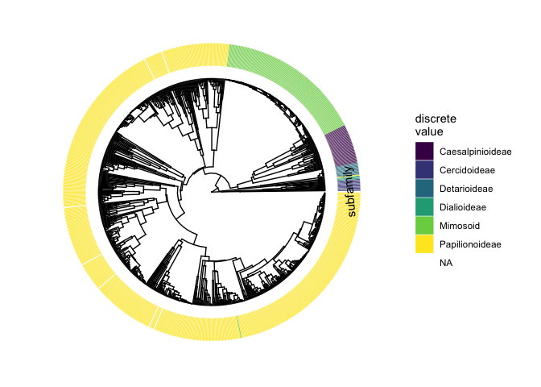

State transitions analysis
================
Tia Harrison
2022-10-13

## Overall setup

### Setup

### Load the packages for analysis

``` r
# Packages 
library(tidyverse)
library(corHMM)
library(ape)
library(expm)
library(hablar)
library(dplyr)
library(phytools)
library(devtools)
library(inauguration)
library(diagram)
```

### Ploidy dataset and phylogeny

The datasheet contains information about the symbiotic status (Fixer
column) of the legume species where 1 indicates a legume that forms
nodules with rhizobia (aka a mutualist) and where 0 indicates a plant
that forms no association with rhizobia (nonmutualist). The diPloidyLow
column indicates whether plant species are diploids (coded as 0) or
polyploid (coded as 1). The diPloidyLow values were calculated from
genus-level data. The NewPloidy column also indicates diploidy (0) and
polyploidy (1) but was calculated from a combination of genus and
subfamily level data.

``` r
# Dataset 
ploidy<- read.csv("Legume_ploidy_dataset.csv", row.names=1)

# Phylogeny 
legumes1<-read.tree("Vascular_Plants_rooted.dated.tre")

# Clean up the data 
ploidy1<-ploidy%>%
  rownames_to_column() %>%
  mutate(NewPloidy = ifelse(is.na(diPloidyLow), disfPloidy_corrected, diPloidyLow)) %>%
  mutate(Fixer = ifelse(is.na(Fixer) & numOTUs >= 1, 1, Fixer)) %>%
  mutate(Fixer = ifelse(is.na(Fixer) & numGenera >=1 , 1, Fixer)) %>%
  column_to_rownames()
```

### Pruning for the genus + subfamily level ploidy data

We pruned the Zanne et al (2014) angiosperm phylogeny for legume species
in our dataset.

``` r
# Remove all NAs from the data for the relevant columns 
ploidy_sub <- ploidy1 %>% 
  filter(!is.na(Fixer), !is.na(NewPloidy))

# Make sure the data and tree match up 
TreeOnly_sub <- setdiff(legumes1$tip.label, rownames(ploidy_sub))
DataOnly_sub <- setdiff(rownames(ploidy_sub), legumes1$tip.label)

# Prune the tree 
sub_tree <- drop.tip(legumes1, TreeOnly_sub)
sub_tree$node.label <- NULL

# Get the tip names 
tip_names_sub<-data.frame(sub_tree$tip.label)

# Filter the dataset for tree species 
ploidy_sub2<-ploidy_sub %>%
  rownames_to_column("Species") %>%
  filter(Species %in% tip_names_sub$sub_tree.tip.label) %>%
  dplyr::select(Species, Fixer, NewPloidy)
```

## Estimating state transitions on subfamily and genus level ploidy data

### Simple model

We ran a simple model first with no hidden states. Dual transitions are
not allowed in the model, only one state transition at a time. We
allowed polyploids to revert back to diploids in the model.

Results are interpreted as transitions from ROW to COLUMN Traits: 1 =
nonmutualist diploid 2 = nonmutualist polyploid 3 = mutualist diploid 4
= mutualist polyploid

``` r
# Set seed for reproducibility 135
set.seed(118)

# Simple model with two traits and no hidden states 
MK_sub_simple<- corHMM(phy=sub_tree, data=ploidy_sub2, rate.cat=1)
```

    ## State distribution in data:
    ## States:  1   2   3   4   
    ## Counts:  44  24  526 253 
    ## Beginning thorough optimization search -- performing 0 random restarts 
    ## Finished. Inferring ancestral states using marginal reconstruction.

``` r
# Look at the results of the model 
MK_sub_simple
```

    ## 
    ## Fit
    ##      -lnL      AIC     AICc Rate.cat ntax
    ##  -448.216 912.4319 912.6038        1  847
    ## 
    ## Legend
    ##     1     2     3     4 
    ## "0_0" "0_1" "1_0" "1_1" 
    ## 
    ## Rates
    ##             (1,R1)      (2,R1)      (3,R1)     (4,R1)
    ## (1,R1)          NA 0.018970157 0.005083216         NA
    ## (2,R1) 0.034455941          NA          NA 0.00452797
    ## (3,R1) 0.002372067          NA          NA 0.02397849
    ## (4,R1)          NA 0.000000001 0.077956973         NA
    ## 
    ## Arrived at a reliable solution

``` r
plotMKmodel(MK_sub_simple)
```

<!-- -->

### Hidden states model

We included rate.cat=2 to specify hidden states in the model. This model
with hidden states performed better than the model with no hidden states
and so it is reported in the manuscript.

Results are interpreted as transitions from ROW to COLUMN Traits: 1 =
nonmutualist diploid 2 = nonmutualist polyploid 3 = mutualist diploid 4
= mutualist polyploid

States: R1 = rate category 1 R2 = rate category 2

``` r
# Two traits and hidden states model 
MK_sub_hidden<- corHMM(phy=sub_tree, data=ploidy_sub2, rate.cat=2)
```

    ## State distribution in data:
    ## States:  1   2   3   4   
    ## Counts:  44  24  526 253 
    ## Beginning thorough optimization search -- performing 0 random restarts 
    ## Finished. Inferring ancestral states using marginal reconstruction.

``` r
# Look at the results of the model 
MK_sub_hidden
```

    ## 
    ## Fit
    ##       -lnL      AIC     AICc Rate.cat ntax
    ##  -398.3266 832.6532 833.4793        2  847
    ## 
    ## Legend
    ##     1     2     3     4 
    ## "0_0" "0_1" "1_0" "1_1" 
    ## 
    ## Rates
    ##             (1,R1)      (2,R1)     (3,R1)      (4,R1)       (1,R2)      (2,R2)
    ## (1,R1)          NA 1.465637426 0.02405909          NA 0.0434532777          NA
    ## (2,R1) 3.678635885          NA         NA 0.000000001           NA 0.043453278
    ## (3,R1) 0.004818012          NA         NA 0.222271433           NA          NA
    ## (4,R1)          NA 0.000000001 0.69794593          NA           NA          NA
    ## (1,R2) 0.020652127          NA         NA          NA           NA 0.000000001
    ## (2,R2)          NA 0.020652127         NA          NA 0.0000000010          NA
    ## (3,R2)          NA          NA 0.02065213          NA 0.0007636173          NA
    ## (4,R2)          NA          NA         NA 0.020652127           NA 0.000000001
    ##             (3,R2)      (4,R2)
    ## (1,R1)          NA          NA
    ## (2,R1)          NA          NA
    ## (3,R1) 0.043453278          NA
    ## (4,R1)          NA 0.043453278
    ## (1,R2) 0.000000001          NA
    ## (2,R2)          NA 0.000000001
    ## (3,R2)          NA 0.000000001
    ## (4,R2) 0.000583391          NA
    ## 
    ## Arrived at a reliable solution

``` r
# Make two colours for gradient 
state_colours1<- inauguration("inauguration_2021")
colour_grad<-state_colours1[c(1,6)]

# Look at the rates 
plotMKmodel(MK_sub_hidden, color=colour_grad, vertex.scale= 0.5, arrow.scale= 0.8, display = "square")

# Prep data for plotting diagram 
rate_data<-as.matrix(MK_sub_hidden$solution) # Make a matrix 
rate_dataR1<-rate_data[1:4, 1:4] # Select the R1 pieces of the matrix 
rate_dataR1<-round(rate_dataR1, 5) # Round the values in the matrix
rate_dataR1<-t(rate_dataR1) # Transpose the matrix so the direction is correct

rate_dataR2<-rate_data[5:8, 5:8] # Select the R2 pieces of the matrix 
rate_dataR2<-round(rate_dataR2, 5) # Round values 
rate_dataR2<-t(rate_dataR2) # Transpose matrix 

# Manipulate matrix for arrow line width plotting 
R1_thick<-1+rate_dataR1 
R2_thick<-1+rate_dataR2

# Set up plot save 
pdf("Figure_R1.pdf")

# Make the plot 
R1_plot<-plotmat(rate_dataR1, pos=c(1,2,1),
              name = c(" non-symbiotic \ndiploid", " non-symbiotic \npolyploid", " symbiotic \ndiploid",  " symbiotic \npolyploid"),
              box.lwd = 1.5, cex.txt = 0.75, curve=0.04, box.col=c("white", "white", "lightgrey", "lightgrey"), shadow.size=0, arr.lwd=R1_thick, arr.type="triangle", 
              box.size = 0.1, box.type = "square", box.prop = 0.5,
              main = "Rate Category 1")

dev.off()
```

    ## quartz_off_screen 
    ##                 2

``` r
# Set up plot save 
pdf("Figure_R2.pdf")

R2_plot<-plotmat(rate_dataR2, pos=c(1,2,1),
              name = c(" non-symbiotic \ndiploid", " non-symbiotic \npolyploid", " symbiotic \ndiploid",  " symbiotic \npolyploid"),
              box.lwd = 1.5, cex.txt = 0.75, curve=0.04, box.col=c("white", "white", "lightgrey", "lightgrey"), shadow.size=0, arr.lwd=R2_thick, arr.type="triangle", 
              box.size = 0.1, box.type = "square", box.prop = 0.5,
              main = "Rate Category 2")

dev.off()
```

    ## quartz_off_screen 
    ##                 2

<!-- -->

## Visualization of transitions

### Prep data for visualization

Pick 8 colours for plotting the different transitions on the tree and
re-label to the corresponding states for ploidy and symbiosis.

``` r
# Load colour palettes 
state_colours2<- inauguration("bernie_mittens")

# Get the colour codes 
color1<-state_colours1[c(2,5,3)]
color2<-state_colours2[c(2)]

# Darken and lighten the colours 
dark1=colorRampPalette(c("#749dae", "black"))(10)
lite1=colorRampPalette(c("#749dae", "white"))(10)
dark2=colorRampPalette(c("#cd3341", "black"))(10)
lite2=colorRampPalette(c("#cd3341", "white"))(10)
dark3=colorRampPalette(c("#50506D", "black"))(10)
lite3=colorRampPalette(c("#50506D", "white"))(10)
dark4=colorRampPalette(c("#f3c483", "black"))(10)
lite4=colorRampPalette(c("#f3c483", "white"))(10)

# Combine colours for for plotting 
state_colours8<-setNames(c("#5A7A87", "#9F2732", "#3E3E54", "#BD9865", "#A2BDC9", "#DD7780", "#8A8A9D", "#F7D7AC"),
                         c("(0_0,R1)", "(0_1,R1)", "(1_0,R1)", "(1_1,R1)", "(0_0,R2)", "(0_1,R2)", "(1_0,R2)", "(1_1,R2)")) 

# Colours and labels for the legend
legend_colours<-setNames(c("#5A7A87", "#9F2732", "#3E3E54", "#BD9865", "#A2BDC9", "#DD7780", "#8A8A9D", "#F7D7AC"),
                         c("non-symbiotic, diploid, R1", "non-symbiotic, polyploid, R1", "symbiotic, diploid, R1", "symbiotic, polyploid, R1", "non-symbiotic, diploid, R2", "non-symbiotic, polyploid, R2", "symbiotic, diploid, R2", "symbiotic, polyploid, R2")) 
```

### Genus/Subfamily level ploidy data

We plotted the transition rates determined from the hidden state model
which was the best fitting model, for the largest dataset (genus +
subfamily level ploidy).

``` r
# Extract the data from the model 
phy_sub_hidden = MK_sub_hidden$phy
data_sub_hidden = MK_sub_hidden$data
model_sub_hidden = MK_sub_hidden$solution
model_sub_hidden[is.na(model_sub_hidden)] <- 0
diag(model_sub_hidden) <- -rowSums(model_sub_hidden)

# Run to get simmap 
simmap_sub_hidden <- makeSimmap(tree = phy_sub_hidden, data = data_sub_hidden, model = model_sub_hidden, rate.cat = 2)

# Import phytools plotSimmap for plotting
phytools::plotSimmap(simmap_sub_hidden[[1]], colors=state_colours8, fsize = 0.15, offset=3, type="fan")
```

<!-- -->

``` r
# Figure out the subfamilies 
unique(ploidy$subfamily)
```

    ## [1] "Papilionoideae"   "Mimosoid"         "Caesalpinioideae" NA                
    ## [5] "Dialioideae"      "Cercidoideae"     "Detarioideae"

``` r
# Papilionoideae Mimosoid Caesalpinioideae Dialioideae Cercidoideae Detarioideae

# Save the subfamily data 
subfam<-ploidy1 %>%
  select(subfamily)

# Plot the tree with subfamily labels to get an idea of where to put labels 
library(ggtree)
circ <- ggtree(simmap_sub_hidden[[1]], layout = "circular")
p1 <- gheatmap(circ, subfam, offset=.8, width=.2,
               colnames_angle=95, colnames_offset_y = .25) +
    scale_fill_viridis_d(option="D", name="discrete\nvalue")
p1
```

<!-- -->

``` r
# Get the node labels 
phytools::plotSimmap(simmap_sub_hidden[[1]], colors=state_colours8, fsize = 0.15, offset=3, type="fan")
nodelabels(cex=0.18)
```

<!-- -->

``` r
# Put the subfamily labels on the black and white figure below 

# Set up plot save the phylogeny with the full information 
pdf("Figure_transition_tree_full.pdf", width =9, height =6.6)

# Run to get simmap 
simmap_sub_hidden <- makeSimmap(tree = phy_sub_hidden, data = data_sub_hidden, model = model_sub_hidden, rate.cat = 2)

# Plot the tree with the proper labels 
phytools::plotSimmap(simmap_sub_hidden[[1]], colors=state_colours8, fsize = 0.15, offset=3, type="fan")
arc.cladelabels(text="Papilionoideae",node=1043,ln.offset=1.15,lab.offset=1.2, cex=0.6, col="grey", mark.node=FALSE) 
# arc.cladelabels(text="Mimosoid",node=912,ln.offset=1.1,lab.offset=1.15) # Give the clade labels based on internal node labels rather than tip labels (specifying tips will be too )
arc.cladelabels(text="Cercidoideae",node=849,ln.offset=1.15,lab.offset=1.2, orientation="horizontal", cex=0.6, mark.node=FALSE)
arc.cladelabels(text="Caesalpinioideae",node=875,ln.offset=1.15,lab.offset=1.2, cex=0.6, mark.node=FALSE)
arc.cladelabels(text="Detarioideae",node=865,ln.offset=1.15,lab.offset=1.2, cex=0.6, orientation="horizontal", col="grey", mark.node=FALSE)

dev.off()
```

    ## quartz_off_screen 
    ##                 2

``` r
# Set up plot save 
pdf("Figure_transition_legend_full.pdf")

phytools::plotSimmap(simmap_sub_hidden[[1]], colors=state_colours8, fsize = 0.01, offset=3, type="fan")
phytools::add.simmap.legend(colors=legend_colours, fsize=0.7, prompt=FALSE, x=-120, y=70, vertical=TRUE)

dev.off()
```

    ## quartz_off_screen 
    ##                 2

Split up the figure into multiple panels with different colours. One
panel that just shows the rate classes, one panel that just shows the 4
categories, and one panel that has all the information (rates and 4
categories).

``` r
# Colours for two rate classes 
state_colours_rate<-setNames(c("black", "black", "black", "black", "grey", "grey", "grey", "grey"),
                         c("(0_0,R1)", "(0_1,R1)", "(1_0,R1)", "(1_1,R1)", "(0_0,R2)", "(0_1,R2)", "(1_0,R2)", "(1_1,R2)")) 

# Set up plot save 
pdf("Figure_transition_rates.pdf")

# Run to get simmap 
simmap_sub_hidden_R <- makeSimmap(tree = phy_sub_hidden, data = data_sub_hidden, model = model_sub_hidden, rate.cat = 2)

# Import phytools plotSimmap for plotting
# Put the subfamily labels on this one 
phytools::plotSimmap(simmap_sub_hidden_R[[1]], colors=state_colours_rate, fsize = 0.15, offset=3, type="fan")

dev.off()
```

    ## quartz_off_screen 
    ##                 2

``` r
# Legend for the two rate classes 
# Set up plot save 
# pdf("Figure_transition_rates_legend.pdf")

phytools::plotSimmap(simmap_sub_hidden[[1]], colors=state_colours_rate, fsize = 0.01, offset=3, type="fan")
phytools::add.simmap.legend(colors=legend_colours, fsize=0.7, prompt=FALSE, x=-120, y=70, vertical=TRUE)
```

<!-- -->

``` r
# dev.off()


# Set up plot save 
pdf("Figure_transition_4.pdf")

# Now the tree with the four classes 
state_colours4<-setNames(c("#5A7A87", "#9F2732", "#3E3E54", "#BD9865", "#5A7A87", "#9F2732", "#3E3E54", "#BD9865"),
                         c("(0_0,R1)", "(0_1,R1)", "(1_0,R1)", "(1_1,R1)", "(0_0,R2)", "(0_1,R2)", "(1_0,R2)", "(1_1,R2)")) 

# Run to get simmap 
simmap_sub_hidden_4 <- makeSimmap(tree = phy_sub_hidden, data = data_sub_hidden, model = model_sub_hidden, rate.cat = 2)

# Import phytools plotSimmap for plotting
phytools::plotSimmap(simmap_sub_hidden_4[[1]], colors=state_colours4, fsize = 0.15, offset=3, type="fan")

dev.off()
```

    ## quartz_off_screen 
    ##                 2
